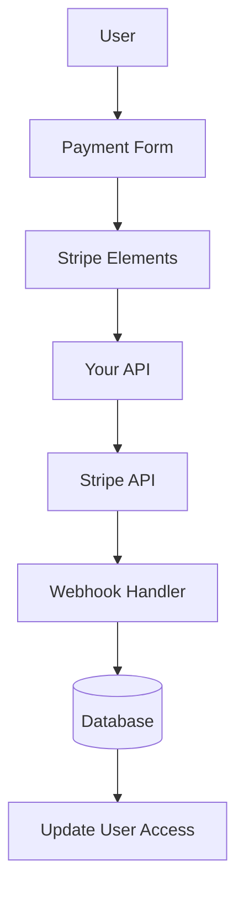

# Конфигурация полосы

В этом руководстве объясняется, как настроить Stripe в вашем приложении Ever Works с полной подпиской и системой оплаты.

## Обзор

Stripe — это комплексная платежная платформа, которая поддерживает:

- 💳 Единовременные выплаты
- 🔄 Регулярные подписки
- 🌍 Несколько способов оплаты (карты, Apple Pay, Google Pay)
- 💰 Несколько валют
- 📊 Расширенная аналитика и отчетность

## Обязательные переменные среды

Добавьте эти переменные в ваш файл `.env.local` :

```bash
# Stripe Configuration
STRIPE_SECRET_KEY=sk_test_your_stripe_secret_key_here
STRIPE_WEBHOOK_SECRET=whsec_your_stripe_webhook_secret_here
NEXT_PUBLIC_STRIPE_PUBLISHABLE_KEY=pk_test_your_stripe_publishable_key_here

# Stripe Price IDs
NEXT_PUBLIC_STRIPE_SUBSCRIPTION_PRICE_ID=price_subscription_id_here
NEXT_PUBLIC_STRIPE_ONETIME_PRICE_ID=price_onetime_id_here
NEXT_PUBLIC_STRIPE_FREE_PRICE_ID=price_free_id_here

# Product Pricing (for display purposes)
NEXT_PUBLIC_PRODUCT_PRICE_PRO=10.00
NEXT_PUBLIC_PRODUCT_PRICE_SPONSOR=20.00
NEXT_PUBLIC_PRODUCT_PRICE_FREE=0.00
```

:::warning
Никогда не передавайте свои секретные ключи контролю версий. Сохраните `.env.local` в вашем `.gitignore` файле.
:::

## Конфигурация панели управления Stripe

### Шаг 1. Создание продуктов

В вашей [панели управления Stripe](https://dashboard.stripe.com/):

1. Перейдите к **Товары** → **Добавить продукт**.
2. Создайте следующие продукты:

| Продукт | Цена | Тип | Описание |
|---------|-------|------|-------------|
| **Бесплатный план** | $0,00 | Одноразовый | Основные возможности |
| **Про-план** | $10,00 | Ежемесячная подписка | Расширенные возможности |
| **Спонсорский план** | $20,00 | Одноразовый | Премиум-поддержка |

3. Скопируйте **ID цены** для каждого продукта (начинается с `price_` ).

### Шаг 2. Настройте веб-перехватчики

Вебхуки позволяют Stripe уведомлять ваше приложение о платежных событиях.

1. Откройте **Разработчики** → **Вебхуки** → **Добавить конечную точку**.
2. Установите URL-адрес конечной точки:
   - Развитие: `http://localhost:3000/api/stripe/webhook` - Производство: `https://your-domain.com/api/stripe/webhook` 3. Выберите события для прослушивания:
   - `payment_intent.succeeded` - `payment_intent.payment_failed` - `customer.subscription.created` - `customer.subscription.updated` - `customer.subscription.deleted` - `customer.subscription.trial_will_end` - `invoice.payment_succeeded` - `invoice.payment_failed` 4. Скопируйте **секрет подписи** (начинается с `whsec_` ).

### Шаг 3. Получите ключи API

На панели управления Stripe:

1. **Секретный ключ**: **Разработчики** → **Ключи API** → **Секретный ключ** (начинается с `sk_` )
2. **Публикуемый ключ**: **Разработчики** → **Ключи API** → **Публикуемый ключ** (начинается с `pk_` )
3. **Секрет вебхука**: **Разработчики** → **Вебхуки** → Выберите вебхук → **Секрет подписи**

:::tip
Во время разработки используйте клавиши **тестового режима** (они начинаются с `sk_test_` и `pk_test_` ). Переключитесь в **режим реального времени** для работы.
:::

## Архитектура платежной системы



### Поставщик полос

Поставщик Stripe ( `lib/payment/lib/providers/stripe-provider.ts` ) реализует:

- ✅ Управление клиентами
- ✅ Создание платежного намерения
- ✅ Управление подпиской
- ✅ Обработка вебхуков
- ✅ Поддержка намерений установки
- ✅ Возвраты и отмены

### API-маршруты

Доступны следующие маршруты API:

| Маршрут | Метод | Описание |
|-------|--------|-------------|
| `/api/stripe/webhook` | ПОСТ | Обрабатывать веб-хуки Stripe |
| `/api/stripe/subscription` | ПОСТ | Создать подписку |
| `/api/stripe/subscription` | ПУТЬ | Обновить подписку |
| `/api/stripe/subscription` | УДАЛИТЬ | Отменить подписку |
| `/api/stripe/payment-intent` | ПОСТ | Создать намерение платежа |
| `/api/stripe/payment-intent` | ПОЛУЧИТЬ | Подтвердить платеж |
| `/api/stripe/setup-intent` | ПОСТ | Установить способ оплаты |

### Компоненты пользовательского интерфейса

Система использует Stripe Elements для безопасных форм оплаты:

- `StripeElementsWrapper` – Основной компонент оболочки
- `StripePaymentForm` - Форма оплаты с подтверждением
- Поддержка Apple Pay и Google Pay
- Адаптивный дизайн для мобильных и настольных компьютеров.

## Примеры использования

### Создать подписку

```typescript
import { StripeProvider } from '@/lib/payment/providers/stripe-provider';

const configs = createProviderConfigs({
  apiKey: process.env.STRIPE_SECRET_KEY!,
  webhookSecret: process.env.STRIPE_WEBHOOK_SECRET!,
  options: {
    publishableKey: process.env.NEXT_PUBLIC_STRIPE_PUBLISHABLE_KEY!,
    apiVersion: '2023-10-16'
  }
});

const stripeProvider = new StripeProvider(configs.stripe);

const subscription = await stripeProvider.createSubscription({
  customerId: 'cus_customer_id',
  priceId: 'price_subscription_id',
  paymentMethodId: 'pm_payment_method_id',
  trialPeriodDays: 7
});
```

### Используйте платежный компонент

```tsx
import { PaymentForm } from '@/lib/payment';

function PaymentPage() {
  return (
    <PaymentForm
      amount={1000} // 10.00 USD in cents
      currency="usd"
      isSubscription={true}
      onSuccess={(paymentId) => {
        console.log('Payment succeeded:', paymentId);
        // Redirect to success page or update UI
      }}
      onError={(error) => {
        console.error('Payment error:', error);
        // Show error message to user
      }}
    />
  );
}
```

## Тестирование вашей интеграции

### Тестовый режим

1. **Используйте тестовые ключи API** (начинайтесь с `sk_test_` и `pk_test_` )
2. **Используйте номера тестовых карт**:
   - Успех: `4242 4242 4242 4242` - Отказ: `4000 0000 0000 0002` - 3D Secure: `4000 0025 0000 3155` 3. **Проверьте веб-перехватчики локально** с помощью Stripe CLI:

   ``` баш
   прослушивание полосы --forward-to localhost:3000/api/stripe/webhook
   ```

### Тестирование вебхука

```bash
# Install Stripe CLI
brew install stripe/stripe-cli/stripe

# Login to your Stripe account
stripe login

# Forward webhooks to your local server
stripe listen --forward-to localhost:3000/api/stripe/webhook

# Trigger test events
stripe trigger payment_intent.succeeded
```

## Обработка ошибок

Система автоматически обрабатывает распространенные ошибки:

| Тип ошибки | Обработка |
|------------|----------|
| Карта отклонена | Удобное сообщение об ошибке |
| Недостаточно средств | Повторить попытку с другой картой |
| Проблемы с сетью | Логика автоматического повтора |
| Сбои вебхука | Зарегистрировано для проверки вручную |
| Ошибки проверки | Подсветка полей формы |

## Лучшие практики безопасности

1. **Ключи API**:
   - Никогда не раскрывайте секретные ключи в клиентском коде.
   - Используйте переменные среды
   - Регулярно меняйте ключи

2. **Проверка вебхука**:
   - Всегда проверяйте подписи вебхуков.
   - Проверка данных о событии перед обработкой.

3. **Платежные данные**:
   - Никогда не храните номера карт
   - Используйте токенизацию Stripe.
   - Обеспечить соответствие требованиям PCI.

4. **Сеансы пользователя**:
   - Проверка аутентификации пользователя
   - Проверка разрешений пользователя
   - Регистрируйте все платежные действия

## Зависимости

Необходимые пакеты (уже включены в Ever Works):

```json
{
  "@stripe/react-stripe-js": "^3.7.0",
  "@stripe/stripe-js": "^7.3.0",
  "stripe": "^18.1.0"
}
```

## Устранение неполадок

### Распространенные проблемы

**Проблема**: Webhook не получает события.

- **Решение**: убедитесь, что URL-адрес веб-перехватчика общедоступен.
- Используйте Stripe CLI для локального тестирования.
- Убедитесь, что секрет веб-перехватчика указан правильно.

**Проблема**: платеж не проходит автоматически

- **Решение**: проверьте консоль браузера на наличие ошибок.
- Убедитесь, что ключи API верны.
- Проверьте журналы панели управления Stripe.

**Проблема**: 3D Secure не работает.

- **Решение**: убедитесь, что вы обрабатываете статус `requires_action` .
- Реализуйте правильный поток перенаправления.
- Тестирование с помощью тестовых карточек 3D Secure

## Следующие шаги

- [Конфигурация LemonSqueezy](./lemonsqueezy) - Альтернативный поставщик платежей
- [Переменные среды](/deployment/environment-variables) - Полная настройка среды.
- [Deployment](/deployment) – развертывание платежной интеграции.

## Ресурсы

- [Документация Stripe](https://stripe.com/docs)
- [Руководство по интеграции Next.js](https://stripe.com/docs/pays/accept-a-paid?platform=web&ui=elements)
- [Управление подпиской](https://stripe.com/docs/billing/subscriptions)
- [События веб-перехватчика](https://stripe.com/docs/api/events/types)

## Поддержка

Нужна помощь с интеграцией Stripe? Посетите нашу [страницу поддержки](/advanced-guide/support) или присоединитесь к нашему сообществу.
