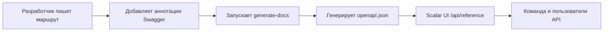

# Обучение по Документации API

Освойте автоматизированную систему документации API с использованием аннотаций Swagger и интерфейса Scalar UI.

## 🎯 Цели

После завершения этого модуля вы сможете:

- ✅ Понимать рабочий процесс документации API
- ✅ Писать корректные аннотации Swagger
- ✅ Следовать стандартным соглашениям тегов
- ✅ Генерировать и валидировать документацию
- ✅ Устранять типичные проблемы
- ✅ Поддерживать высококачественную документацию API

**Ориентировочное время**: 2–3 дня

---

## Почему эта система?

### Решённые проблемы

- **Непоследовательная документация**: Раньше было 8 разных тегов Stripe разбросанных по эндпоинтам
- **Ручная синхронизация**: Документация часто устаревала по сравнению с реальным кодом
- **Плохой опыт разработчика**: Базовый Swagger UI с ограниченными возможностями

### Полученные преимущества

- **Автоматическая синхронизация**: Документация генерируется прямо из аннотаций в коде
- **Современный интерфейс**: Scalar UI с интерактивным тестированием и лучшим UX
- **Последовательные стандарты**: Унифицированная система тегов и шаблоны документации

---

## Архитектура системы

### Основные компоненты

1. **Аннотации Swagger в коде**
   - JSDoc-комментарии с тегом `@swagger`
   - Формат спецификации OpenAPI 3.0
   - Встроены прямо в файлы маршрутов

2. **Скрипт generate-docs**
   - Сканирует все файлы `app/api/**/route.ts`
   - Извлекает и валидирует аннотации Swagger
   - Генерирует унифицированный `public/openapi.json`

3. **Интерфейс Scalar UI**
   - Современный адаптивный интерфейс документации
   - Интерактивное тестирование API
   - Доступен по адресу `/api/reference`

### Полный рабочий процесс



---

## Основные команды

```bash
yarn generate-docs
yarn docs:watch
yarn docs:validate
git status public/openapi.json
```

---

## Стандартная система тегов

### Соглашения по тегам

#### Административные операции

```yaml
"Admin - Users"        # Управление пользователями
"Admin - Categories"   # Управление категориями
"Admin - Items"        # Управление контентом
"Admin - Comments"     # Модерация комментариев
```

#### Основные функции приложения

```yaml
"Authentication"       # Вход, выход, сброс пароля
"Favorites"           # Избранное пользователя
"Items & Content"     # Просмотр публичного контента
```

#### Платёжные системы

```yaml
"Stripe - Core"              # Checkout, Payment Intent
"Stripe - Subscriptions"     # Управление подписками
"LemonSqueezy - Core"        # Все операции LemonSqueezy
```

---

## Лучшие практики

### Написание эффективных описаний

- Использовать глаголы действия: "Создать", "Обновить", "Удалить", "Получить"
- Быть конкретным: "Получить профиль пользователя", а не "Получить пользователя"
- Не превышать 50 символов для читаемости в UI

### Реалистичные примеры

```yaml
# ❌ Плохие примеры
example: "string"

# ✅ Хорошие примеры
example: "john.doe@company.com"
example: "user_123abc456def"
```

---

## Контрольный список разработчика

Перед фиксацией изменений API:

- [ ] Аннотация Swagger добавлена или обновлена
- [ ] Использован правильный тег из стандартной системы
- [ ] Присутствуют значимые заголовок и описание
- [ ] Задокументированы все поля тела запроса
- [ ] Задокументированы все коды ответов
- [ ] Выполнен `yarn generate-docs`
- [ ] Документация проверена по адресу `/api/reference`
- [ ] `public/openapi.json` включён в коммит
