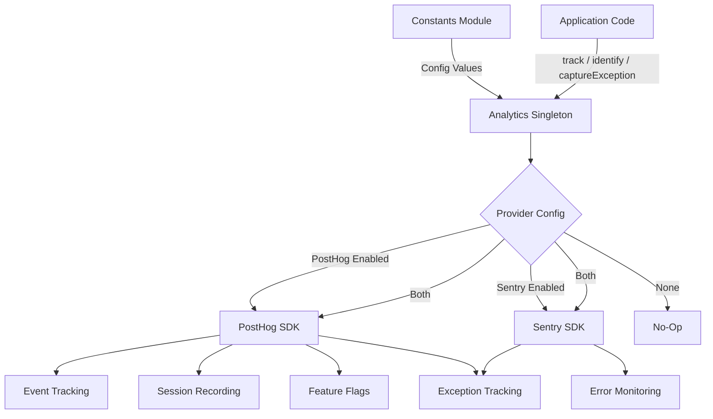
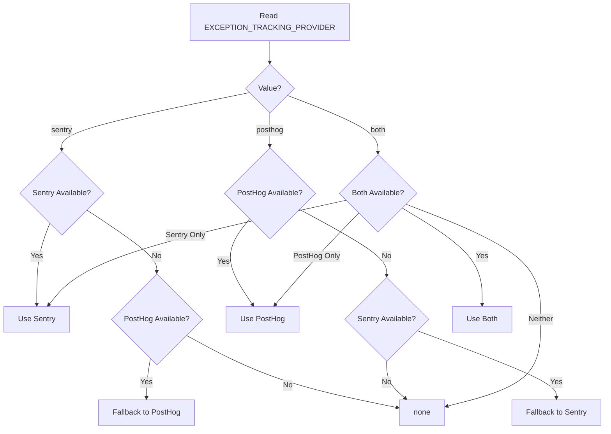

# 分析模块

分析模块（`template/lib/analytics/`）为客户端事件跟踪、用户识别、功能标志评估和异常捕获提供统一的单例类。它集成了用于产品分析的 **PostHog** 和用于错误监控的 **Sentry**，并支持单独使用、同时使用或两者都不使用。

## 架构概述



## 源文件

|文件|描述|
|------|-------------|
|`lib/analytics/index.ts`|`Analytics` 单例类和 `analytics` 导出|

## 核心课程：`Analytics`

`Analytics` 类是包装 PostHog 和 Sentry 的单例。在服务器端调用是安全的——当 `window` 未定义时，所有方法都会默默返回。

### 类型定义

```typescript
type EventProperties = Properties;          // PostHog Properties type
type UserProperties = Record<string, any>;
type ExceptionTrackingProvider = 'sentry' | 'posthog' | 'both' | 'none';
```

### 单例访问

```typescript
// Get the singleton instance
const analytics = Analytics.getInstance();

// Or use the pre-created export
import { analytics } from '@/lib/analytics';
```

### `init(): void`

使用集中配置初始化 PostHog 并设置异常跟踪。必须在客户端调用一次（通常在根布局或提供程序组件中）。

```typescript
// In your root layout or PostHog provider
'use client';
import { analytics } from '@/lib/analytics';

useEffect(() => {
  analytics.init();
}, []);
```

**行为：**
- 如果已经初始化或正在运行服务器端，则跳过初始化
- 从常量读取配置（`POSTHOG_KEY`、`POSTHOG_HOST`、`POSTHOG_ENABLED` 等）
- 当 `POSTHOG_SESSION_RECORDING_ENABLED` 为 true 时，配置带有屏蔽的会话记录
- 应用采样率 (`POSTHOG_SAMPLE_RATE`)——生产中默认为 10%
- 当启用 PostHog 异常跟踪时，设置全局 `window.onerror` 和 `unhandledrejection` 处理程序
- 当两个提供商都处于活动状态时，将 PostHog 与 Sentry 链接

### `identify(userId: string, properties?: UserProperties): void`

将当前匿名用户与已识别的用户 ID 相关联。启用 Sentry 时还会设置 Sentry 用户上下文。

```typescript
analytics.identify(session.user.id, {
  email: session.user.email,
  plan: 'premium',
});
```

### `reset(): void`

重置当前用户身份（例如，注销时）。清除 PostHog 和 Sentry 用户上下文。

```typescript
analytics.reset();
```

### `track(eventName: string, properties?: EventProperties): void`

在 PostHog 中捕获自定义事件。

```typescript
analytics.track('item_submitted', {
  itemId: 'abc-123',
  category: 'SaaS Tools',
});
```

### `trackPageView(url: string, properties?: EventProperties): void`

手动捕获页面查看事件。当 `POSTHOG_AUTO_CAPTURE` 被禁用并且您需要显式页面视图跟踪时使用。

```typescript
analytics.trackPageView(window.location.href, {
  referrer: document.referrer,
});
```

### `isFeatureEnabled(flagKey: string, defaultValue?: boolean): boolean`

同步评估 PostHog 功能标志。

```typescript
const showNewUI = analytics.isFeatureEnabled('new-dashboard-ui', false);
```

### `reloadFeatureFlags(): Promise<void>`

强制从 PostHog 服务器重新获取功能标志。

```typescript
await analytics.reloadFeatureFlags();
```

### `captureException(error: Error | string, context?: Record<string, any>): void`

调度到配置的提供程序的统一异常跟踪。

```typescript
try {
  await riskyOperation();
} catch (error) {
  analytics.captureException(error, {
    component: 'PaymentForm',
    action: 'submit',
  });
}
```

**提供商路由：**
- `'posthog'` -- 将`$exception` 事件发送到带有堆栈跟踪的 PostHog
- `'sentry'` -- 使用额外上下文调用 `Sentry.captureException`
- `'both'` -- 发送给两个提供商
- `'none'` -- 默默丢弃

### `captureError(error: Error, context?: Record<string, any>): void`

**已弃用。** `captureException` 的别名。记录弃用警告。

### `getExceptionTrackingProvider(): ExceptionTrackingProvider`

返回当前活动的异常跟踪提供程序。

### `setUserProperties(properties: UserProperties): void`

通过 `posthog.people.set()` 在 PostHog 人员配置文件上设置持久用户属性。

```typescript
analytics.setUserProperties({
  subscription_tier: 'premium',
  company: 'Acme Corp',
});
```

### `setSuperProperties(properties: Record<string, any>): void`

注册通过 `posthog.register()` 随每个后续事件发送的超级属性。

```typescript
analytics.setSuperProperties({
  app_version: '2.1.0',
  environment: 'production',
});
```

## 配置常量

所有分析配置均由 `lib/constants.ts` 中的常量驱动：

|常数|默认|描述|
|----------|---------|-------------|
|`POSTHOG_KEY`|环境变量|PostHog 项目 API 密钥|
|`POSTHOG_HOST`|环境变量|PostHog API 主机 URL|
|`POSTHOG_ENABLED`|导出的|当密钥和主机都设置时为 True|
|`POSTHOG_DEBUG`|环境变量|启用 PostHog 调试日志记录|
|`POSTHOG_SESSION_RECORDING_ENABLED`|`'true'`|启用会话记录|
|`POSTHOG_AUTO_CAPTURE`|`'false'`|自动捕获页面浏览量|
|`POSTHOG_SAMPLE_RATE`|`0.1`（产品）/`1.0`（开发）|事件采样率|
|`POSTHOG_SESSION_RECORDING_SAMPLE_RATE`|`0.1`（产品）/`1.0`（开发）|录音采样率|
|`EXCEPTION_TRACKING_PROVIDER`|`'both'`|哪个提供商处理异常|
|`SENTRY_ENABLED`|导出的|当 DSN 设置且 env 允许时为 True|

## 异常跟踪提供商解决方案

提供者在构建时通过后备逻辑确定：



## 与 Next.js 一起使用

Next.js App Router 项目中的典型集成：

```tsx
// app/providers.tsx
'use client';
import { useEffect } from 'react';
import { analytics } from '@/lib/analytics';
import { useSession } from 'next-auth/react';
import { usePathname } from 'next/navigation';

export function AnalyticsProvider({ children }: { children: React.ReactNode }) {
  const { data: session } = useSession();
  const pathname = usePathname();

  useEffect(() => {
    analytics.init();
  }, []);

  useEffect(() => {
    if (session?.user?.id) {
      analytics.identify(session.user.id, {
        email: session.user.email,
      });
    }
  }, [session]);

  useEffect(() => {
    analytics.trackPageView(pathname);
  }, [pathname]);

  return <>{children}</>;
}
```
