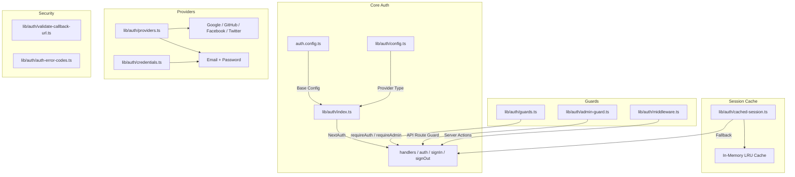
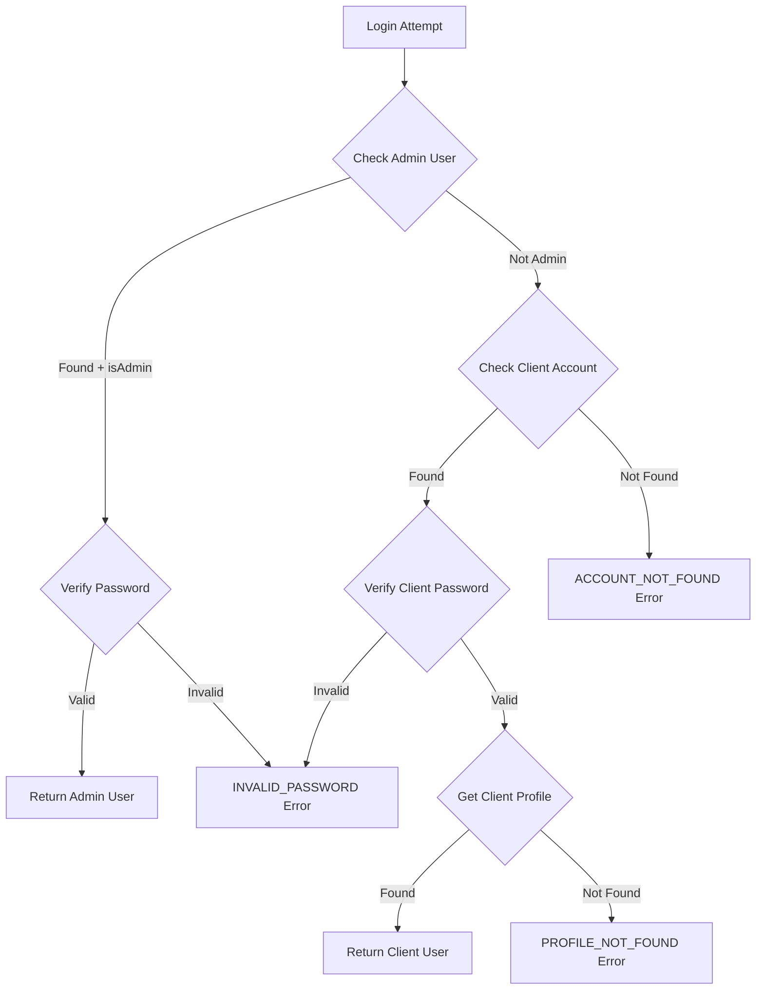

# 验证实用程序模块

身份验证实用程序模块 (`template/lib/auth/`) 提供了基于 NextAuth.js (Auth.js) 构建的全面身份验证层，支持多个提供程序、会话缓存、服务器端防护、经过验证的服务器操作以及作为替代身份验证后端的 Supabase。

## 架构概述



## 源文件

|文件|描述|
|------|-------------|
|`lib/auth/index.ts`|使用 Drizzle 适配器的 NextAuth.js 配置|
|`lib/auth/config.ts`|身份验证提供者类型配置|
|`lib/auth/credentials.ts`|电子邮件/密码凭据提供商|
|`lib/auth/providers.ts`|OAuth 提供者工厂|
|`lib/auth/guards.ts`|服务器端页面防护|
|`lib/auth/admin-guard.ts`|API路由管理守卫|
|`lib/auth/middleware.ts`|经过验证的服务器操作中间件|
|`lib/auth/cached-session.ts`|会话缓存层|
|`lib/auth/session-cache.ts`|缓存实现|
|`lib/auth/validate-callback-url.ts`|重定向 URL 验证|
|`lib/auth/auth-error-codes.ts`|错误代码枚举|
|`lib/auth/supabase/`|Supabase 身份验证客户端/服务器/中间件|

## NextAuth.js 配置 (`index.ts`)

主要导出提供标准的 NextAuth.js 接口：

```typescript
import { auth, signIn, signOut, handlers, unstable_update } from '@/lib/auth';
```

### 会议策略

- **策略：** JWT（不是数据库会话）
- **最大年龄：** 30 天
- **更新期限：** 24小时（会话刷新间隔）

### 智威汤逊回调

JWT 回调通过以下方式丰富了令牌：
- `userId` -- 来自用户对象或令牌 `sub`
- `clientProfileId` -- 首次登录时为 OAuth 用户自动创建
- `isAdmin` -- 由`isClient`/`isAdmin` 标志确定或默认为`false`
- `provider` -- 身份验证提供者名称

### 会话回调

会话回调将 JWT 字段映射到会话对象：
- `session.user.id`
- `session.user.clientProfileId`
- `session.user.provider`
- `session.user.isAdmin`

### 自定义页面

```typescript
pages: {
  signIn: '/auth/signin',
  signOut: '/auth/signout',
  error: '/auth/error',
  verifyRequest: '/auth/verify-request',
  newUser: '/auth/register',
}
```

### 活动

- **signOut** -- 使用户的会话缓存无效
- **updateUser** -- 当用户数据更改时使会话缓存失效

## 身份验证配置 (`config.ts`)

### `AuthProviderType`

```typescript
type AuthProviderType = 'supabase' | 'next-auth' | 'both';
```

### `AuthConfig`

```typescript
interface AuthConfig {
  provider: AuthProviderType;
  supabase?: {
    url: string;
    anonKey: string;
    redirectUrl?: string;
  };
  nextAuth?: {
    enableCredentials?: boolean;
    enableOAuth?: boolean;
    providers?: any[];
  };
}
```

### `getAuthConfig(): AuthConfig`

以此优先级解析配置：
1. 通过 `configureAuth()` 进行全局覆盖
2. 基于环境的检测（Supabase URL/密钥存在）
3. 默认值：`next-auth`，启用凭据和 OAuth

## 凭证提供者 (`credentials.ts`)

### 密码功能

```typescript
async function hashPassword(password: string): Promise<string>;
// Uses bcryptjs with 10 salt rounds, loaded via dynamic import

async function comparePasswords(plainText: string, hashed: string | null): Promise<boolean>;
// Returns false if hashed is null
```

### 认证流程



### `AuthProviders` 枚举

```typescript
enum AuthProviders {
  CREDENTIALS = 'credentials',
  GOOGLE = 'google',
  FACEBOOK = 'facebook',
  GITHUB = 'github',
  TWITTER = 'twitter',
  X = 'x',
  MICROSOFT = 'microsoft',
}
```

## OAuth 提供商 (`providers.ts`)

### `createNextAuthProviders(config?): Provider[]`

根据配置动态创建 NextAuth 提供程序实例：

```typescript
import { createNextAuthProviders } from '@/lib/auth/providers';

const providers = createNextAuthProviders({
  google: { enabled: true, clientId: '...', clientSecret: '...' },
  github: { enabled: true, clientId: '...', clientSecret: '...' },
  credentials: { enabled: true },
});
```

支持的提供商：**Google**、**GitHub**、**Facebook**、**Twitter**、**Credentials**。

## 服务器端防护 (`guards.ts`)

### `requireAuth(): Promise<Session>`

需要身份验证。如果未通过身份验证，则重定向至`/auth/signin`。

```typescript
export default async function ProtectedPage() {
  const session = await requireAuth();
  return <div>Welcome {session.user.email}</div>;
}
```

### `requireAdmin(): Promise<Session>`

需要管理员角色。如果未通过身份验证，则重定向至`/admin/auth/signin`；如果不是管理员，则重定向至`/unauthorized`。

```typescript
export default async function AdminPage() {
  const session = await requireAdmin();
  return <div>Admin Dashboard</div>;
}
```

### `getSession(): Promise<Session | null>`

获取当前会话而不重定向。对于未经身份验证的用户，返回 `null`。

### `checkIsAdmin(): Promise<boolean>`

检查管理员状态而不重定向。

## API 路由防护 (`admin-guard.ts`)

### `checkAdminAuth(): Promise<NextResponse | null>`

如果已授权，则返回 `null`；如果未授权，则返回错误 `NextResponse` (401/403/500)：

```typescript
export async function GET() {
  const authError = await checkAdminAuth();
  if (authError) return authError;
  // ... handle authorized request
}
```

### `withAdminAuth(handler): handler`

包装 API 路由处理程序的高阶函数：

```typescript
import { withAdminAuth } from '@/lib/auth/admin-guard';

export const GET = withAdminAuth(async (request) => {
  // Only reached if user is authenticated admin
  return NextResponse.json({ data: await getAdminData() });
});
```

## 已验证的服务器操作 (`middleware.ts`)

### `validatedAction(schema, action)`

使用 Zod 验证包装服务器操作：

```typescript
import { validatedAction } from '@/lib/auth/middleware';
import { z } from 'zod';

const schema = z.object({ name: z.string().min(1), email: z.string().email() });

export const updateProfile = validatedAction(schema, async (data, formData) => {
  await db.update(users).set(data);
  return { success: 'Profile updated' };
});
```

### `validatedActionWithUser(schema, action)`

与上面相同，但还验证身份验证并注入用户：

```typescript
export const submitItem = validatedActionWithUser(schema, async (data, formData, user) => {
  await db.insert(items).values({ ...data, userId: user.id });
  return { success: 'Item submitted' };
});
```

### `ActionState` 类型

```typescript
type ActionState = {
  error?: string;
  success?: string;
  redirect?: string;
  [key: string]: any;
};
```

## 会话缓存 (`cached-session.ts`)

通过在内存中缓存解码的会话来减少身份验证开销。

### `getCachedSession(request?): Promise<Session | null>`

```typescript
import { getCachedSession } from '@/lib/auth/cached-session';

// In server components
const session = await getCachedSession();

// In API routes (pass request for token extraction)
const session = await getCachedSession(request);
```

### `invalidateSessionCache(token?, userId?): Promise<void>`

通过令牌或用户 ID 使缓存的会话失效。

### `clearSessionCache(): void`

清除所有缓存的会话（用于部署或关键更新）。

### 代币提取

令牌按以下顺序从请求中提取：
1. `next-auth.session-token` 或 `__Secure-next-auth.session-token` cookie
2. `Authorization: Bearer <token>` 标头
3. `X-Session-Token` 自定义标头

## 错误代码 (`auth-error-codes.ts`)

```typescript
enum AuthErrorCode {
  ACCOUNT_NOT_FOUND = 'ACCOUNT_NOT_FOUND',
  INVALID_PASSWORD = 'INVALID_PASSWORD',
  PROFILE_NOT_FOUND = 'PROFILE_NOT_FOUND',
  GENERIC_ERROR = 'GENERIC_ERROR',
  RATE_LIMITED = 'RATE_LIMITED',
  USE_OAUTH_PROVIDER = 'USE_OAUTH_PROVIDER',
  SESSION_REFRESH_FAILED = 'SESSION_REFRESH_FAILED',
  PAGE_REFRESH_FAILED = 'PAGE_REFRESH_FAILED',
}
```

## 回调 URL 验证 (`validate-callback-url.ts`)

### `isValidCallbackUrl(url: string | null): boolean`

防止开放重定向漏洞：

```typescript
isValidCallbackUrl('/admin/items')       // true
isValidCallbackUrl('/client/dashboard')  // true
isValidCallbackUrl('https://evil.com')   // false
isValidCallbackUrl('//evil.com')         // false
```

### `getSafeRedirectPath(callbackUrl, fallbackPath): string`

如果有效则返回回调 URL，否则返回回退路径。

### `createSafeCallbackUrl(pathname, search?): string`

创建限制为 2048 个字符的回调 URL，以防止参数污染。
