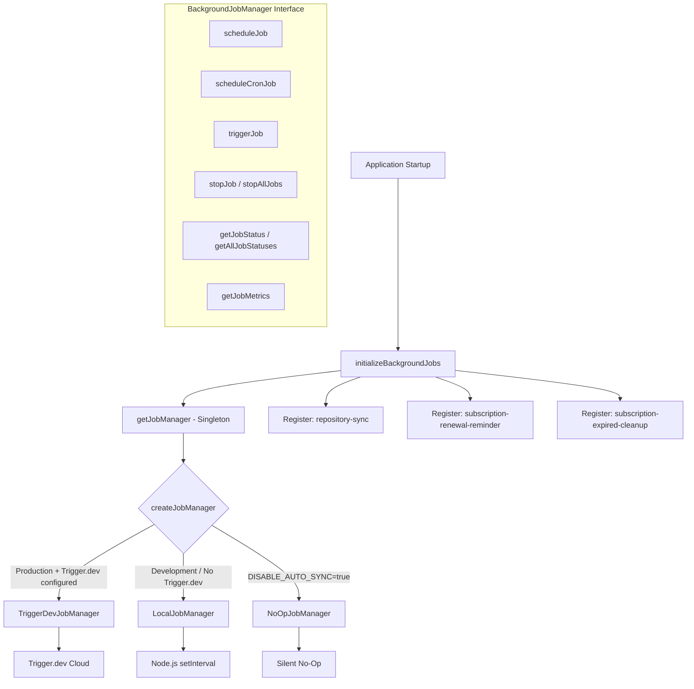
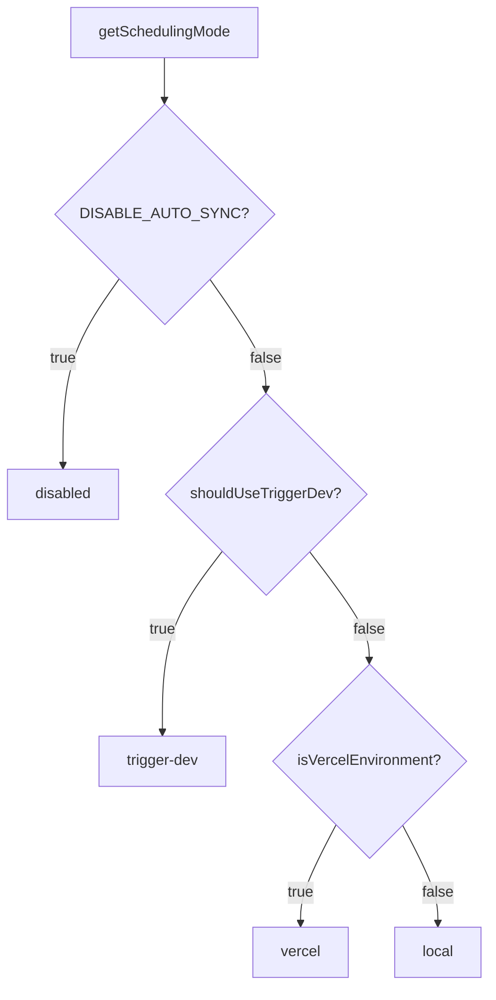

# 后台作业模块

后台作业模块 (`template/lib/background-jobs/`) 提供了一个用于调度和执行重复任务的抽象层。它支持三种运行时策略 - 用于生产的 **Trigger.dev**、用于开发的 **local `setInterval`** 以及用于完全禁用作业的 **no-op** 模式 - 根据环境配置自动选择。

## 架构概述



## 源文件

|文件|描述|
|------|-------------|
|`lib/background-jobs/types.ts`|接口和类型定义|
|`lib/background-jobs/config.ts`|Trigger.dev配置和调度模式检测|
|`lib/background-jobs/job-factory.ts`|工厂函数和单例管理器|
|`lib/background-jobs/local-job-manager.ts`|`LocalJobManager`实施|
|`lib/background-jobs/trigger-dev-job-manager.ts`|`TriggerDevJobManager`实施|
|`lib/background-jobs/noop-job-manager.ts`|`NoOpJobManager`实施|
|`lib/background-jobs/initialize-jobs.ts`|应用程序启动时注册作业|
|`lib/background-jobs/index.ts`|桶出口|

## 类型定义

### `BackgroundJobManager` 接口

```typescript
interface BackgroundJobManager {
  scheduleJob(id: string, name: string, job: () => void | Promise<void>, interval: number): void;
  scheduleCronJob(id: string, name: string, job: () => void | Promise<void>, cronExpression: string): void;
  triggerJob(id: string): Promise<void>;
  stopJob(id: string): void;
  stopAllJobs(): void;
  getJobStatus(id: string): JobStatus | undefined;
  getAllJobStatuses(): JobStatus[];
  getJobMetrics(): JobMetrics;
}
```

### `JobStatus`

```typescript
type JobStatusType = 'running' | 'completed' | 'failed' | 'scheduled' | 'stopped';

interface JobStatus {
  id: string;
  name: string;
  status: JobStatusType;
  lastRun: Date | null;
  nextRun: Date | null;
  duration: number;     // Last execution duration in ms
  error?: string;       // Error message if status is 'failed'
}
```

### `JobMetrics`

```typescript
interface JobMetrics {
  totalExecutions: number;       // Total invocations (not unique jobs)
  successfulJobs: number;
  failedJobs: number;
  averageJobDuration: number;    // Rolling average in ms
  lastCleanup: Date;
}
```

### `TriggerDevConfig`

```typescript
interface TriggerDevConfig {
  enabled: boolean;
  apiKey?: string;
  apiUrl?: string;
  environment: string;
  isFullyConfigured: boolean;
  isPartiallyConfigured: boolean;
}
```

### `SchedulingMode`

```typescript
type SchedulingMode = 'trigger-dev' | 'vercel' | 'local' | 'disabled';
```

## 配置功能

### `getTriggerDevConfig(): TriggerDevConfig`

从 ConfigService 读取 Trigger.dev 设置。

### `shouldUseTriggerDev(): boolean`

当 Trigger.dev 完全配置、启用并且环境处于生产状态时，返回`true`。

### `getSchedulingMode(): SchedulingMode`

使用此优先级确定哪个调度系统应处于活动状态：



## 工厂和单例

### `createJobManager(): BackgroundJobManager`

根据环境创建适当的作业管理器：

```typescript
import { createJobManager } from '@/lib/background-jobs';

const manager = createJobManager();
// Returns: TriggerDevJobManager | LocalJobManager | NoOpJobManager
```

### `getJobManager(): BackgroundJobManager`

返回单例实例，在第一次调用时创建它：

```typescript
import { getJobManager } from '@/lib/background-jobs';

const manager = getJobManager();
manager.scheduleJob('my-job', 'My Job', async () => {
  await doWork();
}, 60_000);
```

### `resetJobManager(): void`

停止所有作业并销毁单例（对于测试有用）：

```typescript
import { resetJobManager } from '@/lib/background-jobs';
resetJobManager();
```

## 本地作业管理器

使用 Node.js `setInterval` 进行开发和后备环境。

**关键行为：**
- 当作业已经运行时跳过执行（防止重叠）
- 使用滚动平均持续时间跟踪指标
- 通过简化映射将 cron 表达式转换为间隔
- 减少开发模式下的控制台日志记录

### Cron 到间隔映射

|计划模式|间隔|
|-------------|----------|
| `*/30 * * * * *` |30秒|
| `*/2 * * * *` |2分钟|
| `*/5 * * * *` |5分钟|
| `*/15 * * * *` |15分钟|
| `0 * * * *` |1小时|
| `0 9 * * *` |24小时|
|默认|1分钟|

## 触发开发作业管理器

使用 `@trigger.dev/sdk` v4 计划 API 注册计划。 **不**执行本地计时器——执行由 Trigger.dev 工作进程处理。

**关键行为：**
- 通过动态导入延迟加载`@trigger.dev/sdk`
- 将基于时间间隔的计划转换为 cron 表达式
- 当任务在工作上下文中运行时跟踪本地指标
- `stopJob` / `stopAllJobs` 仅清除本地状态（远程调度由 Trigger.dev 管理）

## 无操作作业管理器

所有操作都是静默无操作。当 `DISABLE_AUTO_SYNC=true` 开发时使用。

## 职位登记

`initializeBackgroundJobs()` 函数在启动时注册所有应用程序作业：

```typescript
import { initializeBackgroundJobs } from '@/lib/background-jobs/initialize-jobs';

// Called once during app initialization
await initializeBackgroundJobs();
```

### 已注册职位

|职位编号|时间表|描述|
|--------|----------|-------------|
|`repository-sync`|每5分钟一班|通过 `syncManager.performSync()` 同步基于 Git 的 CMS 内容|
|`subscription-renewal-reminder`|每天上午 9:00|针对 7 天后到期的订阅发送续订提醒|
|`subscription-expired-cleanup`|每天午夜|处理超过结束日期的订阅并使其过期|

**重要提示：** 所有作业回调都使用动态导入来防止 webpack 在构建时捆绑 Node.js 特定的模块：

```typescript
manager.scheduleJob('repository-sync', 'Repository Synchronization', async () => {
  // Dynamic import prevents webpack bundling of isomorphic-git chain
  const { syncManager } = await import('@/lib/services/sync-service');
  await syncManager.performSync();
}, 5 * 60 * 1000);
```

## 使用示例

### 安排自定义作业

```typescript
import { getJobManager } from '@/lib/background-jobs';

const manager = getJobManager();

// Interval-based (every 10 minutes)
manager.scheduleJob('cleanup-temp', 'Temp File Cleanup', async () => {
  await cleanupTempFiles();
}, 10 * 60 * 1000);

// Cron-based (every hour)
manager.scheduleCronJob('hourly-report', 'Hourly Report', async () => {
  await generateReport();
}, '0 * * * *');
```

### 监控作业

```typescript
const manager = getJobManager();

// Check specific job
const status = manager.getJobStatus('repository-sync');
console.log(status?.status, status?.lastRun, status?.duration);

// List all jobs
const allStatuses = manager.getAllJobStatuses();

// Get aggregate metrics
const metrics = manager.getJobMetrics();
console.log(`Total: ${metrics.totalExecutions}, Failed: ${metrics.failedJobs}`);
```

### 手动触发

```typescript
const manager = getJobManager();
await manager.triggerJob('repository-sync');
```
