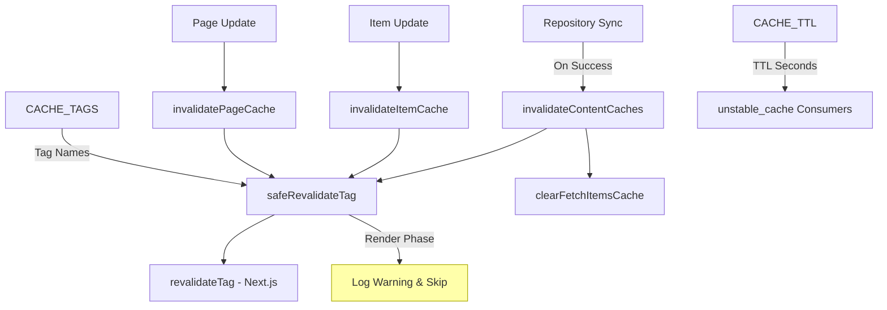
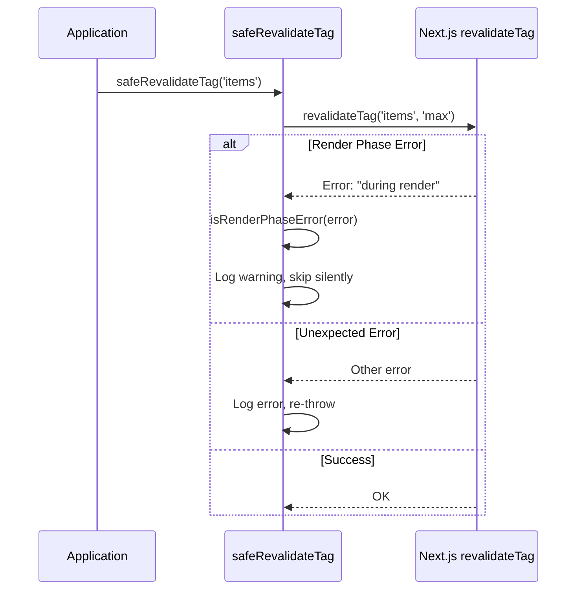
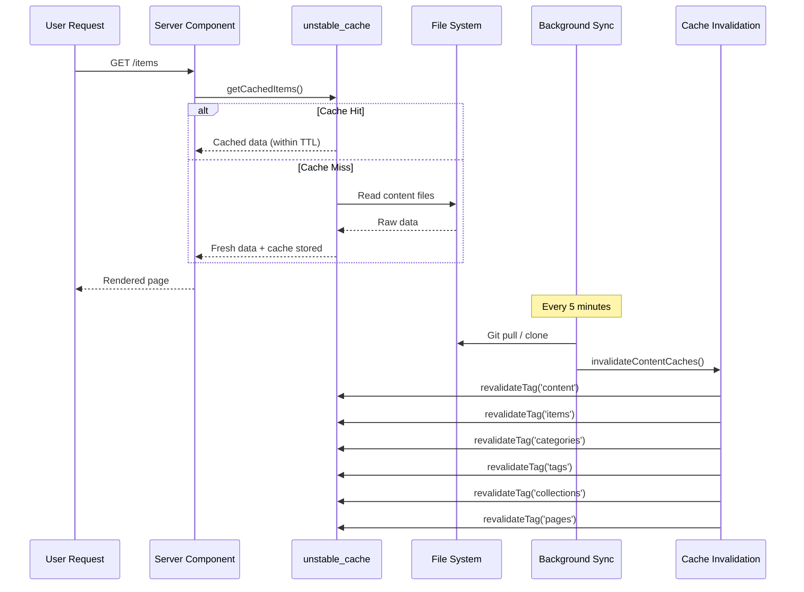

# 缓存失效模块

缓存失效模块（`template/lib/cache-config.ts` 和`template/lib/cache-invalidation.ts`）为Next.js `unstable_cache` 和`revalidateTag` 提供集中式缓存标记系统和失效功能。它确保内容缓存在存储库同步后正确失效，同时优雅地处理 Next.js 渲染阶段限制。

## 架构概述



## 源文件

|文件|描述|
|------|-------------|
|`lib/cache-config.ts`|缓存 TTL 常量和标记定义|
|`lib/cache-invalidation.ts`|具有渲染阶段安全性的失效函数|

## 缓存 TTL 配置

所有 TTL 值均以**秒**为单位，与 Next.js `unstable_cache` 一起使用：

```typescript
const CACHE_TTL = {
  CONTENT: 600,   // 10 minutes -- content listings
  ITEM: 600,      // 10 minutes -- individual items
  CONFIG: 600,    // 10 minutes -- site configuration
  PAGES: 600,     // 10 minutes -- static pages
} as const;
```

### 与 `unstable_cache` 一起使用

```typescript
import { unstable_cache } from 'next/cache';
import { CACHE_TTL, CACHE_TAGS } from '@/lib/cache-config';

const getCachedItems = unstable_cache(
  async () => fetchAllItems(),
  ['items-list'],
  {
    revalidate: CACHE_TTL.CONTENT,
    tags: [CACHE_TAGS.CONTENT, CACHE_TAGS.ITEMS],
  }
);
```

## 缓存标签

标签与 `revalidateTag()` 一起使用以选择性地使缓存失效。

### 静态标签

|标签常数|价值|描述|
|-------------|-------|-------------|
|`CACHE_TAGS.CONTENT`|`'content'`|主标签——使所有内容缓存失效|
|`CACHE_TAGS.ITEMS`|`'items'`|所有物品集合|
|`CACHE_TAGS.CATEGORIES`|`'categories'`|所有类别|
|`CACHE_TAGS.TAGS`|`'tags'`|所有标签|
|`CACHE_TAGS.COLLECTIONS`|`'collections'`|所有系列|
|`CACHE_TAGS.CONFIG`|`'config'`|站点配置|
|`CACHE_TAGS.PAGES`|`'pages'`|所有静态页面|

### 动态标签（函数）

|标签功能|示例输出|描述|
|-------------|---------------|-------------|
|`CACHE_TAGS.ITEM(slug)`|`'item:my-tool'`|按 slug 划分的特定项目|
|`CACHE_TAGS.PAGE(slug)`|`'page:about'`|slug 的特定页面|
|`CACHE_TAGS.ITEMS_LOCALE(locale)`|`'items:en'`|按区域设置过滤的项目|
|`CACHE_TAGS.CATEGORIES_LOCALE(locale)`|`'categories:fr'`|按地区分类|
|`CACHE_TAGS.TAGS_LOCALE(locale)`|`'tags:de'`|按区域设置的标签|
|`CACHE_TAGS.COLLECTIONS_LOCALE(locale)`|`'collections:es'`|按区域设置的集合|

### 示例：特定于区域设置的缓存

```typescript
import { CACHE_TAGS, CACHE_TTL } from '@/lib/cache-config';

const getCachedItemsByLocale = unstable_cache(
  async (locale: string) => fetchItemsByLocale(locale),
  ['items-by-locale'],
  {
    revalidate: CACHE_TTL.CONTENT,
    tags: [CACHE_TAGS.ITEMS, CACHE_TAGS.ITEMS_LOCALE('en')],
  }
);
```

## 失效函数

### `invalidateContentCaches(): Promise<void>`

使**所有**内容相关的缓存失效。存储库同步成功完成后调用。

```typescript
import { invalidateContentCaches } from '@/lib/cache-invalidation';

// After successful repository sync
await performSync();
await invalidateContentCaches();
```

**使这些标签无效：**
- `CONTENT`、`ITEMS`、`CATEGORIES`、`TAGS`、`COLLECTIONS`、`PAGES`
- 还通过 `clearFetchItemsCache()` 清除内存中 `fetchItems` 缓存

### `invalidateItemCache(slug: string): Promise<void>`

使单个项目的缓存无效。

```typescript
import { invalidateItemCache } from '@/lib/cache-invalidation';

await invalidateItemCache('my-saas-tool');
// Revalidates tag: 'item:my-saas-tool'
```

### `invalidatePageCache(slug: string): Promise<void>`

使单个静态页面的缓存失效。

```typescript
import { invalidatePageCache } from '@/lib/cache-invalidation';

await invalidatePageCache('about');
// Revalidates tag: 'page:about'
```

## 渲染阶段安全

Next.js 在服务器组件的渲染阶段不允许`revalidateTag()`。该模块使用 `safeRevalidateTag` 包装器来处理此问题。

### 它是如何运作的



### 错误检测模式

`isRenderPhaseError` 函数检查多种模式，以适应 Next.js 错误消息更改：

- `"during render"` -- 当前的 Next.js 消息
- `"render phase"` -- 替代措辞
- `"revalidate"` + `"render"` -- 两个关键字都存在
- `"unsupported"` + `"render"` -- 组合检查

## 缓存流程图


