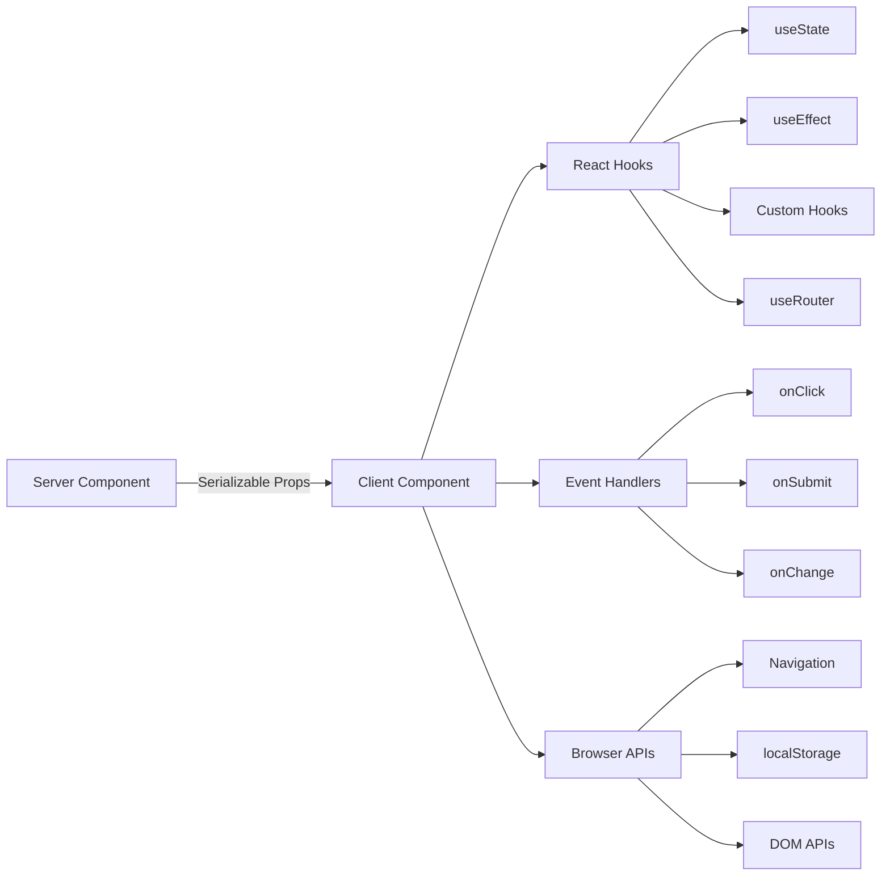

# 客户端组件模式

## 概述

Ever Works 模板中的客户端组件是交互式“岛”，用于处理用户事件、管理本地状态并与浏览器 API 集成。它们由文件顶部的 `"use client"` 指令标识，并在需要交互性的地方有选择地使用。

## 建筑



## 源文件

|文件|图案|
|------|---------|
|`template/app/[locale]/admin/page.tsx`|委托给组件的最小客户端包装器|
|`template/app/not-found.tsx`|使用 `useRouter` 进行客户端导航|
|`template/app/global-error.tsx`|具有重置功能的错误边界|
|`template/components/filters/filter-url-parser.tsx`|URL状态管理|
|`template/components/header/more-menu.tsx`|交互式下拉菜单|

## 核心模式

### 模式 1：最小客户端包装器

许多页面组件使用尽可能最薄的客户端包装器：

```typescript
"use client";

import { AdminDashboard } from "@/components/admin";

export default function AdminPage() {
    return <AdminDashboard />;
}
```

此模式使页面文件保持较小，同时将所有逻辑委托给单独的组件。 `"use client"` 指令标记了服务器组件树转换到客户端渲染的边界。

### 模式 2：误差边界分量

全局错误处理程序演示了错误边界模式：

```typescript
'use client';

export default function GlobalError({
    error,
    reset,
}: {
    error: Error & { digest?: string };
    reset: () => void;
}) {
    useEffect(() => {
        console.error(error);
    }, [error]);

    return (
        <html lang="en">
            <body>
                <div>
                    <h1>Something went wrong!</h1>
                    {process.env.NODE_ENV !== 'production' && (
                        <div>
                            <p>{error.message}</p>
                            {error.digest && <p>Error ID: {error.digest}</p>}
                        </div>
                    )}
                    <Button onPress={() => reset()}>Refresh</Button>
                    <Link href="/">Go Home</Link>
                </div>
            </body>
        </html>
    );
}
```

关键方面：
- `error` 属性包含一个可选的 `digest` 用于服务器错误跟踪
- `reset()` 函数重新渲染错误边界的子级
- 堆栈跟踪仅在开发中显示
- 该组件包装了自己的 `<html>` 和 `<body>` 标记，因为全局错误会替换整个页面

### 模式 3：客户端导航

Not Found 页面演示了客户端导航模式：

```typescript
'use client';

import { useRouter } from 'next/navigation';

export default function NotFound() {
    const router = useRouter();

    return (
        <div>
            <Button onClick={() => router.back()}>Go Back</Button>
            <Button onClick={() => router.push('/')}>Back to Home</Button>
            <button onClick={() => router.push('/help')}>Contact Support</button>
        </div>
    );
}
```

`next/navigation` 中的 `useRouter` 挂钩提供了编程导航。请注意，这是来自`next/navigation`，而不是`next/router`（页面路由器）。

### 模式 4：支持 i18n 的客户端导航

该模板通过 `i18n/navigation.ts` 提供区域设置感知的导航挂钩：

```typescript
import { createNavigation } from "next-intl/navigation";
import { routing } from "./routing";

export const { Link, redirect, usePathname, useRouter, getPathname } =
    createNavigation(routing);
```

需要从此模块导入区域设置感知导航的客户端组件，而不是`next/navigation`：

```typescript
'use client';

import { Link, useRouter, usePathname } from '@/i18n/navigation';

function LocaleAwareComponent() {
    const router = useRouter();
    const pathname = usePathname();

    // router.push('/about') automatically includes the current locale prefix
    return <Link href="/about">About</Link>;
}
```

### 模式 5：带有表单验证的服务器操作

客户端组件使用 `lib/auth/middleware.ts` 中经过验证的操作模式与服务器操作集成：

```typescript
// Server action (lib/auth/middleware.ts)
export function validatedAction<S extends z.ZodType, T>(
    schema: S,
    action: ValidatedActionFunction<S, T>
) {
    return async (prevState: ActionState, formData: FormData): Promise<T> => {
        const result = schema.safeParse(Object.fromEntries(formData));
        if (!result.success) {
            return { error: result.error.issues[0].message } as T;
        }
        return action(result.data, formData);
    };
}

// Client component
'use client';

import { useActionState } from 'react';
import { myServerAction } from './actions';

function MyForm() {
    const [state, formAction, isPending] = useActionState(myServerAction, {});

    return (
        <form action={formAction}>
            {state.error && <p>{state.error}</p>}
            <input name="email" type="email" />
            <button type="submit" disabled={isPending}>Submit</button>
        </form>
    );
}
```

### 模式 6：使用自定义 Hook 进行状态管理

该模板将客户端逻辑组织到 `hooks/` 目录中的自定义挂钩中：

```typescript
'use client';

import { useFavorites } from '@/hooks/useFavorites';
import { useFilters } from '@/hooks/useFilters';

function ItemList() {
    const { favorites, toggleFavorite } = useFavorites();
    const { filters, updateFilter, resetFilters } = useFilters();

    return (
        <div>
            <FilterBar filters={filters} onChange={updateFilter} onReset={resetFilters} />
            <ItemGrid items={items} favorites={favorites} onToggleFavorite={toggleFavorite} />
        </div>
    );
}
```

## 客户端组件边界

### 何时使用`"use client"`

- **事件处理程序**：`onClick`、`onSubmit`、`onChange`
- **反应挂钩**：`useState`、`useEffect`、`useRef`、自定义挂钩
- **浏览器 API**：`window`、`localStorage`、`navigator`
- **第三方客户端库**：需要交互的UI组件库

### 何时保留为服务器组件

- 静态内容渲染
- 数据获取和转换
- 翻译加载 (`getTranslations`)
- 元数据生成
- 布局包装器

## 模板中的最佳实践

1. **将`"use client"`尽可能深地推**——保持边界靠近交互式叶子
2. **将服务器数据作为 props 传递** -- 避免在客户端重新获取
3. **仅使用 `useEffect` 产生副作用** -- 不适用于数据获取
4. **优先选择服务器操作而不是 API 路由**——用于表单提交和更改
5. **从`@/i18n/navigation`导入导航** -- 确保区域设置感知路由
6. **仅用于门开发的 UI** -- 使用 `process.env.NODE_ENV !== 'production'` 检查
