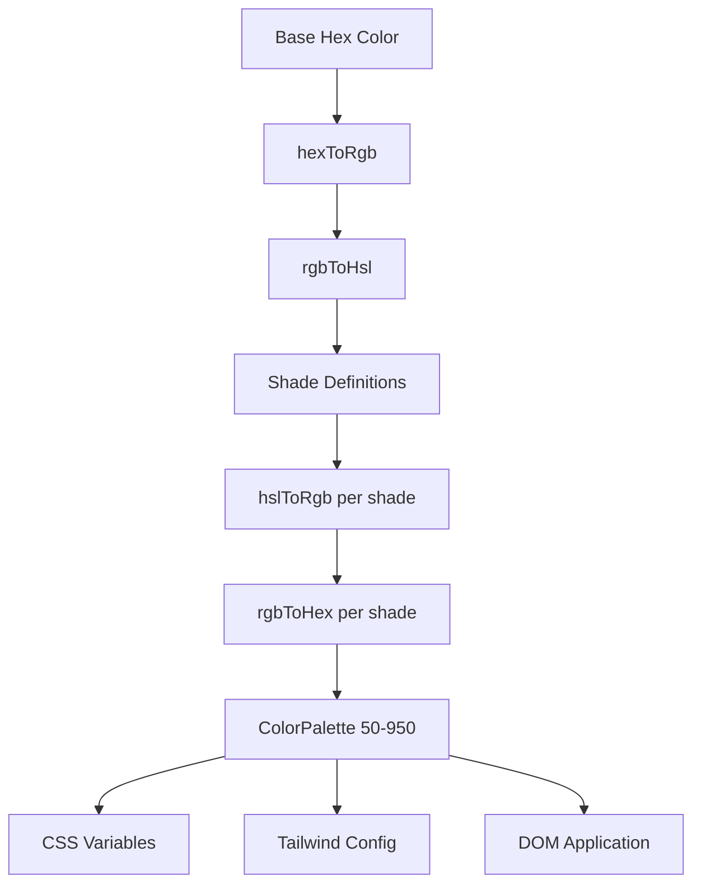

# 色彩系统

该模板使用动态颜色生成系统，可从基本十六进制颜色创建完整的调色板。这为主题引擎提供了动力，并允许通过 CSS 变量和 Tailwind CSS 集成进行运行时颜色自定义。

## 架构概述



## 源文件

|文件|目的|
|------|---------|
|`lib/color-generator.ts`|从十六进制颜色生成核心调色板|
|`lib/theme-color-manager.ts`|主题级颜色应用和CSS生成|
|`lib/theme-utils.ts`|实用程序类、不透明度助手和主题预设|

## 颜色转换管道

该系统通过多种表示方式转换颜色以准确生成色调。四个转换函数处理完整的往返过程。

```typescript
// Hex -> RGB -> HSL (for manipulation) -> RGB -> Hex (output)
export function hexToRgb(hex: string): { r: number; g: number; b: number };
export function rgbToHsl(r: number, g: number, b: number): { h: number; s: number; l: number };
export function hslToRgb(h: number, s: number, l: number): { r: number; g: number; b: number };
export function rgbToHex(r: number, g: number, b: number): string;
```

亮度和饱和度调整发生在 HSL 色彩空间中，它在整个调色板中提供感知上均匀的阴影过渡。

## 阴影定义

每个阴影级别都有相对于基色 (500) 的固定亮度和饱和度调整：

|遮荫|亮度调节|饱和度调整|用途|
|-------|-----------------|-------------------|-------|
| 50 | +45 | -30 |最浅的背景|
| 100 | +40 | -25 |悬停背景|
| 200 | +30 | -20 |活跃的背景|
| 300 | +20 | -10 |边框|
| 400 | +10 | -5 |占位符文本|
| **500** | **0** | **0** |**基色**|
| 600 | -10 | +5 |悬停状态|
| 700 | -20 | +10 |活跃状态|
| 800 | -30 | +15 |强调文字|
| 900 | -40 | +20 |头条新闻|
| 950 | -45 | +25 |最暗的背景|

## 调色板界面

```typescript
export interface ColorPalette {
  50: string;
  100: string;
  200: string;
  300: string;
  400: string;
  500: string;  // Base color
  600: string;
  700: string;
  800: string;
  900: string;
  950: string;
}
```

## 生成调色板

`generateColorPalette` 函数采用任何十六进制颜色并生成完整的 11 色调调色板：

```typescript
import { generateColorPalette } from '@/lib/color-generator';

const palette = generateColorPalette('#3b82f6');
// Returns: { 50: '#e8f0fe', 100: '#d4e4fd', ..., 950: '#0a1d3d' }
```

亮度和饱和度的值均限制在 0 到 100 之间，以防止颜色超出范围。

## CSS 变量生成

系统为每个阴影生成 CSS 自定义属性：

```typescript
import { generateCssVariables } from '@/lib/color-generator';

const palette = generateColorPalette('#3b82f6');
const css = generateCssVariables('theme-primary', palette);
// Output:
// --theme-primary: #3b82f6;
// --theme-primary-50: #e8f0fe;
// --theme-primary-100: #d4e4fd;
// ... (all 11 shades)
```

## Tailwind CSS 集成

生成引用 CSS 变量的 Tailwind 配置对象：

```typescript
import { generateTailwindConfig } from '@/lib/color-generator';

const config = generateTailwindConfig('theme-primary');
// Returns: {
//   DEFAULT: 'var(--theme-primary)',
//   50: 'var(--theme-primary-50)',
//   100: 'var(--theme-primary-100)',
//   ...
// }
```

## 主题颜色管理器

`theme-color-manager.ts` 模块在运行时将调色板应用于 DOM。

### 扩展主题配置

四个内置主题定义主要、次要、强调、背景、表面和文本的基色：

```typescript
export const EXTENDED_THEME_CONFIGS: Record<ThemeKey, ThemeConfig> = {
  everworks: {
    primary: "#3d70ef",
    secondary: "#00c853",
    accent: "#0056b3",
    background: "#ffffff",
    surface: "#f8f9fa",
    text: "#1a1a1a",
    textSecondary: "#6c757d",
  },
  corporate: { /* ... */ },
  material: { /* ... */ },
  funny: { /* ... */ },
};
```

### 将调色板应用到 DOM

```typescript
import { applyColorPalette, applyThemeWithPalettes } from '@/lib/theme-color-manager';

// Apply a single color palette
applyColorPalette('theme-primary', '#3d70ef');

// Apply an entire theme (primary + secondary + accent + utility colors)
applyThemeWithPalettes('everworks');
```

`applyColorPalette` 函数还生成用于不透明度支持的 RGB 变体：

```typescript
// Sets both:
// --theme-primary: #3d70ef
// --theme-primary-rgb: 61, 112, 239
```

### 生成静态 CSS

对于服务器端渲染或构建时 CSS 生成：

```typescript
import { generateThemeCss } from '@/lib/theme-color-manager';

const css = generateThemeCss('everworks');
// Returns full CSS variable string for all theme colors
```

## 主题实用程序类

`theme-utils.ts` 模块提供预构建的 Tailwind 类组合：

```typescript
import { themeClasses } from '@/lib/theme-utils';

// Button variants
themeClasses.button.primary   // "bg-theme-primary hover:bg-theme-accent text-white"
themeClasses.button.secondary // "bg-theme-secondary hover:bg-theme-secondary/80 text-white"
themeClasses.button.outline   // "border-2 border-theme-primary text-theme-primary ..."
themeClasses.button.ghost     // "text-theme-primary hover:bg-theme-primary/10"

// Text variants
themeClasses.text.primary     // "text-theme-text"
themeClasses.text.secondary   // "text-theme-text-secondary"
themeClasses.text.accent      // "text-theme-primary"
```

### 辅助函数

```typescript
import { withOpacity, getCssVariable, cn, buildThemeClasses } from '@/lib/theme-utils';

// Generate opacity variant
withOpacity('bg-theme-primary', 50); // "bg-theme-primary/50"

// Get CSS variable reference
getCssVariable('theme-primary'); // "var(--theme-primary)"

// Conditional class building
buildThemeClasses('base-class', 'theme-class', {
  'active-class': isActive,
  'disabled-class': isDisabled,
});
```

## 批量主题颜色生成

一次生成多种颜色的 CSS 和 Tailwind 配置：

```typescript
import { generateThemeColors } from '@/lib/color-generator';

const result = generateThemeColors({
  primary: '#3d70ef',
  secondary: '#00c853',
  accent: '#0056b3',
});

// result.css - Complete CSS variable declarations
// result.tailwind - Tailwind config object for all colors
```

## 自定义主题应用

应用任意颜色而不使用预设主题：

```typescript
import { applyCustomTheme } from '@/lib/theme-color-manager';

applyCustomTheme({
  primary: '#e91e63',
  secondary: '#9c27b0',
  accent: '#673ab7',
});
```

## 错误处理

主题颜色管理器包括后备行为：

- 如果未找到主题键，则会回退到 `everworks` 默认主题。
- 如果应用主题引发错误并且请求的主题不是`everworks`，则会自动使用默认主题重试。
- SSR 安全：`useThemeWithPalettes` 在应用 DOM 更改之前检查 `window` 可用性。
