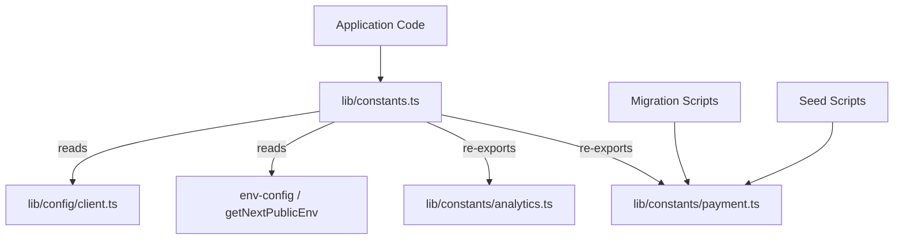

# 常量参考

常量模块（`template/lib/constants.ts` 和 `template/lib/constants/`）集中了所有应用程序范围的配置值、枚举、环境驱动的设置和幻数。常量被组织到特定于域的文件中，以允许在 Next.js 运行时之外的上下文中安全导入（例如，迁移脚本、种子脚本）。

## 架构概述



## 源文件

|文件|描述|
|------|-------------|
|`lib/constants.ts`|主要常量桶——从 env-config 导入并重新导出子模块|
|`lib/constants/payment.ts`|支付枚举和类型（对于脚本来说是安全的）|
|`lib/constants/analytics.ts`|与分析相关的常量|

## 本地化常数

```typescript
const DEFAULT_LOCALE = 'en';

const LOCALES = [
  'en', 'fr', 'es', 'de', 'zh', 'ar', 'he', 'ru', 'uk', 'pt',
  'it', 'ja', 'ko', 'nl', 'pl', 'tr', 'vi', 'th', 'hi', 'id', 'bg'
] as const;

type Locale = (typeof LOCALES)[number];

/** Right-to-left locales */
const RTL_LOCALES: readonly Locale[] = ['ar', 'he'] as const;
```

## 品牌和用户界面

```typescript
const LOGO_URL = '/logo-ever-work-3.png';
```

## API和后端

```typescript
/** Base URL for internal Next.js API routes */
const API_BASE_URL = getNextPublicEnv('NEXT_PUBLIC_API_BASE_URL');
```

## 身份验证和安全

```typescript
const COOKIE_SECRET = getNextPublicEnv('COOKIE_SECRET');
const JWT_ACCESS_TOKEN_EXPIRES_IN = getNextPublicEnv('JWT_ACCESS_TOKEN_EXPIRES_IN');
const JWT_REFRESH_TOKEN_EXPIRES_IN = getNextPublicEnv('JWT_REFRESH_TOKEN_EXPIRES_IN');
```

## 分析——PostHog

|常数|来源|描述|
|----------|--------|-------------|
|`POSTHOG_KEY`|`NEXT_PUBLIC_POSTHOG_KEY`|PostHog 项目 API 密钥|
|`POSTHOG_HOST`|`NEXT_PUBLIC_POSTHOG_HOST`|PostHog API 主机|
|`POSTHOG_ENABLED`|派生|当密钥和主机都存在时为真|
|`POSTHOG_DEBUG`|`POSTHOG_DEBUG`|启用调试日志记录|
|`POSTHOG_SESSION_RECORDING_ENABLED`|环境 /`'true'`|会话录制切换|
|`POSTHOG_AUTO_CAPTURE`|环境 /`'false'`|自动捕获页面浏览量|
|`POSTHOG_SAMPLE_RATE`|计算的|`0.1` 正在生产中，`1.0` 正在开发中|
|`POSTHOG_SESSION_RECORDING_SAMPLE_RATE`|计算的|`0.1` 正在生产中，`1.0` 正在开发中|

## 错误跟踪——哨兵

|常数|来源|描述|
|----------|--------|-------------|
|`SENTRY_DSN`|`NEXT_PUBLIC_SENTRY_DSN`|Sentry 数据源名称|
|`SENTRY_ENABLE_DEV`|`SENTRY_ENABLE_DEV`|在开发中启用 Sentry|
|`SENTRY_DEBUG`|`SENTRY_DEBUG`|哨兵调试模式|
|`SENTRY_ENABLED`|派生|当 DSN 设置且环境允许时为 True|

## 统一异常跟踪

```typescript
const EXCEPTION_TRACKING_PROVIDER = getNextPublicEnv('EXCEPTION_TRACKING_PROVIDER', 'both');
const POSTHOG_EXCEPTION_TRACKING = getNextPublicEnv('POSTHOG_EXCEPTION_TRACKING', 'true');
const SENTRY_EXCEPTION_TRACKING = getNextPublicEnv('SENTRY_EXCEPTION_TRACKING', 'true');

type ExceptionTrackingProvider = 'sentry' | 'posthog' | 'both' | 'none';
```

## 验证码

```typescript
const RECAPTCHA_SITE_KEY = getNextPublicEnv('NEXT_PUBLIC_RECAPTCHA_SITE_KEY');
const RECAPTCHA_SECRET_KEY = getNextPublicEnv('RECAPTCHA_SECRET_KEY');
```

## 付款常量 (`constants/payment.ts`)

此文件有意与 `constants.ts` 分开，以避免导入 `@/lib/config`，从而允许在 Next.js 之外运行的迁移和种子脚本中使用。

### 枚举

```typescript
enum PaymentFlow {
  PAY_AT_START = 'pay_at_start',
  PAY_AT_END = 'pay_at_end',
}

enum PaymentStatus {
  PENDING = 'pending',
  PAID = 'paid',
  FAILED = 'failed',
}

enum PaymentInterval {
  DAILY = 'daily',
  WEEKLY = 'weekly',
  MONTHLY = 'monthly',
  YEARLY = 'yearly',
  ONE_TIME = 'one-time',
  PER_SUBMISSION = 'per-submission',
}

enum PaymentPlan {
  FREE = 'free',
  STANDARD = 'standard',
  PREMIUM = 'premium',
}

enum PaymentMethod {
  CREDIT_CARD = 'credit_card',
  PAYPAL = 'paypal',
}

enum PaymentCurrency {
  USD = 'USD',
  EUR = 'EUR',
  GBP = 'GBP',
  CAD = 'CAD',
  AUD = 'AUD',
  ETH = 'ETH',
}

enum PaymentProvider {
  STRIPE = 'stripe',
  SOLIDGATE = 'solidgate',
  LEMONSQUEEZY = 'lemonsqueezy',
  POLAR = 'polar',
}

enum SubmissionStatus {
  DRAFT = 'draft',
  PENDING = 'pending',
  APPROVED = 'approved',
  REJECTED = 'rejected',
  PUBLISHED = 'published',
  ARCHIVED = 'archived',
}
```

### 计划显示名称

```typescript
const PAYMENT_PLAN_NAMES: Record<PaymentPlan, string> = {
  free: 'Free Plan',
  standard: 'Standard Plan',
  premium: 'Premium Plan',
};
```

### 赞助商广告定价

```typescript
const SponsorAdPricing = {
  WEEKLY: 100,    // $100.00
  MONTHLY: 300,   // $300.00
} as const;
```

## 分析常量 (`constants/analytics.ts`)

```typescript
/** Cookie name for anonymous viewer tracking */
const VIEWER_COOKIE_NAME = 'ever_viewer_id';

/** Cookie max age: 365 days in seconds */
const VIEWER_COOKIE_MAX_AGE = 365 * 24 * 60 * 60;  // 31,536,000
```

## 导入模式

### 完整的应用程序代码

```typescript
// Import everything from the main barrel
import {
  DEFAULT_LOCALE,
  LOCALES,
  POSTHOG_ENABLED,
  PaymentPlan,
  PaymentProvider,
  SubmissionStatus,
  VIEWER_COOKIE_NAME,
} from '@/lib/constants';
```

### Next.js 运行时之外的脚本

```typescript
// Import only from payment.ts to avoid Next.js dependencies
import { PaymentPlan, PaymentStatus, SubmissionStatus } from '@/lib/constants/payment';
```
