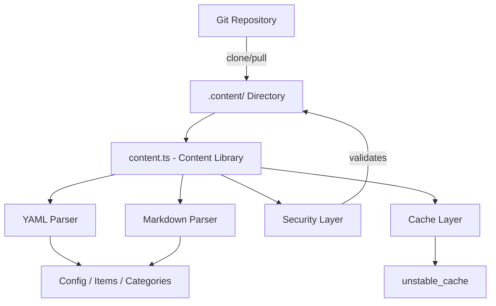
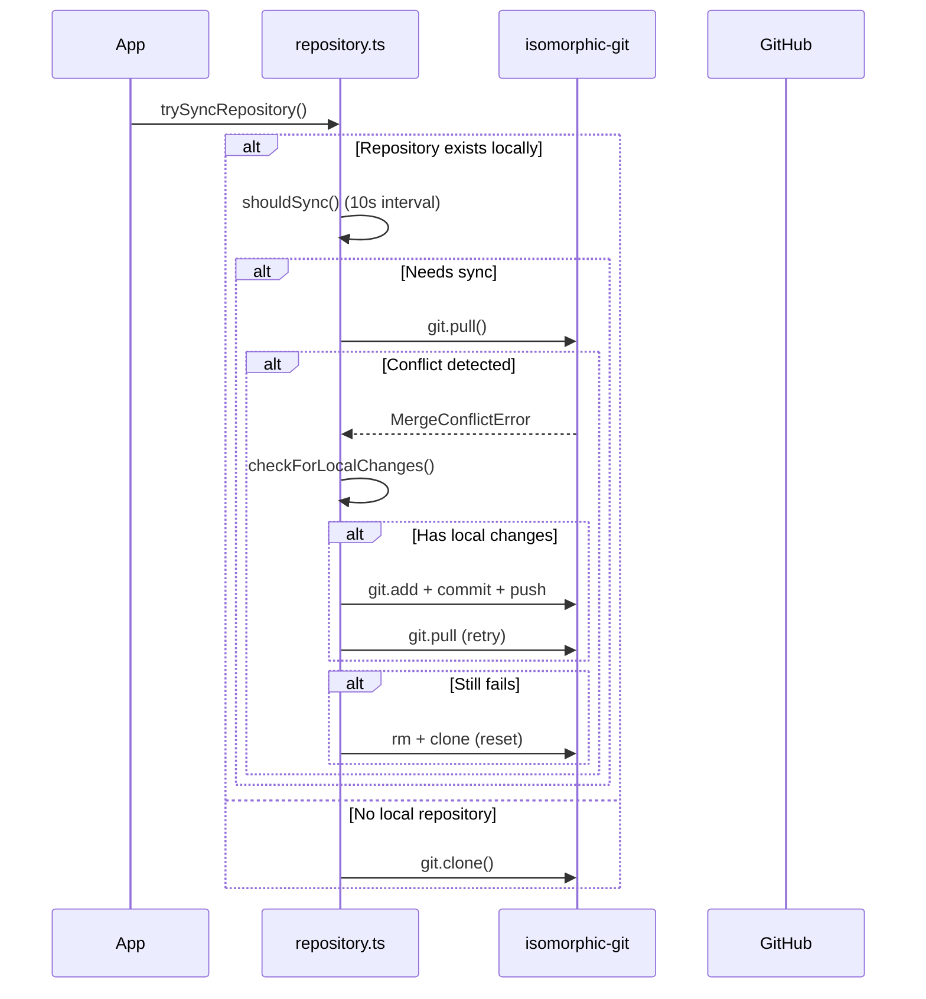

# 内容库

内容库 (`lib/content.ts`) 提供服务器端实用程序，用于从基于 Git 的 CMS 存储库读取、解析和缓存内容。它通过强大的安全措施处理 YAML/Markdown 内容文件、配置管理和内容同步。

## 架构概述



## 源文件

|文件|目的|
|------|---------|
|`lib/content.ts`|主要内容处理、读取、缓存|
|`lib/repository.ts`|Git 克隆/拉取与远程存储库同步|
|`lib/lib.ts`|路径实用程序（`getContentPath`、`fsExists`、`dirExists`）|
|`lib/cache-config.ts`|缓存标签和TTL配置|

## 安全层

内容库实施多种安全措施来防止路径遍历和注入攻击。

### 语言代码验证

```typescript
function validateLanguageCode(lang: string): boolean {
  const validLangPattern = /^[a-zA-Z0-9_-]+$/;
  return validLangPattern.test(lang) && lang.length <= 10;
}
```

仅接受字母数字字符、连字符和下划线，最大长度为 10 个字符。

### 文件名清理

```typescript
function sanitizeFilename(filename: string): string {
  const sanitized = path.basename(filename);
  if (sanitized.includes('..') || sanitized.includes('/') || sanitized.includes('\\')) {
    throw new Error('Invalid filename: contains dangerous characters');
  }
  return sanitized;
}
```

使用`path.basename` 去除目录组件并拒绝任何剩余的遍历字符。

### 路径验证

```typescript
function validatePath(filepath: string, basePath: string): void {
  const resolvedPath = path.resolve(filepath);
  const resolvedBase = path.resolve(basePath);
  if (!resolvedPath.startsWith(resolvedBase + path.sep) && resolvedPath !== resolvedBase) {
    throw new Error('Invalid file path: outside of allowed directory');
  }
}
```

`safeReadFile` 函数执行双重检查：它验证路径，然后验证解析的真实路径（以下符号链接）是否保留在基本目录中。

### 网址验证

```typescript
function isValidUrl(url: string): boolean {
  const trimmed = url.trim();
  if (trimmed.startsWith('/') && !trimmed.startsWith('//')) return true;
  return trimmed.startsWith('http://') || trimmed.startsWith('https://');
}
```

阻止 `javascript:`、`data:`、`vbscript:` 和其他危险协议方案。

### CSS 大小验证

```typescript
function isValidCssSize(value: string): boolean {
  if (['auto', 'inherit', 'initial', 'unset'].includes(value.trim())) return true;
  return /^\d+(\.\d+)?(px|em|rem|vh|vw|%|pt|cm|mm|in)?$/.test(value.trim());
}
```

通过自定义英雄 frontmatter 字段防止 CSS 注入。

## 内容处理

### YAML解析

使用 `yaml` 库解析内容文件，并对 frontmatter 进行 Zod 模式验证：

```typescript
const customHeroFrontmatterSchema = z.object({
  background_image: z.string().refine(isValidUrl, {
    message: 'Invalid URL: must be http, https, or relative path'
  }).optional(),
  // ... additional validated fields
});
```

### 配置缓存

站点配置使用 Next.js `unstable_cache` 进行缓存，并定义了 TTL 和缓存标签：

```typescript
import { CACHE_TAGS, CACHE_TTL } from './cache-config';

const getCachedConfig = unstable_cache(
  async () => { /* read and parse config.yml */ },
  [CACHE_TAGS.CONFIG],
  { revalidate: CACHE_TTL }
);
```

## Git 存储库同步

`repository.ts` 模块使用 `isomorphic-git` 管理 Git 操作。

### 同步流程



### 超时保护

所有 Git 操作都包含可配置的超时：

```typescript
async function withTimeout<T>(promise: Promise<T>, timeoutMs: number = 120000): Promise<T> {
  const timeoutPromise = new Promise<never>((_, reject) => {
    setTimeout(() => reject(new Error(`Operation timeout after ${timeoutMs}ms`)), timeoutMs);
  });
  return Promise.race([promise, timeoutPromise]);
}
```

### 冲突解决

系统通过多步策略处理合并冲突：

1. **通过`git.statusMatrix()`检测本地更改**
2. **在拉取之前尝试推送**本地更改
3. **推送成功后重试拉**
4. **完全重置**（删除+重新克隆）作为最后手段

### 回退行为

如果未配置 `DATA_REPOSITORY` 或克隆失败，系统将创建最少的后备内容：

```typescript
// Creates empty content directory with minimal config
const DEFAULT_CONFIG = `site_name: Website
item_name: Item
items_name: Items
copyright_year: ${new Date().getFullYear()}
`;
```

## 仅服务器执行

`content.ts` 和`repository.ts` 都使用`server-only` 导入来防止客户端意外使用：

```typescript
'use server';
import 'server-only';
```

这确保了文件系统访问的内容操作永远不会泄漏到客户端捆绑包中。

## 关键导出函数

|功能|描述|
|----------|-------------|
|`getCachedConfig()`|从 `config.yml` 返回缓存的站点配置|
|`trySyncRepository()`|从远程 Git 存储库克隆或提取内容|
|`pullChanges()`|通过冲突解决拉取最新更改|
|`validateLanguageCode()`|验证 i18n 语言代码格式|
|`sanitizeFilename()`|从文件名中删除目录组件|
|`safeReadFile()`|读取文件时具有全路径遍历保护|
