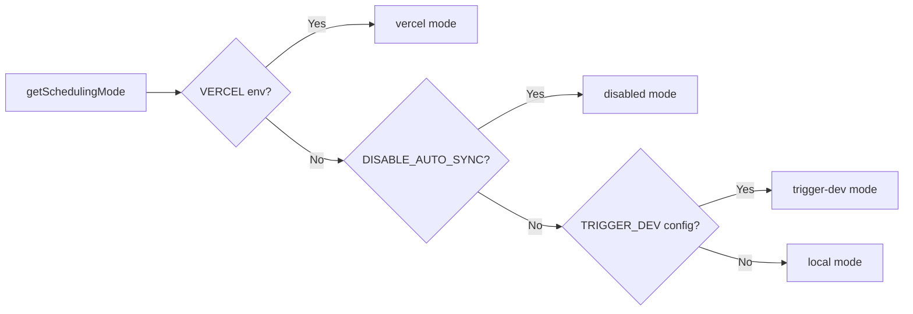

# 定时作业系统

## 概述

Ever Works Template 实现了灵活的后台作业系统，支持三种调度模式：**Vercel Cron**、**Trigger.dev** 和 **本地调度程序**。 Cron 端点是通过 `CRON_SECRET` 进行身份验证的标准 Next.js API 路由，系统包含一个单例初始化模块，可确保每个进程只设置一次作业。

## 建筑

```mermaid
flowchart TD
    A[Scheduling Mode Detection] --> B{getSchedulingMode}

    B -->|vercel| C[Vercel Cron]
    B -->|trigger-dev| D[Trigger.dev]
    B -->|local| E[Local Scheduler]
    B -->|disabled| F[No Jobs]

    C --> G[vercel.json crons]
    G --> G1[/api/cron/sync]
    G --> G2[/api/cron/subscription-reminders]
    G --> G3[/api/cron/subscription-expiration]

    G1 --> H[CRON_SECRET Verification]
    G2 --> H
    G3 --> H

    H -->|Valid| I[Execute Job]
    H -->|Invalid| J[401 Unauthorized]

    I --> I1[triggerManualSync]
    I --> I2[subscriptionRenewalReminderJob]
    I --> I3[processExpiredSubscriptions]

    D --> K[Trigger.dev SDK]
    E --> L[Internal setInterval]

    K --> I
    L --> I
```

## 源文件

|文件|目的|
|------|---------|
|`template/vercel.json`|Vercel cron 计划定义|
|`template/app/api/cron/sync/route.ts`|内容同步 cron 端点|
|`template/app/api/cron/subscription-reminders/route.ts`|续订提醒电子邮件|
|`template/app/api/cron/subscription-expiration/route.ts`|过期订阅处理|
|`template/app/api/cron/jobs/background-jobs-init.ts`|单例作业初始化|

## Cron 计划配置

### vercel.json

```json
{
    "crons": [
        {
            "path": "/api/cron/sync",
            "schedule": "0 3 * * *"
        },
        {
            "path": "/api/cron/subscription-reminders",
            "schedule": "0 9 * * *"
        },
        {
            "path": "/api/cron/subscription-expiration",
            "schedule": "0 0 * * *"
        }
    ]
}
```

|职位|时间表|时间|描述|
|-----|----------|------|-------------|
|内容同步| `0 3 * * *` |世界标准时间 (UTC) 每天凌晨 3:00|同步来自基于 Git 的 CMS 的内容|
|订阅提醒| `0 9 * * *` |世界标准时间 (UTC) 每天上午 9:00|发送续订提醒电子邮件|
|订阅到期| `0 0 * * *` |UTC 每日午夜|处理过期的订阅|

## 认证

### 定时安全秘密验证

所有 cron 端点都使用定时安全比较来验证 `CRON_SECRET` 以防止定时攻击：

```typescript
import crypto from 'crypto';

function verifyCronSecret(request: NextRequest): boolean {
    const authHeader = request.headers.get('authorization');
    const cronSecret = process.env.CRON_SECRET;

    // Development bypass
    if (!cronSecret && process.env.NODE_ENV === 'development') {
        console.log('[Cron] Bypassing cron auth in development');
        return true;
    }

    if (!cronSecret || !authHeader) return false;

    const expectedValue = `Bearer ${cronSecret}`;

    // Length check before timing-safe comparison
    if (authHeader.length !== expectedValue.length) return false;

    return crypto.timingSafeEqual(
        Buffer.from(authHeader, 'utf8'),
        Buffer.from(expectedValue, 'utf8')
    );
}
```

主要安全特性：
- **定时安全比较**通过`crypto.timingSafeEqual`——防止攻击者通过测量响应时间差异来猜测秘密
- **长度预检查** -- `timingSafeEqual` 需要等长缓冲区
- **开发绕过** -- 仅当 `CRON_SECRET` 未配置且 `NODE_ENV=development` 时

### Vercel 自动身份验证

在 Vercel 上部署时，平台会自动包含用于配置的 cron 作业的 `Authorization: Bearer <CRON_SECRET>` 标头。您只需在 Vercel 仪表板中设置`CRON_SECRET` 环境变量即可。

## 工作实施

### 内容同步作业

```typescript
export async function GET(request: Request): Promise<NextResponse> {
    const startTime = Date.now();

    // Verify authorization
    if (!isAuthorized) {
        return NextResponse.json({ success: false, message: "Unauthorized" }, { status: 401 });
    }

    try {
        const result = await triggerManualSync();
        const duration = Date.now() - startTime;

        return NextResponse.json({
            success: result.success,
            timestamp: new Date().toISOString(),
            duration,
            message: result.message,
        }, {
            headers: { "Cache-Control": "no-cache, no-store, must-revalidate" },
        });
    } catch (error) {
        return NextResponse.json({
            success: false,
            message: "Cron sync failed",
            details: safeErrorMessage(error, "Unknown error"),
        }, { status: 500 });
    }
}
```

响应格式：
```json
{
    "success": true,
    "timestamp": "2025-01-15T03:00:05.123Z",
    "duration": 5123,
    "message": "Sync completed successfully"
}
```

### 订阅到期作业

此作业处理过期的订阅并发送通知电子邮件：

```typescript
export async function GET(request: NextRequest) {
    if (!verifyCronSecret(request)) {
        return NextResponse.json({ success: false, message: 'Unauthorized' }, { status: 401 });
    }

    // 1. Find and update expired subscriptions
    const result = await subscriptionService.processExpiredSubscriptions();

    // 2. Send notification emails
    const { service: emailService } = await createEmailService();
    if (emailService.isServiceAvailable()) {
        for (const subscription of result.subscriptions) {
            const user = await getUserById(subscription.userId);
            const emailTemplate = getSubscriptionExpiredTemplate({ /* ... */ });
            await sendEmailSafely(emailService, emailConfig, emailTemplate, user.email);
        }
    }

    // 3. Return results
    return NextResponse.json({
        success: true,
        data: {
            processed: result.processed,
            affectedUsers,
            errors: result.errors,
            timestamp: new Date().toISOString()
        }
    });
}
```

关键行为：
- 电子邮件故障不会导致作业失败
- `POST` 方法也导出为手动触发器的别名
- 部分成功则返回`207 Multi-Status`

### 订阅提醒 工作

```typescript
export async function GET(request: NextRequest) {
    if (!verifyCronSecret(request)) {
        return NextResponse.json({ error: 'Unauthorized' }, { status: 401 });
    }

    const result = await subscriptionRenewalReminderJob();

    if (!result.success) {
        return NextResponse.json(
            { error: 'Job completed with errors', ...result },
            { status: 207 }  // Multi-Status for partial success
        );
    }

    return NextResponse.json({
        message: 'Subscription reminder job completed',
        ...result
    });
}

// Support POST for Vercel Cron
export async function POST(request: NextRequest) {
    return GET(request);
}
```

## 后台作业初始化

### 单例模式

初始化模块使用 `globalThis` 确保作业仅设置一次，即使跨无服务器函数调用也是如此：

```typescript
const GLOBAL_KEY = '__BACKGROUND_JOBS_INIT__' as const;

interface BackgroundJobsGlobalState {
    initializationState: 'pending' | 'initializing' | 'completed';
    initializationPromise: Promise<void> | null;
    loggedMode: SchedulingMode | null;
}

export async function ensureBackgroundJobsInitialized(): Promise<void> {
    // Skip during tests and builds
    if (process.env.NODE_ENV === 'test') return;
    if (process.env.NEXT_PHASE === 'phase-production-build') return;

    const state = getGlobalState();

    // Fast path: already completed
    if (state.initializationState === 'completed') return;

    // Wait for in-progress initialization
    if (state.initializationState === 'initializing') {
        return state.initializationPromise;
    }

    // Start initialization
    state.initializationState = 'initializing';
    state.initializationPromise = doInitialize();

    try {
        await state.initializationPromise;
        state.initializationState = 'completed';
    } catch (error) {
        state.initializationState = 'pending'; // Allow retry
        throw error;
    }
}
```

### 调度方式



|模式|行为|
|------|----------|
|`vercel`|Vercel Cron 通过 HTTP 端点处理的作业|
|`trigger-dev`|由 Trigger.dev 云调度程序管理的作业|
|`local`|用于开发的基于`setInterval`的内部调度程序|
|`disabled`|无自动调度 (`DISABLE_AUTO_SYNC=true`)|

## 环境变量

|变量|必填|描述|
|----------|----------|-------------|
|`CRON_SECRET`|仅限生产|用于 cron 身份验证的承载令牌|
|`DISABLE_AUTO_SYNC`|否|设置为 `true` 以禁用所有后台作业|
|`VERCEL`|自动设置|Vercel平台自动设置|

## 最佳实践

1. **始终对 cron 秘密使用计时安全比较**——防止计时攻击
2. **同时导出 GET 和 POST** -- Vercel Cron 可以使用任一方法
3. **在响应上设置 `Cache-Control: no-cache`** -- 防止缓存作业结果
4. **记录作业持续时间**——帮助识别性能回归
5. **优雅地处理电子邮件失败**——不要让通知失败导致作业崩溃
6. **使用 `207 Multi-Status`** 表示部分成功 - 区别于完全成功/失败
