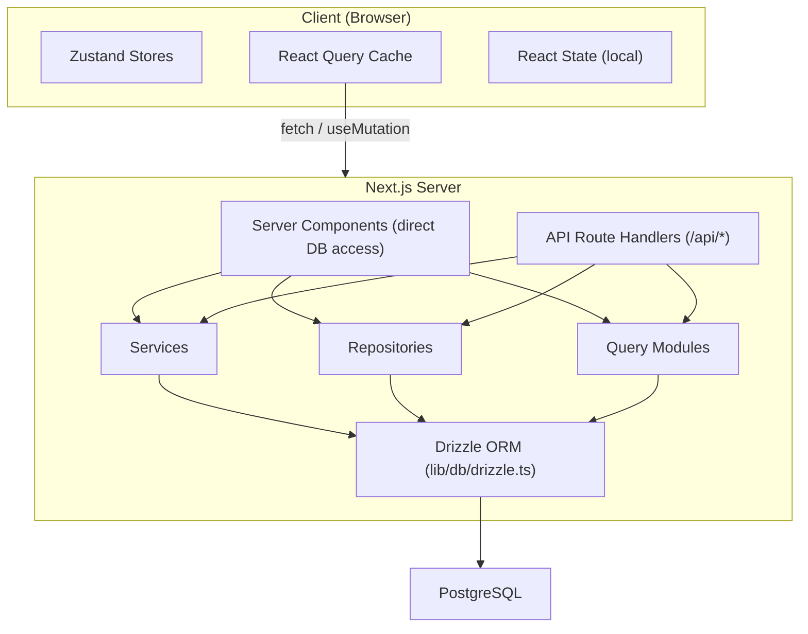

# 数据流和状态管理

本文档描述了数据如何通过 Ever Works 模板从数据库流向 UI，涵盖服务器组件、API 路由、React Query、Zustand 存储和存储库模式。

## 架构概述

该模板采用多层数据架构：



## 服务器端数据获取

### 服务器组件（直接数据库访问）

`app/`目录中的服务器组件可以直接导入和调用数据库查询函数或存储库方法。这是最有效的路径，因为它避免了不必要的 HTTP 往返。

```typescript
// app/[locale]/admin/items/page.tsx (simplified)
import { getItems } from '@/lib/db/queries';

export default async function AdminItemsPage() {
  const items = await getItems();
  return <ItemsList items={items} />;
}
```

### API 路由处理程序

`app/api/` 中的 API 路由充当客户端组件和服务器端逻辑之间的桥梁。它们遵循瘦处理程序模式：验证输入、调用适当的服务或存储库，然后返回 HTTP 响应。

```typescript
// Typical API route pattern
export async function GET(request: NextRequest) {
  const session = await auth();
  if (!session?.user) {
    return NextResponse.json({ error: 'Unauthorized' }, { status: 401 });
  }

  const data = await someRepository.findAll();
  return NextResponse.json({ success: true, data });
}
```

## 客户端状态管理

### TanStack 查询（反应查询 5）

React Query 是客户端服务器状态管理的主要工具。该模板通过 `hooks/` 目录中的自定义挂钩广泛使用它。

**全局配置** (`lib/react-query-config.ts`)：
- 默认失效时间：5 分钟
- 垃圾收集时间：10分钟
- 带指数退避的自动重试（最多 3 次重试）
- 重新获取窗口焦点并重新连接
- 4xx 客户端错误时不重试

**钩子模式**：每个功能区域都有专用的钩子来包装React Query：

```typescript
// hooks/use-admin-items.ts (simplified pattern)
import { useQuery, useMutation, useQueryClient } from '@tanstack/react-query';

export function useAdminItems(params) {
  return useQuery({
    queryKey: ['admin', 'items', params],
    queryFn: () => fetch('/api/admin/items').then(r => r.json()),
    staleTime: 5 * 60 * 1000,
  });
}

export function useCreateItem() {
  const queryClient = useQueryClient();
  return useMutation({
    mutationFn: (data) => fetch('/api/admin/items', {
      method: 'POST',
      body: JSON.stringify(data),
    }).then(r => r.json()),
    onSuccess: () => {
      queryClient.invalidateQueries({ queryKey: ['admin', 'items'] });
    },
  });
}
```

### 祖斯坦商店

Zustand 用于仅客户端的 UI 状态，不需要服务器同步。示例包括：

- **主题状态**：亮/暗模式首选项
- **过滤器状态**：活动过滤器选择
- **模态状态**：模态和叠加的打开/关闭状态
- **布局首选项**：网格视图与列表视图、侧边栏状态

### 反应上下文

`components/context/` 和 `components/providers/` 中的 React 上下文提供程序向组件子树提供共享状态。根提供程序包装器 (`app/[locale]/providers.tsx`) 组成：

- React 查询提供者（带有查询客户端）
- 主题提供者
- 身份验证会话提供者
- Toast 通知提供者

## 数据访问层

### 存储库模式

`lib/repositories/` 中的存储库提供了对数据库操作的清晰抽象。每个存储库都封装了对特定域实体的查询。

```
lib/repositories/
├── admin-analytics-optimized.repository.ts
├── admin-stats.repository.ts
├── category.repository.ts
├── client-dashboard.repository.ts
├── client-item.repository.ts
├── collection.repository.ts
├── integration-mapping.repository.ts
├── item.repository.ts
├── role.repository.ts
├── sponsor-ad.repository.ts
├── tag.repository.ts
├── twenty-crm-config.repository.ts
└── user.repository.ts
```

### 查询模块

`lib/db/queries/` 目录包含按域组织的 23 个以上查询模块。它们提供存储库和服务使用的原始 Drizzle ORM 查询功能。

### 服务层

`lib/services/` 目录包含 30 多个实现业务逻辑的服务文件。服务协调多个存储库、外部 API 调用和副作用（电子邮件、通知、Webhook）。

## API客户端架构

### 服务器端 API 客户端

`lib/api/server-api-client.ts` 为服务器端调用提供集中式 HTTP 客户端：
- 使用指数退避自动重试
- 可配置的超时（默认 30 秒）
- 开发中的结构化日志记录
- 误差归一化

### 浏览器端 API 客户端

`lib/api/api-client.ts` 和 `lib/api/api-client-class.ts` 提供了 React Query hook 用来调用 API 路由的客户端 API 抽象。

## 内容数据（基于 Git 的 CMS）

项目内容（目录列表）存储在 Git 存储库中，并通过 `lib/content.ts` 和 `lib/repository.ts` 进行管理。此内容在构建时克隆到`.content/` 中并定期同步。内容系统使用 `isomorphic-git` 直接从 Node.js 进行 Git 操作。

## 缓存策略

该模板实现了多级缓存方法：

1. **React 查询缓存**：客户端可配置每个查询的陈旧/GC 时间
2. **Next.js缓存**：通过`lib/cache-config.ts`进行服务器端渲染和数据缓存
3. **缓存失效**：使用重新验证标签通过`lib/cache-invalidation.ts`进行有针对性的失效
4. **数据库连接池**：在 `lib/db/drizzle.ts` 中配置，池大小在 1-50 个连接之间
