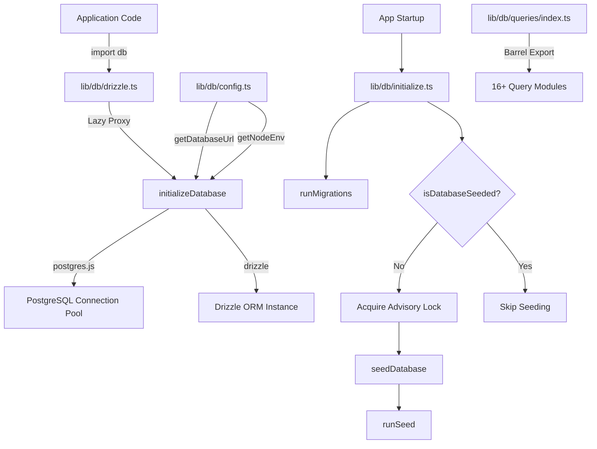
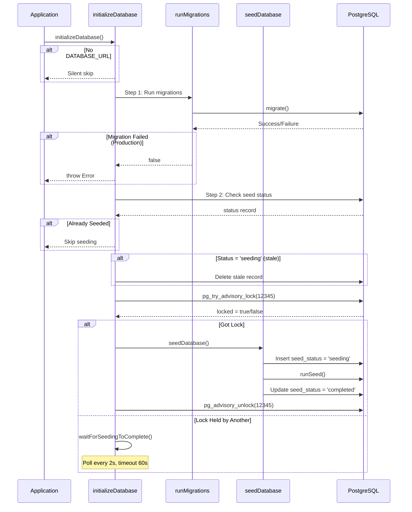

# 数据库实用程序模块

数据库实用程序模块 (`template/lib/db/`) 通过 `postgres.js` 管理 PostgreSQL 连接池、Drizzle ORM 初始化、自动迁移以及具有并发安全锁定的数据库播种。它设计用于在无服务器环境 (Vercel) 中工作，其中多个冷启动可以竞相初始化数据库。

## 架构概述



## 源文件

|文件|描述|
|------|-------------|
|`lib/db/config.ts`|脚本安全数据库配置（无`server-only`）|
|`lib/db/drizzle.ts`|连接池和带有惰性代理的 Drizzle 实例|
|`lib/db/initialize.ts`|自动迁移和播种编排|
|`lib/db/migrate.ts`|迁移运行者|
|`lib/db/queries/index.ts`|所有查询模块的桶式导出|

## 数据库配置 (`config.ts`)

**不**导入`server-only`的脚本安全函数，允许在迁移和种子脚本中使用：

```typescript
function getDatabaseUrl(): string | undefined;
function getNodeEnv(): 'development' | 'production' | 'test';
function isProduction(): boolean;
```

## 连接和 ORM (`drizzle.ts`)

### 惰性代理模式

`db` 导出使用 JavaScript `Proxy` 将连接初始化推迟到首次使用。这可以防止在构建期间 `DATABASE_URL` 可能不可用时出现连接错误。

```typescript
// Proxy intercepts all property access and initializes on demand
export const db = new Proxy({} as ReturnType<typeof drizzle>, {
  get(target, prop) {
    const database = initializeDatabase();
    return database[prop as keyof typeof database];
  },
});
```

### 连接池配置

```typescript
function getPoolSize(): number;
// - Reads DB_POOL_SIZE env var (clamped to 1-50)
// - Defaults: 20 (production), 10 (development)
```

池设置：
- `idle_timeout`：20秒
- `connect_timeout`：30秒
- `prepare`： false（某些无服务器环境需要）

### 单例通过`globalThis`

连接缓存在 `globalThis` 上，以便在开发过程中 Next.js 热模块重新加载时继续存在：

```typescript
const globalForDb = globalThis as unknown as {
  conn: postgres.Sql | undefined;
  db: ReturnType<typeof drizzle> | undefined;
};
```

### 直接实例访问

对于需要实际 Drizzle 实例的情况（例如 NextAuth.js Drizzle 适配器）：

```typescript
import { getDrizzleInstance } from '@/lib/db/drizzle';

const adapter = DrizzleAdapter(getDrizzleInstance(), { ... });
```

## 迁移运行者 (`migrate.ts`)

### `runMigrations(): Promise<boolean>`

从 `./lib/db/migrations` 文件夹运行 Drizzle 迁移。可以安全地调用每个初创公司，因为 Drizzle 的 `migrate()` 是幂等的——它跟踪 `__drizzle_migrations` 表中应用的迁移。

```typescript
import { runMigrations } from '@/lib/db/migrate';

const success = await runMigrations();
if (!success) {
  console.error('Migrations failed -- run pnpm db:migrate manually');
}
```

**行为：**
- 记录执行前后的最近迁移历史记录
- 成功时返回`true`，失败时返回`false`
- 不抛出——记录失败并以布尔值形式返回

## 数据库初始化 (`initialize.ts`)

### `initializeDatabase(): Promise<void>`

应用程序启动时调用的主要初始化函数。处理完整的生命周期：



### 并发安全

多个无服务器实例可以同时启动。该模块使用以下方式防止重复播种：

1. **PostgreSQL 咨询锁** (`pg_try_advisory_lock(12345)`) -- 非阻塞
2. **种子状态表**跟踪 `seeding`、`completed`、`failed` 状态
3. **过时检测** -- 卡住 `seeding` 状态的 5 分钟阈值
4. **Wait-and-poll** -- 无法获取锁的实例每 2 秒轮询一次

### 辅助函数

```typescript
// Check if database has been successfully seeded
async function isDatabaseSeeded(): Promise<boolean>;

// Wait for another instance to finish seeding (60s timeout, 2s intervals)
async function waitForSeedingToComplete(): Promise<boolean>;
```

## 查询模块

`lib/db/queries/` 目录包含特定于域的查询模块，全部通过 `index.ts` 重新导出：

|模块|域名|
|--------|--------|
|`activity.queries.ts`|活动记录|
|`auth.queries.ts`|身份验证（用户查找、密码验证）|
|`client.queries.ts`|客户简介|
|`comment.queries.ts`|评论|
|`company.queries.ts`|公司简介|
|`dashboard.queries.ts`|仪表板统计|
|`engagement.queries.ts`|浏览量、投票数、收藏夹聚合|
|`item.queries.ts`|项目增删改查|
|`location-index.queries.ts`|基于位置的索引|
|`newsletter.queries.ts`|时事通讯订阅|
|`payment.queries.ts`|付款记录|
|`report.queries.ts`|报告|
|`subscription.queries.ts`|订阅|
|`survey.queries.ts`|调查和回应|
|`user.queries.ts`|用户管理|
|`vote.queries.ts`|投票系统|

### 导入模式

```typescript
import {
  getUserByEmail,
  getClientProfileByUserId,
  logActivity,
  isUserAdmin,
} from '@/lib/db/queries';
```

## 环境变量

|变量|必填|描述|
|----------|----------|-------------|
|`DATABASE_URL`|否（可选数据库）|PostgreSQL 连接字符串|
|`DB_POOL_SIZE`|否|连接池大小（默认：10/20）|
|`NODE_ENV`|否|确定池大小默认值和日志记录|
