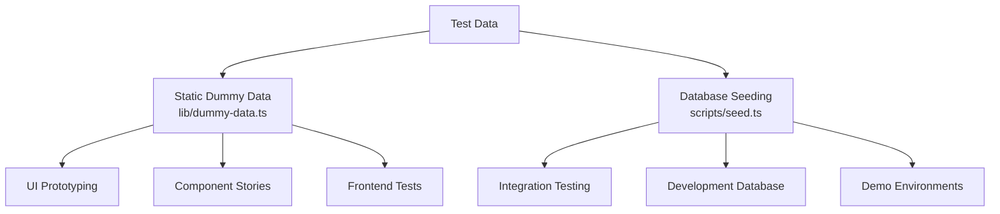
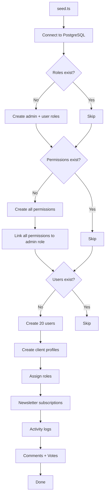
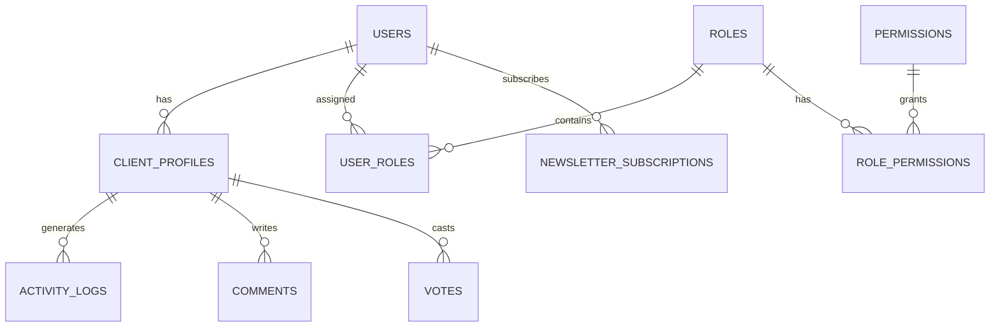

# 虚拟数据系统

该模板提供了两种测试数据的方法：用于 UI 开发和原型设计的静态虚拟数据，以及用于在 PostgreSQL 中生成真实记录的数据库播种系统。它们共同涵盖了从模型到集成测试的整个开发生命周期。

## 概述



## 静态虚拟数据

`lib/dummy-data.ts` 模块导出类型化的示例数据，以供开发期间的组件使用。

### 提交接口

```typescript
export interface Submission {
  id: string;
  title: string;
  description: string;
  status: "approved" | "pending" | "rejected";
  submittedAt: string | null;
  approvedAt?: string;
  rejectedAt?: string;
  rejectionReason?: string;
  category: string;
  tags: string[];
  views: number;
  likes: number;
}
```

### 虚拟提交

涵盖所有状态状态的六个提交示例：

|身份证号|标题|状态|类别|意见|喜欢|
|---|---|---|---|---|---|
| 1 |现代电子商务平台|已批准|网页开发| 1250 | 89 |
| 2 |任务管理应用程序|待定|移动开发| 567 | 23 |
| 3 |天气仪表板|被拒绝|网页开发| 890 | 45 |
| 4 |人工智能聊天助手|已批准|人工智能/机器学习| 2100 | 156 |
| 5 |健身追踪应用程序|待定|移动开发| 432 | 18 |
| 6 |博客平台|待定|网页开发| 0 | 0 |

在组件中的用法：

```typescript
import { dummySubmissions } from '@/lib/dummy-data';

export function SubmissionList() {
  return (
    <div>
      {dummySubmissions.map((submission) => (
        <SubmissionCard key={submission.id} submission={submission} />
      ))}
    </div>
  );
}
```

### 虚拟投资组合

用于展示项目卡的三个示例组合项目：

|身份证号|标题|精选|标签|
|---|---|---|---|
| 1 |电商平台|是的|Next.js、Stripe、电子商务|
| 2 |任务管理应用程序|是的|反应、Firebase、实时|
| 3 |天气仪表板|否|Vue.js、天气 API、仪表板|

每个投资组合项目包括：

```typescript
{
  id: string;
  title: string;
  description: string;
  imageUrl: string;      // Unsplash placeholder image
  externalUrl: string;   // Demo link
  tags: string[];
  isFeatured: boolean;
}
```

## 数据库播种

`scripts/seed.ts` 脚本使用 Drizzle ORM 直接在 PostgreSQL 中生成真实数据。

### 播种架构



### 数据关系



### 生成的用户配置文件

播种器创建具有确定性变化的配置文件：

```typescript
// Plan distribution
plan: i % 5 === 0 ? 'premium'    // 20% premium
    : i % 3 === 0 ? 'standard'   // ~13% standard
    : 'free';                     // ~67% free

// Job titles alternate
jobTitle: i % 2 === 0 ? 'Developer' : 'Designer';

// Companies alternate
company: i % 2 === 0 ? 'Acme Inc.' : 'Globex';

// Bios for every 3rd user
bio: i % 3 === 0 ? 'Power user' : null;
```

### 活动日志模式

活动日志通过四种操作类型循环：

|指数形态|行动|描述|
|---|---|---|
|`i % 4 === 0`|`SIGN_UP`|账户创建|
|`i % 4 === 1`|`SIGN_IN`|登录事件|
|`i % 4 === 2`|`COMMENT`|发表评论|
|`i % 4 === 3`|`VOTE`|投票|

时间戳是过去 7 天内随机的。

### 投票分配

投票采用 75/25 的比例，赞成赞成票：

```typescript
voteType: i % 4 === 0 ? VoteType.DOWNVOTE : VoteType.UPVOTE
```

### 连接配置

播种器使用适合脚本的保守连接设置：

```typescript
const conn = postgres(databaseUrl, {
  max: 1,              // Single connection (no pool needed)
  idle_timeout: 20,    // Close idle connections after 20s
  connect_timeout: 10, // 10-second connection timeout
  prepare: false,      // Disable prepared statements
});
```

## 条纹产品播种

`scripts/seed-stripe-products.ts` 脚本在 Stripe 中创建计费目录。有关完整的产品列表，请参阅[数据库脚本](../development/database-scripts.md) 文档。

## 幂等性

两种播种方法都被设计为可以安全地重复执行：

|数据类型|守卫状态|重新运行时的行为|
|---|---|---|
|角色|`SELECT * FROM roles LIMIT 1`|如果存在则跳过|
|权限|`SELECT * FROM permissions LIMIT 1`|如果存在则跳过|
|用户|`SELECT count(*) FROM users`|如果计数 > 0 则跳过|
|时事通讯|包含在用户创建块中|与用户一起跳过|

## 在开发中使用虚拟数据

### 模式 1：组件原型设计

在后端准备就绪之前，使用静态虚拟数据构建 UI 组件：

```typescript
import { dummySubmissions, type Submission } from '@/lib/dummy-data';

interface SubmissionCardProps {
  submission: Submission;
}

export function SubmissionCard({ submission }: SubmissionCardProps) {
  const statusColors = {
    approved: 'bg-green-100 text-green-800',
    pending: 'bg-yellow-100 text-yellow-800',
    rejected: 'bg-red-100 text-red-800',
  };

  return (
    <div className="p-4 border rounded-lg">
      <h3>{submission.title}</h3>
      <span className={statusColors[submission.status]}>
        {submission.status}
      </span>
      <p>{submission.description}</p>
      <div className="flex gap-2">
        {submission.tags.map(tag => (
          <span key={tag} className="badge">{tag}</span>
        ))}
      </div>
    </div>
  );
}
```

### 模式 2：仪表板模型

```typescript
import { dummySubmissions } from '@/lib/dummy-data';

// Derive stats from dummy data
const stats = {
  total: dummySubmissions.length,
  approved: dummySubmissions.filter(s => s.status === 'approved').length,
  pending: dummySubmissions.filter(s => s.status === 'pending').length,
  rejected: dummySubmissions.filter(s => s.status === 'rejected').length,
  totalViews: dummySubmissions.reduce((sum, s) => sum + s.views, 0),
};
```

### 模式 3：用真实数据替换

当后端集成准备就绪时，交换导入：

```typescript
// Before (dummy data)
import { dummySubmissions } from '@/lib/dummy-data';
const submissions = dummySubmissions;

// After (real data)
const submissions = await getSubmissions();
```

## 添加新的虚拟数据

添加新功能时，请使用键入的示例数据扩展`lib/dummy-data.ts`：

1. 定义数据形状的 TypeScript 接口
2. 导出它以在组件中使用
3. 创建涵盖边缘情况的示例条目（空字段、最大长度字符串、所有状态值）
4. 使用现实的值（正确的名称、有效的 URL、合理的数字）
5. 如果适用，包括特色项目和非特色项目

```typescript
// Example: adding dummy reviews
export interface DummyReview {
  id: string;
  authorName: string;
  rating: number;
  comment: string;
  createdAt: string;
}

export const dummyReviews: DummyReview[] = [
  {
    id: "1",
    authorName: "Jane Developer",
    rating: 5,
    comment: "Excellent tool for rapid prototyping",
    createdAt: "2024-02-01T10:00:00Z"
  },
  // ... more entries covering 1-star, no comment, etc.
];
```
