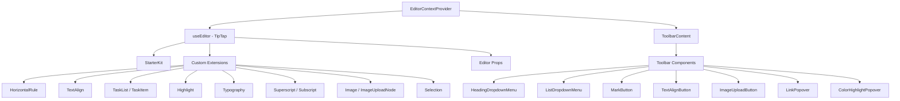

# 编辑系统

该模板包括一个基于 TipTap (ProseMirror) 构建的富文本编辑器，具有扩展、工具栏组件、挂钩和实用功能的模块化架构。该编辑器支持标题、列表、任务列表、图像、代码块、文本格式等。

## 架构概述



## 源文件

|目录|内容|
|-----------|----------|
|`lib/editor/extensions/`|TipTap 扩展重新导出和配置|
|`lib/editor/components/`|UI 组件（工具栏按钮、弹出窗口、图标）|
|`lib/editor/hooks/`|用于编辑器状态管理的 React hooks|
|`lib/editor/providers/`|具有扩展设置的编辑器上下文提供程序|
|`lib/editor/contents/`|工具栏布局和编辑器内容组件|
|`lib/editor/utils/`|实用功能（快捷方式、验证、上传）|

## 扩展配置

扩展注册在`EditorContextProvider` 中。 `StarterKit` 提供基本功能，并在顶部提供附加扩展：

```typescript
const extensions = useMemo(() => [
  StarterKit.configure({
    horizontalRule: false,
    link: { openOnClick: false, enableClickSelection: true },
  }),
  HorizontalRule,
  TextAlign.configure({ types: ['heading', 'paragraph'] }),
  ImageUploadNode.configure({
    accept: 'image/*',
    maxSize: MAX_FILE_SIZE, // 5MB
    limit: 3,
    upload: handleImageUpload,
    onError: (error) => console.error('Upload failed:', error),
  }),
  TaskList,
  TaskItem.configure({ nested: true }),
  Highlight.configure({ multicolor: true }),
  Image,
  Typography,
  Superscript,
  Subscript,
  Selection,
], []);
```

### 扩展总结

|扩展|来源|目的|
|-----------|--------|---------|
|`StarterKit`|`@tiptap/starter-kit`|段落、粗体、斜体、列表、代码、块引用|
|`HorizontalRule`|`@tiptap/extension-horizontal-rule`|水平分隔线|
|`TextAlign`|`@tiptap/extension-text-align`|左、中、右、对齐对齐|
|`TaskList` / `TaskItem`|`@tiptap/extension-list`|交互式复选框列表|
|`Highlight`|`@tiptap/extension-highlight`|多色文本突出显示|
|`Typography`|`@tiptap/extension-typography`|智能引号、破折号、省略号|
|`Superscript`|`@tiptap/extension-superscript`|上标文字|
|`Subscript`|`@tiptap/extension-subscript`|下标文字|
|`Selection`|`@tiptap/extensions`|增强的选择处理|
|`Image`|`@tiptap/extension-image`|静态图像展示|
|`ImageUploadNode`|定制|拖放图像上传并显示进度|

## 编辑器上下文提供者

该编辑器是通过 React Context 提供的，用于树范围的访问：

```typescript
export const EditorContext = createContext<Editor | null>(null);

export function EditorContextProvider({ children }: { children: React.ReactNode }) {
  const editor = useEditor({
    immediatelyRender: false,
    shouldRerenderOnTransaction: false,
    editorProps: {
      attributes: {
        autocomplete: 'on',
        autocorrect: 'on',
        autocapitalize: 'off',
        'aria-label': 'Main content area, start typing to enter text.',
        class: cn('min-h-96'),
      },
    },
    extensions,
  });

  return <EditorContext.Provider value={editor}>{children}</EditorContext.Provider>;
}
```

关键配置选择：
- `immediatelyRender: false` 防止 SSR 水合作用不匹配
- `shouldRerenderOnTransaction: false` 通过避免不必要的重新渲染来优化性能

## 工具栏配置

`ToolbarContent` 组件定义了按组组织的完整工具栏布局：

|集团|组件|
|-------|------------|
|历史|撤消、重做|
|块类型|标题下拉菜单 (H1-H4)、列表下拉菜单（项目符号、有序、任务）、块引用、代码块|
|行内标记|粗体、斜体、删除线、代码、下划线、颜色突出显示、链接|
|脚本|上标、下标|
|对准|左、中、右、两端对齐|
|媒体|图片上传|

组由 `ToolbarSeparator` 组件分隔，并使用 `Spacer` 元素进行定位。

## 编辑器挂钩

### `useTiptapEditor`

提供从 props 或 context 灵活访问编辑器实例：

```typescript
export function useTiptapEditor(providedEditor?: Editor | null): {
  editor: Editor | null;
  editorState?: Editor["state"];
  canCommand?: Editor["can"];
}
```

该挂钩将直接提供的编辑器与上下文编辑器合并，使组件能够独立工作并在提供程序树中工作。

### 附加挂钩

|钩子|目的|
|------|---------|
|`use-editor.ts`|核心编辑器状态管理|
|`use-editor-sync.ts`|编辑器实例之间的同步|
|`use-cursor-visibility.ts`|光标位置和可见性跟踪|
|`use-element-rect.ts`|元素边界矩形跟踪|
|`use-scrolling.ts`|滚动位置和行为|
|`use-throttled-callback.ts`|限制回调执行|
|`use-window-size.ts`|响应式窗口大小跟踪|
|`use-unmount.ts`|组件卸载时的清理|

## 实用功能

### 快捷键格式化

系统处理特定于平台的键盘快捷键：

```typescript
export const MAC_SYMBOLS: Record<string, string> = {
  mod: "Command", command: "Command", meta: "Command",
  ctrl: "Ctrl", alt: "Option", shift: "Shift",
  // ... additional mappings
};

export const formatShortcutKey = (key: string, isMac: boolean, capitalize?: boolean) => {
  // Returns Mac symbols or formatted key names
};

export const parseShortcutKeys = (props: {
  shortcutKeys: string | undefined;
  delimiter?: string;
  capitalize?: boolean;
}) => string[];
```

### 模式验证

```typescript
// Check if a mark type exists in the editor schema
export const isMarkInSchema = (markName: string, editor: Editor | null): boolean;

// Check if a node type exists in the editor schema
export const isNodeInSchema = (nodeName: string, editor: Editor | null): boolean;

// Check if extensions are registered
export function isExtensionAvailable(editor: Editor | null, extensionNames: string | string[]): boolean;
```

### 节点导航

```typescript
// Find a node at a specific document position
export function findNodeAtPosition(editor: Editor, position: number): TiptapNode | null;

// Find a node by reference or position
export function findNodePosition(props: {
  editor: Editor | null;
  node?: TiptapNode | null;
  nodePos?: number | null;
}): { pos: number; node: TiptapNode } | null;

// Move focus to the next node
export function focusNextNode(editor: Editor): boolean;
```

### 图片上传

```typescript
export const MAX_FILE_SIZE = 5 * 1024 * 1024; // 5MB

export const handleImageUpload = async (
  file: File,
  onProgress?: (event: { progress: number }) => void,
  abortSignal?: AbortSignal
): Promise<string>;
```

上传处理程序验证文件大小，支持进度跟踪，并通过`AbortSignal`处理取消。

### 网址清理

```typescript
export function isAllowedUri(uri: string | undefined, protocols?: ProtocolConfig): boolean;
export function sanitizeUrl(inputUrl: string, baseUrl: string, protocols?: ProtocolConfig): string;
```

确保链接中仅允许使用安全协议（`http`、`https`、`ftp`、`mailto` 等）。不安全的 URL 将替换为 `"#"`。
