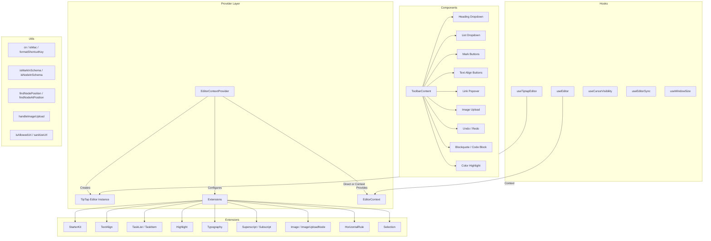

# 编辑器实用程序模块

编辑器实用程序模块 (`template/lib/editor/`) 提供了基于 **TipTap** (ProseMirror) 构建的完整富文本编辑解决方案。它包括预配置的编辑器提供程序、TipTap 扩展、完整的工具栏组件库、用于 DOM 操作的实用函数以及用于编辑器状态管理的自定义 React 挂钩。

## 架构概述



## 源文件

|目录|描述|
|-----------|-------------|
|`lib/editor/index.ts`|所有子模块的桶式导出|
|`lib/editor/providers/`|`EditorContextProvider` 和`EditorContext`|
|`lib/editor/extensions/`|TipTap 扩展重新导出|
|`lib/editor/hooks/`|自定义 React 钩子|
|`lib/editor/utils/`|实用功能|
|`lib/editor/contents/`|`ToolbarContent` 和 `EditorContent` 组件|
|`lib/editor/components/`|UI 基元、工具栏按钮、图标、节点|
|`lib/editor/styles/`|编辑 CSS 样式|

## 编辑器提供者

### `EditorContextProvider`

使用预配置的 TipTap 编辑器实例包裹子项：

```tsx
import { EditorContextProvider } from '@/lib/editor';

function MyEditor() {
  return (
    <EditorContextProvider>
      <ToolbarContent editor={null} />
      <EditorContent />
    </EditorContextProvider>
  );
}
```

### 配置

提供商使用以下设置配置 TipTap：

```typescript
const editor = useEditor({
  immediatelyRender: false,
  shouldRerenderOnTransaction: false,
  editorProps: {
    attributes: {
      autocomplete: 'on',
      autocorrect: 'on',
      autocapitalize: 'off',
      'aria-label': 'Main content area, start typing to enter text.',
      class: 'min-h-96',
    },
  },
  extensions: [/* ... */],
});
```

### 预配置扩展

|扩展|配置|
|-----------|--------------|
|`StarterKit`|`horizontalRule: false`、`link.openOnClick: false`|
|`HorizontalRule`|默认|
|`TextAlign`|适用于 `heading` 和 `paragraph` 节点|
|`ImageUploadNode`|接受：`image/*`，最大5MB，限制3张图片|
|`TaskList` / `TaskItem`|启用嵌套任务|
|`Highlight`|启用多色|
|`Image`|默认|
|`Typography`|智能引号和破折号|
|`Superscript` / `Subscript`|默认|
|`Selection`|默认|

## 挂钩

### `useEditor(): Editor`

从`EditorContext` 检索编辑器实例。必须在`EditorContextProvider` 内使用。

```typescript
import { useEditor } from '@/lib/editor';

function MyComponent() {
  const editor = useEditor();
  // editor is the TipTap Editor instance
}
```

### `useTiptapEditor(providedEditor?): { editor, editorState?, canCommand? }`

灵活的钩子，接受可选的编辑器实例或回退到 TipTap 上下文：

```typescript
import { useTiptapEditor } from '@/lib/editor/hooks';

function ToolbarButton({ editor: externalEditor }) {
  const { editor, editorState, canCommand } = useTiptapEditor(externalEditor);

  const isBold = editorState ? editor?.isActive('bold') : false;
  const canBold = canCommand ? canCommand().toggleBold() : false;
}
```

### 其他挂钩

|钩子|目的|
|------|---------|
|`useCursorVisibility`|跟踪视口中光标位置的可见性|
|`useEditorSync`|将编辑器内容与外部状态同步|
|`useElementRect`|跟踪元素边界矩形|
|`useScrolling`|检测滚动状态|
|`useThrottledCallback`|限制回调函数|
|`useUnmount`|在组件卸载时运行清理|
|`useWindowSize`|跟踪窗口尺寸|

## 实用功能

### 类名助手

```typescript
function cn(...classes: (string | boolean | undefined | null)[]): string;
// Filters falsy values and joins with space
cn('min-h-96', isActive && 'bg-blue-500', undefined); // 'min-h-96 bg-blue-500'
```

### 平台检测

```typescript
function isMac(): boolean;
// Returns true if navigator.platform includes 'mac'
```

### 快捷键格式化

```typescript
function formatShortcutKey(key: string, isMac: boolean, capitalize?: boolean): string;
// Mac: 'ctrl' -> '???', 'alt' -> '???', 'shift' -> '???', 'meta' -> '???'
// Windows: 'ctrl' -> 'Ctrl'

function parseShortcutKeys(props: {
  shortcutKeys: string | undefined;
  delimiter?: string;    // default: '+'
  capitalize?: boolean;  // default: true
}): string[];
// 'ctrl+shift+b' -> ['???', '???', 'B'] (Mac) or ['Ctrl', 'Shift', 'B'] (Windows)
```

### 模式检查

```typescript
function isMarkInSchema(markName: string, editor: Editor | null): boolean;
// Checks if a mark type exists in the editor schema

function isNodeInSchema(nodeName: string, editor: Editor | null): boolean;
// Checks if a node type exists in the editor schema

function isExtensionAvailable(editor: Editor | null, extensionNames: string | string[]): boolean;
// Checks if one or more extensions are registered
// Logs a warning if none found
```

### 节点操作

```typescript
function findNodeAtPosition(editor: Editor, position: number): TiptapNode | null;
// Returns the node at the given document position

function findNodePosition(props: {
  editor: Editor | null;
  node?: TiptapNode | null;
  nodePos?: number | null;
}): { pos: number; node: TiptapNode } | null;
// Finds position by node reference or position number

function focusNextNode(editor: Editor): boolean;
// Moves cursor to the next node, creating a paragraph if at end

function isNodeTypeSelected(editor: Editor | null, types: string[]): boolean;
// Checks if current selection is a NodeSelection matching any type

function isValidPosition(pos: number | null | undefined): pos is number;
// Type guard for valid document positions (>= 0)
```

### 图片上传

```typescript
const MAX_FILE_SIZE = 5 * 1024 * 1024; // 5MB

async function handleImageUpload(
  file: File,
  onProgress?: (event: { progress: number }) => void,
  abortSignal?: AbortSignal,
): Promise<string>;
// Returns the URL of the uploaded image
// Default implementation is a demo stub -- replace with actual upload logic
```

### 网址验证

```typescript
function isAllowedUri(uri: string | undefined, protocols?: ProtocolConfig): boolean;
// Checks URI against allowed protocols:
// http, https, ftp, ftps, mailto, tel, callto, sms, cid, xmpp
// Plus any custom protocols passed in

function sanitizeUrl(inputUrl: string, baseUrl: string, protocols?: ProtocolConfig): string;
// Returns sanitized URL or '#' if not allowed
```

## 工具栏内容

`ToolbarContent` 组件提供了一个完整的、预配置的工具栏：

```tsx
import { ToolbarContent } from '@/lib/editor/contents';

<ToolbarContent editor={editor} />
```

### 工具栏组

|集团|组件|
|-------|-----------|
|撤消/重做|`UndoRedoButton`（撤消、重做）|
|块格式化|`HeadingDropdownMenu` (H1-H4)、`ListDropdownMenu`（项目符号、有序、任务）、`BlockquoteButton`、`CodeBlockButton`|
|内联格式|`MarkButton`（粗体、斜体、删除线、代码、下划线）、`ColorHighlightPopover`、`LinkPopover`|
|上标|`MarkButton`（上标、下标）|
|文本对齐|`TextAlignButton`（左、中、右、对齐）|
|媒体|`ImageUploadButton`|

## 元件库

### 原始组件

工具栏按钮使用的基本 UI 组件：

- `Badge`、`Button`、`Card`、`DropdownMenu`、`Input`、`Popover`、`Separator`、`Spacer`、`Toolbar`、 `Tooltip`

### 节点组件

自定义 TipTap 节点视图：

- `HorizontalRuleNode` -- 自定义水平线扩展
- `ImageUploadNode` -- 带拖放功能的文件上传节点

### 图标组件

所有工具栏操作的 SVG 图标（粗体、斜体、标题级别、列表、对齐方式等）。
