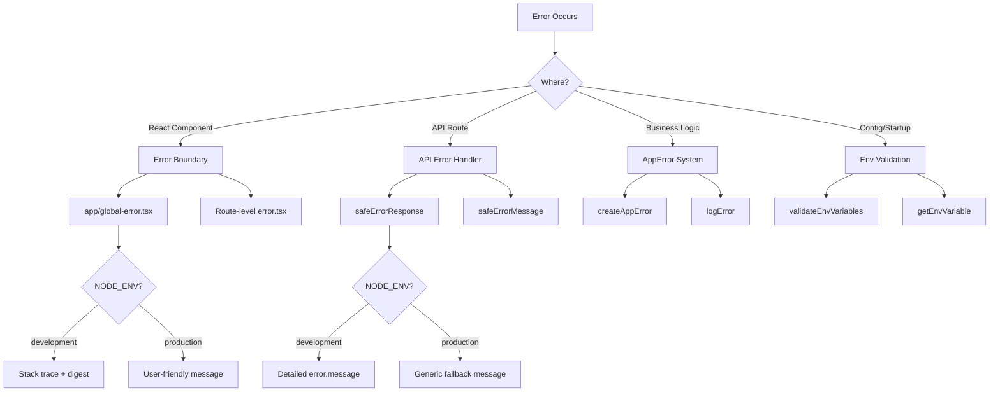

# 错误处理模式

## 概述

Ever Works Template 实现了多层错误处理策略，涵盖 React 错误边界、API 路由错误响应、类型化应用程序错误和环境变量验证。该设计优先考虑安全性（生产中不会泄漏信息），同时在开发中保持开发人员友好的调试。

## 建筑



## 源文件

|文件|目的|
|------|---------|
|`template/app/global-error.tsx`|根级 React 错误边界|
|`template/app/not-found.tsx`|404 未找到页面|
|`template/lib/utils/api-error.ts`|API 路由错误实用程序|
|`template/lib/utils/error-handler.ts`|应用程序错误类型和日志记录|
|`template/lib/auth/error-handler.ts`|特定于身份验证的错误处理|

## 反应错误边界

### 全局误差边界

`global-error.tsx` 文件捕获应用程序根目录中未处理的错误：

```typescript
'use client';

export default function GlobalError({
    error,
    reset,
}: {
    error: Error & { digest?: string };
    reset: () => void;
}) {
    useEffect(() => {
        console.error(error);
    }, [error]);

    return (
        <html lang="en">
            <body>
                <h1>Something went wrong!</h1>
                {process.env.NODE_ENV !== 'production' && (
                    <div>
                        <p className="text-red-600">{error.message}</p>
                        {error.stack && <pre>{error.stack}</pre>}
                        {error.digest && <p>Error ID: {error.digest}</p>}
                    </div>
                )}
                <Button onPress={() => reset()}>Refresh</Button>
                <Link href="/">Go Home</Link>
            </body>
        </html>
    );
}
```

关键行为：
- **开发**：显示错误消息、堆栈跟踪和错误摘要
- **生产**：仅显示一般消息
- **错误摘要**：Next.js 生成的唯一 ID，用于服务器端错误关联
- **重置功能**：重新渲染错误边界子树
- **自包含 HTML**：包含自己的 `<html>` 和 `<body>` 标签，因为它替换了整个页面

### 未找到页面

```typescript
'use client';

export default function NotFound() {
    const router = useRouter();
    return (
        <div>
            <h1>404</h1>
            <h2>Page Not Found</h2>
            <Button onClick={() => router.back()}>Go Back</Button>
            <Button onClick={() => router.push('/')}>Back to Home</Button>
        </div>
    );
}
```

## API错误处理

### 安全错误响应

API 路由错误响应的主要实用程序：

```typescript
export function safeErrorResponse(
    error: unknown,
    fallbackMessage: string,
    status: number = 500
): NextResponse {
    const detail = error instanceof Error ? error.message : String(error);

    // Always log full details server-side
    console.error(`[API Error] ${fallbackMessage}:`, detail);

    const message = process.env.NODE_ENV === "development" ? detail : fallbackMessage;

    return NextResponse.json({ success: false, error: message }, { status });
}
```

API 路由中的用法：

```typescript
export async function GET(request: NextRequest) {
    try {
        const result = await someOperation();
        return NextResponse.json(result);
    } catch (error) {
        return safeErrorResponse(error, 'Failed to process request');
    }
}
```

### 安全错误消息

对于需要错误字符串而不创建响应的情况：

```typescript
export function safeErrorMessage(error: unknown, fallbackMessage: string): string {
    if (process.env.NODE_ENV === "development") {
        return error instanceof Error ? error.message : String(error);
    }
    return fallbackMessage;
}
```

## 应用错误系统

### 错误类型

```typescript
export enum ErrorType {
    AUTH = 'auth',
    CONFIG = 'config',
    DATABASE = 'database',
    NETWORK = 'network',
    VALIDATION = 'validation',
    UNKNOWN = 'unknown'
}

export interface AppError {
    message: string;
    type: ErrorType;
    code?: string;
    originalError?: unknown;
}
```

### 创建类型错误

```typescript
import { createAppError, ErrorType } from '@/lib/utils/error-handler';

const error = createAppError(
    'Failed to configure OAuth providers',
    ErrorType.CONFIG,
    'OAUTH_CONFIG_FAILED',
    originalError
);
```

### 结构化错误记录

```typescript
import { logError } from '@/lib/utils/error-handler';

// Logs: [CONFIG] [Auth Config]: Failed to configure OAuth providers
// Logs: Error code: OAUTH_CONFIG_FAILED
// Logs: Original error: <original error details>
logError(error, 'Auth Config');
```

`logError` 函数处理三种错误形状：
1. **AppError** -- 包含类型、代码和原始错误的结构化日志
2. **错误**——带有消息和堆栈跟踪的标准日志
3. **未知** -- 带字符串强制的后备日志

### 环境变量验证

```typescript
import { validateEnvVariables, getEnvVariable } from '@/lib/utils/error-handler';

// Validate multiple variables at once
const validationError = validateEnvVariables([
    'DATABASE_URL', 'AUTH_SECRET', 'CRON_SECRET'
]);
if (validationError) {
    logError(validationError, 'Startup');
}

// Get a single required variable (throws if missing)
const dbUrl = getEnvVariable('DATABASE_URL');

// Get an optional variable
const optional = getEnvVariable('OPTIONAL_VAR', false);
```

## Auth 中的错误处理

auth 配置使用优雅降级：

```typescript
const configureProviders = () => {
    try {
        const oauthProviders = configureOAuthProviders();
        return createNextAuthProviders({ /* full config */ });
    } catch (error) {
        const appError = createAppError(
            'Failed to configure OAuth providers. Falling back to credentials only.',
            ErrorType.CONFIG,
            'OAUTH_CONFIG_FAILED',
            error
        );
        logError(appError, 'Auth Config');

        // Fallback to credentials only
        return createNextAuthProviders({
            credentials: { enabled: true },
            google: { enabled: false },
            github: { enabled: false },
            facebook: { enabled: false },
            twitter: { enabled: false },
        });
    }
};
```

如果 OAuth 提供程序配置失败，系统将回退到仅凭据身份验证而不是崩溃。

## 按层的错误处理流程

|图层|策略|生产行为|
|-------|----------|-------------------|
|反应组件|错误边界 (`global-error.tsx`)|通用消息，没有堆栈跟踪|
|API 路由|`safeErrorResponse()`|通用后备消息|
|服务器操作|`validatedAction()` 捕获 Zod 错误|第一条验证错误消息|
|认证配置|尝试/捕捉 `createAppError()`|凭证的优雅降级|
|计划任务|Try/catch + 结构化日志记录|记录错误，返回响应|
|网络钩子|Try/catch + 400 响应|发送给提供商的通用失败消息|

## 最佳实践

1. **永远不要在生产中暴露内部结构**——始终使用 `safeErrorResponse` 作为 API 路由
2. **记录服务器端的所有内容** - 无论环境如何，完整的错误详细信息都会转到控制台/日志记录
3. **使用键入的错误** -- `createAppError` 和 `ErrorType` 以获得一致的分类
4. **优雅降级**——回退到减少的功能而不是崩溃
5. **相关错误摘要** - 使用 Next.js 错误中的 `digest` 字段来跟踪服务器端问题
6. **在边界处验证** -- 在启动时检查环境变量，在 API 边界处验证输入
