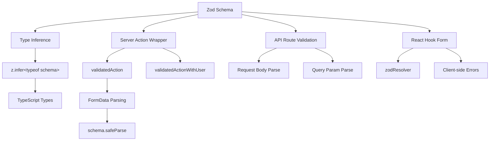

# 表单验证模式

## 概述

Ever Works 模板使用 **Zod** 作为跨客户端和服务器边界进行数据验证的单一事实来源。验证模式在 `lib/validations/` 中组织，并由以下人员使用：

- **服务器操作** 通过 `validatedAction()` 和 `validatedActionWithUser()` 包装器
- **API 路由处理程序** 用于请求正文/查询参数验证
- **React Hook Form** 集成用于客户端表单验证
- **通过 `z.infer<>` 进行类型推断**，以实现端到端类型安全

## 建筑



## 源文件

|文件|目的|
|------|---------|
|`template/lib/validations/auth.ts`|密码验证架构|
|`template/lib/validations/company.ts`|公司 CRUD 架构|
|`template/lib/validations/client-item.ts`|客户端项目提交/更新架构|
|`template/lib/validations/client-dashboard.ts`|仪表板查询架构|
|`template/lib/validations/sponsor-ad.ts`|赞助商广告生命周期架构|
|`template/lib/validations/item.ts`|位置数据架构|
|`template/lib/validations/user-location.ts`|用户位置设置架构|
|`template/lib/auth/middleware.ts`|`validatedAction` / `validatedActionWithUser` 实用程序|

## 验证架构模式

### 模式 1：使用链式规则进行密码验证

```typescript
import { z } from "zod";

export const passwordSchema = z
    .string()
    .min(8, "Password must be at least 8 characters")
    .regex(/[A-Z]/, "Password must contain at least one uppercase letter")
    .regex(/[a-z]/, "Password must contain at least one lowercase letter")
    .regex(/[0-9]/, "Password must contain at least one number")
    .regex(/[^A-Za-z0-9]/, "Password must contain at least one special character");
```

该架构通过链式细化强制执行强密码要求。每个 `.regex()` 都提供 UI 可以内联显示的特定错误消息。

### 模式 2：创建/更新模式对

公司验证演示了创建/更新模式：

```typescript
export const createCompanySchema = z.object({
    name: z.string().min(1, "Company name is required").max(255),
    website: z.string().url("Invalid URL format").optional().or(z.literal("")),
    domain: z.string().max(255).optional()
        .transform((val) => val?.toLowerCase().trim() || undefined),
    slug: z.string().max(255).optional()
        .transform((val) => val?.toLowerCase().trim() || undefined)
        .refine(
            (val) => !val || /^[a-z0-9-]+$/.test(val),
            { message: "Slug must contain only lowercase letters, numbers, and hyphens" }
        ),
    status: z.enum(companyStatus).default("active"),
});

export const updateCompanySchema = z.object({
    id: z.string().uuid(),
    name: z.string().min(1).max(255).optional(),  // Optional for updates
    // ... other fields also optional
    status: z.enum(companyStatus).optional(),
});
```

主要区别：
- **创建模式**具有默认的必填字段
- **更新架构**需要 `id` 并使所有其他字段可选
- 两者共享 `.transform()` 标准化逻辑（例如，小写字母）

### 模式 3：基于枚举的状态字段

```typescript
export const companyStatus = ["active", "inactive"] as const;
export const itemStatus = ['pending', 'approved', 'rejected'] as const;
export const sponsorAdStatuses = [
    "pending_payment", "pending", "rejected",
    "active", "expired", "cancelled",
] as const;

// Usage in schemas
status: z.enum(companyStatus).default("active"),
status: z.enum(sponsorAdStatuses).optional(),
```

将`as const` 数组与`z.enum()` 一起使用可提供运行时验证和编译时类型安全。

### 模式 4：带有转换的查询参数模式

```typescript
export const clientItemsListQuerySchema = z.object({
    page: z.string().optional()
        .transform(val => (val ? parseInt(val, 10) : 1))
        .refine(val => !Number.isNaN(val), { message: 'Page must be a valid number' })
        .refine(val => val >= 1, { message: 'Page must be at least 1' }),
    limit: z.string().optional()
        .transform(val => (val ? parseInt(val, 10) : 10))
        .refine(val => val >= 1 && val <= 100, { message: 'Limit must be between 1 and 100' }),
    status: z.enum(clientStatusFilter).optional().default('all'),
    search: z.string().max(100, 'Search query is too long').optional(),
    sortBy: z.enum(['name', 'updated_at', 'status', 'submitted_at']).optional().default('updated_at'),
    sortOrder: z.enum(['asc', 'desc']).optional().default('desc'),
    deleted: z.string().optional().transform(val => val === 'true'),
});
```

查询参数以字符串形式到达。该模式使用 `.transform()` 将它们转换为正确的类型（数字、布尔值），同时应用验证和默认值。

### 模式 5：具有跨域验证的嵌套对象模式

```typescript
export const updateLocationSchema = z
    .object({
        defaultLatitude: z.number().min(-90).max(90).nullable().optional(),
        defaultLongitude: z.number().min(-180).max(180).nullable().optional(),
        defaultCity: z.string().max(200).nullable().optional(),
        defaultCountry: z.string().max(100).nullable().optional(),
        locationPrivacy: locationPrivacySchema.optional(),
    })
    .refine(
        (data) => {
            const hasLat = data.defaultLatitude != null;
            const hasLng = data.defaultLongitude != null;
            return hasLat === hasLng;  // Both or neither
        },
        { message: 'Both latitude and longitude must be provided together' }
    );
```

对象级别的`.refine()` 验证跨字段依赖关系——纬度和经度必须同时存在或都不存在。

### 模式 6：灵活输入的联合类型

```typescript
category: z.union([
    z.string().min(1, 'Category is required'),
    z.array(z.string().min(1)).min(1, 'At least one category is required'),
]).optional().nullable(),
```

类别字段接受单个字符串和字符串数组，以适应不同的表单输入类型。

## 服务器端验证

### 验证动作包装器

```typescript
export function validatedAction<S extends z.ZodType<any, any>, T>(
    schema: S,
    action: ValidatedActionFunction<S, T>
) {
    return async (prevState: ActionState, formData: FormData): Promise<T> => {
        const result = schema.safeParse(Object.fromEntries(formData));
        if (!result.success) {
            return { error: result.error.issues[0].message } as T;
        }
        return action(result.data, formData);
    };
}
```

这个高阶函数：
1. 将 `FormData` 转换为普通对象
2. 使用 `safeParse()` 针对 Zod 架构进行验证
3. 如果无效则返回第一个验证错误
4. 如果有效，则使用已解析的键入数据调用操作函数

### validatedActionWithUser 包装器

```typescript
export function validatedActionWithUser<S extends z.ZodType<any, any>, T>(
    schema: S,
    action: ValidatedActionWithUserFunction<S, T>
) {
    return async (prevState: ActionState, formData: FormData): Promise<T> => {
        const session = await auth();
        if (!session?.user) {
            throw new Error("User is not authenticated");
        }
        const result = schema.safeParse(Object.fromEntries(formData));
        if (!result.success) {
            return { error: result.error.issues[0].message } as T;
        }
        return action(result.data, formData, session.user);
    };
}
```

这会在验证之前添加身份验证检查，将经过身份验证的 `user` 对象传递给操作函数。

## 类型推断

每个模式都会导出推断的 TypeScript 类型：

```typescript
export type CreateCompanyInput = z.infer<typeof createCompanySchema>;
export type UpdateCompanyInput = z.infer<typeof updateCompanySchema>;
export type ClientUpdateItemInput = z.infer<typeof clientUpdateItemSchema>;
export type ClientCreateItemInput = z.infer<typeof clientCreateItemSchema>;
```

这些类型在整个服务层和 API 路由中使用，确保经过验证的数据形状符合业务逻辑的预期。

## 最佳实践

1. **单一模式，多个消费者** -- 在`lib/validations/`中定义一次，到处使用
2. **边界处转换** -- 使用`.transform()`将字符串转换为正确的类型
3. **自定义错误消息** - 每个验证规则都包含一条用户友好的消息
4. **共享子模式**——跨表单重用 `locationSchema` 和 `passwordSchema` 等模式
5. **从模式推断类型** - 永远不要手动定义重复模式定义的类型
6. **跨字段验证** -- 在对象级别使用 `.refine()` 进行多字段规则
7. **合理的默认值** -- 使用 `.default()` 作为具有标准值的可选字段
