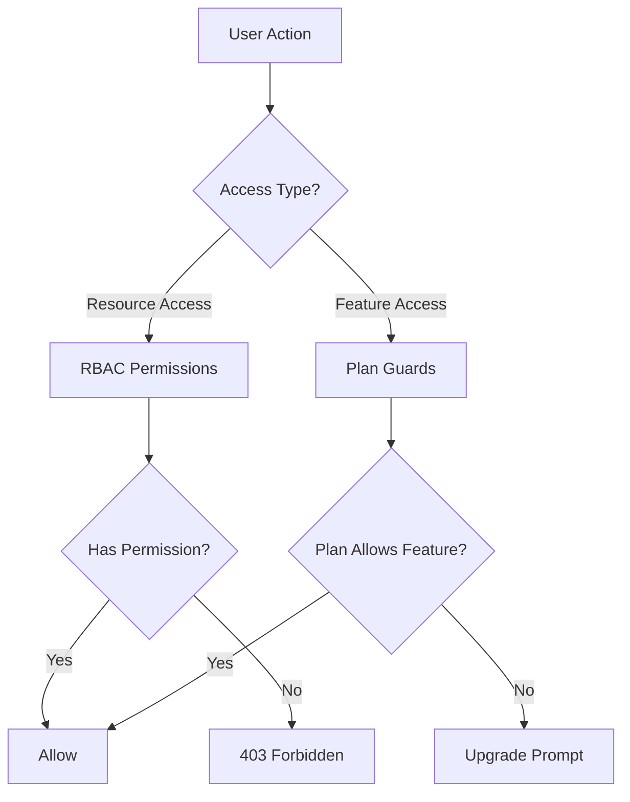
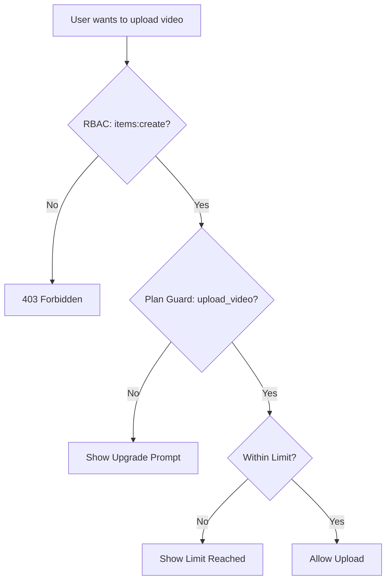

# 警卫和权限系统

Ever Works 模板实现了双层访问控制系统：**RBAC 权限**用于基于角色的资源访问，**计划防护**用于基于订阅的功能门控。这些系统共同控制用户可以执行的操作以及可以访问的功能。

## 系统架构



## RBAC权限系统

### 权限定义

所有权限均使用`resource:action` 格式在`lib/permissions/definitions.ts` 中定义：

```typescript
const PERMISSIONS = {
  items: {
    read: 'items:read',
    create: 'items:create',
    update: 'items:update',
    delete: 'items:delete',
    review: 'items:review',
    approve: 'items:approve',
    reject: 'items:reject',
  },
  categories: { read, create, update, delete },
  tags: { read, create, update, delete },
  roles: { read, create, update, delete },
  users: { read, create, update, delete, assignRoles },
  analytics: { read, export },
  system: { settings },
} as const;
```

### 权限类型

`Permission` 类型派生自 `PERMISSIONS` const 对象，确保类型安全：

```typescript
type Permission = 'items:read' | 'items:create' | ... | 'system:settings';
```

### 默认角色

预先配置了两个默认角色：

|角色|身份证号|权限|
|---|---|---|
|超级管理员|`super-admin`|所有系统权限|
|内容经理|`content-manager`|项目 + 类别 + 标签（完整 CRUD + 评论）|

### 权限组

权限在 `lib/permissions/groups.ts` 中组织成 UI 友好的组：

|集团|图标|包含的资源|
|---|---|---|
|内容管理|`FileText`|项目、类别、标签|
|用户管理|`Users`|用户、角色|
|系统与分析|`Settings`|分析、系统|

### 实用功能

`lib/permissions/utils.ts` 模块为权限 UI 提供状态管理实用程序：

```typescript
// Create a permission state map for checkboxes
const state = createPermissionState(currentPermissions);
// { 'items:read': true, 'items:create': true, ... }

// Get selected permissions from state
const selected = getSelectedPermissions(state);

// Calculate changes between old and new permissions
const changes = calculatePermissionChanges(original, updated);
// { added: ['items:delete'], removed: ['tags:create'] }

// Compare two permission sets
const equal = arePermissionsEqual(perms1, perms2);

// Filter permissions by search term
const filtered = filterPermissions(allPerms, 'items');
```

## 计划守卫系统

计划警卫根据用户的订阅计划控制对功能的访问。该系统在`lib/guards/plan-features.guard.ts` 中定义。

### 计划层次结构

```typescript
const PLAN_LEVELS: Record<string, number> = {
  free: 1,
  standard: 2,
  premium: 3,
};
```

### 特征定义

所有门控功能均在 `FEATURES` 中枚举：

|类别|特点|
|---|---|
|提交|`submit_product`、`extended_description`、`unlimited_description`、`upload_images`、`upload_video`|
|徽章|`verified_badge`、`sponsored_badge`|
|评论|`priority_review`、`instant_review`|
|能见度|`search_visibility`、`category_placement`、`sponsored_position`、`homepage_featured`、`newsletter_mention`|
|分析|`view_statistics`、`advanced_analytics`|
|支持|`email_support`、`priority_email_support`、`phone_support`|
|社交|`social_sharing`、`learn_more_button`|
|其他|`free_modifications`、`unlimited_submissions`|

### 功能访问矩阵

每个功能都映射到一个访问规则：

|接入类型|语法|示例|
|---|---|---|
|所有计划|`'all'`|`submit_product`、`upload_images`|
|单一计划|`PaymentPlan.PREMIUM`|`upload_video`、`instant_review`|
|最低计划|`{ minPlan: PaymentPlan.STANDARD }`|`verified_badge`、`priority_review`|
|具体计划|`[PaymentPlan.STANDARD, PaymentPlan.PREMIUM]`|（自定义功能）|

### 计划限制

数字限制因计划而异：

|限制|免费|标准型|高级版|
|---|---|---|---|
|`max_images`| 1 | 5 |无限|
|`max_description_words`| 200 | 500 |无限|
|`max_submissions`| 1 | 10 |无限|
|`review_days`| 7 | 3 | 1 |
|`free_modification_days`| 0 | 30 | 365 |

### 服务器端防护的使用

```typescript
import { canAccessFeature, createPlanGuard, FEATURES } from '@/lib/guards';

// Simple check
const allowed = canAccessFeature(FEATURES.UPLOAD_VIDEO, userPlan);

// Guard factory for multiple checks
const guard = createPlanGuard(userPlan);
guard.canAccess(FEATURES.VERIFIED_BADGE);       // boolean
guard.requireFeature(FEATURES.UPLOAD_VIDEO);     // throws PlanGuardError
guard.getLimit('max_images');                    // number | null
guard.isWithinLimit('max_submissions', count);   // boolean
guard.getAccessibleFeatures();                   // Feature[]
```

### 计划卫士错误

当 `requireFeature` 失败时，它会抛出一个类型错误：

```typescript
class PlanGuardError extends Error {
  feature: Feature;      // e.g., 'upload_video'
  userPlan: string;      // e.g., 'free'
  requiredPlan: PaymentPlan; // e.g., 'premium'
}
```

### 客户端防护钩

`hooks/use-plan-guard.ts` 中的 `usePlanGuard` 钩子包装了 React 组件的防护系统：

```typescript
import { usePlanGuard, FEATURES } from '@/hooks/use-plan-guard';

function VideoUploadButton() {
  const { canAccess, requireUpgrade, isLoading } = usePlanGuard();

  if (isLoading) return <Spinner />;

  const upgradePlan = requireUpgrade(FEATURES.UPLOAD_VIDEO);
  if (upgradePlan) {
    return <UpgradePrompt plan={upgradePlan} />;
  }

  return <Button>Upload Video</Button>;
}
```

### 专用挂钩

#### `useFeatureAccess`

检查对单个功能的访问：

```typescript
const { hasAccess, requiredPlan, isLoading } = useFeatureAccess(FEATURES.VERIFIED_BADGE);
```

#### `useFeatureLimit`

检查剩余计数的数字限制：

```typescript
const { limit, isUnlimited, remaining, isWithinLimit } = useFeatureLimit('max_images', currentCount);

if (!isUnlimited && remaining <= 0) {
  return <LimitReached />;
}
```

## 组成守卫

警卫自然地组成了复杂的访问控制场景：

```typescript
// Server: Combine RBAC + plan check
function canCreateItem(userPermissions: UserPermissions, userPlan: string): boolean {
  const hasRBACAccess = hasPermission(userPermissions, 'items:create');
  const hasPlanAccess = canAccessFeature(FEATURES.SUBMIT_PRODUCT, userPlan);
  return hasRBACAccess && hasPlanAccess;
}

// Client: Combine hooks
function CreateItemButton() {
  const { canAccess } = usePlanGuard();
  const { permissions } = useRolePermissions();

  const canCreate =
    hasPermission(permissions, 'items:create') &&
    canAccess(FEATURES.SUBMIT_PRODUCT);

  if (!canCreate) return null;
  return <Button>Create Item</Button>;
}
```

## 警卫流程图



## 添加新守卫

### 添加新权限

1. 添加到`lib/permissions/definitions.ts`中的`PERMISSIONS`：

```typescript
billing: {
  read: 'billing:read',
  manage: 'billing:manage',
},
```

2. 添加到`lib/permissions/groups.ts`中的权限组
3. 分配给适当的默认角色

### 添加新计划功能

1. 将特征常量添加到`lib/guards/plan-features.guard.ts`中的`FEATURES`
2. 在`FEATURE_ACCESS`中定义访问规则
3. 可以选择将数字限制添加到`PLAN_LIMITS`

## 最佳实践

1. **优先选择用于功能门控的计划防护**和用于资源访问控制的 RBAC - 不要混合使用它们。
2. **始终检查服务器**，即使客户端隐藏 UI 元素 - 客户端检查仅适用于 UX。
3. **使用 `createPlanGuard`** 在同一请求中进行多次检查，以避免重复的计划查找。
4. **在钩子中处理加载状态**——计划数据可以从订阅服务异步加载。
5. **保持功能名称的描述性** - 使用 `upload_video` 而不是 `feature_3` 以便日志和错误消息中清晰可见。
