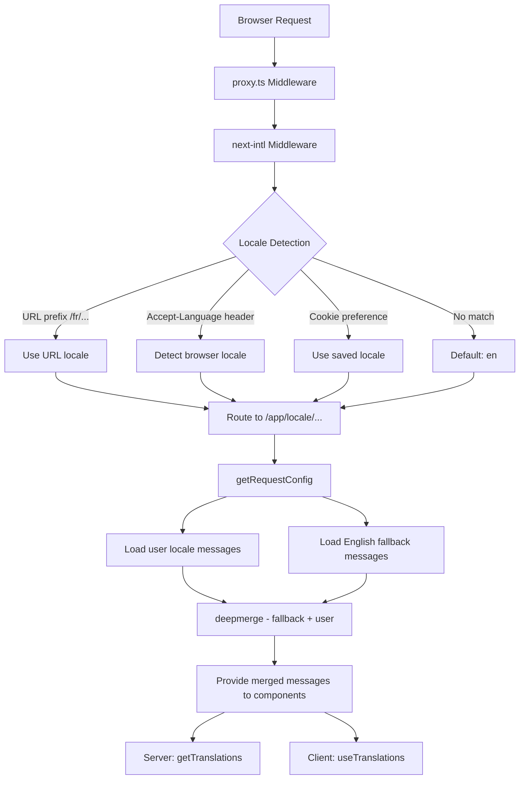

# 国际化实施

## 概述

Ever Works 模板使用 **next-intl** 实现国际化，支持 20 多种语言环境、RTL（从右到左）文本方向、深度合并消息回退和语言环境感知导航。该系统围绕三层构建：路由配置、带回退的消息加载以及区域设置感知导航帮助程序。

## 建筑



## 源文件

|文件|目的|
|------|---------|
|`template/i18n/routing.ts`|区域设置路由配置|
|`template/i18n/request.ts`|请求范围的消息加载|
|`template/i18n/navigation.ts`|区域设置感知导航导出|
|`template/lib/constants.ts`|语言环境和 RTL 定义|
|`template/messages/*.json`|翻译消息文件|
|`template/proxy.ts`|具有区域设置前缀解析的中间件|

## 支持的区域设置

```typescript
// lib/constants.ts
export const DEFAULT_LOCALE = 'en';
export const LOCALES = [
    'en', 'fr', 'es', 'de', 'zh', 'ar', 'he',
    'ru', 'uk', 'pt', 'it', 'ja', 'ko', 'nl',
    'pl', 'tr', 'vi', 'th', 'hi', 'id', 'bg'
] as const;

export type Locale = (typeof LOCALES)[number];

/** Locales that use right-to-left text direction */
export const RTL_LOCALES: readonly Locale[] = ['ar', 'he'] as const;
```

该模板支持 20 种语言环境，包括两种 RTL 语言环境（阿拉伯语和希伯来语）。

## 路由配置

```typescript
// i18n/routing.ts
import { defineRouting } from "next-intl/routing";
import { DEFAULT_LOCALE, LOCALES } from "@/lib/constants";

export const routing = defineRouting({
    locales: LOCALES,
    defaultLocale: DEFAULT_LOCALE,
    localeDetection: true,
    localePrefix: "as-needed",
});
```

|设置|价值|效果|
|---------|-------|--------|
|`locales`|20 个区域设置代码|支持的语言集|
|`defaultLocale`|`'en'`|当没有区域设置匹配时回退|
|`localeDetection`|`true`|从 `Accept-Language` 标头自动检测|
|`localePrefix`|`"as-needed"`|默认语言环境没有前缀；其他人做|

与`localePrefix: "as-needed"`：
- 英语（默认）：`https://example.com/about`
- 法语：`https://example.com/fr/about`
- 阿拉伯语：`https://example.com/ar/about`

## 带有后备的消息加载

```typescript
// i18n/request.ts
import deepmerge from "deepmerge";
import { getRequestConfig } from "next-intl/server";

export default getRequestConfig(async ({ requestLocale }) => {
    let locale = await requestLocale;

    if (!locale || !routing.locales.includes(locale as any)) {
        locale = routing.defaultLocale;
    }

    const userMessages = (await import(`../messages/${locale}.json`)).default;
    const defaultMessages = (await import(`../messages/en.json`)).default;
    const messages = deepmerge(defaultMessages, userMessages) as any;

    return { locale, messages };
});
```

深度合并策略确保：
1. 英文消息作为完整的后备集
2. 如果存在翻译，则特定于区域设置的消息会覆盖英语
3. 缺失的翻译优雅地回退到英语而不是显示按键

### 消息文件结构

```
messages/
  en.json        # Complete English messages (base)
  fr.json        # French translations
  es.json        # Spanish translations
  de.json        # German translations
  ar.json        # Arabic translations
  he.json        # Hebrew translations
  zh.json        # Chinese translations
  ...            # 13+ more locales
```

### 日期/数字格式

```typescript
// i18n/request.ts
export const formats = {
    dateTime: {
        short: {
            day: "numeric",
            month: "short",
            year: "numeric",
        },
    },
    number: {
        precise: {
            maximumFractionDigits: 5,
        },
    },
    list: {
        enumeration: {
            style: "long",
            type: "conjunction",
        },
    },
} satisfies Formats;
```

## 导航助手

```typescript
// i18n/navigation.ts
import { createNavigation } from "next-intl/navigation";
import { routing } from "./routing";

export const { Link, redirect, usePathname, useRouter, getPathname } =
    createNavigation(routing);
```

这些导出将标准 Next.js 导航实用程序替换为区域设置感知版本：

|出口|标准 Next.js|区域设置感知行为|
|--------|-----------------|----------------------|
|`Link`|`next/link`|将区域设置前缀添加到`href`|
|`redirect`|`next/navigation`|在重定向中保留当前区域设置|
|`usePathname`|`next/navigation`|返回不带区域设置前缀的路径|
|`useRouter`|`next/navigation`|`push()` / `replace()` 添加语言环境前缀|
|`getPathname`| -- |带有区域设置的服务器端路径|

### 在服务器组件中的使用

```typescript
import { getTranslations } from 'next-intl/server';

export default async function Page({ params }: { params: Promise<{ locale: string }> }) {
    const { locale } = await params;
    const t = await getTranslations({ locale, namespace: 'common' });

    return <h1>{t('WELCOME')}</h1>;
}
```

### 在客户端组件中的使用

```typescript
'use client';
import { useTranslations } from 'next-intl';
import { Link } from '@/i18n/navigation';

export function NavLink() {
    const t = useTranslations('navigation');
    return <Link href="/about">{t('ABOUT')}</Link>;
}
```

## 中间件区域设置解析

`proxy.ts` 中的中间件解析用于身份验证保护决策的区域设置信息：

```typescript
function resolveLocalePrefix(pathname: string): {
    prefix: string;           // "/fr" or ""
    hasLocale: boolean;
    locale?: string;
    pathWithoutLocale: string; // "/admin/items"
} {
    const segments = pathname.split('/').filter(Boolean);
    const maybeLocale = segments[0];
    const hasLocale = routing.locales.includes(maybeLocale as any);
    const pathWithoutLocale = hasLocale
        ? `/${segments.slice(1).join('/')}`
        : pathname;
    return {
        prefix: hasLocale ? `/${maybeLocale}` : '',
        hasLocale,
        locale: hasLocale ? maybeLocale : undefined,
        pathWithoutLocale
    };
}
```

这用于在身份验证防护中构造区域设置感知的重定向 URL：

```typescript
url.pathname = `${localePrefix}/auth/signin`;
```

## RTL 支持

RTL 语言环境在 `lib/constants.ts` 中定义：

```typescript
export const RTL_LOCALES: readonly Locale[] = ['ar', 'he'] as const;
```

根布局组件应根据当前区域设置应用 `dir` 属性：

```typescript
// app/[locale]/layout.tsx
const isRTL = RTL_LOCALES.includes(locale as Locale);

return (
    <html lang={locale} dir={isRTL ? 'rtl' : 'ltr'}>
        {/* ... */}
    </html>
);
```

## SEO：Hreflang 替代品

`lib/seo/hreflang.ts` 实用程序为 SEO 生成备用语言链接：

```typescript
import { generateHreflangAlternates } from '@/lib/seo/hreflang';

export async function generateMetadata(): Promise<Metadata> {
    return {
        alternates: {
            languages: generateHreflangAlternates('/about')
        }
    };
}
```

这会为所有受支持的语言环境生成`<link rel="alternate" hreflang="fr" href="...">` 标记，以及指向英语版本的`x-default` 条目。

## Next.js 插件集成

```typescript
// next.config.ts
import createNextIntlPlugin from "next-intl/plugin";

const withNextIntl = createNextIntlPlugin('./i18n/request.ts');
const configWithIntl = withNextIntl(nextConfig);
```

`next-intl` 插件应用于 Next.js 配置，并具有请求配置文件的显式路径。

## 最佳实践

1. **始终在服务器组件中使用 `getTranslations`** -- 加载翻译而无需客户端捆绑成本
2. **从 `@/i18n/navigation` 导入导航** -- 确保区域设置感知链接
3. **保持英语完整**——它作为所有其他语言环境的后备
4. **使用命名空间翻译** -- 按功能组织（`common`、`footer`、`pages` 等）
5. **使用`RTL_LOCALES`检查RTL** -- 在布局级别应用`dir="rtl"`
6. **生成 hreflang 标签** -- 在元数据函数中使用 `generateHreflangAlternates()`
