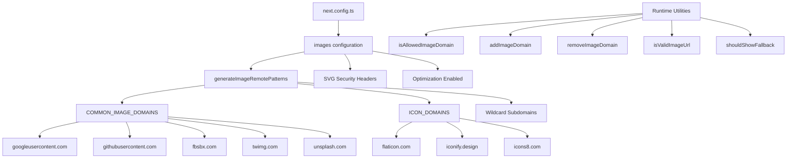

# 图像优化

## 概述

Ever Works 模板使用动态远程模式、SVG 支持和域管理实用程序层来配置 Next.js Image Optimization。该系统处理来自 OAuth 提供商（Google、GitHub、Facebook、Twitter）、库存照片服务 (Unsplash) 和图标库的图像，同时强制 SVG 内容的安全标头。

## 建筑



## 源文件

|文件|目的|
|------|---------|
|`template/next.config.ts`|Next.js 镜像配置|
|`template/lib/utils/image-domains.ts`|域管理实用程序|

## 配置

### Next.js 图像设置

```typescript
// next.config.ts
images: {
    remotePatterns: generateImageRemotePatterns(),
    dangerouslyAllowSVG: true,
    contentDispositionType: 'attachment',
    contentSecurityPolicy: "default-src 'self'; script-src 'none'; sandbox;",
    unoptimized: false,
},
```

|设置|价值|目的|
|---------|-------|---------|
|`remotePatterns`|动态通过`generateImageRemotePatterns()`|将外部图像域列入白名单|
|`dangerouslyAllowSVG`|`true`|允许 SVG 图像通过优化器|
|`contentDispositionType`|`'attachment'`|强制下载而不是内联渲染以进行原始访问|
|`contentSecurityPolicy`|严格的沙箱|防止基于 SVG 的 XSS 攻击|
|`unoptimized`|`false`|保持图像优化启用|

### SVG安全

SVG 文件可以包含嵌入的 JavaScript。该模板通过以下方式缓解了这种情况：
- **内容安全策略**：`script-src 'none'; sandbox;` 阻止 SVG 中的脚本执行
- **内容处置**：`attachment` 确保直接访问时下载 SVG，而不是执行

## 远程模式生成

`generateImageRemotePatterns()` 函数动态构建白名单：

```typescript
export function generateImageRemotePatterns() {
    const patterns = [
        {
            protocol: 'https' as const,
            hostname: 'lh3.googleusercontent.com',
            pathname: '/a/**'
        },
        {
            protocol: 'https' as const,
            hostname: 'avatars.githubusercontent.com',
            pathname: '/u/**'
        },
        {
            protocol: 'https' as const,
            hostname: 'platform-lookaside.fbsbx.com',
            pathname: '/platform/**'
        },
        // ... more specific patterns
    ];

    // Add wildcard subdomain patterns
    [...COMMON_IMAGE_DOMAINS, ...ICON_DOMAINS].forEach((domain) => {
        patterns.push({
            protocol: 'https' as const,
            hostname: `*.${domain}`,
            pathname: '/**'
        });
    });

    return patterns;
}
```

### 允许的域

**通用图像域**（OAuth 头像、库存照片）：

|域名|来源|
|--------|--------|
|`lh3.googleusercontent.com`|谷歌 OAuth 头像|
|`avatars.githubusercontent.com`|GitHub OAuth 头像|
|`platform-lookaside.fbsbx.com`|Facebook OAuth 头像|
|`pbs.twimg.com`|Twitter/X 头像|
|`images.unsplash.com`|Unsplash 库存照片|

**图标域**（项目图标）：

|域名|来源|
|--------|--------|
|`flaticon.com`|平面图标|
|`iconify.design`|图标化图标|
|`icons8.com`|图标8个图标|
|`feathericons.com`|羽毛图标|
|`heroicons.com`|英雄图标|
|`tabler-icons.io`|表图标|

## 运行时域管理

### 检查允许的域

```typescript
import { isAllowedImageDomain } from '@/lib/utils/image-domains';

// Returns true for whitelisted domains
isAllowedImageDomain('https://lh3.googleusercontent.com/a/photo.jpg'); // true
isAllowedImageDomain('https://cdn.flaticon.com/icons/svg/123.svg');    // true
isAllowedImageDomain('https://evil-site.com/image.jpg');               // false

// Relative URLs are always allowed
isAllowedImageDomain('/images/logo.png'); // true
```

### 动态域添加

```typescript
import { addImageDomain, removeImageDomain } from '@/lib/utils/image-domains';

// Add a new domain at runtime
addImageDomain('cdn.example.com');

// Add as an icon domain
addImageDomain('my-icons.com', true);

// Remove a domain
removeImageDomain('old-cdn.com');
```

注意：运行时添加会影响实用程序函数，但不会修改 Next.js `next.config.ts` 远程模式（这些需要重建）。

### 网址验证

```typescript
import { isValidImageUrl, isProblematicUrl, shouldShowFallback } from '@/lib/utils/image-domains';

// Check URL format validity
isValidImageUrl('https://example.com/photo.jpg'); // true
isValidImageUrl('/images/local.png');              // true (relative)
isValidImageUrl('not-a-url');                      // false

// Check for problematic URLs (non-image pages, redirect URLs)
isProblematicUrl('https://flaticon.com/icone-gratuite/search'); // true (not a direct image)
isProblematicUrl('https://cdn.flaticon.com/icon.svg');          // false (has image extension)

// Determine if fallback icon should be shown
shouldShowFallback('');                                          // true (empty)
shouldShowFallback('https://flaticon.com/icone-gratuite/123');   // true (problematic)
shouldShowFallback('https://cdn.flaticon.com/icon.svg');         // false
```

## 安全标头

`next.config.ts` 将安全标头应用于所有路由：

```typescript
async headers() {
    return [{
        source: "/(.*)",
        headers: [
            { key: "X-Content-Type-Options", value: "nosniff" },
            { key: "X-Frame-Options", value: "DENY" },
            { key: "Referrer-Policy", value: "strict-origin-when-cross-origin" },
            { key: "X-DNS-Prefetch-Control", value: "on" },
            { key: "Strict-Transport-Security", value: "max-age=63072000; includeSubDomains; preload" },
            {
                key: "Content-Security-Policy",
                value: "default-src 'self'; script-src 'self' 'unsafe-inline' https://assets.lemonsqueezy.com; style-src 'self' 'unsafe-inline'; img-src 'self' data: https:; font-src 'self'; connect-src 'self' https:; frame-ancestors 'none';"
            },
        ],
    }];
},
```

`img-src 'self' data: https:` 指令允许来自同一来源、数据 URI 和任何 HTTPS 源的图像。这是故意允许 `img-src` 的，因为 Next.js Image 组件在应用程序级别处理域验证。

## 最佳实践

1. **对所有外部图像使用`next/image`**——它处理优化、延迟加载和格式转换
2. **将新域添加到 `image-domains.ts`** -- 不在 `next.config.ts` 中内联
3. **渲染前检查`shouldShowFallback()`** -- 显示无效/缺失 URL 的默认图标
4. **保留 SVG 安全标头** -- 切勿删除 `contentSecurityPolicy` 或 `contentDispositionType` 设置
5. **优先选择路径名限制**——尽可能使用特定的 `pathname` 模式（例如，`/a/**`）而不是广泛的通配符
