# 库实用程序概述

`template/lib/` 目录是 Ever Works 模板的核心实用程序和业务逻辑层。它包含用于分析、API 通信、身份验证、后台作业、缓存、配置、数据库访问、支付、编辑器工具、防护等的共享模块。所有非组件、非路由逻辑都遵循保持组件呈现性并将繁重逻辑委托给`lib/` 的原则。

## 模块图

```mermaid
graph TD
    subgraph Core Infrastructure
        A[config/] --> B[config.ts / config-manager.ts]
        C[db/] --> D[drizzle.ts / queries/ / migrate.ts]
        E[cache-config.ts] --> F[cache-invalidation.ts]
    end

    subgraph Auth & Security
        G[auth/] --> H[NextAuth / Supabase / Guards / Caching]
        I[guards/] --> J[Plan Feature Access Control]
        K[permissions/] --> L[Role-Based Permissions]
    end

    subgraph API Layer
        M[api/] --> N[ApiClient / ServerClient / Error Handling]
    end

    subgraph Analytics & Tracking
        O[analytics/] --> P[PostHog + Sentry Singleton]
    end

    subgraph Background Processing
        Q[background-jobs/] --> R[Trigger.dev / Local / NoOp]
    end

    subgraph Content & Editor
        S[content.ts] --> T[Git CMS Content Loader]
        U[editor/] --> V[TipTap Rich Text Editor]
        W[lib.ts] --> X[Content Path / File Utilities]
    end

    subgraph Business Logic
        Y[services/] --> Z[20+ Domain Services]
        AA[repositories/] --> AB[Data Access Layer]
        AC[payment/] --> AD[Stripe / LemonSqueezy / Polar]
    end

    subgraph Shared Utilities
        AE[constants.ts + constants/]
        AF[utils.ts + utils/]
        AG[types.ts + types/]
        AH[validations/]
        AI[helpers.ts]
    end
```



## 目录结构

|目录/文件|描述|
|-----------------|-------------|
|`lib/analytics/`|PostHog + Sentry 分析单例（[文档](./analytics-module)）|
|`lib/api/`|浏览器和服务器的 HTTP 客户端（[文档](./api-client-module)）|
|`lib/auth/`|使用 NextAuth.js + Supabase 进行身份验证（[文档](./auth-utilities-module)）|
|`lib/background-jobs/`|使用 Trigger.dev / local / no-op 进行作业调度（[文档](./background-jobs-module)）|
|`lib/cache-config.ts`|缓存 TTL 和标记定义 ([docs](./cache-invalidation-module))|
|`lib/cache-invalidation.ts`|缓存失效函数（[文档](./cache-invalidation-module)）|
|`lib/config/`|使用 Zod 模式的集中配置服务|
|`lib/config.ts`|站点配置 (`siteConfig`)|
|`lib/config-manager.ts`|运行时配置管理器|
|`lib/constants.ts`|应用程序常量桶（[文档](./constants-reference-module)）|
|`lib/constants/`|特定领域的常量（支付、分析）|
|`lib/content.ts`|基于Git的CMS内容加载和缓存|
|`lib/db/`|数据库连接、迁移、播种、查询 ([docs](./db-utilities-module))|
|`lib/editor/`|TipTap 富文本编辑器组件和实用程序 ([docs](./editor-utilities-module))|
|`lib/guards/`|基于计划的功能访问控制（[文档](./guards-module)）|
|`lib/helpers.ts`|语言代码到国家/地区代码的映射|
|`lib/lib.ts`|内容路径解析、文件系统实用程序|
|`lib/logger.ts`|结构化日志记录实用程序|
|`lib/mail/`|支持模板发送电子邮件|
|`lib/mappers/`|数据转换映射器|
|`lib/maps/`|地图提供商集成（Google 地图、Mapbox）|
|`lib/middleware/`|Next.js 中间件实用程序|
|`lib/newsletter/`|时事通讯订阅提供商|
|`lib/paginate.ts`|分页辅助函数|
|`lib/payment/`|付款处理（Stripe、LemonSqueezy、Solidgate、Polar）|
|`lib/permissions/`|基于角色的权限定义|
|`lib/query-client.ts`|React 查询客户端配置|
|`lib/react-query-config.ts`|React 查询默认选项|
|`lib/repositories/`|数据访问层（存储库模式）|
|`lib/repository.ts`|Git 存储库操作（克隆、拉取、同步）|
|`lib/seo/`|SEO 元数据和结构化数据生成器|
|`lib/services/`|业务逻辑服务（20+领域服务）|
|`lib/stripe-helpers.ts`|特定于条带的实用程序|
|`lib/swagger/`|Swagger/OpenAPI 注释|
|`lib/theme-color-manager.ts`|动态主题色彩管理|
|`lib/theme-utils.ts`|主题实用函数|
|`lib/themes.tsx`|主题定义|
|`lib/types.ts`|共享类型定义|
|`lib/types/`|特定领域的类型定义|
|`lib/utils.ts`|通用实用函数|
|`lib/utils/`|特定领域的实用程序（15+ 模块）|
|`lib/validations/`|Zod 验证模式|

## 关键独立模块

### `lib/helpers.ts` -- 语言/国家代码映射

```typescript
type LanguageCode = 'en' | 'fr' | 'es' | 'zh' | 'de' | 'ar' | ... ;

const LANGUAGE_COUNTRY_CODES: Record<LanguageCode, string>;
// { en: 'US', fr: 'FR', es: 'ES', zh: 'CN', ... }

const appLocales: string[];
// All supported locale codes

function getCountryCode(languageCode?: LanguageCode): string;
// 'en' -> 'US', 'fr' -> 'FR'
```

### `lib/lib.ts` -- 内容路径和文件系统

用于内容目录管理的仅服务器实用程序：

```typescript
function getContentPath(): string;
// Returns '.content' path (local) or '/tmp/.content' (Vercel runtime)

async function ensureContentAvailable(): Promise<string>;
// Ensures content is available, triggering Git clone if needed

async function fsExists(filepath: string): Promise<boolean>;
async function dirExists(dirpath: string): Promise<boolean>;
```

### `lib/paginate.ts` -- 分页助手

```typescript
function paginate<T>(items: T[], page: number, limit: number): T[];
```

### `lib/logger.ts` -- 结构化日志记录

```typescript
const logger = {
  info(message: string, context?: Record<string, any>): void;
  warn(message: string, context?: Record<string, any>): void;
  error(message: string, context?: Record<string, any>): void;
  debug(message: string, context?: Record<string, any>): void;
};
```

### `lib/color-generator.ts` -- 确定性颜色生成

从字符串生成一致的颜色（用于头像、标签等）。

### `lib/theme-color-manager.ts` -- 动态主题颜色

管理主题切换的 CSS 自定义属性更新。

## 服务层 (`lib/services/`)

services 目录包含按域组织的业务逻辑服务：

|服务|责任|
|---------|---------------|
|`analytics-background-processor.ts`|后台分析处理|
|`analytics-export.service.ts`|分析数据导出|
|`analytics-scheduled-reports.service.ts`|预定的分析报告|
|`category-file.service.ts`|分类文件操作|
|`category-git.service.ts`|类别 Git 操作|
|`collection-git.service.ts`|集合Git操作|
|`company.service.ts`|公司简介管理|
|`currency-detection.service.ts`|用户货币检测|
|`currency.service.ts`|货币换算|
|`email-notification.service.ts`|电子邮件通知|
|`engagement.service.ts`|查看/投票/收藏追踪|
|`file.service.ts`|文件上传/管理|
|`geocoding/`|使用 Google/Mapbox 提供商进行地理编码|
|`item-audit.service.ts`|项目审计追踪|
|`item-git.service.ts`|项目 Git 操作|
|`location/`|位置索引和管理|
|`moderation.service.ts`|内容审核|
|`notification.service.ts`|推送通知|
|`posthog-api.service.ts`|服务器端 PostHog API|
|`role-db.service.ts`|角色管理|
|`settings.service.ts`|应用程序设置|
|`sponsor-ad.service.ts`|赞助商广告管理|
|`stripe-products.service.ts`|Stripe 产品同步|
|`subscription-jobs.ts`|订阅后台作业|
|`subscription.service.ts`|订阅生命周期|
|`survey.service.ts`|调查管理|
|`sync-service.ts`|Git 仓库同步|
|`tag-git.service.ts`|标记 Git 操作|
|`twenty-crm-*.ts`|二十个CRM集成（5个文件）|
|`user-db.service.ts`|用户数据库操作|
|`webhook-subscription.service.ts`|网络钩子管理|

## 实用程序层 (`lib/utils/`)

针对特定问题的实用模块：

|模块|目的|
|--------|---------|
|`api-error.ts`|API错误类别|
|`bot-detection.ts`|机器人用户代理检测|
|`checkout-utils.ts`|付款结帐助手|
|`client-auth.ts`|客户端身份验证实用程序|
|`currency-format.ts`|货币格式|
|`custom-navigation.ts`|自定义路由器导航|
|`database-check.ts`|数据库健康检查|
|`email-validation.ts`|电子邮件格式验证|
|`error-handler.ts`|全局错误处理程序|
|`featured-items.ts`|特色项目选择|
|`footer-utils.ts`|页脚链接实用程序|
|`image-domains.ts`|允许的图像域|
|`pagination-validation.ts`|分页参数验证|
|`payment-provider.ts`|支付提供商检测|
|`plan-expiration.utils.ts`|计划到期计算|
|`rate-limit.ts`|API速率限制|
|`request-body.ts`|请求体解析|
|`server-url.ts`|服务器 URL 解析|
|`settings.ts`|设置辅助函数|
|`slug.ts`|URL slug 生成|
|`url-cleaner.ts`|网址清理|
|`url-filter-sync.ts`|URL过滤器状态同步|

## 设计原则

1. **关注点分离** -- 业务逻辑在 `services/` 中，数据访问在 `repositories/` 和 `db/queries/` 中，演示文稿在 `components/` 中。

2. **脚本安全** - 迁移/种子脚本使用的模块（如 `constants/payment.ts` 和 `db/config.ts`）避免导入 Next.js 特定的代码。

3. **延迟初始化** - 数据库连接、API 客户端和作业管理器使用带有延迟初始化的单例模式，以避免构建期间出现错误。

4. **动态导入** - Node.js 特定模块在后台作业和身份验证中使用动态导入来防止 webpack 捆绑问题。

5. **服务器/客户端边界** -- 仅服务器模块使用 `server-only` 包。客户端安全模块避免服务器导入。 `'use client'` 指令很少使用。
