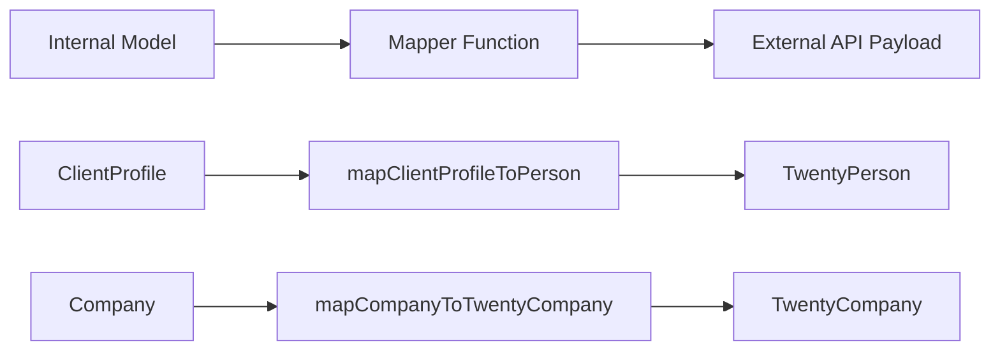

# 映射器模式

该模板使用纯映射器函数在内部模型和外部 API 负载之间转换数据。映射器无副作用、空安全，并且在转换之前验证所需字段。

## 架构概述



## 源文件

|文件|目的|
|------|---------|
|`lib/mappers/twenty-crm.mapper.ts`|将本地实体映射到二十个 CRM API 负载|

## 设计原则

映射器模块遵循严格的函数式编程约定：

1. **纯函数**——没有副作用，没有突变，没有数据库调用
2. **空安全**——所有可选字段都使用显式空/未定义检查
3. **映射前验证** -- 必填字段通过描述性错误进行验证
4. **外部 ID 强制** -- 每个映射实体必须具有有效的 `external_id`

## 外部身份验证

映射到外部系统的每个实体都需要一个有效的标识符：

```typescript
export function ensureExternalId(id: string | undefined | null, entityType: string): string {
  if (!id || id.trim() === '') {
    throw new Error(`${entityType} ID is required for external_id mapping`);
  }
  return id.trim();
}
```

该函数在每个映射器开始时调用，以保证 `external_id` 字段永远不为空。

## 位置提取

实用程序函数从自由文本位置字符串中解析城市名称：

```typescript
export function extractCityFromLocation(location: string | undefined | null): string | null {
  if (!location || location.trim() === '') return null;
  const parts = location.split(',');
  const city = parts[0]?.trim();
  return city || null;
}
```

处理 `"San Francisco"`、`"San Francisco, CA"` 和 `"San Francisco, CA, USA"` 等格式。

## 二十名 CRM 人员的客户资料

将内部 `ClientProfile` 记录映射到二十个 CRM `TwentyPerson` 负载：

```typescript
export function mapClientProfileToPerson(clientProfile: ClientProfile): TwentyPerson {
  const external_id = ensureExternalId(clientProfile.id, 'ClientProfile');

  const person: TwentyPerson = {
    external_id,
    name: clientProfile.name,
    email: clientProfile.email,
  };

  // Optional field mapping (null-safe)
  if (clientProfile.phone)     person.phone = clientProfile.phone;
  if (clientProfile.jobTitle)  person.job_title = clientProfile.jobTitle;
  if (clientProfile.company)   person.company_name = clientProfile.company;
  if (clientProfile.website)   person.website = clientProfile.website;

  const city = extractCityFromLocation(clientProfile.location);
  if (city) person.city = city;

  // Custom fields
  if (clientProfile.accountType) person.account_type = clientProfile.accountType;
  if (clientProfile.plan)        person.plan = clientProfile.plan;
  if (clientProfile.totalSubmissions !== null && clientProfile.totalSubmissions !== undefined) {
    person.total_submissions = clientProfile.totalSubmissions;
  }

  return person;
}
```

### 字段映射表

|客户档案字段|二十人场|必填|注释|
|--------------------|--------------------|----------|-------|
|`id`|`external_id`|是的|验证和修剪|
|`name`|`name`|是的|直接映射|
|`email`|`email`|是的|直接映射|
|`phone`|`phone`|否|仅当存在时|
|`jobTitle`|`job_title`|否|驼峰命名法转蛇形命名法|
|`company`|`company_name`|否|重命名字段|
|`website`|`website`|否|直接映射|
|`location`|`city`|否|通过`extractCityFromLocation`提取|
|`accountType`|`account_type`|否|自定义字段|
|`plan`|`plan`|否|自定义字段|
|`totalSubmissions`|`total_submissions`|否|需要显式空检查|

## 公司到二十家 CRM 公司

将内部 `Company` 实体映射到二十个 CRM `TwentyCompany` 有效负载：

```typescript
export function mapCompanyToTwentyCompany(company: Company): TwentyCompany {
  const external_id = ensureExternalId(company.id, 'Company');

  const twentyCompany: TwentyCompany = {
    external_id,
    name: company.name,
  };

  if (company.domain)  twentyCompany.domain_name = company.domain;
  if (company.website) twentyCompany.website = company.website;
  if (company.status)  twentyCompany.status = company.status;

  return twentyCompany;
}
```

### 字段映射表

|公司领域|二十公司领域|必填|注释|
|--------------|---------------------|----------|-------|
|`id`|`external_id`|是的|验证和修剪|
|`name`|`name`|是的|直接映射|
|`domain`|`domain_name`|否|重命名字段|
|`website`|`website`|否|直接映射|
|`status`|`status`|否|`'active'` 或 `'inactive'`|

## 添加新的映射器

为新集成创建映射器时，请遵循既定的模式：

```typescript
// 1. Always validate external_id first
const external_id = ensureExternalId(entity.id, 'EntityName');

// 2. Build the required fields object
const payload: ExternalType = {
  external_id,
  // ... required fields
};

// 3. Conditionally add optional fields (null-safe)
if (entity.optionalField) {
  payload.optional_field = entity.optionalField;
}

// 4. Return the payload -- never mutate the input
return payload;
```

## 测试注意事项

由于映射器是纯函数，因此它们很容易进行单元测试：

- 测试填充所有可选字段
- 使用`null` 或`undefined` 等所有可选字段进行测试
- 测试缺少必需的 ID 是否会引发描述性错误
- 使用各种字符串格式测试位置提取
- 验证输入对象从未发生变化
