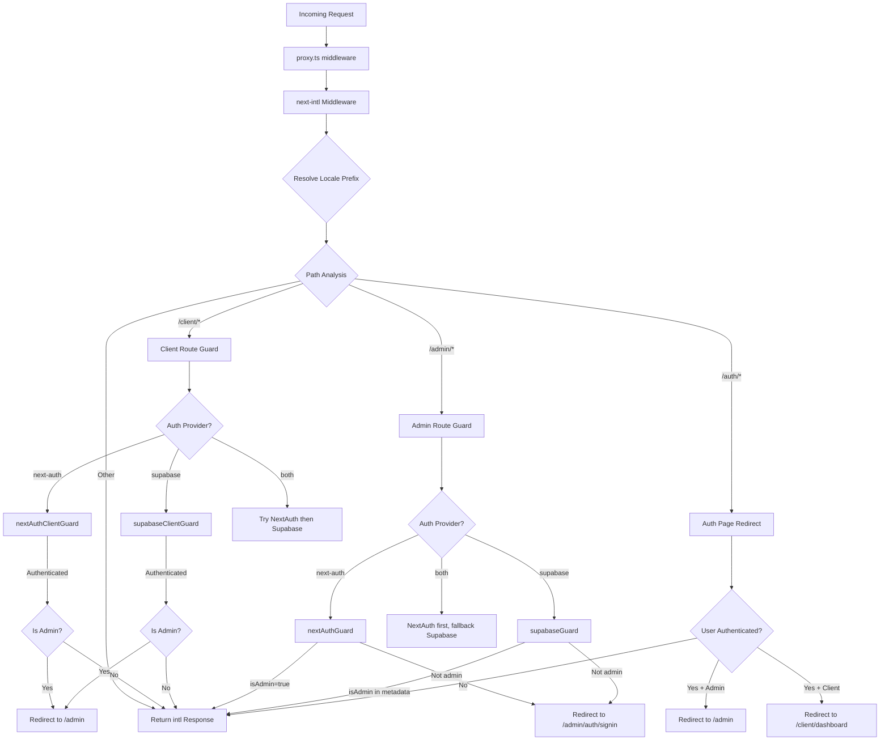

# 中间件链和请求处理

## 概述

Ever Works 模板使用项目根目录`proxy.ts` 中定义的**统一中间件**架构。该中间件为每个传入请求协调三个关键问题：

1. **国际化** -- 区域设置检测、前缀插入和通过 `next-intl` 进行路由
2. **身份验证防护** - 使用 NextAuth、Supabase 或两者来保护 `/admin/*` 和 `/client/*` 路由
3. **基于角色的重定向** - 将经过身份验证的用户从公共身份验证页面发送出去，并将管理员/客户端重定向到各自的仪表板

该设计支持**可插入的身份验证提供程序**模型：中间件从集中式身份验证配置中读取当前的`AuthProviderType`（`'next-auth'`、`'supabase'`或`'both'`）并相应地选择适当的保护功能。

## 架构图



## 源文件

|文件|目的|
|------|---------|
|`template/proxy.ts`|主要中间件入口点|
|`template/lib/auth/config.ts`|身份验证提供商配置 (`getAuthConfig()`)|
|`template/lib/auth/supabase/middleware.ts`|Supabase 会话刷新助手|
|`template/lib/auth/validate-callback-url.ts`|安全回调URL构建|
|`template/i18n/routing.ts`|区域设置路由配置|

## 请求处理订单

### 第一步：国际化

每个请求首先通过`createIntlMiddleware(routing)`创建的`next-intl`中间件：

```typescript
import createIntlMiddleware from 'next-intl/middleware';
import { routing } from './i18n/routing';

const intl = createIntlMiddleware(routing);
```

它通过 `Accept-Language` 标头、cookie 首选项和 URL 前缀处理区域设置检测。路由配置使用 `localePrefix: "as-needed"`，这意味着默认区域设置 (`en`) 不需要 URL 前缀。

### 第 2 步：区域设置解析

`resolveLocalePrefix` 帮助程序从路径名中提取区域设置信息：

```typescript
function resolveLocalePrefix(pathname: string): {
    prefix: string;       // e.g., "/fr" or ""
    hasLocale: boolean;
    locale?: string;
    pathWithoutLocale: string;  // e.g., "/admin/items"
}
```

这很重要，因为所有后续路径匹配（例如，检查 `/admin` 或 `/client`）都必须在**没有**区域设置前缀的路径上运行。

### 步骤 3：基于路由的守卫选择

中间件评估 `pathWithoutLocale` 以确定应用哪个保护链：

|路径模式|应用防护|目的|
|-------------|--------------|---------|
|`/client` 或 `/client/*`|客户端授权守卫|需要身份验证；将管理员重定向至`/admin`|
|`/admin/*`（`/admin/auth/signin`除外）|管理员权限守卫|需要身份验证 + `isAdmin` 标志|
|`/auth/*`|身份验证页面重定向|将经过身份验证的用户重定向，使其不再登录/注册|
|其他一切|没有警卫|通过 i18n 响应传递|

### 第四步：身份验证

#### NextAuth Guard（基于 JWT）

```typescript
const token = await getToken({ req, secret: process.env.AUTH_SECRET });
if (token?.isAdmin === true) {
    return baseRes; // Admin access granted
}
```

NextAuth 防护使用 `next-auth/jwt` 中的 `getToken()` 从 cookie 中读取 JWT 令牌。这与 Edge Runtime 兼容，并且不需要数据库查找。

#### 苏帕基地守卫

```typescript
const supRes = await supabaseUpdate(req);
// Merge cookies...
const { data: { user } } = await supabase.auth.getUser();
const isAdmin = user?.user_metadata?.isAdmin === true
    || user?.user_metadata?.role === 'admin';
```

Supabase 防护首先使用 `updateSession()` 刷新会话，然后检查用户元数据中的管理标志。

### 第 5 步：Cookie 传播

一个关键的实现细节：当警卫产生重定向响应时，来自 `intlResponse` 的所有 cookie 都必须传播：

```typescript
const redirectRes = NextResponse.redirect(url);
baseRes.cookies.getAll().forEach((c) => redirectRes.cookies.set(c));
return redirectRes;
```

这可确保区域设置首选项和身份验证会话 cookie 在重定向后仍然存在。

## 配置

### 身份验证提供商选择

身份验证提供者由`lib/auth/config.ts` 中的`getAuthConfig()` 确定：

```typescript
export type AuthProviderType = 'supabase' | 'next-auth' | 'both';

export function getAuthConfig(): AuthConfig {
    // Priority 1: Global override via configureAuth()
    // Priority 2: Environment-based (detects Supabase env vars)
    // Priority 3: Default ('next-auth')
}
```

### 中间件匹配器

```typescript
export const config = {
    matcher: ['/((?!api|trpc|_next|_vercel|.*\\..*).*)']
};
```

该正则表达式不包括：
- `/api/*` 路由（由 Next.js API 层处理）
- `/trpc/*`路线
- `/_next/*`（Next.js 内部）
- `/_vercel/*`（Vercel 内部结构）
- 任何带有文件扩展名的路径（静态资源）

### 回调 URL 安全

中间件使用`createSafeCallbackUrl()`来防止开放重定向攻击：

```typescript
export function createSafeCallbackUrl(pathname: string, search?: string): string {
    // Limits URL length to 2048 characters
    // Validates relative-only paths
}

export function isValidCallbackUrl(url: string | null): boolean {
    return url?.startsWith('/') && !url.startsWith('//');
}
```

## 双提供商模式（“两者”）

当`provider === 'both'`时，中间件实现了一个后备链：

1. **客户端路由**：首先尝试 NextAuth；如果未经身份验证，请尝试 Supabase
2. **管理路线**：首先尝试 NextAuth；如果它产生重定向（被拒绝），请尝试 Supabase
3. **Auth 页面**：首先检查 NextAuth 令牌，然后检查 Supabase 会话

这允许组织在身份验证提供商之间迁移，而不会中断现有用户。

## 关键实施细节

### 边缘运行时兼容性

该中间件在 Next.js Edge Runtime 中运行。所有身份验证检查均使用与 Edge 兼容的 API：
- NextAuth：`getToken()`（基于 JWT，无需数据库）
- Supabase：`createServerClient()` 带有基于 cookie 的会话

### 开发与生产日志记录

调试日志记录位于 `NODE_ENV === 'development'` 后面：

```typescript
if (process.env.NODE_ENV === 'development') {
    console.log('[Middleware] Admin access granted via token');
}
```

### Supabase 会话刷新

Supabase 中间件助手 (`updateSession`) 在每次身份验证检查之前被调用，以确保刷新令牌：

```typescript
export async function updateSession(request: NextRequest) {
    const supabase = createServerClient(url, anonKey, {
        cookies: { getAll, setAll }
    });
    // IMPORTANT: DO NOT REMOVE auth.getUser()
    await supabase.auth.getUser();
    return supabaseResponse;
}
```

源代码中的注释强调不得删除`auth.getUser()`——它会触发令牌刷新周期，以防止随机注销。
