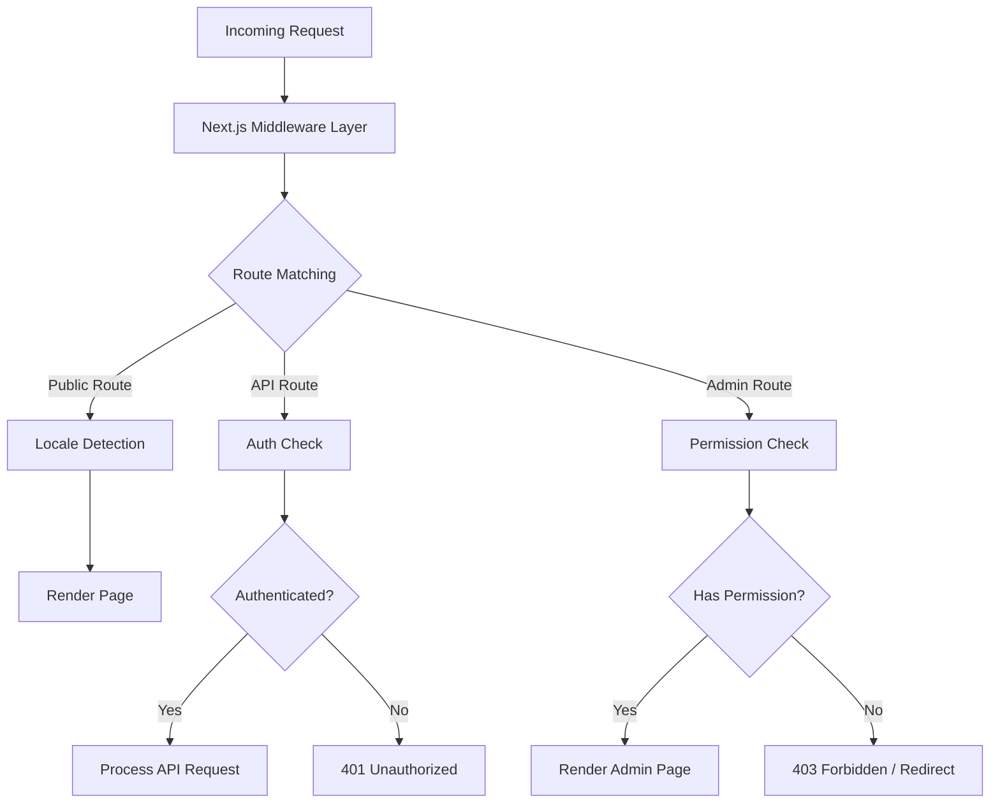
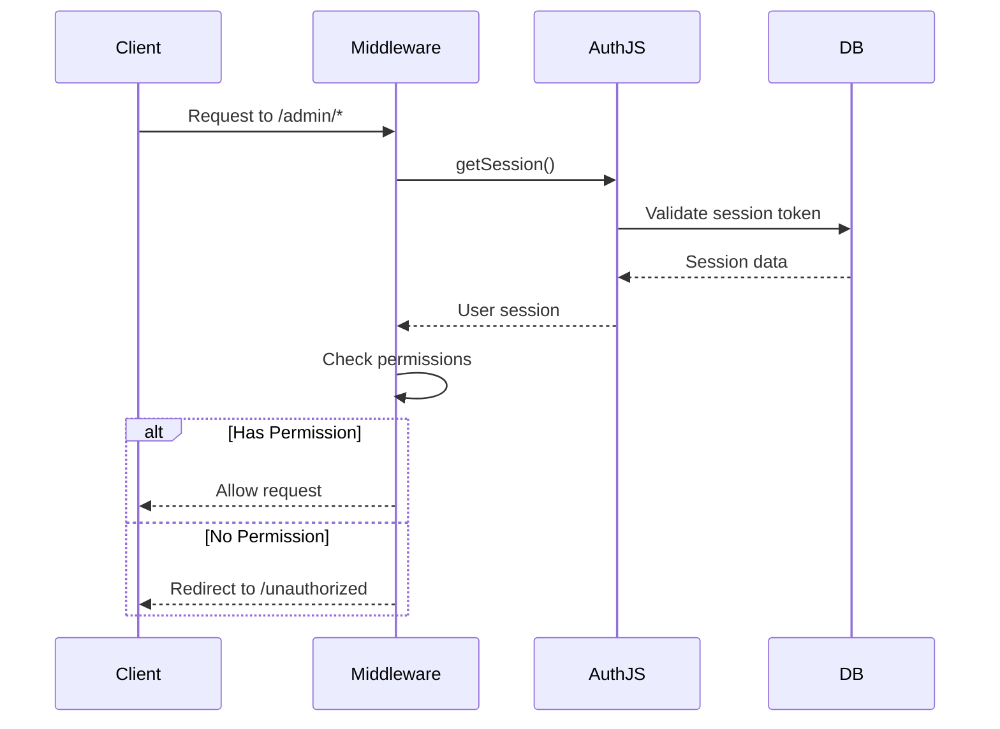
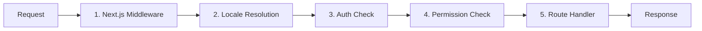

# 中间件深入研究

Ever Works 模板使用基于 Next.js App Router 约定和自定义权限检查逻辑构建的分层中间件架构。本文档涵盖了完整的请求处理管道、权限检查、身份验证中间件、区域设置处理和中间件排序。

## 架构概述



## 权限检查中间件

权限检查系统位于`lib/middleware/permission-check.ts` 中，并为 API 路由和管理页面提供精细的访问控制。

### 核心接口

```typescript
interface UserPermissions {
  userId: string;
  roles: string[];
  permissions: Permission[];
}
```

### 权限检查功能

|功能|目的|退货|
|---|---|---|
|`hasPermission(user, permission)`|检查单个权限|`boolean`|
|`hasAnyPermission(user, permissions)`|检查用户是否至少有一个|`boolean`|
|`hasAllPermissions(user, permissions)`|检查用户是否已列出所有内容|`boolean`|
|`hasResourcePermission(user, resource, action)`|检查`resource:action` 格式|`boolean`|
|`getResourcePermissions(user, resource)`|获取资源的所有权限|`Permission[]`|
|`canManageResource(user, resource)`|检查创建/更新/删除访问权限|`boolean`|
|`isSuperAdmin(user)`|检查超级管理员角色或所有权限|`boolean`|

### API 路由中的用法

```typescript
import { hasPermission, hasAnyPermission } from '@/lib/middleware/permission-check';

export async function GET(request: Request) {
  const userPermissions = await getUserPermissions(session);

  // Single permission check
  if (!hasPermission(userPermissions, 'items:read')) {
    return new Response('Forbidden', { status: 403 });
  }

  // Multiple permission check (any)
  if (!hasAnyPermission(userPermissions, ['items:review', 'items:approve'])) {
    return new Response('Forbidden', { status: 403 });
  }
}
```

### 资源级别检查

```typescript
// Check specific resource and action
const canEdit = hasResourcePermission(userPermissions, 'items', 'update');

// Get all permissions for a resource
const itemPerms = getResourcePermissions(userPermissions, 'items');
// Returns: ['items:read', 'items:create', 'items:update']

// Check management capability (create, update, or delete)
const canManage = canManageResource(userPermissions, 'categories');
```

### 专门的权限助手

该中间件提供了结合多个权限检查的特定于域的帮助程序：

```typescript
// Can the user review, approve, or reject items?
const canReview = canReviewItems(userPermissions);

// Can the user manage users (read, create, update, delete, assignRoles)?
const canAdmin = canManageUsers(userPermissions);

// Can the user view analytics data?
const canView = canViewAnalytics(userPermissions);

// Is the user a super admin?
const isAdmin = isSuperAdmin(userPermissions);
```

### 超级管理员检测

`isSuperAdmin` 函数使用两层方法：

1. **角色检查**（主要）：检查用户是否具有 `super-admin` 角色
2. **权限检查**（后备）：验证用户是否拥有每个系统权限

```typescript
function isSuperAdmin(userPermissions: UserPermissions): boolean {
  // Fast path: check role
  if (userPermissions.roles.includes('super-admin')) {
    return true;
  }
  // Exhaustive check: verify all permissions
  return hasAllPermissions(userPermissions, allSystemPermissions);
}
```

## 认证中间件

身份验证通过 `auth.config.ts` 中配置的 NextAuth.js (Auth.js v5) 进行处理。中间件在对受保护路由的每个请求上运行。

### 提供商配置

auth 配置通过优雅的回退动态配置 OAuth 提供程序：

|提供者|配置源|
|---|---|
|谷歌|`authConfig.google.clientId/clientSecret`|
|GitHub|`authConfig.github.clientId/clientSecret`|
|脸书|`authConfig.facebook.clientId/clientSecret`|
|推特/X|`authConfig.twitter.clientId/clientSecret`|
|凭证|始终启用|

如果 OAuth 配置失败，系统将回退到仅凭据身份验证。

### 身份验证会话流程



## 语言环境中间件

该模板通过 `next-intl` 中间件集成支持 20 多个语言环境。区域设置检测遵循“按需”前缀模式：

- 默认区域设置 (`en`)：无 URL 前缀 -- `/items/my-app`
- 其他语言环境：语言环境前缀 -- `/fr/items/my-app`

### 支持的区域设置

|语言环境|语言|语言环境|语言|
|---|---|---|---|
|`en`|英语（默认）|`ja`|日语|
|`fr`|法语|`ko`|韩语|
|`es`|西班牙语|`nl`|荷兰语|
|`de`|德语|`pl`|波兰语|
|`zh`|中文|`tr`|土耳其语|
|`ar`|阿拉伯语|`vi`|越南语|
|`he`|希伯来语|`th`|泰语|
|`ru`|俄语|`hi`|印地语|
|`uk`|乌克兰语|`id`|印度尼西亚语|
|`pt`|葡萄牙语|`bg`|保加利亚语|
|`it`|意大利语| | |

## 请求处理管道

完整的请求处理管道遵循以下顺序：



### 管道步骤

1. **Next.js 中间件** (`middleware.ts`)：在与配置的匹配器匹配的每个请求上运行。处理重定向、重写和标头注入。

2. **区域设置解析**：从 URL 路径、`Accept-Language` 标头或 cookie 检测用户的首选区域设置。设置请求上下文的区域设置。

3. **身份验证检查**：对于受保护的路由（`/admin/*`、`/dashboard/*`、`/api/admin/*`），验证用户的会话令牌。

4. **权限检查**：身份验证后，验证用户是否具有特定资源和操作所需的权限。

5. **路由处理程序**：实际的页面组件或 API 路由处理程序处理请求。

### 中间件订购保证

系统强制执行严格的排序：

- 区域设置检测始终首先运行（错误页面需要）
- 身份验证检查在权限检查之前运行（需要用户检查权限）
- 权限检查是路由处理程序之前的最后一道关口
- API 路由使用函数级权限检查（而非中间件级）

## 权限验证实用程序

中间件包括用于处理权限字符串的验证助手：

```typescript
// Validate a permission string
validatePermission('items:read');     // true
validatePermission('invalid:perm');   // false

// Parse a permission into parts
parsePermission('items:update');
// Returns: { resource: 'items', action: 'update' }

// Get summary grouped by resource
getPermissionSummary(userPermissions);
// Returns: { items: ['read', 'create'], categories: ['read'] }
```

## 错误处理

中间件系统在每一层处理错误：

|图层|错误|回应|
|---|---|---|
|语言环境|区域设置无效|重定向到默认区域设置|
|授权|没有会话|401 或重定向到登录|
|授权|会话过期|401带刷新提示|
|许可|缺少权限|403 禁忌|
|许可|权限字符串无效|记录警告，访问被拒绝|

## 最佳实践

1. **使用最具体的检查** - 对于常规功能门控，优先使用具有单一权限的`hasPermission`，而不是`isSuperAdmin`。

2. **检查API路由中的权限**——不要仅仅依赖中间件；始终在路由处理程序中进行验证以进行深度防御。

3. **在中间件中使用动态导入**以避免将仅服务器模块捆绑到边缘运行时中。

4. **保持快速权限检查** - `O(1)` 权限集查找可确保每个请求的开销最小。

5. **记录权限失败** -- 使用结构化日志记录以及用户 ID 和尝试的权限进行安全审核。
