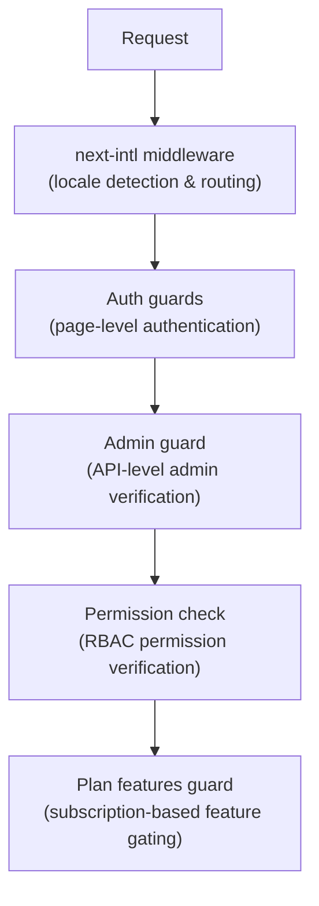

# 中间件和警卫

Ever Works 模板使用分层保护系统，其中包括用于路由的 Next.js 中间件、用于页面和 API 保护的身份验证防护、RBAC 的权限检查以及用于订阅门控的基于计划的功能防护。

## 中间件层



## 区域设置中间件 (next-intl)

根中间件通过`next-intl`处理国际化路由。它是通过`i18n/routing.ts` 和`i18n/request.ts` 配置的。

职责：
- 从 URL 路径、cookie 或 `Accept-Language` 标头检测用户区域设置
- 将没有区域设置前缀的请求重定向到适当的区域设置
- 当未检测到首选项时默认为英语 (`en`)
- 支持 6 个语言环境：`en`、`fr`、`es`、`de`、`ar`、`zh`

## 认证卫士

### 页面级防护 (`lib/auth/guards.ts`)

Guards 模块为页面提供服务器端身份验证检查。这些在服务器组件的顶部被调用以保护页面访问。

**`requireAuth()`** -- 要求用户进行身份验证：

```typescript
import { requireAuth } from '@/lib/auth/guards';

export default async function ProtectedPage() {
  const session = await requireAuth();
  // session.user is guaranteed to exist here
  return <div>Welcome {session.user.email}</div>;
}
```

如果用户未通过身份验证，他们将被重定向到`/auth/signin`。

**`requireAdmin()`** -- 要求用户经过身份验证并具有管理员角色：

```typescript
import { requireAdmin } from '@/lib/auth/guards';

export default async function AdminPage() {
  const session = await requireAdmin();
  return <div>Admin: {session.user.email}</div>;
}
```

如果用户未通过身份验证，他们将被重定向到`/admin/auth/signin`。如果经过身份验证但未经过管理员身份验证，它们将被重定向到`/unauthorized`。

**`getSession()`** -- 获取会话而不重定向：

```typescript
const session = await getSession();
if (session) {
  // Authenticated
} else {
  // Guest
}
```

**`checkIsAdmin()`** -- 检查管理员状态而不重定向：

```typescript
const isAdmin = await checkIsAdmin();
// Returns true or false
```

### 已验证的操作 (`lib/auth/guards.ts`)

Guards 模块还为 Next.js 服务器操作提供经过验证的操作包装器：

**`validatedAction(schema, action)`** -- 根据 Zod 模式验证表单数据：

```typescript
export const myAction = validatedAction(mySchema, async (data, formData) => {
  // data is validated and typed
});
```

**`validatedActionWithUser(schema, action)`** -- 验证并要求身份验证：

```typescript
export const myAction = validatedActionWithUser(mySchema, async (data, formData, user) => {
  // data is validated, user is authenticated
});
```

## 管理员警卫 (`lib/auth/admin-guard.ts`)

管理防护专门为管理端点提供 API 路由保护。

**`checkAdminAuth()`** -- API 路由的中间件函数：

```typescript
import { checkAdminAuth } from '@/lib/auth/admin-guard';

export async function GET(request: NextRequest) {
  const authError = await checkAdminAuth();
  if (authError) return authError;

  // User is verified admin, proceed with handler
}
```

如果获得授权，则返回 `null`，或者返回带有相应错误状态（401 或 403）的 `NextResponse`。

**`withAdminAuth(handler)`** -- 高阶函数包装器：

```typescript
import { withAdminAuth } from '@/lib/auth/admin-guard';

export const GET = withAdminAuth(async (request) => {
  // Already verified as admin
  return NextResponse.json({ data: 'admin only' });
});
```

管理员守卫验证身份验证（会话存在）和授权（用户通过 `isAdmin()` 检查在数据库中具有管理员角色）。

## 权限检查系统(`lib/middleware/permission-check.ts`)

权限系统实现了基于角色的访问控制（RBAC），具有细化的权限。

### 权限结构

权限遵循 `resource:action` 格式：

```typescript
// Examples of permission keys
'items:read'
'items:create'
'items:update'
'items:delete'
'items:review'
'items:approve'
'items:reject'
'categories:read'
'categories:create'
'users:assignRoles'
'analytics:read'
'system:settings'
```

### 权限检查功能

```typescript
import {
  hasPermission,
  hasAnyPermission,
  hasAllPermissions,
  hasResourcePermission,
  canManageResource,
  canReviewItems,
  canManageUsers,
  canManageRoles,
  canViewAnalytics,
  isSuperAdmin,
} from '@/lib/middleware/permission-check';

// Single permission check
hasPermission(userPermissions, 'items:create');

// Any of multiple permissions
hasAnyPermission(userPermissions, ['items:create', 'items:update']);

// All permissions required
hasAllPermissions(userPermissions, ['items:read', 'items:update']);

// Resource-level check
hasResourcePermission(userPermissions, 'items', 'create');

// Domain-specific helpers
canManageResource(userPermissions, 'categories'); // create, update, or delete
canReviewItems(userPermissions);                  // review, approve, or reject
canManageUsers(userPermissions);                  // user CRUD + assignRoles
isSuperAdmin(userPermissions);                    // all system permissions
```

### 超级管理员检测

`isSuperAdmin()` 函数检查两个条件：
1. 用户是否具有`super-admin`角色（首选）
2. 作为后备，用户是否拥有所有系统权限

### 权限验证

```typescript
// Validate a permission string is defined in the system
validatePermission('items:create'); // true
validatePermission('invalid:perm'); // false

// Parse permission into resource and action
parsePermission('items:create'); // { resource: 'items', action: 'create' }
```

## 计划功能守卫 (`lib/guards/plan-features.guard.ts`)

该计划具有基于订阅计划（免费、标准、高级）的警卫控制功能访问。

### 计划层次结构

```typescript
const PLAN_LEVELS = {
  free: 1,
  standard: 2,
  premium: 3,
};
```

### 功能访问矩阵

每个功能都映射到可以访问它的计划：

|特点|免费|标准型|高级版|
|---------|------|----------|---------|
|提交产品|是的|是的|是的|
|上传图片|是的|是的|是的|
|电子邮件支持|是的|是的|是的|
|扩展描述| - |是的|是的|
|已验证徽章| - |是的|是的|
|优先审查| - |是的|是的|
|查看统计数据| - |是的|是的|
|上传视频| - | - |是的|
|赞助徽章| - | - |是的|
|主页精选| - | - |是的|
|高级分析| - | - |是的|
|无限提交| - | - |是的|

### 计划限制

每个计划对某些功能都有数字限制：

|限制|免费|标准型|高级版|
|-------|------|----------|---------|
|最大图像数| 1 | 5 |无限|
|最大描述字数| 200 | 500 |无限|
|最大提交数量| 1 | 10 |无限|
|审核日| 7 | 3 | 1 |
|免费修改天数| 0 | 30 | 365 |

### 使用计划卫士

**直接函数调用：**

```typescript
import { canAccessFeature, getFeatureLimit, isWithinLimit } from '@/lib/guards';

canAccessFeature('upload_video', 'free');    // false
canAccessFeature('upload_video', 'premium'); // true
getFeatureLimit('max_images', 'standard');   // 5
isWithinLimit('max_submissions', 3, 'free'); // false (limit is 1)
```

**守卫工厂（用于多次检查）：**

```typescript
import { createPlanGuard } from '@/lib/guards';

const guard = createPlanGuard('standard');
guard.canAccess('verified_badge');     // true
guard.canAccess('upload_video');       // false
guard.getLimit('max_images');          // 5
guard.requireFeature('upload_video');  // throws PlanGuardError
```

**反应挂钩集成：**

```typescript
import { createPlanGuardResult } from '@/lib/guards';

// In a hook or component
const guardResult = createPlanGuardResult(userPlan);
guardResult.canAccess('verified_badge');
guardResult.accessibleFeatures; // array of all accessible features
```

`requireFeature()` 抛出的`PlanGuardError` 包含功能名称、用户当前计划和所需计划，从而在 UI 中启用信息丰富的升级提示。
