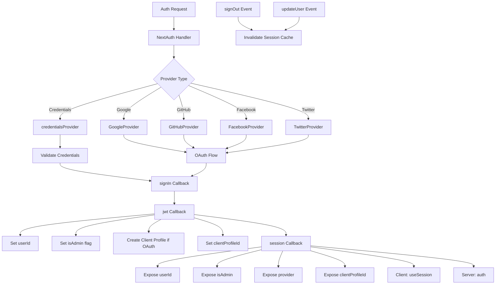

# NextAuth 配置

## 概述

Ever Works 模板使用基于 JWT 的会话、Drizzle ORM 适配器、多个 OAuth 提供程序（Google、GitHub、Facebook、Twitter）、基于凭据的身份验证以及用于管理员/客户端角色管理的自定义回调来配置 NextAuth.js (Auth.js v5)。系统支持为 OAuth 用户自动创建客户端配置文件以及具有缓存失效功能的会话缓存。

## 建筑



## 源文件

|文件|目的|
|------|---------|
|`template/lib/auth/index.ts`|主要 NextAuth 配置和导出|
|`template/auth.config.ts`|提供商配置（边缘兼容）|
|`template/lib/auth/config.ts`|身份验证提供者类型选择|
|`template/lib/auth/providers.ts`|OAuth 提供者工厂函数|
|`template/lib/auth/credentials.ts`|凭证提供者实施|
|`template/lib/auth/guards.ts`|服务器端身份验证防护实用程序|
|`template/lib/auth/middleware.ts`|经过验证的操作包装器|
|`template/lib/auth/setup.ts`|身份验证初始化助手|
|`template/lib/auth/cached-session.ts`|会话缓存管理|
|`template/lib/auth/session-cache.ts`|会话缓存实现|
|`template/lib/auth/admin-guard.ts`|管理员特定的保护逻辑|

## NextAuth 初始化

```typescript
// lib/auth/index.ts
export const { handlers, auth, signIn, signOut, unstable_update } = NextAuth({
    adapter: drizzle,
    session: {
        strategy: 'jwt',
        maxAge: 30 * 24 * 60 * 60,    // 30 days
        updateAge: 24 * 60 * 60        // Refresh every 24 hours
    },
    jwt: {
        maxAge: 30 * 24 * 60 * 60      // 30 days
    },
    callbacks: { authorized, redirect, signIn, jwt, session },
    events: { signOut, updateUser },
    pages: {
        signIn: '/auth/signin',
        signOut: '/auth/signout',
        error: '/auth/error',
        verifyRequest: '/auth/verify-request',
        newUser: '/auth/register'
    },
    ...authConfig  // Merges providers from auth.config.ts
});
```

### 会议策略

该模板使用 **JWT 会话** (`strategy: 'jwt'`)，而不是数据库会话。这意味着：
- 会话存储在加密的 cookie 中，而不是存储在数据库中
- 不需要数据库查询来验证会话
- 与 Edge Runtime 兼容（中间件）
- 会话数据仅限于 JWT 令牌中适合的内容

## 数据库适配器

```typescript
const isDatabaseAvailable = !!coreConfig.DATABASE_URL && typeof db !== 'undefined';

const drizzle = isDatabaseAvailable
    ? DrizzleAdapter(getDrizzleInstance(), {
        usersTable: users,
        accountsTable: accounts,
        sessionsTable: sessions,
        verificationTokensTable: verificationTokens
    })
    : undefined;
```

该适配器是根据数据库可用性有条件地创建的。这允许模板即使在没有数据库的情况下也可以启动（例如，在初始设置期间），但身份验证将受到限制。

## 提供商配置

### auth.config.ts（边缘兼容）

```typescript
// auth.config.ts
const configureProviders = () => {
    try {
        const oauthProviders = configureOAuthProviders();
        return createNextAuthProviders({
            google: oauthProviders.find((p) => p.id === 'google')
                ? { enabled: true, clientId: '...', clientSecret: '...' }
                : { enabled: false },
            github: { /* ... */ },
            facebook: { /* ... */ },
            twitter: { /* ... */ },
            credentials: { enabled: true },
        });
    } catch (error) {
        // Fallback to credentials only
        return createNextAuthProviders({
            credentials: { enabled: true },
            google: { enabled: false },
            github: { enabled: false },
            facebook: { enabled: false },
            twitter: { enabled: false },
        });
    }
};

export default {
    trustHost: true,
    providers: configureProviders(),
} satisfies NextAuthConfig;
```

### 供应商工厂

```typescript
// lib/auth/providers.ts
export function createNextAuthProviders(config: OAuthProvidersConfig) {
    const providers = [];

    if (config.google?.enabled && config.google.clientId && config.google.clientSecret) {
        providers.push(GoogleProvider({
            clientId: config.google.clientId,
            clientSecret: config.google.clientSecret,
            ...config.google.options,
        }));
    }
    // GitHub, Facebook, Twitter follow the same pattern...

    if (config.credentials?.enabled) {
        providers.push(credentialsProvider);
    }

    return providers;
}
```

仅当提供程序具有有效凭据时才会添加，以防止启动时出现配置错误。

## 回调

### 登录回调

```typescript
signIn: async ({ user, account, profile }) => {
    const isCredentials = account?.provider === 'credentials';

    if (!user?.email) {
        return !isCredentials; // Allow OAuth without email
    }

    if (!isDatabaseAvailable) {
        return !isCredentials; // Skip DB validation if no DB
    }

    // For OAuth providers, allow account linking
    if (!isCredentials && account?.provider) {
        return true;
    }

    return true;
}
```

### jwt 回调

JWT 回调是身份验证管道的核心。它根据每个请求运行并管理：

```typescript
jwt: async ({ token, user, account }) => {
    // 1. Set userId from user object or token.sub
    if (user?.id) token.userId = user.id;
    if (!token.userId && token.sub) token.userId = token.sub;

    // 2. Set clientProfileId
    if (user?.clientProfileId) token.clientProfileId = user.clientProfileId;

    // 3. Record provider
    if (account?.provider) token.provider = account.provider;

    // 4. Auto-create client profile for OAuth users
    if (isOAuthProvider && !token.clientProfileId && token.userId) {
        let clientProfile = await getClientProfileByUserId(token.userId);
        if (!clientProfile) {
            clientProfile = await createClientProfile({
                userId: token.userId,
                email: token.email,
                name: token.name || token.email?.split('@')[0],
            });
        }
        token.clientProfileId = clientProfile?.id;
    }

    // 5. Set isAdmin flag
    if (user?.isClient !== undefined) {
        token.isAdmin = !user.isClient;
    } else if (user?.isAdmin !== undefined) {
        token.isAdmin = user.isAdmin;
    } else if (token.isAdmin === undefined) {
        token.isAdmin = false; // Default: non-admin
    }

    return token;
}
```

### 会话回调

将 JWT 令牌字段映射到向客户端组件公开的会话对象：

```typescript
session: async ({ session, token }) => {
    if (token && session.user) {
        session.user.id = token.userId;
        session.user.clientProfileId = token.clientProfileId;
        session.user.provider = token.provider || 'credentials';
        session.user.isAdmin = token.isAdmin;
    }
    return session;
}
```

## 活动

### 会话缓存失效

```typescript
events: {
    signOut: async (event) => {
        const token = 'token' in event ? event.token : undefined;
        if (token?.userId) {
            await invalidateSessionCache(undefined, token.userId);
        }
    },
    updateUser: async ({ user }) => {
        if (user?.id) {
            await invalidateSessionCache(undefined, user.id);
        }
    }
}
```

`signOut` 和 `updateUser` 事件都会触发会话缓存失效，确保在身份验证状态更改后不会提供过时的会话数据。

## 服务器端防护

### 需要验证

```typescript
export async function requireAuth() {
    const session = await auth();
    if (!session?.user) {
        redirect('/auth/signin');
    }
    return session;
}
```

### 需要管理员

```typescript
export async function requireAdmin() {
    const session = await auth();
    if (!session?.user) {
        redirect('/admin/auth/signin');
    }
    if (!session.user.isAdmin) {
        redirect('/unauthorized');
    }
    return session;
}
```

### 实用卫士

```typescript
// Check without redirecting
export async function getSession() {
    return await auth();
}

export async function checkIsAdmin() {
    const session = await auth();
    return session?.user?.isAdmin === true;
}
```

## 自定义页面

|页面|路径|目的|
|------|------|---------|
|登录|`/auth/signin`|登录表格|
|退出|`/auth/signout`|注销确认|
|错误|`/auth/error`|验证错误显示|
|验证请求|`/auth/verify-request`|邮箱验证提示|
|注册|`/auth/register`|新用户注册|

## 环境变量

|变量|必填|目的|
|----------|----------|---------|
|`AUTH_SECRET`|是的|JWT 加密秘密|
|`AUTH_GOOGLE_ID`|否|Google OAuth 客户端 ID|
|`AUTH_GOOGLE_SECRET`|否|Google OAuth 客户端密钥|
|`AUTH_GITHUB_ID`|否|GitHub OAuth 客户端 ID|
|`AUTH_GITHUB_SECRET`|否|GitHub OAuth 客户端密钥|
|`AUTH_FACEBOOK_ID`|否|Facebook OAuth 客户端 ID|
|`AUTH_FACEBOOK_SECRET`|否|Facebook OAuth 客户端密钥|
|`AUTH_TWITTER_ID`|否|Twitter/X OAuth 客户端 ID|
|`AUTH_TWITTER_SECRET`|否|Twitter/X OAuth 客户端密钥|
|`DATABASE_URL`|对于适配器|数据库连接字符串|

## 最佳实践

1. **使用 JWT 策略**实现中间件中的 Edge Runtime 兼容性
2. **在 JWT 回调中为 OAuth 用户自动创建客户端配置文件**
3. **优雅降级**——如果 OAuth 配置失败，则仅使用凭据
4. **使身份验证事件的缓存无效** -- 注销和用户更新都会清除缓存的会话
5. **条件适配器** -- 允许在没有数据库的情况下启动以进行初始配置
6. **保护功能** -- 在服务器组件中使用 `requireAuth()` / `requireAdmin()`，而不是手动会话检查
7. **自定义页面** -- 覆盖默认的 NextAuth 页面，使 UI 与模板设计保持一致
