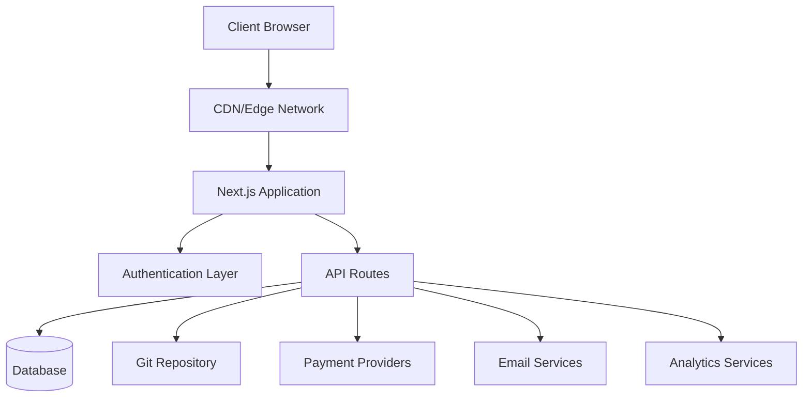
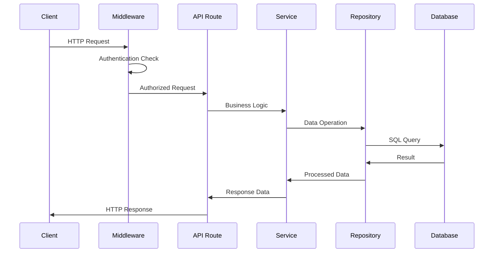
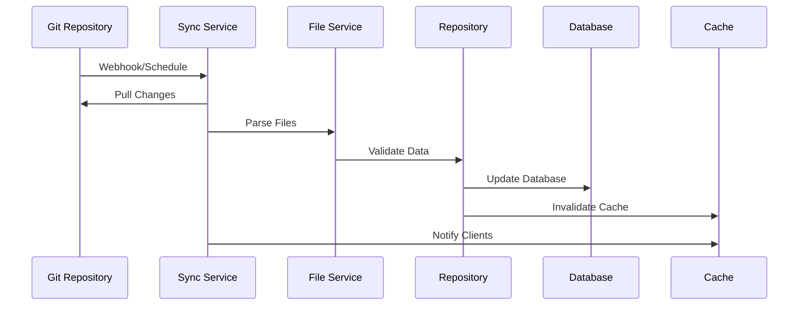
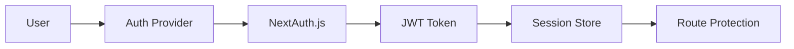

# 架构概述

Ever Works 遵循现代、可扩展的架构，专为性能、可维护性和开发人员体验而设计。

## 高层架构



## 核心原则

### 1. 关注点分离
- **表示层**：React 组件和 UI 逻辑
- **业务层**：服务和存储库
- **数据层**：数据库和外部API

### 2. 模块化设计
- 基于特征的组织
- 可重复使用的组件
- 类似插件的集成

### 3. 类型安全
- 贯穿全文的 TypeScript
- 严格的类型检查
- 使用 Zod 进行运行时验证

### 4. 性能第一
- 服务端渲染
- 尽可能生成静态
- 优化的缓存策略

## 应用层

### 前端层

**技术**：React 19 + Next.js 15
**职责**：
- 用户界面渲染
- 客户端状态管理
- 用户交互
- 路线处理

**关键组件**：
- 页面组件 (`app/[locale]/`)
- 可重用的 UI 组件 (`components/`)
- 自定义挂钩 (`hooks/`)
- 上下文提供者 (`components/providers/`)

### API层

**技术**：Next.js API 路由
**职责**：
- 业务逻辑执行
- 数据验证
- 外部服务整合
- 认证处理

**结构**：
```
app/api/
├── auth/           # Authentication endpoints
├── admin/          # Admin-only endpoints
├── items/          # Item management
└── webhooks/       # External service webhooks
```

### 数据层

**技术**：Drizzle ORM + PostgreSQL
**职责**：
- 数据持久化
- 查询优化
- 交易管理
- 架构迁移

**组件**：
- 数据库架构 (`lib/db/schema.ts`)
- 存储库 (`lib/repositories/`)
- 迁移文件 (`lib/db/migrations/`)

### 内容层

**技术**：基于Git的CMS
**职责**：
- 内容同步
- 版本控制
- 协同编辑
- 内容验证

**结构**：
```
.content/
├── config.yml      # Site configuration
├── items/          # Item definitions
├── categories/     # Category definitions
└── tags/           # Tag definitions
```

## 设计模式

### 1. 存储库模式

摘要数据访问逻辑：

```typescript
interface ItemRepository {
  findById(id: string): Promise<Item | null>;
  findBySlug(slug: string): Promise<Item | null>;
  findWithFilters(filters: ItemFilters): Promise<Item[]>;
  create(item: CreateItemRequest): Promise<Item>;
  update(id: string, updates: UpdateItemRequest): Promise<Item>;
  delete(id: string): Promise<void>;
}
```

### 2. 服务层模式

封装业务逻辑：

```typescript
class ItemService {
  constructor(
    private itemRepository: ItemRepository,
    private gitService: GitService,
    private notificationService: NotificationService
  ) {}

  async submitItem(data: SubmitItemRequest): Promise<SubmissionResult> {
    // Business logic here
  }
}
```

### 3.工厂模式

创建服务实例：

```typescript
class PaymentProviderFactory {
  static create(provider: PaymentProvider): PaymentService {
    switch (provider) {
      case 'stripe':
        return new StripePaymentService();
      case 'lemonsqueezy':
        return new LemonSqueezyPaymentService();
      default:
        throw new Error(`Unsupported provider: ${provider}`);
    }
  }
}
```

### 4.观察者模式

事件驱动的更新：

```typescript
class ContentSyncService {
  private observers: ContentObserver[] = [];

  addObserver(observer: ContentObserver): void {
    this.observers.push(observer);
  }

  notifyObservers(event: ContentEvent): void {
    this.observers.forEach(observer => observer.update(event));
  }
}
```

## 数据流

### 1. 请求流程



### 2. 内容同步流程



## 安全架构

### 1. 认证流程



### 2. 授权层

- **路由级**：中间件保护
- **API 级**：端点防护
- **数据级**：行级安全性
- **UI级别**：基于组件的访问控制

### 3. 安全措施

- **输入验证**：Zod 模式
- **SQL注入**：参数化查询
- **XSS 保护**：内容清理
- **CSRF 保护**：令牌验证
- **速率限制**：请求限制

## 缓存策略

### 1. 应用程序缓存

- **React Query**：客户端数据缓存
- **Next.js 缓存**：页面和 API 路由缓存
- **静态生成**：预构建页面

### 2. 数据库缓存

- **连接池**：高效的数据库连接
- **查询优化**：索引查询
- **只读副本**：分布式读取操作

### 3.CDN缓存

- **静态资产**：图像、CSS、JS
- **API 响应**：可缓存端点
- **边缘位置**：全球分布

## 可扩展性考虑因素

### 1. 水平缩放

- **无状态设计**：无服务器端会话
- **数据库扩展**：读取副本和分片
- **CDN 分发**：全局边缘缓存

### 2. 性能优化

- **代码分割**：动态导入
- **图像优化**：Next.js 图像组件
- **捆绑优化**：树抖动和缩小

### 3. 监控和可观察性

- **错误跟踪**：Sentry 集成
- **性能监控**：核心网络生命
- **分析**：PostHog 集成
- **日志记录**：结构化日志记录

## 技术决策

### 为什么选择 Next.js？
- **全栈框架**：API路由+前端
- **性能**：SSR、SSG 和 ISR
- **开发者体验**：热重载、TypeScript 支持
- **生态系统**：丰富的插件生态系统

### 为什么要使用 Drizzle ORM？
- **类型安全**：完整的 TypeScript 支持
- **性能**：最小开销
- **灵活性**：需要时使用原始 SQL
- **迁移系统**：版本控制的架构更改

### 为什么选择基于 Git 的 CMS？
- **版本控制**：完整历史记录跟踪
- **协作**：拉取请求工作流程
- **备份**：自然分布
- **灵活性**：任何 Git 提供商

### 为什么要响应查询？
- **缓存**：智能缓存管理
- **同步**：后台更新
- **乐观更新**：更好的用户体验
- **错误处理**：重试逻辑

## 扩展点

该架构提供了几个扩展点：

### 1. 自定义身份验证提供商
```typescript
// lib/auth/providers/custom-provider.ts
export function CustomProvider(options: CustomProviderOptions) {
  return {
    id: "custom",
    name: "Custom Provider",
    type: "oauth",
    // Implementation
  }
}
```

### 3. 内容源整合
```typescript
// lib/content/sources/custom-source.ts
export class CustomContentSource implements ContentSource {
  async sync(): Promise<SyncResult> {
    // Implementation
  }
}
```

## 下一步

- [详细探索技术堆栈](./tech-stack)
