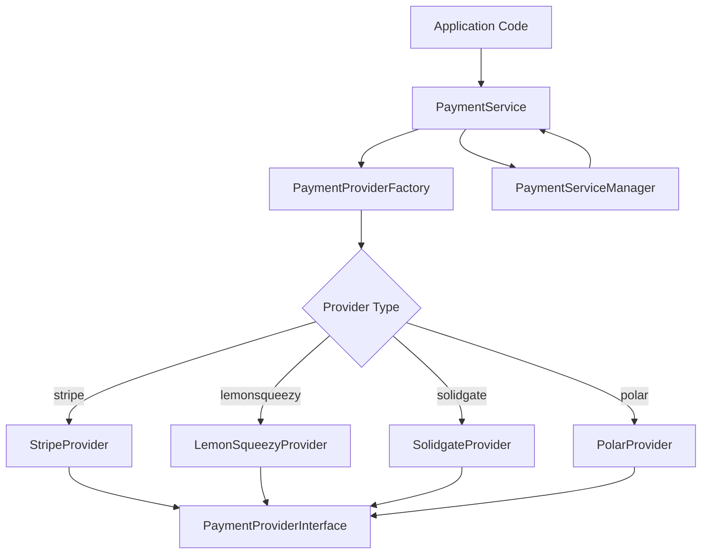
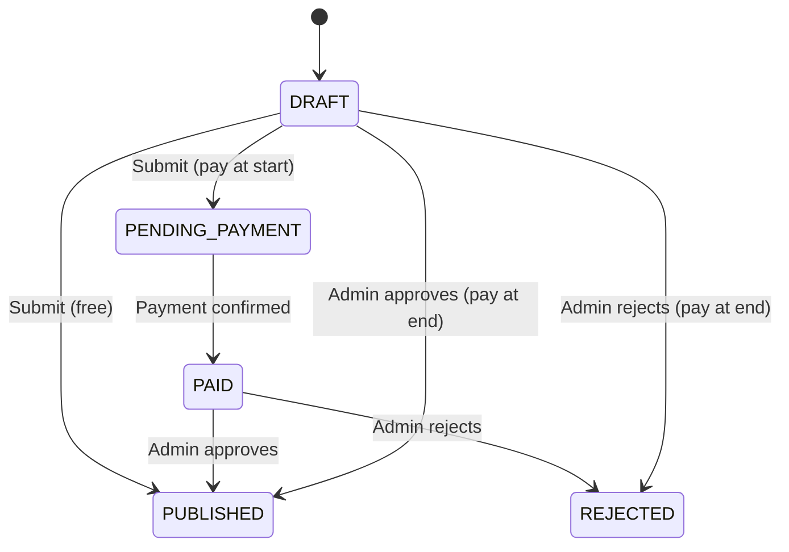

# 支付库

该模板使用工厂和策略模式实现多提供商支付系统。它支持 Stripe、LemonSqueezy、Solidgate 和 Polar 作为支付提供商，并具有用于支付、订阅、Webhooks 和退款的统一界面。

## 架构概述



## 源文件

|文件|目的|
|------|---------|
|`lib/payment/index.ts`|公共 API 导出|
|`lib/payment/lib/payment-provider-factory.ts`|用于创建提供者实例的工厂|
|`lib/payment/lib/payment-service.ts`|统一服务门面|
|`lib/payment/lib/payment-service-manager.ts`|服务生命周期的单例管理器|
|`lib/payment/types/payment-types.ts`|核心接口和枚举|
|`lib/payment/types/payment.ts`|付款流程和提交类型|
|`lib/payment/config/`|提供者配置和验证|
|`lib/payment/lib/providers/`|个别提供商实施|
|`lib/payment/hooks/`|客户端支付流程的 React hooks|
|`lib/payment/ui/`|付款表格组件|

## 核心接口

### 支付提供商接口

每个提供商都实现这个综合接口：

```typescript
export interface PaymentProviderInterface {
  // Payment operations
  createPaymentIntent(params: CreatePaymentParams): Promise<PaymentIntent>;
  confirmPayment(paymentId: string, paymentMethodId: string): Promise<PaymentIntent>;
  verifyPayment(paymentId: string): Promise<PaymentVerificationResult>;
  createSetupIntent(user: User | null): Promise<SetupIntent>;

  // Subscription management
  createCustomer(params: CreateCustomerParams): Promise<CustomerResult>;
  createSubscription(params: CreateSubscriptionParams): Promise<SubscriptionInfo>;
  cancelSubscription(subscriptionId: string, cancelAtPeriodEnd?: boolean): Promise<SubscriptionInfo>;
  updateSubscription(params: UpdateSubscriptionParams): Promise<SubscriptionInfo>;
  hasCustomerId(user: User | null): boolean;
  getCustomerId(user: User | null): Promise<string | null>;

  // Webhooks and refunds
  handleWebhook(payload: any, signature: string, ...args: any[]): Promise<WebhookResult>;
  refundPayment(paymentId: string, amount?: number): Promise<any>;

  // Client configuration and UI
  getClientConfig(): ClientConfig;
  getUIComponents(): UIComponents;
}
```

### 支付提供商工厂

根据配置创建提供程序实例：

```typescript
export type SupportedProvider = 'stripe' | 'solidgate' | 'lemonsqueezy' | 'polar';

export class PaymentProviderFactory {
  static createProvider(
    providerType: SupportedProvider,
    config: PaymentProviderConfig
  ): PaymentProviderInterface {
    switch (providerType) {
      case 'stripe':       return new StripeProvider(config);
      case 'solidgate':    return new SolidgateProvider(config);
      case 'lemonsqueezy': return new LemonSqueezyProvider(config);
      case 'polar':        return new PolarProvider(config);
      default:             throw new Error(`Unsupported payment provider: ${providerType}`);
    }
  }
}
```

## 支付服务

`PaymentService` 类为所有提供者操作提供统一的外观：

```typescript
export class PaymentService {
  private provider: PaymentProviderInterface;

  constructor(config: PaymentServiceConfig) {
    this.provider = PaymentProviderFactory.createProvider(config.provider, config.config);
  }

  // All methods delegate to the underlying provider
  async createPaymentIntent(params: CreatePaymentParams): Promise<PaymentIntent> {
    return this.provider.createPaymentIntent(params);
  }

  async createSubscription(params: CreateSubscriptionParams): Promise<SubscriptionInfo> {
    return this.provider.createSubscription(params);
  }

  // ... additional delegated methods
}
```

## 数据类型

### 支付枚举

```typescript
export enum PaymentType {
  ONE_TIME = 'one_time',
  SUBSCRIPTION = 'subscription',
  FREE = 'free',
}

export enum SubscriptionStatus {
  INCOMPLETE = 'incomplete',
  INCOMPLETE_EXPIRED = 'incomplete_expired',
  TRIALING = 'trialing',
  ACTIVE = 'active',
  PAST_DUE = 'past_due',
  CANCELED = 'canceled',
  UNPAID = 'unpaid',
}

export enum PaymentFlow {
  PAY_AT_START = "pay_at_start",
  PAY_AT_END = "pay_at_end",
}
```

### Webhook 事件

```typescript
export enum WebhookEventType {
  PAYMENT_SUCCEEDED = 'payment_succeeded',
  PAYMENT_FAILED = 'payment_failed',
  SUBSCRIPTION_CREATED = 'subscription_created',
  SUBSCRIPTION_UPDATED = 'subscription_updated',
  SUBSCRIPTION_CANCELLED = 'subscription_cancelled',
  INVOICE_PAID = 'invoice_paid',
  REFUND_CREATED = 'refund_created',
  // ... additional event types
}
```

### 关键数据结构

|类型|目的|
|------|---------|
|`PaymentIntent`|包含 id、金额、货币、状态、clientSecret 的付款会话|
|`SubscriptionInfo`|订阅详细信息，包括状态、期限结束、试用信息|
|`CustomerResult`|使用 ID、电子邮件、姓名创建客户|
|`WebhookResult`|已处理的带有类型、id、数据的 webhook|
|`ClientConfig`|具有公钥和网关类型的前端安全配置|
|`UIComponents`|为提供商提供 React 组件和视觉资产|

## 货币实用工具

该库包含用于货币格式化的辅助函数：

```typescript
// Format cents to display currency
export function formatCentsToCurrency(
  cents: number, currency: string = 'USD', locale: string = 'en-US'
): string {
  const amount = cents / 100;
  return new Intl.NumberFormat(locale, {
    style: 'currency', currency,
    minimumFractionDigits: 2, maximumFractionDigits: 2,
  }).format(amount);
}

// Convert between cents and decimal
export function convertCentsToDecimal(cents: number): number;
export function convertDecimalToCents(decimal: number): number;

// Convert timestamps to Date objects
export function convertNumberToDate(timestamp?: number): Date | null;
export function safeTimestampToDate(timestamp: number | null | undefined): Date | undefined;
```

## 支付流程类型

系统支持两种提交支付流程：

|流量|枚举|描述|
|------|------|-------------|
|开始付款|`PAY_AT_START`|提交审核前需付款|
|结束时付款|`PAY_AT_END`|管理员批准后收取付款|

### 提交状态生命周期



## UI组件接口

每个提供商都公开用于前端集成的 UI 组件：

```typescript
export interface UIComponents {
  PaymentForm: React.ComponentType<PaymentFormProps>;
  logo: string;
  cardBrands: CardBrandIcon[];
  supportedPaymentMethods: string[];
  translations: Record<string, Record<string, string>>;
}
```

## 客户端集成

`usePayment` 钩子和 `PaymentProvider` 上下文提供了 React 集成：

```typescript
import { usePayment, PaymentProvider } from '@/lib/payment';

// Wrap your app with the payment provider
<PaymentProvider>
  <PaymentForm
    amount={2999}
    currency="usd"
    isSubscription={false}
    onSuccess={(paymentId) => console.log('Paid:', paymentId)}
    onError={(error) => console.error('Failed:', error)}
  />
</PaymentProvider>
```

## 提供商配置

```typescript
export interface PaymentProviderConfig {
  apiKey: string;
  webhookSecret?: string;
  secretKey?: string;
  options?: Record<string, any>;
}
```

每个提供商至少需要`apiKey`。 Stripe 和 Solidgate 还使用 `webhookSecret` 进行 webhook 签名验证。
