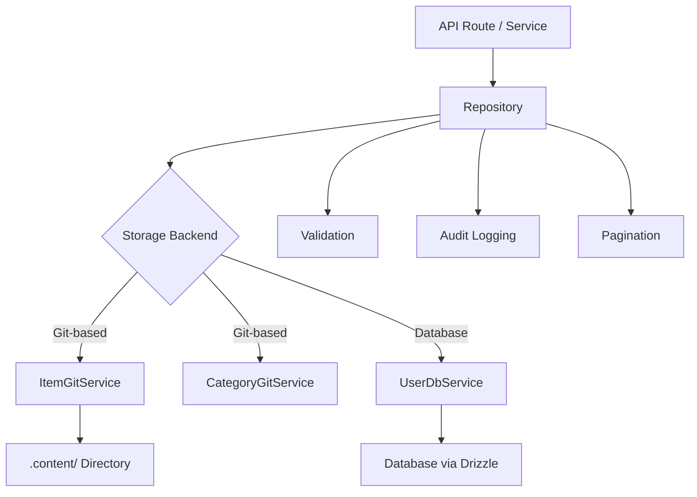

# 存储库模式

该模板实现了存储库模式，以在业务逻辑和数据存储之间提供干净的数据访问层。存储库封装了查询构建、验证、分页和审核日志记录，同时将实际存储委托给底层服务（基于 Git 或数据库支持）。

## 架构概述



## 源文件

|文件|目的|
|------|---------|
|`lib/repositories/item.repository.ts`|使用 Git 存储、过滤、审计的项目 CRUD|
|`lib/repositories/category.repository.ts`|使用 Git 存储进行类别管理|
|`lib/repositories/user.repository.ts`|用户对数据库存储的操作|
|`lib/repositories/tag.repository.ts`|标签管理|
|`lib/repositories/role.repository.ts`|角色管理|
|`lib/repositories/collection.repository.ts`|馆藏管理|
|`lib/repositories/sponsor-ad.repository.ts`|赞助商广告管理|
|`lib/repositories/client-item.repository.ts`|面向客户的项目操作|
|`lib/repositories/client-dashboard.repository.ts`|客户仪表板数据|
|`lib/repositories/admin-stats.repository.ts`|管理统计|
|`lib/repositories/admin-analytics-optimized.repository.ts`|优化的分析查询|
|`lib/repositories/integration-mapping.repository.ts`|外部集成映射|
|`lib/repositories/twenty-crm-config.repository.ts`|二十个CRM配置|

## 常用存储库方法

所有存储库都遵循一致的 API 界面：

|方法|描述|
|--------|-------------|
|`findAll(options?)`|使用可选过滤检索所有记录|
|`findAllPaginated(page, limit, options?)`|分页检索|
|`findById(id)`|通过ID查找单条记录|
|`findBySlug(slug)`|按 slug 查找单个记录|
|`create(data)`|创建一条带有验证的新记录|
|`update(id, data)`|通过验证更新现有记录|
|`delete(id)`|硬删除一条记录|
|`getStats()`|获取汇总统计数据|

## 项目存储库

最全面的存储库，展示了所有关键模式。

### 延迟服务初始化

Git 服务在第一次使用时会延迟初始化：

```typescript
export class ItemRepository {
  private gitService: ItemGitService | null = null;

  private async getGitService(): Promise<ItemGitService> {
    if (!this.gitService) {
      const dataRepo = coreConfig.content.dataRepository;
      const token = coreConfig.content.ghToken;
      // Parse GitHub URL, create service config
      this.gitService = await createItemGitService(config);
    }
    return this.gitService;
  }
}
```

### 过滤

`findAll` 方法支持使用数组的 OR 逻辑进行多标准过滤：

```typescript
async findAll(options: ItemListOptions = {}): Promise<ItemData[]> {
  const items = await gitService.readItems(options.includeDeleted ?? false);
  let filteredItems = items;

  if (options.status)
    filteredItems = filteredItems.filter(item => item.status === options.status);

  if (options.categories?.length > 0)
    filteredItems = filteredItems.filter(item => {
      const itemCategories = Array.isArray(item.category) ? item.category : [item.category];
      return options.categories!.some(cat => itemCategories.includes(cat));
    });

  if (options.tags?.length > 0)
    filteredItems = filteredItems.filter(item =>
      options.tags!.some(tag => item.tags.includes(tag))
    );

  if (options.search) {
    const searchLower = options.search.toLowerCase();
    filteredItems = filteredItems.filter(item =>
      item.name.toLowerCase().includes(searchLower) ||
      item.description.toLowerCase().includes(searchLower)
    );
  }

  return filteredItems;
}
```

### 分页

```typescript
async findAllPaginated(page = 1, limit = 10, options = {}): Promise<{
  items: ItemData[];
  total: number;
  page: number;
  limit: number;
  totalPages: number;
}> {
  return await gitService.getItemsPaginated(page, limit, options);
}
```

### 审计日志记录

所有变异操作都会记录到审计跟踪中（尽力而为，非阻塞）：

```typescript
async create(data: CreateItemRequest, auditUser?: AuditUser): Promise<ItemData> {
  this.validateCreateData(data);
  const item = await gitService.createItem(data);

  try {
    await itemAuditService.logCreation(item, auditUser);
  } catch (err) {
    console.warn('Audit logCreation failed:', err);
  }

  return item;
}
```

捕获的审计事件：

|操作|审核方法|捕获的数据|
|-----------|-------------|---------------|
|创建|`logCreation`|新项目、用户|
|更新|`logUpdate`|先前状态、新状态、用户|
|评论|`logReview`|项目、先前状态、注释、用户|
|删除|`logDeletion`|项目、用户、软/硬标志|
|恢复|`logRestoration`|项目、用户|

### 批量操作

`batchUpdate` 方法通过一次 Git 提交优化多个更新：

```typescript
async batchUpdate(updates: Array<{ id: string; data: UpdateItemRequest }>): Promise<ItemData[]> {
  // Pre-validate ALL updates before writing
  for (const { id, data } of updates) {
    this.validateUpdateData(id, data);
  }

  // Write each update without committing
  for (const { id, data } of updates) {
    await gitService.updateItemWithoutCommit(id, data);
  }

  // Single commit for all changes
  await gitService.commitAndPushBatch(`Batch update ${updates.length} items`);

  // Audit logging after successful commit
  for (const entry of auditEntries) {
    await itemAuditService.logUpdate(entry.previous, entry.updated, auditUser);
  }
}
```

### 验证

存储库在存储操作之前执行输入验证：

```typescript
private validateCreateData(data: CreateItemRequest): void {
  if (!data.id?.trim())          throw new Error('Item ID is required');
  if (!data.name?.trim())        throw new Error('Item name is required');
  if (!data.slug?.trim())        throw new Error('Item slug is required');
  if (!data.description?.trim()) throw new Error('Item description is required');
  if (!data.source_url?.trim())  throw new Error('Item source URL is required');

  if (!/^[a-z0-9-]+$/.test(data.slug))
    throw new Error('Slug must contain only lowercase letters, numbers, and hyphens');

  try { new URL(data.source_url); }
  catch { throw new Error('Invalid source URL format'); }
}
```

### 软删除和恢复

```typescript
async softDelete(id: string): Promise<ItemData> {
  return await gitService.softDeleteItem(id);
}

async restore(id: string): Promise<ItemData> {
  return await gitService.restoreItem(id);
}
```

## 类别存储库

演示单例模式和重复检查：

```typescript
export class CategoryRepository {
  // Duplicate name checking (case-insensitive, excludes self for updates)
  private async checkDuplicateName(name: string, excludeId?: string): Promise<void> {
    const categories = await gitService.readCategories();
    const duplicate = categories.find(cat =>
      cat.name.toLowerCase() === name.toLowerCase() && cat.id !== excludeId
    );
    if (duplicate) throw new Error(`Category with name "${name}" already exists`);
  }

  // Sorting
  private sortCategories(categories, options): CategoryData[] {
    return categories.sort((a, b) => {
      const comparison = a.name.localeCompare(b.name);
      return options.sortOrder === 'desc' ? -comparison : comparison;
    });
  }
}

// Singleton export
export const categoryRepository = new CategoryRepository();
```

## 用户存储库

通过 `UserDbService` 使用数据库支持的存储并进行 Zod 验证：

```typescript
export class UserRepository {
  private userDbService: UserDbService;

  async create(data: CreateUserRequest): Promise<AuthUserData> {
    // Zod schema validation
    const validatedData = userValidationSchema
      .pick({ email: true, password: true })
      .parse(data);

    // Uniqueness check
    const exists = await this.userDbService.emailExists(validatedData.email);
    if (exists) throw new Error('Email already in use');

    return await this.userDbService.createUser(validatedData);
  }
}
```

## 错误处理策略

存储库遵循一致的错误处理模式：

1. 重新抛出已知的业务错误（例如，“电子邮件已在使用中”）
2. 使用通用消息记录和包装未知错误
3. 审计日志记录失败会被捕获并发出警告，永远不会阻止操作
