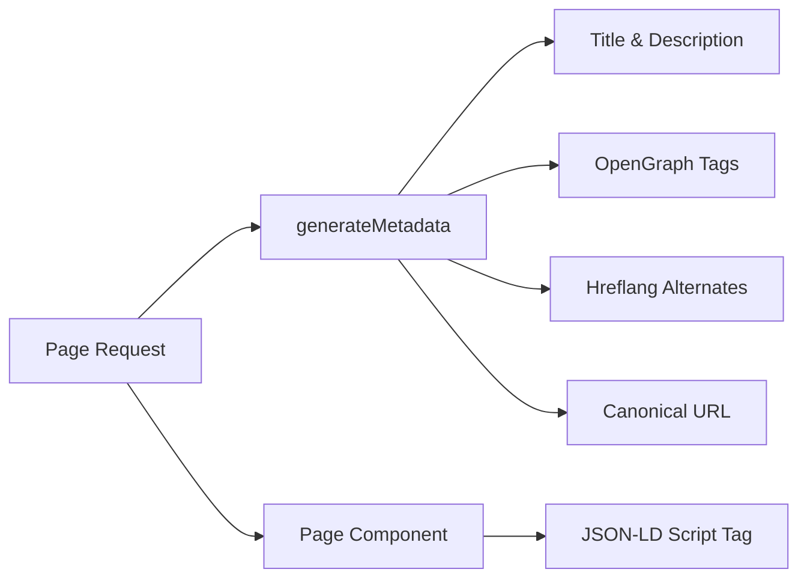

# 搜索引擎优化系统

Ever Works 模板包括一个全面的 SEO 系统，可生成结构化数据 (JSON-LD)、hreflang 标签、OpenGraph 元数据和动态站点地图。所有 SEO 实用程序都位于 `lib/seo/` 下，并与 Next.js 元数据 API 集成。

## 架构概述



### 源文件

|文件|目的|
|---|---|
|`lib/seo/schema.ts`|JSON-LD 结构化数据生成器|
|`lib/seo/hreflang.ts`|语言备用 URL 生成器|
|`lib/seo/listing-metadata.ts`|列表页面元数据工厂|

## JSON-LD 结构化数据

`lib/seo/schema.ts` 模块为搜索引擎丰富的结果生成 Schema.org 结构化数据。

### 产品架构

对于项目详细信息页面，生成 `Product` 架构：

```typescript
import { generateProductSchema } from '@/lib/seo/schema';

const schema = generateProductSchema({
  name: 'My App',
  description: 'A productivity tool',
  image: 'https://example.com/icon.png',
  url: 'https://example.com/items/my-app',
  category: 'Productivity',
  sourceUrl: 'https://myapp.com',
  brandName: 'MyApp Inc.',
});
```

生成的输出：

```json
{
  "@context": "https://schema.org",
  "@type": "Product",
  "name": "My App",
  "description": "A productivity tool",
  "image": "https://example.com/icon.png",
  "url": "https://example.com/items/my-app",
  "category": "Productivity",
  "brand": {
    "@type": "Brand",
    "name": "MyApp Inc."
  },
  "offers": {
    "@type": "Offer",
    "url": "https://myapp.com",
    "availability": "https://schema.org/InStock"
  }
}
```

### 组织架构

生成站点范围的 `Organization` 模式以实现知识面板可见性：

```typescript
import { generateOrganizationSchema } from '@/lib/seo/schema';

const schema = generateOrganizationSchema();
```

该架构包括：
- 品牌名称、URL 和徽标
- 来自 `siteConfig.social` 的社交个人资料链接（`sameAs` 数组）
- 带有电子邮件的联络点（配置后）

### 带有 SearchAction 的网站架构

启用 Google 附加链接搜索框：

```typescript
import { generateWebSiteSchema } from '@/lib/seo/schema';

const schema = generateWebSiteSchema('en');
// Includes potentialAction with SearchAction targeting /?q={search_term_string}
```

该模式尊重区域设置前缀：
- 默认区域设置：`https://example.com`
- 其他语言环境：`https://example.com/fr`

### 面包屑模式

为导航感知搜索结果生成 `BreadcrumbList`：

```typescript
import { generateBreadcrumbSchema } from '@/lib/seo/schema';

const schema = generateBreadcrumbSchema([
  { name: 'Home', url: 'https://example.com' },
  { name: 'Productivity', url: 'https://example.com/categories/productivity' },
  { name: 'My App', url: 'https://example.com/items/my-app' },
]);
```

### 嵌入页面

JSON-LD 使用 `<script>` 标签嵌入到页面组件中：

```tsx
export default function ItemDetailPage({ item }) {
  const schema = generateProductSchema({ ... });

  return (
    <>
      <script
        type="application/ld+json"
        dangerouslySetInnerHTML={{ __html: JSON.stringify(schema) }}
      />
      <ItemDetail item={item} />
    </>
  );
}
```

## 赫尔夫朗标签

`lib/seo/hreflang.ts` 模块为多语言环境 SEO 生成语言备用 URL。

### 网址模式

该模板使用“按需”区域设置前缀模式：

|语言环境|网址模式|
|---|---|
|`en`（默认）|`https://example.com/items/my-app`|
|`fr`|`https://example.com/fr/items/my-app`|
|`es`|`https://example.com/es/items/my-app`|
|`x-default`|与 `en` 相同（默认区域设置）|

### 生成替代品

```typescript
import { generateHreflangAlternates } from '@/lib/seo/hreflang';

// For any page path
const alternates = generateHreflangAlternates('/about');
// Returns: { en: 'https://example.com/about', fr: 'https://example.com/fr/about', ... }

// Convenience functions for common page types
import { generateItemHreflangAlternates } from '@/lib/seo/hreflang';
const itemAlternates = generateItemHreflangAlternates('my-app');

import { generatePageHreflangAlternates } from '@/lib/seo/hreflang';
const pageAlternates = generatePageHreflangAlternates('about');
```

### 与 Next.js 元数据集成

```typescript
export async function generateMetadata({ params }) {
  const { locale, slug } = await params;
  return {
    alternates: {
      canonical: `https://example.com/${locale}/items/${slug}`,
      languages: generateItemHreflangAlternates(slug),
    },
  };
}
```

### 支持的区域设置映射

所有 20 多个语言环境均映射在 `LOCALE_TO_HREFLANG` 中：

```
en -> en, fr -> fr, es -> es, de -> de, zh -> zh,
ar -> ar, he -> he, ru -> ru, uk -> uk, pt -> pt,
it -> it, ja -> ja, ko -> ko, nl -> nl, pl -> pl,
tr -> tr, vi -> vi, th -> th, hi -> hi, id -> id, bg -> bg
```

## 列表页面元数据

`lib/seo/listing-metadata.ts` 模块为列表和类别页面生成完整的`Metadata` 对象。

### 用途

```typescript
import { generateListingMetadata } from '@/lib/seo/listing-metadata';

export async function generateMetadata({ params }) {
  const { locale } = await params;
  return generateListingMetadata({
    title: 'Time Tracking Tools',
    description: 'Browse the best time tracking tools',
    path: '/categories/time-tracking',
    locale,
    itemCount: 42,
    keywords: ['time tracking', 'productivity', 'tools'],
    imageUrl: 'https://example.com/og/time-tracking.png',
  });
}
```

### 生成的元数据结构

该函数生成一个完整的 Next.js `Metadata` 对象：

|领域|来源|
|---|---|
|`title`|`{标题} \|{站点名称}`|
|`description`|自定义或根据标题+项目计数自动生成|
|`keywords`|连接关键字数组|
|`openGraph.type`|`'website'`|
|`openGraph.siteName`|来自`siteConfig.name`|
|`openGraph.url`|带有区域设置的规范 URL|
|`openGraph.images`|可选图像网址|
|`twitter.card`|`'summary_large_image'`|
|`alternates.canonical`|完整规范 URL|
|`alternates.languages`|Hreflang 替代所有语言环境|

## OpenGraph 图像生成

动态 OG 图像是使用 Next.js `ImageResponse` 在两个级别生成的：

|文件|路线|目的|
|---|---|---|
|`app/opengraph-image.tsx`|`/opengraph-image`|全站默认 OG 图片|
|`app/[locale]/items/[slug]/opengraph-image.tsx`|`/items/{slug}/opengraph-image`|每项动态 OG 图像|

这些文件使用 `next/og` 模块在请求时将 React 组件渲染为图像，从而允许动态文本、徽标和品牌。

## 搜索引擎优化清单

添加新页面类型时，请确保以下 SEO 元素就位：

|元素|实施|
|---|---|
|页面标题|`generateMetadata` 带有描述性标题|
|元描述|自定义描述或自动生成|
|规范网址|设置于`alternates.canonical`|
|赫夫朗 标签|使用`generateHreflangAlternates`|
|OpenGraph 标签|通过 `generateListingMetadata` 或手动包含|
|推特卡|将 `twitter.card` 设置为 `summary_large_image`|
|JSON-LD|通过`<script type="application/ld+json">` 添加模式|
|面包屑|对嵌套页面使用 `generateBreadcrumbSchema`|

## 最佳实践

1. **始终设置规范 URL** - 防止跨区域设置出现重复内容问题。
2. **包含所有语言环境的 hreflang** - 即使内容尚未翻译，URL 结构也有助于搜索引擎。
3. **使用描述性的、独特的标题** - 避免通用标题，例如没有网站名称的“主页”。
4. **将描述控制在 160 个字符以内**——较长的描述会在搜索结果中被截断。
5. **在部署之前使用 Google Rich Results Test 工具测试结构化数据**。
6. **动态生成 OG 图像** -- 静态后备图像会错过特定于商品的品牌机会。
