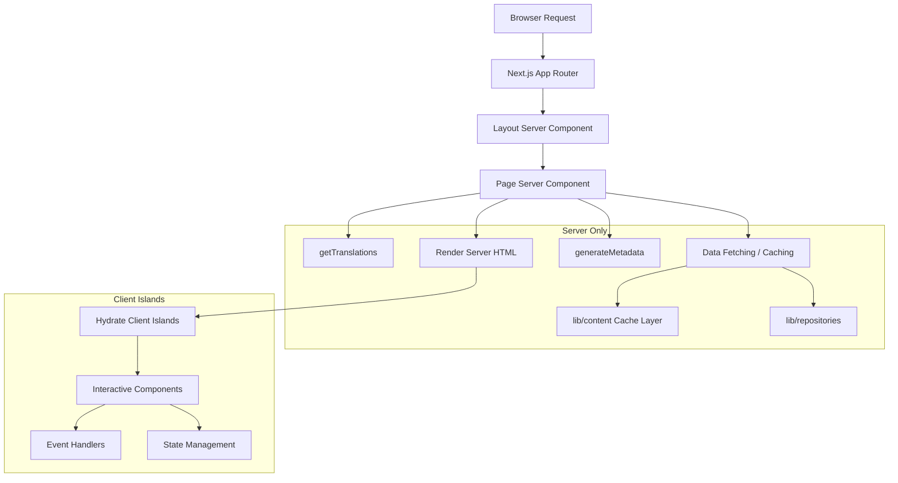

# 服务器组件模式

## 概述

Ever Works 模板利用 React Server Components (RSC) 作为整个 Next.js App Router 的默认渲染策略。服务器组件处理服务器上的数据获取、翻译加载、元数据生成和布局合成，仅将渲染的 HTML 发送到客户端。

## 建筑



## 源文件

|文件|模式展示|
|------|---------------------|
|`template/app/[locale]/about/page.tsx`|数据获取、i18n、元数据、MDX 渲染|
|`template/app/[locale]/layout.tsx`|与区域设置提供者的根布局|
|`template/app/layout.tsx`|全局布局、字体、提供商|
|`template/app/sitemap.ts`|仅服务器路由生成|
|`template/app/robots.ts`|仅服务器配置|

## 核心模式

### 模式 1：使用 i18n 的异步页面组件

每个本地化页面都遵循以下模式：

```typescript
// Server Component -- no "use client" directive
export const revalidate = 3600; // ISR: revalidate every hour

interface PageProps {
    params: Promise<{ locale: string }>;
}

export async function generateMetadata({ params }: PageProps): Promise<Metadata> {
    const { locale } = await params;
    const t = await getTranslations({ locale, namespace: 'footer' });
    return {
        title: t('ABOUT_US'),
        description: t('ABOUT_PAGE_META_DESCRIPTION'),
        alternates: {
            languages: generateHreflangAlternates('/about')
        }
    };
}

export default async function AboutPage({ params }: PageProps) {
    const { locale } = await params;
    const pageData = await getCachedPageContent('about', locale);
    const tCommon = await getTranslations({ locale, namespace: 'common' });

    return (
        <PageContainer>
            <MDX source={pageData?.content || DEFAULT_CONTENT} />
        </PageContainer>
    );
}
```

主要特点：
- `params` 是 `Promise`（Next.js 15+ 应用程序路由器约定）
- 多个 `getTranslations()` 调用不同的命名空间
- 通过 `getCachedPageContent()` 获取缓存内容
- `export const revalidate` 的静态重新验证间隔

### 模式 2：元数据生成

服务器组件在路由级别生成 SEO 元数据：

```typescript
export async function generateMetadata({ params }: PageProps): Promise<Metadata> {
    const { locale } = await params;
    const t = await getTranslations({ locale, namespace: 'pages' });

    return {
        metadataBase: new URL(appUrl),
        title: t('PAGE_TITLE'),
        description: t('PAGE_DESCRIPTION'),
        alternates: {
            languages: generateHreflangAlternates('/path')
        }
    };
}
```

`lib/seo/hreflang.ts` 中的 `generateHreflangAlternates()` 实用程序会自动为所有支持的语言环境生成备用语言链接。

### 模式 3：带有内容缓存的 ISR

```typescript
export const revalidate = 3600; // Revalidate every hour

export default async function Page({ params }: PageProps) {
    const data = await getCachedPageContent('page-name', locale);
    // Render with cached data...
}
```

`getCachedPageContent()` 功能在 `.content/` 中基于 Git 的 CMS 内容上提供服务器端缓存层。与`revalidate` 结合，这将创建一个 ISR（增量静态再生）模式，其中页面静态生成并定期刷新。

### 模式 4：服务器端身份验证检查

受保护的页面使用来自 `lib/auth/guards.ts` 的服务器端防护：

```typescript
import { requireAuth, requireAdmin } from '@/lib/auth/guards';

export default async function ProtectedPage() {
    const session = await requireAuth();
    // session.user is guaranteed to exist here
    return <div>Welcome {session.user.email}</div>;
}

export default async function AdminPage() {
    const session = await requireAdmin();
    // session.user.isAdmin is guaranteed true here
    return <AdminDashboard />;
}
```

这些警卫在内部调用 `auth()` 并使用 `next/navigation` 中的 `redirect()` 将未经身份验证的用户发送到登录页面。重定向发生在服务器端，因此不需要客户端 JavaScript。

### 模式 5：组合服务器和客户端组件

服务器组件将交互委托给客户端组件“岛”：

```typescript
// Server Component (page.tsx)
export default async function Page({ params }: PageProps) {
    const { locale } = await params;
    const data = await fetchData();
    const t = await getTranslations({ locale, namespace: 'page' });

    return (
        <div>
            <h1>{t('TITLE')}</h1>
            {/* Server-rendered static content */}
            <StaticContent data={data} />
            {/* Client island for interactivity */}
            <InteractiveFilter initialData={data} />
        </div>
    );
}
```

数据作为可序列化的 props 从服务器流向客户端。客户端组件接收预取的数据并处理用户交互。

## 数据获取策略

### 直接存储库访问

服务器组件可以直接导入和调用存储库函数：

```typescript
import { getItemBySlug } from '@/lib/repositories/item-repository';

export default async function ItemPage({ params }) {
    const item = await getItemBySlug(params.slug);
    // ...
}
```

### 缓存内容层

对于基于 Git 的 CMS 内容：

```typescript
import { getCachedPageContent } from '@/lib/content';

const pageData = await getCachedPageContent('about', locale);
```

### 外部API调用

`lib/services/`中的服务函数封装了外部API交互：

```typescript
import { triggerManualSync } from '@/lib/services/sync-service';
```

## 流媒体和悬念

服务器组件支持通过 React Suspense 边界进行流式传输。大页面可以显示各个部分的加载状态：

```typescript
import { Suspense } from 'react';

export default async function Page() {
    return (
        <div>
            <Header /> {/* Renders immediately */}
            <Suspense fallback={<LoadingSkeleton />}>
                <SlowDataSection /> {/* Streams when ready */}
            </Suspense>
        </div>
    );
}
```

## 模板中的最佳实践

1. **除非需要，否则没有`"use client"`** -- 组件默认是服务器组件
2. **翻译加载到服务器端** -- `getTranslations()` 仅在服务器上运行
3. **元数据与页面位于同一位置** -- `generateMetadata` 从同一文件导出
4. **航线级别的重新验证** -- `export const revalidate` 控制 ISR 时序
5. **用于身份验证的保护功能** -- 服务器端重定向，无需客户端捆绑成本
6. **道具向下，事件向上**——服务器组件将数据作为道具传递到客户端岛
