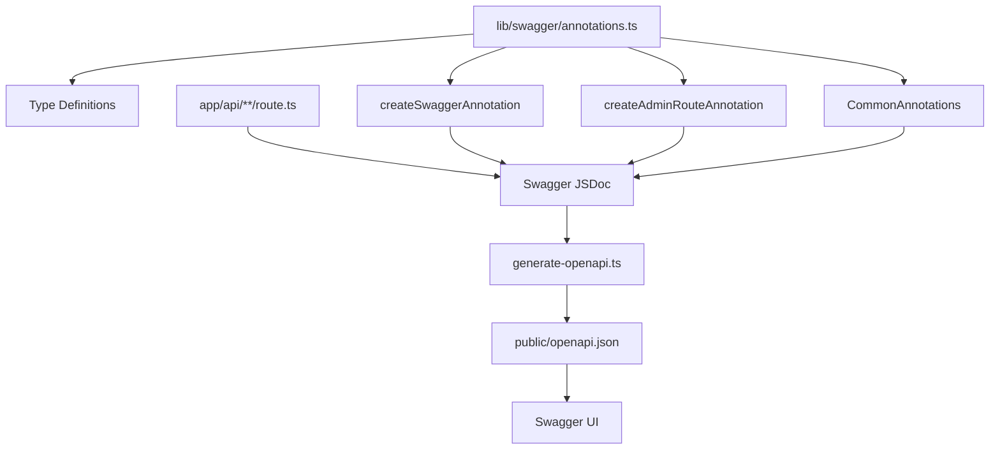
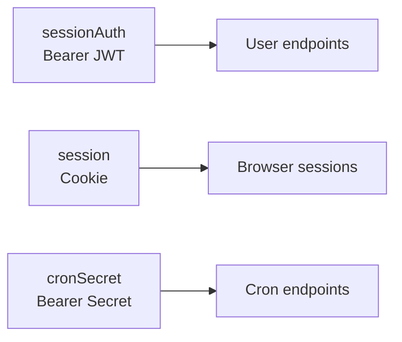

# 招摇系统

The template provides a complete Swagger/OpenAPI documentation system built on `swagger-jsdoc`. It includes annotation helpers in `lib/swagger/annotations.ts` for standardizing API documentation across all route handlers.

## 建筑



## 注释类型系统

The `lib/swagger/annotations.ts` module defines TypeScript interfaces that mirror the OpenAPI 3.0 specification:

### Swagger路由配置

The main configuration object for documenting an API route:

```typescript
interface SwaggerRouteConfig {
  tags: string[];                              // API grouping tags
  summary: string;                             // Brief description
  description: string;                         // Detailed description
  security?: Array<Record<string, string[]>>;  // Security requirements
  parameters?: SwaggerParameter[];             // Query/path/header params
  requestBody?: SwaggerRequestBody;            // Request body schema
  responses: Record<string, SwaggerResponse>;  // Response definitions
}
```

### Swagger参数

Defines query, path, or header parameters:

```typescript
interface SwaggerParameter {
  name: string;
  in: 'query' | 'path' | 'header';
  required?: boolean;
  schema: {
    type: string;
    format?: string;
    minimum?: number;
    maximum?: number;
    default?: any;
    enum?: string[];
  };
  description?: string;
  example?: any;
}
```

### Swagger请求正文

Defines the request body structure:

```typescript
interface SwaggerRequestBody {
  required: boolean;
  content: {
    'application/json': {
      schema: {
        $ref?: string;       // Reference to a component schema
        type?: string;       // Inline type definition
        properties?: Record<string, any>;
      };
      example?: any;
    };
  };
}
```

### 招摇响应

定义响应状态代码及其模式：

```typescript
interface SwaggerResponse {
  description: string;
  content?: {
    'application/json': {
      schema: {
        $ref?: string;
        type?: string;
        properties?: Record<string, any>;
      };
      example?: any;
      examples?: Record<string, any>;
    };
  };
}
```

## 常用注解

The `CommonAnnotations` object provides reusable building blocks:

### 标准错误响应

```typescript
CommonAnnotations.responses.unauthorized
// { description: 'Authentication required', ... }

CommonAnnotations.responses.forbidden
// { description: 'Forbidden - Admin access required', ... }

CommonAnnotations.responses.notFound
// { description: 'Resource not found', ... }

CommonAnnotations.responses.serverError
// { description: 'Internal server error', ... }
```

Each error response includes a standard example:

```json
{
  "success": false,
  "error": "Error message"
}
```

### 分页参数

```typescript
CommonAnnotations.paginationParameters
// [
//   { name: 'page', in: 'query', schema: { type: 'integer', minimum: 1, default: 1 } },
//   { name: 'limit', in: 'query', schema: { type: 'integer', minimum: 1, maximum: 100, default: 10 } }
// ]
```

### 管理安全

```typescript
CommonAnnotations.adminSecurity
// [{ sessionAuth: [] }]
```

## 创建注释

### 创建SwaggerAnnotation()

Generates a complete `@swagger` JSDoc comment string:

```typescript
import { createSwaggerAnnotation, CommonAnnotations } from '@/lib/swagger/annotations';

const annotation = createSwaggerAnnotation('/api/items', 'GET', {
  tags: ['Items'],
  summary: 'List all items',
  description: 'Returns a paginated list of items with filtering support',
  parameters: [
    ...CommonAnnotations.paginationParameters,
    {
      name: 'category',
      in: 'query',
      required: false,
      schema: { type: 'string' },
      description: 'Filter by category',
      example: 'Web Development'
    }
  ],
  responses: {
    '200': {
      description: 'Paginated list of items',
      content: {
        'application/json': {
          schema: { $ref: '#/components/schemas/Pagination' },
          example: {
            items: [{ id: '1', title: 'Sample Item' }],
            pagination: { page: 1, pageSize: 10, total: 50, totalPages: 5 }
          }
        }
      }
    },
    '500': CommonAnnotations.responses.serverError
  }
});
```

### createAdminRouteAnnotation()

Shorthand for admin-protected routes. Automatically adds `sessionAuth` security:

```typescript
import { createAdminRouteAnnotation, CommonAnnotations } from '@/lib/swagger/annotations';

const annotation = createAdminRouteAnnotation('/api/admin/users', 'GET', {
  tags: ['Admin'],
  summary: 'List all users',
  description: 'Returns all registered users with their profiles and roles',
  parameters: CommonAnnotations.paginationParameters,
  responses: {
    '200': {
      description: 'User list with pagination',
      content: {
        'application/json': {
          schema: { type: 'object' },
          example: {
            items: [{ id: '1', email: 'admin@example.com', role: 'admin' }],
            pagination: { page: 1, pageSize: 10, total: 100, totalPages: 10 }
          }
        }
      }
    },
    '401': CommonAnnotations.responses.unauthorized,
    '403': CommonAnnotations.responses.forbidden,
    '500': CommonAnnotations.responses.serverError
  }
});
```

## 编写路线文档

### Direct Annotation Pattern

The most common approach is writing `@swagger` comments directly in route files:

```typescript
// app/api/items/route.ts

/**
 * @swagger
 * /api/items:
 *   get:
 *     tags: ["Items"]
 *     summary: "Get all items"
 *     description: "Returns paginated items list with optional category filter"
 *     parameters:
 *       - name: "page"
 *         in: query
 *         schema:
 *           type: integer
 *           default: 1
 *       - name: "limit"
 *         in: query
 *         schema:
 *           type: integer
 *           default: 10
 *     responses:
 *       200:
 *         description: "Success"
 *       500:
 *         description: "Server error"
 */
export async function GET(request: Request) {
  // implementation
}
```

### POST Route with Request Body

```typescript
/**
 * @swagger
 * /api/items:
 *   post:
 *     tags: ["Items"]
 *     summary: "Create a new item"
 *     security:
 *       - sessionAuth: []
 *     requestBody:
 *       required: true
 *       content:
 *         application/json:
 *           schema:
 *             type: object
 *             properties:
 *               title:
 *                 type: string
 *               description:
 *                 type: string
 *               category:
 *                 type: string
 *           example:
 *             title: "My New Item"
 *             description: "Item description"
 *             category: "Web Development"
 *     responses:
 *       201:
 *         description: "Item created"
 *       400:
 *         description: "Validation error"
 *       401:
 *         description: "Unauthorized"
 */
export async function POST(request: Request) {
  // implementation
}
```

## 标签组织

Organize API routes into logical groups using tags:

|标签|路线|描述|
|---|---|---|
|`Items`|`/api/items/*`|公开项目列表和详细信息|
|`Admin`|`/api/admin/*`|管理仪表板操作|
|`Auth`|`/api/auth/*`|身份验证流程|
|`Profile`|`/api/profile/*`|用户档案管理|
|`Newsletter`|`/api/newsletter/*`|时事通讯订阅|
|`Comments`|`/api/comments/*`|注释CRUD操作|
|`Payments`|`/api/payments/*`|付款处理|
|`Cron`|`/api/cron/*`|预定作业端点|

## 安全方案

OpenAPI 配置中定义了三种安全方案：



### 注释中的用法

```yaml
# JWT Bearer authentication
security:
  - sessionAuth: []

# Cookie-based session
security:
  - session: []

# Cron job secret
security:
  - cronSecret: []
```

## 生成的输出

`generate-openapi.ts` 脚本生成具有以下结构的`public/openapi.json`：

```json
{
  "openapi": "3.0.0",
  "info": { "title": "Ever Works API", "version": "1.0.0" },
  "servers": [{ "url": "/" }],
  "paths": {
    "/api/items": { "get": { ... }, "post": { ... } },
    "/api/admin/users": { "get": { ... } }
  },
  "components": {
    "securitySchemes": { ... },
    "schemas": {
      "ErrorResponse": { ... },
      "PaginationMeta": { ... },
      "Pagination": { ... }
    }
  },
  "tags": [
    { "name": "Items" },
    { "name": "Admin" }
  ]
}
```

## 最佳实践

1. **记录每条公共路线** -- `app/api/` 中的所有路线都应具有 `@swagger` 注释
2. **使用 `$ref` 进行共享模式** -- 引用组件模式而不是重复定义
3. **包括示例** -- 始终为请求和响应正文提供 `example` 值
4. **使用 CommonAnnotations** -- 利用共享的错误响应和分页参数
5. **标签一致** -- 将相关端点分组在同一标签名称下
6. **描述参数** -- 每个参数都包含`description` 和`example`
7. **记录所有状态代码** -- 涵盖成功、验证错误、身份验证错误和服务器错误情况
8. **使注释靠近处理程序** -- 将 `@swagger` 注释直接放在路由处理程序函数上方
