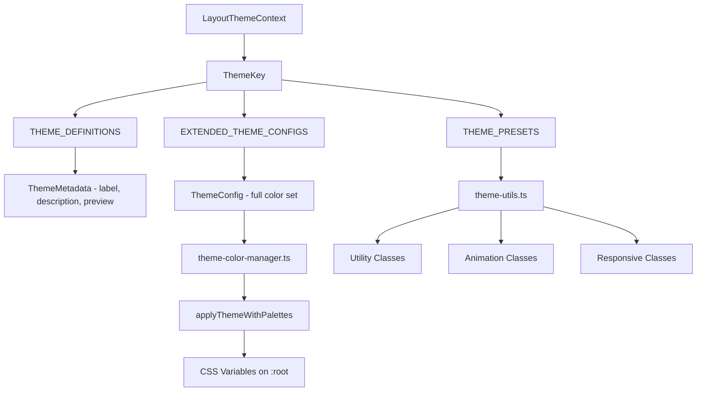
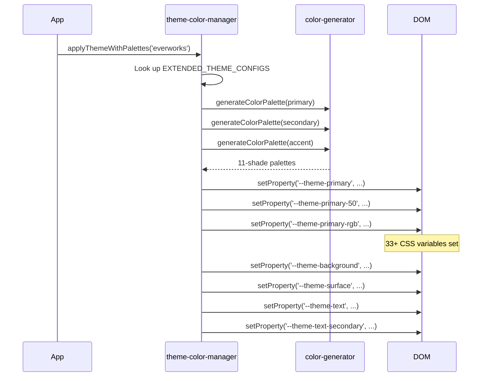

# 主题系统

该模板提供了一个多主题系统，具有四个内置主题。主题控制颜色、CSS 变量、Tailwind 实用程序，并包括主题选择 UI 的预览组件和元数据。

## 架构概述



## 源文件

|文件|目的|
|------|---------|
|`lib/themes.tsx`|主题定义、元数据和预览组件|
|`lib/theme-color-manager.ts`|扩展配置、DOM 应用、CSS 生成|
|`lib/theme-utils.ts`|Tailwind 类实用程序、预设、辅助函数|
|`components/context/LayoutThemeContext`|主题状态的 React 上下文（参考）|

## 可用主题

|主题键|标签|小学|中学|描述|
|-----------|-------|---------|-----------|-------------|
|`everworks`|默认|`#3d70ef`|`#00c853`|蓝绿搭配现代又专业|
|`corporate`|企业|`#00c853`|`#e74c3c`|绿色和红色的专业业务|
|`material`|材质|`#673ab7`|`#ff9800`|紫色和橙色的 Google Material Design|
|`funny`|搞笑|`#ff4081`|`#ffeb3b`|粉色和黄色的搭配俏皮又充满活力|

## 主题配置

每个主题定义七个颜色槽：

```typescript
export interface ThemeConfig {
  primary: string;
  secondary: string;
  accent: string;
  background: string;
  surface: string;
  text: string;
  textSecondary: string;
}
```

### 扩展主题配置

`theme-color-manager.ts` 中的`EXTENDED_THEME_CONFIGS` 提供了完整的颜色定义：

```typescript
export const EXTENDED_THEME_CONFIGS: Record<ThemeKey, ThemeConfig> = {
  everworks: {
    primary: "#3d70ef",
    secondary: "#00c853",
    accent: "#0056b3",
    background: "#ffffff",
    surface: "#f8f9fa",
    text: "#1a1a1a",
    textSecondary: "#6c757d",
  },
  // ... other themes
};
```

## 主题元数据

`themes.tsx`模块提供显示元数据和预览组件：

```typescript
export interface ThemeMetadata {
  readonly key: ThemeKey;
  readonly label: string;
  readonly description: string;
  readonly preview: React.ReactNode;
  readonly config: ThemeConfig;
}
```

### 主题定义

```typescript
export const THEME_DEFINITIONS: Record<ThemeKey, Omit<ThemeMetadata, 'config'>> = {
  everworks: {
    key: "everworks",
    label: "Default",
    description: "Modern and professional theme with blue and green accents",
    preview: ThemePreviews.everworks,
  },
  // ... other themes
};
```

### 预览组件

每个主题都有一个小的视觉预览，呈现为样式化的`div`：

```typescript
export const ThemePreviews: Record<ThemeKey, React.ReactNode> = {
  everworks: (
    <div className="w-12 h-8 bg-[#3d70ef] rounded-sm overflow-hidden relative">
      <div className="absolute inset-0 bg-linear-to-br from-white/10 to-black/10" />
      <div className="absolute bottom-1 left-1 w-2 h-1 bg-white/80 rounded-xs" />
      <div className="absolute top-1 right-1 w-1 h-1 bg-white/60 rounded-full" />
    </div>
  ),
  // ... other previews
};
```

### 元数据查询函数

```typescript
// Get metadata for a single theme
export const getThemeMetadata = (themeKey: ThemeKey, config: ThemeConfig): ThemeMetadata;

// Get metadata for all themes
export const getAllThemeMetadata = (configs: Record<ThemeKey, ThemeConfig>): ThemeMetadata[];
```

## CSS变量应用

应用主题时，颜色管理器会在 `document.documentElement` 上设置 CSS 自定义属性：



### 生成的 CSS 变量

对于每个主题，都会创建以下 CSS 变量：

|可变模式|计数|示例|
|-----------------|-------|---------|
|`--theme-primary-{50-950}`| 11 |`--theme-primary-500: #3d70ef`|
|`--theme-primary-rgb`| 1 |`--theme-primary-rgb: 61, 112, 239`|
|`--theme-secondary-{50-950}`| 11 |`--theme-secondary-500: #00c853`|
|`--theme-accent-{50-950}`| 11 |`--theme-accent-500: #0056b3`|
|`--theme-background`| 1 |`--theme-background: #ffffff`|
|`--theme-surface`| 1 |`--theme-surface: #f8f9fa`|
|`--theme-text`| 1 |`--theme-text: #1a1a1a`|
|`--theme-text-secondary`| 1 |`--theme-text-secondary: #6c757d`|

## Tailwind 实用程序类

预构建的类组合可实现一致的主题使用：

### 按钮变体

```typescript
themeClasses.button.primary   // "bg-theme-primary hover:bg-theme-accent text-white"
themeClasses.button.secondary // "bg-theme-secondary hover:bg-theme-secondary/80 text-white"
themeClasses.button.outline   // "border-2 border-theme-primary text-theme-primary ..."
themeClasses.button.ghost     // "text-theme-primary hover:bg-theme-primary/10"
```

### 动画课程

```typescript
export const animationClasses = {
  fadeIn: "animate-in fade-in duration-200",
  slideIn: "animate-in slide-in-from-top-2 duration-200",
  scaleIn: "animate-in zoom-in-95 duration-200",
  hover: "transition-all duration-200 hover:scale-105",
  press: "transition-all duration-100 active:scale-95",
};
```

### 响应式布局类

```typescript
export const responsiveClasses = {
  container: "container max-w-7xl px-4 sm:px-6 lg:px-8",
  grid: {
    responsive: "grid grid-cols-1 md:grid-cols-2 lg:grid-cols-3 gap-4",
    auto: "grid grid-cols-[repeat(auto-fit,minmax(300px,1fr))] gap-4",
  },
  flex: {
    center: "flex items-center justify-center",
    between: "flex items-center justify-between",
    start: "flex items-center justify-start",
  },
};
```

## 主题意识课堂建设

`buildThemeClasses` 函数组合了基础类、主题类和条件类：

```typescript
import { buildThemeClasses } from '@/lib/theme-utils';

const className = buildThemeClasses(
  'px-4 py-2 rounded',           // Base classes
  'bg-theme-primary text-white',  // Theme classes
  {
    'opacity-50 cursor-not-allowed': isDisabled,
    'ring-2 ring-theme-accent': isFocused,
  }
);
```

## 主题颜色预设

快速访问主题原色/次要颜色：

```typescript
export const THEME_PRESETS = {
  everworks: { primary: "#3d70ef", secondary: "#00c853" },
  corporate: { primary: "#2c3e50", secondary: "#e74c3c" },
  material: { primary: "#673ab7", secondary: "#ff9800" },
  funny: { primary: "#ff4081", secondary: "#ffeb3b" },
} as const;

// Query function
export const getThemeColor = (
  themeKey: ThemeKey,
  colorType: "primary" | "secondary"
) => colorMap[themeKey][colorType];
```

## Tailwind 颜色参考

`theme-utils.ts` 模块还将完整的 Tailwind CSS 颜色值集导出为 `tailwindColors` 对象，涵盖所有 22 个颜色系列（石板色到玫瑰色），色调为 50-950，以及从 5% 到 95% 的 `opacities` 贴图。
