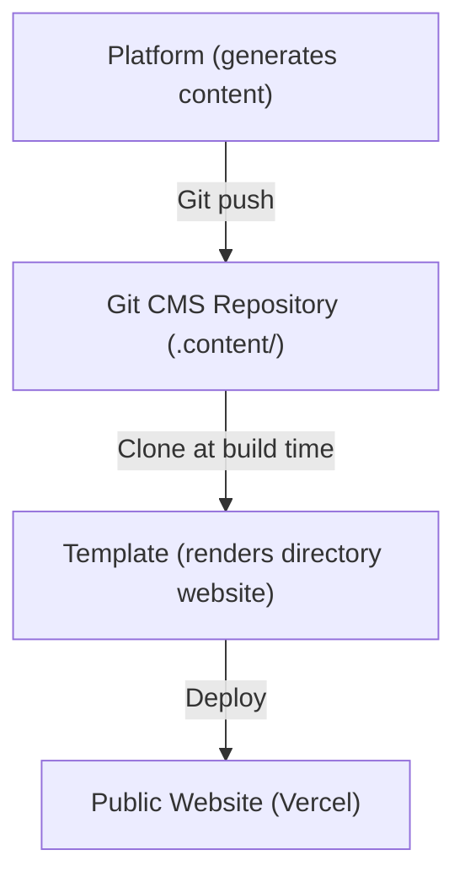
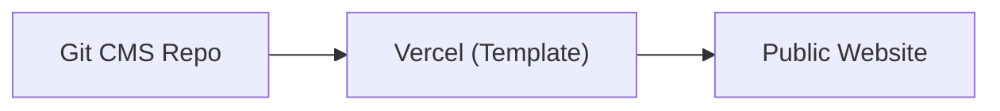
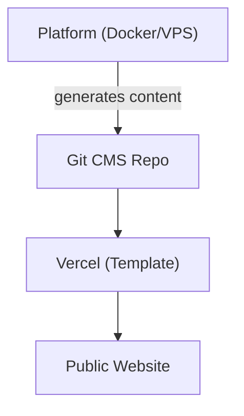
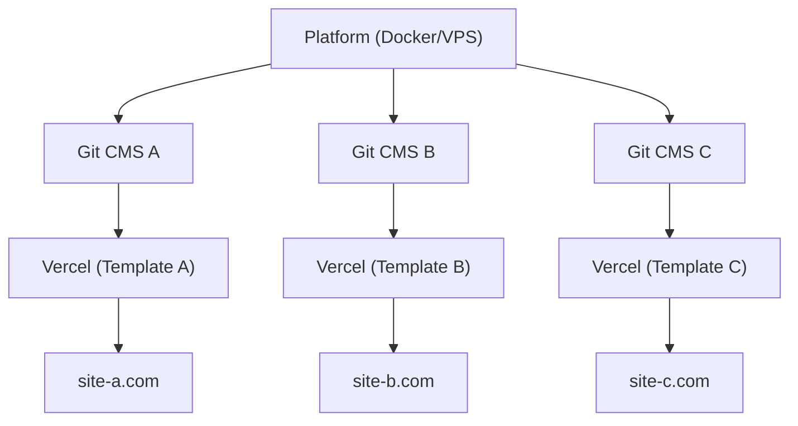

# 平台与模板

Ever Works 由两个主要产品组成，它们服务于不同的目的，但作为统一的生态系统协同工作。本页面说明两者的区别以及何时使用哪个。

## Ever Works 平台

**Ever Works 平台**是用于大规模构建和管理目录网站的后端基础设施。它提供 REST API、AI 驱动的内容生成管道、插件系统和部署编排。

完整的平台文档请访问 [docs.ever.works](https://docs.ever.works)。

## Directory Web Template

**Directory Web Template**（本项目）是一个生产就绪的全栈目录网站，您可以克隆、自定义并作为独立应用程序部署。

### 它的功能

- 提供完整的**目录网站**，包含条目列表、搜索、过滤、分类、标签和集合
- 通过 NextAuth.js v5（含 OAuth 提供商：Google、GitHub、Facebook、Twitter、Microsoft）和 Supabase Auth 提供**身份验证**
- 通过 Stripe、LemonSqueezy 和 Polar 支持**支付**及订阅管理
- 通过 next-intl 提供多语言和 RTL 支持的**国际化**
- 使用**基于 Git 的 CMS** 从 Git 仓库同步目录内容
- 包含带内置主题和动态颜色生成的**主题系统**
- 通过 PostHog 和 Sentry 提供**分析和监控**
- 内置 **SEO 优化**、站点地图生成和结构化数据（JSON-LD）
- 包含带内容管理、用户管理和分析的**管理仪表板**

### 技术栈

- **框架：** Next.js 15、React 19
- **语言：** TypeScript 5
- **ORM：** Drizzle ORM（PostgreSQL）
- **UI：** Tailwind CSS 4、HeroUI React、Radix UI
- **身份验证：** NextAuth.js v5、Supabase Auth
- **支付：** Stripe、LemonSqueezy、Polar
- **测试：** Playwright（E2E）
- **部署：** Vercel（主要）、Docker（备选）

## 并排对比

| 维度             | 平台                                       | 模板                                   |
| ---------------- | ------------------------------------------ | -------------------------------------- |
| **用途**         | 后端基础设施和 AI 管道                       | 前端目录网站                           |
| **架构**         | Monorepo（Turborepo + pnpm）                | 独立 Next.js 应用                      |
| **后端**         | NestJS 11 API                              | Next.js API 路由                       |
| **数据库 ORM**   | TypeORM                                    | Drizzle ORM                            |
| **身份验证**     | JWT + OAuth（NestJS Guards）                | NextAuth.js v5 + Supabase Auth         |
| **支付**         | 不包含                                     | Stripe、LemonSqueezy、Polar            |
| **AI 功能**      | LangChain 代理、7 个 LLM 提供商             | 无（消费 AI 生成的内容）               |
| **内容**         | 通过 AI 管道生成内容                         | 从基于 Git 的 CMS 读取内容             |
| **部署**         | Docker 在任何 VPS 上                        | Vercel（或 Docker）                    |
| **测试**         | Jest + Vitest                              | Playwright                             |
| **受众**         | 平台运营商、AI 开发人员                      | 网站构建者、目录创建者                  |

## 它们如何连接

平台和模板通过**基于 Git 的 CMS** 模式协同工作：

### 独立运行

- **无平台的模板：** 通过编辑 Git CMS 仓库中的 YAML 和 Markdown 文件手动维护目录内容。模板可作为完全功能的目录网站独立运行，无需 AI 生成。
- **无模板的平台：** 使用平台 API 生成目录数据并将其导出到任何前端。

## 何时使用哪个

### 使用模板，当...

- 您想以最小的后端设置快速启动目录网站
- 您的目录内容是手动整理的或来自静态数据源
- 您需要一个开箱即用、带身份验证、支付和 SEO 的生产就绪网站
- 您希望在 Vercel 上部署而无需服务器管理

### 使用平台，当...

- 您需要为大型目录提供 AI 驱动的内容生成
- 您需要自动化管道来发现、丰富和更新目录条目
- 您需要从单个后端管理多个目录
- 您想使用插件系统进行自定义集成

### 同时使用两者，当...

- 您希望 AI 生成的内容流入生产网站
- 您正在基于 Ever Works 构建 SaaS 产品
- 您需要自动化内容生成和精美的前端

## 部署架构

### 仅模板（最简单）

通过 Git 手动管理内容。单个 Vercel 部署。

### 平台 + 模板（全栈）

通过平台自动生成内容。通过 Git 连接。

### 平台 + 多个模板

单个平台实例管理多个目录网站。
