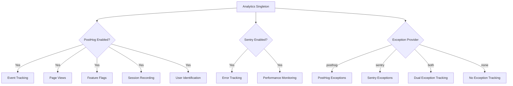
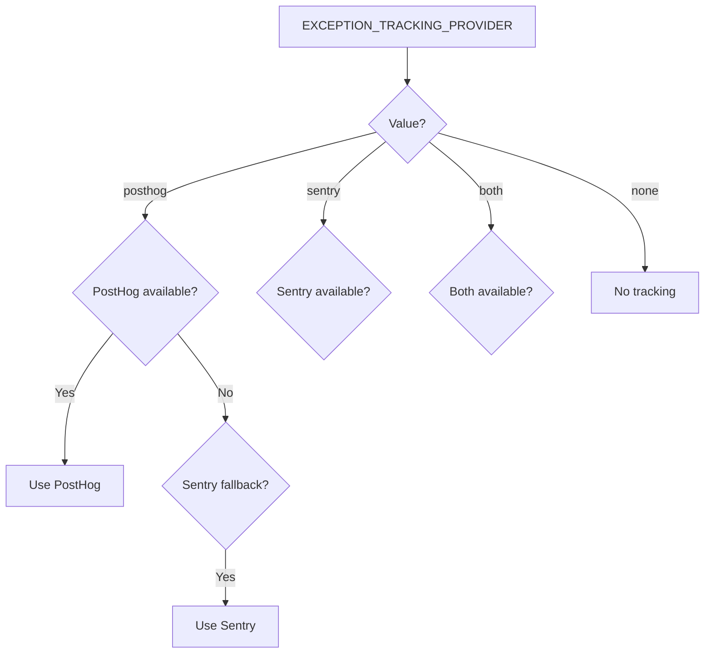

# 分析配置

本模板提供了统一的分析系统，集成了用于产品分析的 PostHog 和用于错误追踪的 Sentry。两个提供商均通过单例 `Analytics` 类管理，并具有自动降级行为。

## 架构



## 环境变量

### PostHog 配置

| 变量 | 必填 | 默认 | 描述 |
|---|---|---|---|
| `NEXT_PUBLIC_POSTHOG_KEY` | 是（用于分析） | -- | PostHog 项目 API 密钥 |
| `NEXT_PUBLIC_POSTHOG_HOST` | 是（用于分析） | -- | PostHog 实例 URL |
| `POSTHOG_DEBUG` | 否 | `false` | 启用调试日志 |
| `POSTHOG_SESSION_RECORDING_ENABLED` | 否 | `true` | 启用会话录制 |
| `POSTHOG_AUTO_CAPTURE` | 否 | `false` | 自动捕获页面浏览 |
| `POSTHOG_EXCEPTION_TRACKING` | 否 | `true` | 启用 PostHog 异常追踪 |

### Sentry 配置

| 变量 | 必填 | 默认 | 描述 |
|---|---|---|---|
| `NEXT_PUBLIC_SENTRY_DSN` | 是（用于错误） | -- | Sentry 数据源名称 |
| `SENTRY_ENABLE_DEV` | 否 | `false` | 在开发环境中启用 Sentry |
| `SENTRY_DEBUG` | 否 | `false` | 启用 Sentry 调试模式 |
| `SENTRY_EXCEPTION_TRACKING` | 否 | `true` | 启用 Sentry 异常追踪 |

### 统一异常追踪

| 变量 | 必填 | 默认 | 描述 |
|---|---|---|---|
| `EXCEPTION_TRACKING_PROVIDER` | 否 | `both` | 使用的提供商：`posthog`、`sentry`、`both` 或 `none` |

## PostHog 设置

### 第一步：获取凭据

1. 在 [posthog.com](https://posthog.com) 注册或自托管 PostHog
2. 创建一个项目
3. 复制项目 API 密钥和主机 URL

### 第二步：配置环境

```env
NEXT_PUBLIC_POSTHOG_KEY=phc_your_project_key_here
NEXT_PUBLIC_POSTHOG_HOST=https://app.posthog.com
```

当同时设置了 `NEXT_PUBLIC_POSTHOG_KEY` 和 `NEXT_PUBLIC_POSTHOG_HOST` 时，PostHog 将自动启用。

### 第三步：采样率

采样率会根据环境自动调整：

| 环境 | 事件采样率 | 会话录制采样率 |
|---|---|---|
| 生产环境 | 10%（`0.1`） | 10%（`0.1`） |
| 开发环境 | 100%（`1.0`） | 100%（`1.0`） |

## Sentry 设置

### 第一步：获取 DSN

1. 在 [sentry.io](https://sentry.io) 创建项目
2. 从项目设置中复制 DSN

### 第二步：配置环境

```env
NEXT_PUBLIC_SENTRY_DSN=https://examplePublicKey@o0.ingest.sentry.io/0
SENTRY_ENABLE_DEV=true  # 可选：在开发环境中启用
```

在生产环境中，设置 DSN 后 Sentry 会自动启用。开发环境需显式设置 `SENTRY_ENABLE_DEV=true`。

## Analytics 类 API

`Analytics` 类是可在整个应用程序中访问的单例：

```typescript
import { analytics } from '@/lib/analytics';
```

### 初始化

```typescript
// 初始化分析（在应用根部调用一次）
analytics.init();
```

`init()` 方法仅限客户端使用，在服务端上下文中调用是安全的（会直接跳过）。

### 事件追踪

```typescript
// 追踪自定义事件
analytics.track('button_clicked', {
  buttonName: 'signup',
  page: '/landing'
});

// 追踪页面浏览
analytics.trackPageView('/dashboard', {
  referrer: document.referrer
});
```

### 用户识别

```typescript
// 识别用户（登录后）
analytics.identify('user-123', {
  email: 'user@example.com',
  plan: 'premium',
  company: 'Acme Inc.'
});

// 重置身份（注销后）
analytics.reset();

// 设置持久用户属性
analytics.setUserProperties({
  subscription_tier: 'premium',
  signup_date: '2024-01-15'
});

// 设置超级属性（随每个事件发送）
analytics.setSuperProperties({
  app_version: '2.0.0',
  platform: 'web'
});
```

### 功能标记

```typescript
// 检查功能标记是否启用
const isEnabled = analytics.isFeatureEnabled('new-dashboard', false);

// 从服务器重新加载功能标记
await analytics.reloadFeatureFlags();
```

### 异常追踪

```typescript
// 捕获异常（路由到配置的提供商）
analytics.captureException(error, {
  component: 'PaymentForm',
  action: 'submit'
});

// 使用字符串消息捕获
analytics.captureException('Payment processing failed', {
  orderId: 'ord-123'
});
```

## 异常追踪提供商选择


