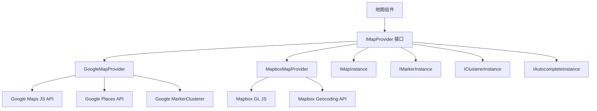

# 地图配置

该模板包含一个提供者无关的地图系统，同时支持 Google Maps 和 Mapbox GL JS。共享接口层允许在不修改组件代码的情况下切换提供者。

## 架构



## 提供者选择

地图提供者根据已配置的 API 密钥确定：

| 提供者 | 所需环境变量 |
|---|---|
| Google Maps | `NEXT_PUBLIC_GOOGLE_MAPS_API_KEY` |
| Mapbox | `NEXT_PUBLIC_MAPBOX_ACCESS_TOKEN` |

如果两者均已配置，则通过应用程序的地图配置设置来选择提供者。

## Google Maps 设置

### 步骤 1：获取 API 密钥

1. 前往 [Google Cloud Console](https://console.cloud.google.com)
2. 启用以下 API：
   - Maps JavaScript API
   - Places API
   - Geocoding API
3. 创建带有 HTTP 来源限制的 API 密钥

### 步骤 2：配置环境

```env
NEXT_PUBLIC_GOOGLE_MAPS_API_KEY=AIzaSy...your-api-key
NEXT_PUBLIC_GOOGLE_MAPS_MAP_ID=your-map-id        # 可选：用于样式化地图
```

**必需的 API 密钥限制：**
- 应用限制：HTTP 来源
- 添加您的域名模式（例如 `https://yourdomain.com/*`）
- API 限制：限制在 Maps JavaScript、Places 和 Geocoding API

## Mapbox 设置

### 步骤 1：获取访问令牌

1. 在 [mapbox.com](https://www.mapbox.com) 注册
2. 复制您的公共访问令牌（以 `pk.` 开头）

### 步骤 2：配置环境

```env
NEXT_PUBLIC_MAPBOX_ACCESS_TOKEN=pk.eyJ1Ijoi...your-token
```

**必需的令牌限制：**
- 使用**公共**令牌（前缀 `pk.`）
- 为您的域名添加 URL 限制
- 切勿在客户端代码中使用密钥令牌（`sk.*`）

## 提供者接口

两个提供者均实现具有相同功能的 `IMapProvider` 接口：

### IMapProvider 方法

| 方法 | 描述 |
|---|---|
| `isLoaded()` | 检查提供者脚本是否已加载 |
| `loadScript()` | 加载提供者库（幂等） |
| `createMap(container, options)` | 在 DOM 元素中创建地图实例 |
| `createMarker(map, options)` | 向地图添加标记 |
| `createClusterer(map, options, onClick)` | 将附近标记组合成聚类 |
| `createAutocomplete(input, onSelect)` | 为输入框附加地址自动补全 |
| `getStyleUrl(style)` | 获取街道视图或卫星视图的样式 URL |
| `isConfigured()` | 检查 API 密钥是否存在 |

### 地图样式

| 样式 | Google Maps | Mapbox |
|---|---|---|
| `streets` | `roadmap` | `mapbox://styles/mapbox/streets-v12` |
| `satellite` | `satellite` | `mapbox://styles/mapbox/satellite-streets-v12` |

## 类型系统

```typescript
interface Coordinates {
  latitude: number;
  longitude: number;
}

interface MapBounds {
  north: number;
  south: number;
  east: number;
  west: number;
}

interface MapViewport {
  center: Coordinates;
  zoom: number;
  bounds?: MapBounds;
}

interface MapMarkerData {
  id: string;
  coordinates: Coordinates;
  title: string;
  icon?: string;
  category?: string;
  slug: string;
  description?: string;
}

interface ClusterOptions {
  radius?: number;     // 聚类半径（像素，默认：60）
  maxZoom?: number;    // 聚类最大缩放级别（默认：16）
  minZoom?: number;    // 聚类最小缩放级别（默认：0）
  minPoints?: number;  // 形成聚类的最少点数（默认：2）
}

interface MapEventHandlers {
  onMarkerClick?: (marker: MapMarkerData) => void;
  onClusterClick?: (cluster: MapClusterData) => void;
  onViewportChange?: (viewport: MapViewport) => void;
  onMapReady?: () => void;
  onMapError?: (error: Error) => void;
}
```

## 地图组件属性

| 属性 | 类型 | 默认 | 描述 |
|---|---|---|---|
| `markers` | `MapMarkerData[]` | `[]` | 要显示的标记 |
| `center` | `Coordinates` | -- | 初始中心位置 |
| `zoom` | `number` | -- | 初始缩放级别（1-20） |
| `style` | `MapStyle` | `streets` | 地图样式（streets/satellite） |
