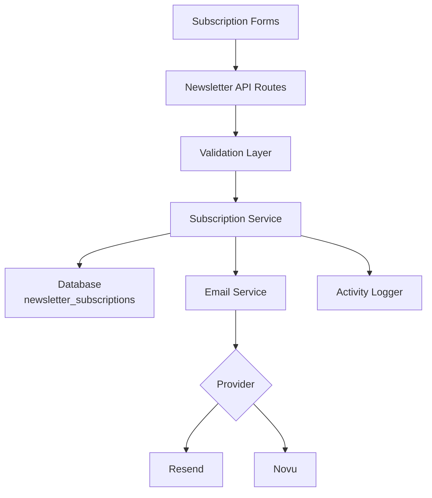
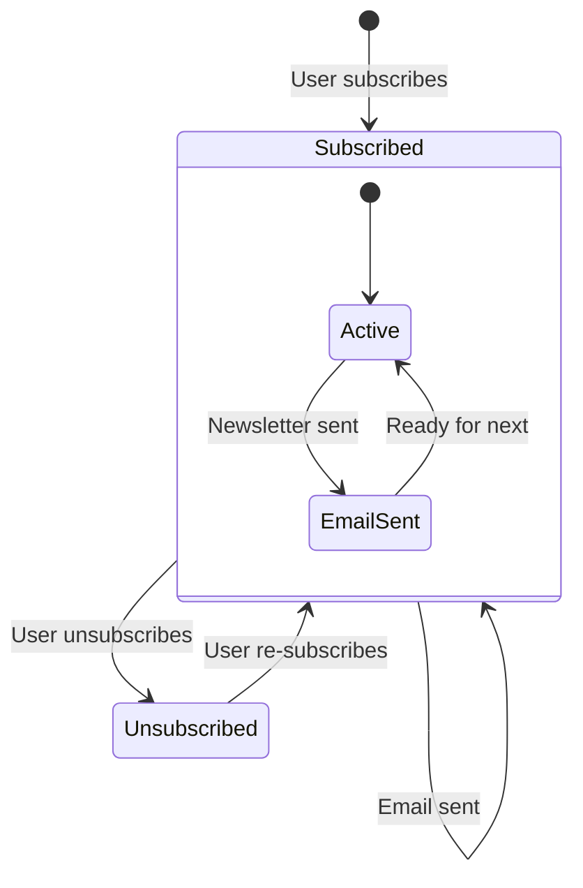

# 邮件订阅配置

该模板包含完整的邮件订阅系统，支持邮件服务商集成、验证、订阅生命周期管理和活动日志记录。配置集中在 `lib/newsletter/` 中。

## 架构



## 文件结构

```
lib/newsletter/
├── config.ts    # Configuration, types, validation schemas
└── utils.ts     # Email sending, subscription validation, logging
```

## 配置常量

`config.ts` 中的 `NEWSLETTER_CONFIG` 对象定义了所有默认值和消息：

```typescript
export const NEWSLETTER_CONFIG = {
  DEFAULT_PROVIDER: "resend",
  DEFAULT_FROM: "onboarding@resend.dev",
  DEFAULT_COMPANY_NAME: "Ever Works",

  SOURCES: {
    FOOTER: "footer",
    POPUP: "popup",
    SIGNUP: "signup",
  },

  ERRORS: {
    INVALID_EMAIL: "Please enter a valid email address",
    ALREADY_SUBSCRIBED: "Email is already subscribed to the newsletter",
    NOT_SUBSCRIBED: "Email is not subscribed to the newsletter",
    SUBSCRIPTION_FAILED: "Failed to create subscription. Please try again.",
    UNSUBSCRIPTION_FAILED: "Failed to unsubscribe. Please try again.",
    EMAIL_SEND_FAILED: "Failed to send email. Please try again.",
    STATS_FAILED: "Failed to get newsletter statistics",
  },

  SUCCESS: {
    SUBSCRIBED: "Successfully subscribed to newsletter",
    UNSUBSCRIBED: "Successfully unsubscribed from newsletter",
  },
};
```

## 邮件服务商设置

### Resend（默认）

```env
RESEND_API_KEY=re_your_api_key_here
```

1. 在 [resend.com](https://resend.com) 注册
2. 创建 API 密钥
3. 验证发送域名（或使用 `onboarding@resend.dev` 进行测试）

### Novu

```env
NOVU_API_KEY=your_novu_api_key
```

对于 Novu，可在站点配置中进行额外配置：

```yaml
mail:
  provider: "novu"
  template_id: "your-template-id"
  backend_url: "https://api.novu.co"
```

## 邮件配置

`createEmailConfig()` 函数从应用程序配置中构建邮件配置：

```typescript
interface EmailConfig {
  provider: string;      // "resend" or "novu"
  defaultFrom: string;   // Sender email address
  domain: string;        // Application domain URL
  apiKeys: {
    resend: string;
    novu: string;
  };
  novu?: {
    templateId?: string;
    backendUrl?: string;
  };
}
```

配置优先级：

| 设置项       | 来源                           | 回退值                     |
|---|---|---|
| 服务商       | `config.mail.provider`         | `"resend"`                 |
| 发件人地址   | `config.mail.default_from`     | `"onboarding@resend.dev"`  |
| 域名         | `config.app_url`               | `coreConfig.APP_URL`       |
| Resend 密钥  | 环境变量 `RESEND_API_KEY`      | 空字符串                   |
| Novu 密钥    | 环境变量 `NOVU_API_KEY`       | 空字符串                   |

## 验证模式

邮件订阅系统使用 Zod 模式进行输入验证：

### 邮件模式

```typescript
const emailSchema = z.object({
  email: z
    .string()
    .email("Please enter a valid email address")
    .transform((email) => email.toLowerCase().trim()),
});
```

### 订阅模式

```typescript
const newsletterSubscriptionSchema = z.object({
  email: z
    .string()
    .email("Please enter a valid email address")
    .transform((email) => email.toLowerCase().trim()),
  source: z
    .enum(["footer", "popup", "signup"])
    .default("footer"),
});
```

## 订阅来源

追踪订阅的来源：

| 来源     | 描述                         |
|---|---|
| `footer` | 网站页脚的订阅表单            |
| `popup`  | 邮件订阅弹窗/模态框           |
| `signup` | 账户注册流程                  |

## 邮件订阅工具

### 发送邮件

```typescript
import { sendEmailSafely, createEmailService } from '@/lib/newsletter/utils';

// Create email service
const { service, config } = await createEmailService();

// Send email with error handling
const result = await sendEmailSafely(
  service,
  config,
  {
    subject: "Welcome to our newsletter!",
    html: "<h1>Welcome!</h1>",
    text: "Welcome!"
  },
  "user@example.com",
  "welcome"
);

if (!result.success) {
  console.error(result.error);
}
```

### 订阅验证

```typescript
import { canSubscribe, canUnsubscribe } from '@/lib/newsletter/utils';

// Check if email can be subscribed
const { canSubscribe: allowed, error } = await canSubscribe("user@example.com");
if (!allowed) {
  // Email is already subscribed
}

// Check if email can be unsubscribed
const { canUnsubscribe: allowed, error } = await canUnsubscribe("user@example.com");
if (!allowed) {
  // Email is not currently subscribed
}
```

### 活动日志记录

```typescript
import { logNewsletterActivity, trackNewsletterMetric } from '@/lib/newsletter/utils';

// Log newsletter activity
logNewsletterActivity("subscribe", "user@example.com", "footer", {
  ip: "192.168.1.1"
});

// Track newsletter metrics
trackNewsletterMetric("subscription", "user@example.com", "popup");
```

活动类型：

| 操作           | 记录时机                             |
|---|---|
| `subscribe`    | 用户订阅邮件通讯                     |
| `unsubscribe`  | 用户取消订阅                         |
| `email_sent`   | 邮件通讯发送成功                     |
| `email_failed` | 邮件通讯发送失败                     |

### 模板工具

```typescript
import { getTemplateWithCompany } from '@/lib/newsletter/utils';

// Generate email template with company name
const template = await getTemplateWithCompany(
  (email, companyName) => ({
    subject: `Welcome to ${companyName}`,
    html: `<p>Thanks for subscribing, ${email}!</p>`,
    text: `Thanks for subscribing, ${email}!`
  }),
  "user@example.com"
);
```

### 响应辅助函数

```typescript
import { createErrorResponse, createSuccessResponse } from '@/lib/newsletter/utils';

// Standardized error response
const error = createErrorResponse(
  "Subscription failed",
  "user@example.com",
  "subscribe"
);
// { error: "Subscription failed", email: "user@example.com", context: "subscribe" }

// Standardized success response
const success = createSuccessResponse("user@example.com", "subscribe");
// { success: true, email: "user@example.com", context: "subscribe" }
```

## 数据库结构

邮件订阅存储在 `newsletter_subscriptions` 表中：

| 列名             | 类型      | 描述                                     |
|---|---|---|
| `id`             | UUID      | 主键                                     |
| `email`          | String    | 订阅者邮箱（唯一）                        |
| `isActive`       | Boolean   | 当前订阅状态                              |
| `subscribedAt`   | Timestamp | 订阅开始时间                              |
| `unsubscribedAt` | Timestamp | 取消订阅时间（可为空）                    |
| `lastEmailSent`  | Timestamp | 最后一次向订阅者发送邮件的时间            |
| `source`         | String    | 订阅来源（footer、popup、signup）         |

## 订阅生命周期



## 类型

```typescript
type NewsletterSource = "footer" | "popup" | "signup";

interface NewsletterActionResult {
  success?: boolean;
  error?: string;
  email?: string;
}

interface NewsletterStats {
  totalActive: number;
  recentSubscriptions: number;
}
```

## 安全性

- 邮件地址在存储前被规范化为小写并去除首尾空格
- 邮件验证使用安全的正则表达式，可防止 ReDoS 攻击（来自 `lib/utils/email-validation.ts`）
- `sendEmailSafely` 函数将所有邮件操作包裹在 try-catch 块中
- API 密钥永远不会暴露给客户端 —— 所有邮件操作均在服务器端执行

## 故障排除

| 问题                         | 解决方案                                                           |
|---|---|
| 邮件未发送                   | 验证 `RESEND_API_KEY` 或 `NOVU_API_KEY` 是否已设置                 |
| "已订阅"错误                 | 检查 `newsletter_subscriptions` 表中是否存在活跃记录               |
| 发件人地址错误               | 在站点配置中更新 `mail.default_from`                               |
| 模板未加载                   | 确保 `getCompanyName()` 可以访问站点配置                           |
| 来源未被追踪                 | 在订阅请求中传递 `source` 参数                                     |
