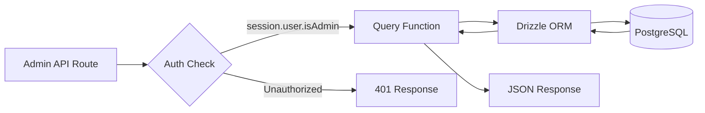
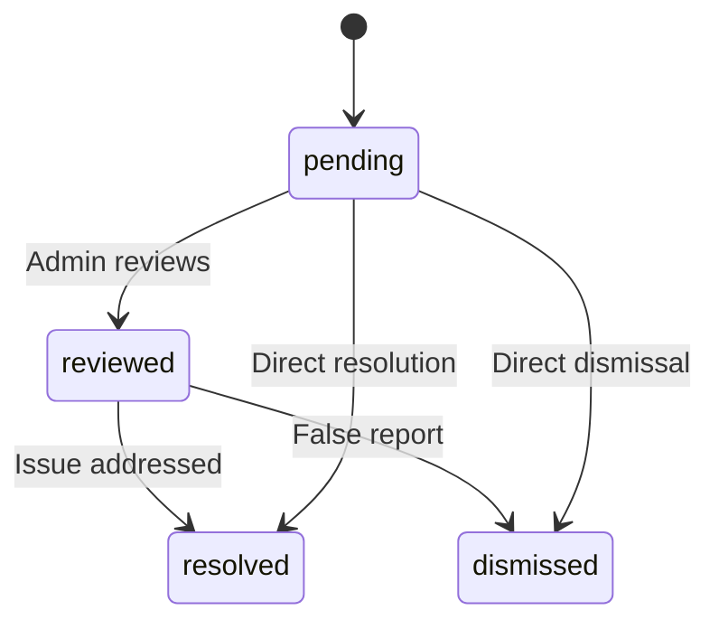

# 管理数据库查询

管理查询处理项目管理、用户/客户端管理、基于角色的访问、仪表板统计、报告审核和设置。这些函数主要由 `app/api/admin/` 下的 API 路由使用。

## 管理查询流程



## 用户管理 (`user.queries.ts`)

### 核心功能

|功能|参数|退货|描述|
|----------|-----------|---------|-------------|
|`getUserByEmail`|`email: string`|`用户\|空`|通过电子邮件地址查找用户|
|`getUserById`|`id: string`|`用户\|空`|通过主键查找用户|
|`insertNewUser`|`user: NewUser`|`User[]`|创建新的用户记录|
|`updateUserPassword`|`hash, userId`|`void`|更新密码哈希|
|`updateUserVerification`|`email, verified`|`void`|设置电子邮件验证状态|
|`softDeleteUser`|`userId: string`|`void`|软删除（将 `-deleted` 附加到电子邮件）|
|`isUserAdmin`|`userId: string`|`boolean`|通过加入检查管理员角色|

### 管理员角色检查

`isUserAdmin` 函数执行多表连接来验证管理员状态：

```typescript
export async function isUserAdmin(userId: string): Promise<boolean> {
  const result = await db
    .select({ isAdmin: roles.isAdmin })
    .from(userRoles)
    .innerJoin(roles, eq(userRoles.roleId, roles.id))
    .where(and(
      eq(userRoles.userId, userId),
      eq(roles.isAdmin, true),
      eq(roles.status, 'active')
    ))
    .limit(1);

  return result.length > 0;
}
```

### 软删除模式

用户永远不会被物理删除。软删除将用户 ID 与电子邮件连接起来，以释放电子邮件地址以供重新注册：

```typescript
export async function softDeleteUser(userId: string) {
  return db
    .update(users)
    .set({
      deletedAt: sql`CURRENT_TIMESTAMP`,
      email: sql`CONCAT(email, '-', id, '-deleted')`
    })
    .where(eq(users.id, userId));
}
```

## 客户管理 (`client.queries.ts`)

### 配置文件增删改查

|功能|描述|
|----------|-------------|
|`createClientProfile(data)`|使用自动生成的唯一用户名创建个人资料|
|`getClientProfileById(id)`|通过个人资料 ID 检索|
|`getClientProfileByUserId(userId)`|通过用户参考检索|
|`getClientProfileByEmail(email)`|通过帐户表查找检索|
|`updateClientProfile(id, data)`|带时间戳的部分更新|
|`deleteClientProfile(id)`|硬删除个人资料记录|

### 管理仪表板数据

`getAdminDashboardData` 函数针对管理仪表板进行了优化，以最少的查询次数返回分页的客户列表和全面的统计信息：

```typescript
export async function getAdminDashboardData(params: {
  page: number;
  limit: number;
  search?: string;
  status?: string;
  plan?: string;
  accountType?: string;
  provider?: string;
  createdAfter?: Date;
  createdBefore?: Date;
}): Promise<{
  clients: ClientProfileWithAuth[];
  stats: { overview, byProvider, byPlan, byAccountType, activity, growth };
  pagination: { page, totalPages, total, limit };
}>
```

该函数使用 LEFT JOIN + IS NULL 模式从客户端列表中排除管理员用户：

```typescript
// Exclude admin users from client listing
.leftJoin(userRoles, eq(userRoles.userId, clientProfiles.userId))
.leftJoin(roles, and(eq(userRoles.roleId, roles.id), eq(roles.isAdmin, true)))
.where(isNull(roles.id))  // Only non-admin users
```

### 高级客户搜索

`advancedClientSearch`支持复杂的多标准过滤：

|过滤器类别|参数|
|----------------|------------|
|**文字搜索**|`search`（姓名、电子邮件、用户名、公司、简历、职务、行业、地点）|
|**枚举过滤器**|`status`、`plan`、`accountType`、`provider`|
|**日期范围**|`createdAfter`、`createdBefore`、`updatedAfter`、`updatedBefore`、`dateRange`|
|**特定领域**|`emailDomain`、`companySearch`、`locationSearch`、`industrySearch`|
|**数字**|`minSubmissions`、`maxSubmissions`|
|**布尔值**|`hasAvatar`、`hasWebsite`、`hasPhone`、`emailVerified`、`twoFactorEnabled`|
|**排序**|`sortBy`（创建时间、更新时间、姓名、电子邮件、公司、提交总数）、`sortOrder`|

### 客户统计

`getEnhancedClientStats` 返回全面的细分：

```typescript
{
  overview: { total, active, inactive, suspended, trial },
  byProvider: { credentials, google, github, facebook, twitter, linkedin, other },
  byPlan: { free: number, standard: number, premium: number },
  byAccountType: { individual, business, enterprise },
  activity: { newThisWeek, newThisMonth, activeThisWeek, activeThisMonth },
  growth: { weeklyGrowth, monthlyGrowth },
}
```

## 报告管理 (`report.queries.ts`)

### 报告增删改查

|功能|描述|
|----------|-------------|
|`createReport(data)`|创建内容报告（项目或评论）|
|`getReportById(id)`|获取包含记者和审阅者详细信息的报告|
|`getReports(params)`|带过滤器的分页报告列表|
|`updateReport(id, data)`|更新状态、解决方案、添加审核注释|
|`getReportStats()`|按状态、内容类型、原因进行统计|
|`hasUserReportedContent(reportedBy, contentType, contentId)`|重复报告检查|

### 报告状态流程



### 报告过滤

报告支持按状态、内容类型（项目/评论）和原因（垃圾邮件、骚扰、不当、其他）进行过滤：

```typescript
export async function getReports(params: {
  page?: number;
  limit?: number;
  search?: string;
  status?: ReportStatusValues;
  contentType?: ReportContentTypeValues;
  reason?: ReportReasonValues;
}): Promise<{
  reports: ReportWithReporter[];
  total: number;
  page: number;
  totalPages: number;
  limit: number;
}>
```

## 仪表板统计 (`dashboard.queries.ts`)

### 可用指标

|功能|目的|用于|
|----------|---------|---------|
|`getVotesReceivedCount(itemSlugs)`|项目总票数|仪表板摘要|
|`getCommentsReceivedCount(itemSlugs)`|项目总评论数|仪表板摘要|
|`getUniqueItemsInteractedCount(clientId)`|用户参与过的项目|活动面板|
|`getUserTotalActivityCount(clientId)`|总投票数+用户评论|活动面板|
|`getWeeklyEngagementData(itemSlugs, weeks)`|每周投票/评论图表|参与度图表|
|`getDailyActivityData(clientId, itemSlugs, days)`|每日活动细目|活动图|
|`getTopItemsEngagement(itemSlugs, limit)`|按参与度排名最高的商品|热门项目面板|

### 每周参与度数据

返回按 ISO 周聚合的参与度数据，匹配 PostgreSQL 的 `to_char(date, 'IYYY-IW')` 格式：

```typescript
const weeklyVotes = await db
  .select({
    week: sql<string>`to_char(${votes.createdAt}, 'IYYY-IW')`.as('week'),
    count: count(),
  })
  .from(votes)
  .where(and(inArray(votes.itemId, itemSlugs), gte(votes.createdAt, startDate)))
  .groupBy(sql`to_char(${votes.createdAt}, 'IYYY-IW')`)
  .orderBy(sql`to_char(${votes.createdAt}, 'IYYY-IW')`);
```

## 身份验证令牌管理 (`auth.queries.ts`)

|功能|描述|
|----------|-------------|
|`getPasswordResetTokenByEmail(email)`|通过电子邮件查找重置令牌|
|`getPasswordResetTokenByToken(token)`|通过令牌字符串查找重置令牌|
|`deletePasswordResetToken(token)`|删除已用/过期的令牌|
|`getVerificationTokenByEmail(email)`|通过电子邮件查找验证令牌|
|`getVerificationTokenByToken(token)`|通过令牌字符串查找验证令牌|
|`deleteVerificationToken(token)`|删除已用/过期的令牌|

所有令牌函数都遵循 `.limit(1)` 按字段选择的相同简单模式。
