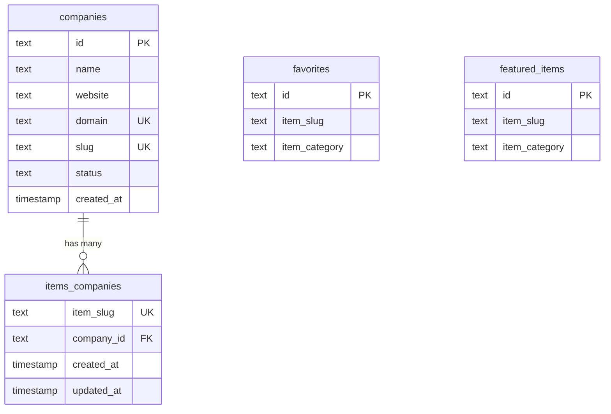

# 类别和公司架构深入探究

## 概述

在 Ever Works 模板中，**类别是在基于 Git 的 CMS**（内容存储库）中定义的，而不是在数据库中定义的。没有`categories` 数据库表。然而，数据库提供了将项目链接到公司并跟踪公司层次结构的基础设施，这具有类似的组织目的。

此页面记录了 `companies` 表、`items_companies` 连接表，以及类别/公司引用在整个架构中的显示方式。

**源文件：** `template/lib/db/schema.ts`

---

## Table: `companies`

Stores company/organization records that can be linked to items.

### Columns

| Column | DB Name | Type | Nullable | Default | Constraints |
|---|---|---|---|---|---|
| `id` | `id` | `text` | No | `crypto.randomUUID()` | Primary Key |
| `name` | `name` | `text` | No | - | - |
| `website` | `website` | `text` | Yes | - | - |
| `domain` | `domain` | `text` | Yes | - | Unique |
| `slug` | `slug` | `text` | Yes | - | Unique |
| `status` | `status` | `text (enum)` | No | `'active'` | `active`, `inactive` |
| `createdAt` | `created_at` | `timestamp` | No | `now()` | - |
| `updatedAt` | `updated_at` | `timestamp` | No | `now()` | - |

### Indexes

| Name | Columns | Type |
|---|---|---|
| `companies_name_idx` | `name` | B-tree |
| `companies_status_idx` | `status` | B-tree |
| `companies_domain_unique_idx` | `domain` | Unique |
| `companies_slug_unique_idx` | `slug` | Unique |

### TypeScript Types

```typescript
export type Company = typeof companies.$inferSelect;
export type NewCompany = typeof companies.$inferInsert;
```

---

## 表：`items_companies`

将项目段链接到公司记录的连接表。每个项目条只能与一个公司关联（`item_slug` 的唯一约束）。

### 专栏

|专栏|数据库名称|类型|可空|默认|约束条件|
|---|---|---|---|---|---|
|`itemSlug`|`item_slug`|`text`|否| - |独特|
|`companyId`|`company_id`|`text`|否| - |FK -> `companies.id`（级联）|
|`createdAt`|`created_at`|`timestamp (tz)`|否|`now()`| - |
|`updatedAt`|`updated_at`|`timestamp (tz)`|否|`now()`| - |

### 索引

|名称|专栏|类型|
|---|---|---|
|`items_companies_company_id_idx`|`companyId`|B树|

### TypeScript 类型

```typescript
export type ItemCompany = typeof itemsCompanies.$inferSelect;
export type NewItemCompany = typeof itemsCompanies.$inferInsert;
```

---

## Category References in Other Tables

While categories do not have a dedicated table, category data appears as denormalized fields in several tables:

| Table | Column | Purpose |
|---|---|---|
| `favorites` | `item_category` | Cached category name for display |
| `featured_items` | `item_category` | Cached category name for display |

These fields store the category string at the time the record is created, avoiding the need to look up the Git CMS at read time.

---

## 关系图



---

## How Categories Work

1. **Content repository defines categories.** The `.content/` directory (cloned from `DATA_REPOSITORY`) contains category definitions in markdown/YAML files.
2. **Items belong to categories in Git.** Each item's frontmatter specifies its category.
3. **Database stores category strings.** When favorites or featured items are created, the category name is copied from the content layer into the database as a denormalized field.
4. **Companies provide organizational grouping.** The `companies` + `items_companies` tables allow linking items to real-world organizations, separate from content categories.

---

## 查询示例

### 获取所有活跃公司

```typescript
import { db } from '@/lib/db/drizzle';
import { companies } from '@/lib/db/schema';
import { eq } from 'drizzle-orm';

const activeCompanies = await db
    .select()
    .from(companies)
    .where(eq(companies.status, 'active'));
```

### 按域名查找公司

```typescript
const company = await db
    .select()
    .from(companies)
    .where(eq(companies.domain, 'example.com'))
    .limit(1);
```

### 为公司获取物品

```typescript
import { itemsCompanies } from '@/lib/db/schema';

const companyItems = await db
    .select()
    .from(itemsCompanies)
    .innerJoin(companies, eq(itemsCompanies.companyId, companies.id))
    .where(eq(companies.slug, 'acme-corp'));
```

### 将项目链接到公司

```typescript
await db.insert(itemsCompanies).values({
    itemSlug: 'my-tool-slug',
    companyId: company.id,
});
```

---

## Design Notes

- **One item, one company.** The unique constraint on `item_slug` in `items_companies` means each item can only belong to one company.
- **Companies have unique domains and slugs.** Both `domain` and `slug` have unique indexes for fast lookups and URL routing.
- **Category data is read from Git at runtime.** The database does not need to store category hierarchies or metadata -- this comes from the content layer.
