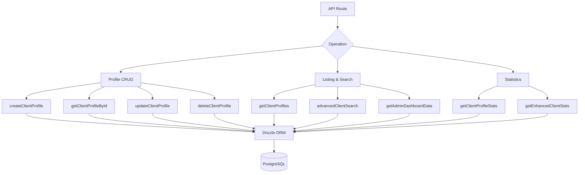

# 面向客户的查询

客户端查询处理配置文件管理、包含身份验证元数据的列表、高级多标准搜索和综合统计。所有函数都位于 `client.queries.ts` 中，并由管理员和面向客户端的 API 路由使用。

## 客户端查询架构



## 配置文件增删改查

### 创建个人资料

当未提供用户名时，新的配置文件会从电子邮件地址自动生成唯一的用户名：

```typescript
export async function createClientProfile(data: {
  userId: string;
  email: string;
  name: string;
  displayName?: string;
  username?: string;
  bio?: string;
  jobTitle?: string;
  company?: string;
  status?: string;
  plan?: string;
  accountType?: string;
}): Promise<ClientProfile>
```

用户名生成逻辑：

1. 如果提供`username`，则规范化并确保唯一性
2. 否则，通过 `extractUsernameFromEmail()` 从电子邮件中提取用户名
3. 后备：生成 `user<timestamp>` 前缀
4. 所有路径都通过`ensureUniqueUsername()`，如果需要，它会附加数字后缀

创建期间应用的默认值：

|领域|默认|
|-------|---------|
|`displayName`|与`name`相同|
|`bio`|`"Welcome! I'm a new user on this platform."`|
|`jobTitle`|`"User"`|
|`company`|`"Unknown"`|
|`status`|`"active"`|
|`plan`|`"free"`|
|`accountType`|`"individual"`|

### 读操作

|功能|查找字段|退货|
|----------|-------------|---------|
|`getClientProfileById(id)`|`clientProfiles.id`|`客户资料\|空`|
|`getClientProfileByUserId(userId)`|`clientProfiles.userId`|`客户资料\|空`|
|`getClientProfileByEmail(email)`|通过`accounts`表|`客户资料\|空`|

基于电子邮件的查找通过`accounts`表解析以找到关联的`userId`，然后查询`clientProfiles`：

```typescript
export async function getClientProfileByEmail(email: string): Promise<ClientProfile | null> {
  const account = await getClientAccountByEmail(email);
  if (!account) return null;
  const [profile] = await db
    .select()
    .from(clientProfiles)
    .where(eq(clientProfiles.userId, account.userId))
    .limit(1);
  return profile || null;
}
```

### 更新和删除

- **`updateClientProfile(id, data)`** -- 使用自动 `updatedAt` 时间戳进行部分更新
- **`deleteClientProfile(id)`** -- 硬删除（返回布尔值成功）

## 分页列表

`getClientProfiles` 返回带有身份验证提供程序数据的分页结果，不包括管理员用户：

```typescript
export async function getClientProfiles(params: {
  page?: number;
  limit?: number;
  search?: string;
  status?: string;
  plan?: string;
  accountType?: string;
  provider?: string;
}): Promise<{
  profiles: ClientProfileWithAuth[];
  total: number;
  page: number;
  totalPages: number;
  limit: number;
}>
```

### 管理员排除模式

计数查询和数据查询都使用 LEFT JOIN + IS NULL 模式来排除管理员用户：

```typescript
.leftJoin(userRoles, eq(userRoles.userId, clientProfiles.userId))
.leftJoin(roles, and(eq(userRoles.roleId, roles.id), eq(roles.isAdmin, true)))
.where(isNull(roles.id))  // Only non-admin users
```

### 提供者子查询

为了避免当用户有多个身份验证帐户时出现重复行，提供程序通过标量子查询进行解析：

```typescript
accountProvider: sql<string>`coalesce(
  (SELECT provider FROM ${accounts}
   WHERE ${accounts.userId} = ${clientProfiles.userId}
   LIMIT 1),
  'unknown'
)`
```

### 搜索过滤器

文本搜索在多个字段中使用 `ILIKE` 并防止 SQL 注入：

```typescript
const escapedSearch = search
  .replace(/\\/g, '\\\\')
  .replace(/[%_]/g, '\\$&');

whereConditions.push(
  sql`(${clientProfiles.username} ILIKE ${`%${escapedSearch}%`} OR
       ${clientProfiles.displayName} ILIKE ${`%${escapedSearch}%`} OR
       ${clientProfiles.company} ILIKE ${`%${escapedSearch}%`} OR
       ${clientProfiles.name} ILIKE ${`%${escapedSearch}%`} OR
       ${clientProfiles.email} ILIKE ${`%${escapedSearch}%`})`
);
```

## 高级客户搜索

`advancedClientSearch` 支持跨多个类别的 20 多个过滤条件：

|过滤器类别|参数|
|----------------|------------|
|**文字搜索**|`search`（姓名、电子邮件、用户名、公司、简历、职务、行业、地点）|
|**枚举过滤器**|`status`、`plan`、`accountType`、`provider`|
|**日期范围**|`createdAfter`、`createdBefore`、`updatedAfter`、`updatedBefore`、`dateRange`|
|**特定领域**|`emailDomain`、`companySearch`、`locationSearch`、`industrySearch`|
|**数字**|`minSubmissions`、`maxSubmissions`|
|**布尔值**|`hasAvatar`、`hasWebsite`、`hasPhone`、`emailVerified`、`twoFactorEnabled`|
|**排序**|`sortBy`、`sortOrder`|

## 客户统计

### 基础统计

`getClientProfileStats` 返回简单计数：

```typescript
{
  total: number;
  active: number;
  inactive: number;
  byPlan: Record<string, number>;
  byAccountType: Record<string, number>;
}
```

### 增强统计

`getEnhancedClientStats`提供全面的多维度细分：

```typescript
{
  overview: { total, active, inactive, suspended, trial },
  byProvider: { credentials, google, github, facebook, twitter, linkedin, other },
  byPlan: { free: number, standard: number, premium: number },
  byAccountType: { individual, business, enterprise },
  activity: { newThisWeek, newThisMonth, activeThisWeek, activeThisMonth },
  growth: { weeklyGrowth, monthlyGrowth },
}
```

增强的统计数据使用 `countDistinct` 和多表连接来生成准确的计数，即使用户拥有多个帐户提供商：

```typescript
const statsResult = await db
  .select({
    status: clientProfiles.status,
    plan: clientProfiles.plan,
    accountType: clientProfiles.accountType,
    provider: accounts.provider,
    count: countDistinct(clientProfiles.id)
  })
  .from(clientProfiles)
  .leftJoin(accounts, eq(clientProfiles.userId, accounts.userId))
  .leftJoin(userRoles, eq(userRoles.userId, clientProfiles.userId))
  .leftJoin(roles, and(eq(userRoles.roleId, roles.id), eq(roles.isAdmin, true)))
  .where(isNull(roles.id))
  .groupBy(
    clientProfiles.status,
    clientProfiles.plan,
    clientProfiles.accountType,
    accounts.provider
  );
```

### 活动指标

活动窗口使用日期算术计算：

```typescript
const oneWeekAgo = new Date(now.getTime() - 7 * 24 * 60 * 60 * 1000);
const oneMonthAgo = new Date(now.getTime() - 30 * 24 * 60 * 60 * 1000);
```

增长率是新注册量相对于总数的简化百分比：

```typescript
const weeklyGrowth = total > 0 ? Math.round((newThisWeek / total) * 100) : 0;
```

## 类型

所有客户端查询类型均在`lib/db/queries/types.ts`中定义：

```typescript
export type ClientProfileWithAuth = ClientProfile & {
  accountProvider: string;
  isActive: boolean;
};

export type ClientStatus = "active" | "inactive" | "suspended" | "trial";
export type ClientPlan = "free" | "standard" | "premium";
export type ClientAccountType = "individual" | "business" | "enterprise";
```
