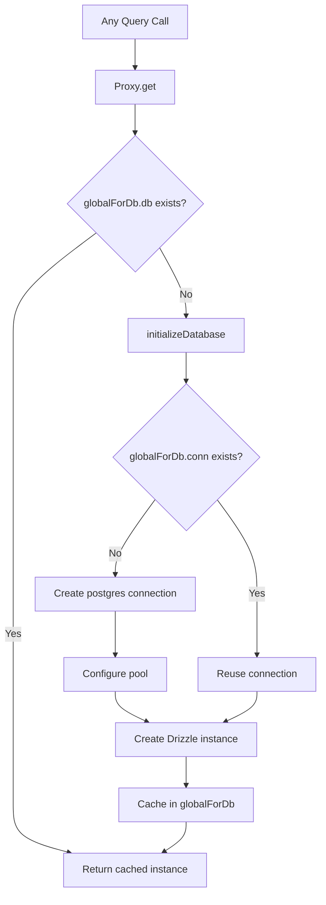

# 数据库连接和池

该模板使用`postgres.js`（`postgres` npm 包）作为带有 Drizzle ORM 的 PostgreSQL 驱动程序。连接管理是通过带有全局单例缓存的惰性初始化模式来处理的，以适应开发中的 Next.js 热模块替换 (HMR)。

## 连接架构



## 数据库设置 (`lib/db/drizzle.ts`)

### 使用代理进行延迟初始化

数据库实例导出为`Proxy`，它在第一次访问时初始化连接：

```typescript
export const db = new Proxy({} as ReturnType<typeof drizzle>, {
  get(target, prop) {
    const database = initializeDatabase();
    return database[prop as keyof typeof database];
  },
});
```

这可以确保：
- 导入时未创建连接
- 导入模块但不查询数据库的脚本不会产生连接开销
- 第一次实际数据库操作触发初始化

### 初始化函数

```typescript
function initializeDatabase(): ReturnType<typeof drizzle> {
  if (!getDatabaseUrl()) {
    throw new Error('DATABASE_URL environment variable is required');
  }

  if (globalForDb.db) {
    return globalForDb.db;
  }

  const poolSize = getPoolSize();
  const conn = postgres(getDatabaseUrl()!, {
    max: poolSize,
    idle_timeout: 20,
    connect_timeout: 30,
    prepare: false,
    onnotice: getNodeEnv() === 'development' ? console.log : undefined,
  });

  globalForDb.conn = conn;
  globalForDb.db = drizzle(conn, { schema });
  return globalForDb.db;
}
```

### 连接选项

|选项|价值|目的|
|--------|-------|---------|
|`max`|可配置（请参阅池大小）|池中的最大连接数|
|`idle_timeout`|`20`秒|在此持续时间后关闭空闲连接|
|`connect_timeout`|`30`秒|建立连接的最长时间|
|`prepare`|`false`|禁用准备好的语句（某些 PaaS 环境需要）|
|`onnotice`|`console.log`（仅限开发）|在开发中记录 PostgreSQL NOTICE 消息|

## 泳池尺寸

### 配置

池大小可通过 `DB_POOL_SIZE` 环境变量进行配置，并具有环境感知默认值：

```typescript
const getPoolSize = (): number => {
  const envPoolSize = process.env.DB_POOL_SIZE;
  if (envPoolSize) {
    const parsed = parseInt(envPoolSize, 10);
    return isNaN(parsed) ? 20 : Math.max(1, Math.min(parsed, 50));
  }
  return getNodeEnv() === 'production' ? 20 : 10;
};
```

### 默认值

|环境|默认池大小|范围|
|-------------|------------------|-------|
|生产| 20 | 1 - 50 |
|发展| 10 | 1 - 50 |

无论配置的值如何，池大小都限制在 1 到 50 之间。

### 池大小指南

- **开发 (10)：** 对于具有 HMR 的单个开发人员来说足够了。保持较低的资源使用率。
- **生产 (20)：** 处理并发 API 请求。增加高流量部署。
- **无服务器 (1-5)：** 在无服务器平台上部署时使用小型池，其中每个实例都有自己的池。

## 全局单例模式

### HMR 安全

Next.js 开发模式在文件更改时重新执行模块。如果没有保护，每个 HMR 周期都会创建一个新的连接池，从而快速耗尽数据库连接。

该模板将连接附加到 `globalThis` 以保证 HMR 存在：

```typescript
const globalForDb = globalThis as unknown as {
  conn: postgres.Sql | undefined;
  db: ReturnType<typeof drizzle> | undefined;
};
```

当模块重新执行时：
1. `initializeDatabase()` 检查`globalForDb.db`
2. 如果实例存在则立即返回
3. 如果连接存在但 Drizzle 实例不存在，则重复使用现有连接

开发日志记录表明连接是否被重用：

```
Reusing existing database connection; pool size is unchanged
```

或新创建的：

```
Database connection established successfully with pool size: 10
```

### 直接实例访问

对于需要具体 Drizzle 实例的库（例如 Auth.js 适配器），提供了 getter 函数：

```typescript
export function getDrizzleInstance(): ReturnType<typeof drizzle> {
  return initializeDatabase();
}
```

## 配置模块 (`lib/db/config.ts`)

脚本安全配置模块，**不**导入`server-only`，允许迁移和种子脚本使用它：

```typescript
export function getDatabaseUrl(): string | undefined {
  return process.env.DATABASE_URL;
}

export function getNodeEnv(): 'development' | 'production' | 'test' {
  const env = process.env.NODE_ENV;
  if (env === 'production' || env === 'test') return env;
  return 'development';
}

export function isProduction(): boolean {
  return getNodeEnv() === 'production';
}
```

## 迁移运行者 (`lib/db/migrate.ts`)

迁移运行器是幂等的，并且可以在每次应用程序启动时安全地调用：

```typescript
export async function runMigrations(): Promise<boolean> {
  const { db } = await import('./drizzle');
  await migrate(db, { migrationsFolder: './lib/db/migrations' });
  return true;
}
```

关键行为：
- Drizzle 跟踪 `drizzle.__drizzle_migrations` 中应用的迁移
- 已应用的迁移将自动跳过
- 成功时返回`true`，失败时返回`false`（不抛出）
- 记录执行前后的迁移状态

## 环境变量

|变量|必填|默认|描述|
|----------|----------|---------|-------------|
|`DATABASE_URL`|是的| -- |PostgreSQL 连接字符串|
|`DB_POOL_SIZE`|否|`20`（产品）/`10`（开发）|连接池大小（1-50）|
|`NODE_ENV`|否|`development`|环境（开发/生产/测试）|

## 毛毛雨套件配置

用于架构生成和迁移管理的 Drizzle Kit 配置：

```typescript
// drizzle.config.ts
export default {
  schema: "./lib/db/schema.ts",
  out: "./lib/db/migrations",
  dialect: "postgresql",
  dbCredentials: {
    url: process.env.DATABASE_URL,
  },
} satisfies Config;
```

## 故障排除

|问题|原因|解决方案|
|-------|-------|----------|
|`DATABASE_URL is required`|缺少环境变量|在`.env.local`中设置`DATABASE_URL`|
|连接超时|网络速度慢或数据库过载|增加`connect_timeout`或检查数据库健康状况|
|开发中的池耗尽|HMR 创建多个池|确保 `globalForDb` 图案完好无损|
|产品中的池耗尽|并发请求过多|增加`DB_POOL_SIZE`（最多 50）|
|`prepare` PaaS 上的错误|事务模式下的PaaS pgBouncer|保留`prepare: false`|
