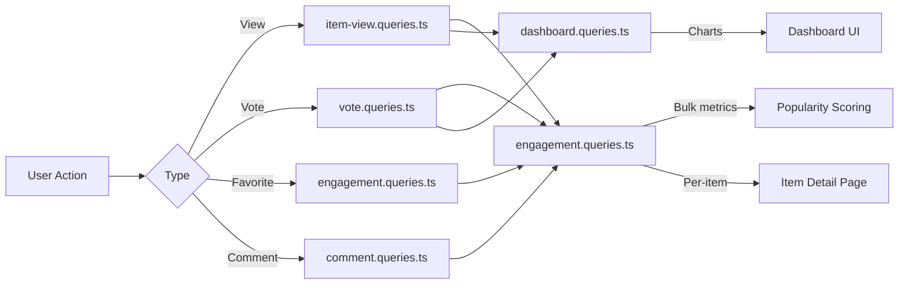

# 参与度和互动查询

参与度查询聚合跨项目的用户交互（视图、投票、收藏夹、评论）。这些查询支持流行度排序、仪表板图表和每个项目的参与面板。相关模块为`engagement.queries.ts`、`vote.queries.ts`、`comment.queries.ts`、`item-view.queries.ts` 和`dashboard.queries.ts`。

## 参与数据流



## 批量参与度指标 (`engagement.queries.ts`)

### `getEngagementMetricsPerItem`

主要功能是人气评分。返回单个并行查询批次中多个项目的所有参与维度：

```typescript
export async function getEngagementMetricsPerItem(
  itemSlugs: string[]
): Promise<Map<string, ItemEngagementMetrics>>
```

返回类型：

```typescript
export interface ItemEngagementMetrics {
  views: number;
  votes: number;       // Net votes (upvotes - downvotes)
  favorites: number;
  comments: number;
  avgRating: number;   // Average rating from comments (0-5)
}
```

### 并行查询策略

通过 `Promise.all` 运行四个独立查询以获得最大吞吐量：

```typescript
const [viewsData, votesData, favoritesData, commentsData] = await Promise.all([
  // 1. Views per item
  db.select({ itemId: itemViews.itemId, count: count() })
    .from(itemViews)
    .where(inArray(itemViews.itemId, itemSlugs))
    .groupBy(itemViews.itemId),

  // 2. Net votes per item (upvotes - downvotes)
  db.select({
      itemId: votes.itemId,
      netScore: sql<number>`SUM(CASE
        WHEN vote_type = 'upvote' THEN 1
        WHEN vote_type = 'downvote' THEN -1
        ELSE 0 END)`.as('netScore'),
    })
    .from(votes)
    .where(inArray(votes.itemId, itemSlugs))
    .groupBy(votes.itemId),

  // 3. Favorites per item
  db.select({ itemSlug: favorites.itemSlug, count: count() })
    .from(favorites)
    .where(inArray(favorites.itemSlug, itemSlugs))
    .groupBy(favorites.itemSlug),

  // 4. Comments count + average rating (excluding soft-deleted)
  db.select({
      itemId: comments.itemId,
      count: count(),
      avgRating: sql<number>`COALESCE(AVG(${comments.rating}), 0)`.as('avgRating'),
    })
    .from(comments)
    .where(and(inArray(comments.itemId, itemSlugs), isNull(comments.deletedAt)))
    .groupBy(comments.itemId),
]);
```

### 结果标准化

每个查询结果都会转换为 `Map` 以进行 O(1) 查找，然后组合成最终的指标图：

```typescript
const viewsMap = new Map<string, number>(
  viewsData.map(v => [v.itemId, Number(v.count)])
);
// ... same for votesMap, favoritesMap, commentsMap

for (const slug of itemSlugs) {
  metricsMap.set(slug, {
    views: viewsMap.get(slug) ?? 0,
    votes: votesMap.get(slug) ?? 0,
    favorites: favoritesMap.get(slug) ?? 0,
    comments: commentsMap.get(slug)?.count ?? 0,
    avgRating: commentsMap.get(slug)?.avgRating ?? 0,
  });
}
```

### 独立度量函数

|功能|退货|描述|
|----------|---------|-------------|
|`getFavoritesPerItem(itemSlugs)`|`Map<string, number>`|每件商品的收藏数|
|`getCommentsPerItem(itemSlugs)`|`Map<string, { count, avgRating }>`|评论数和平均评分|

两个函数都使用相同的模式：空数组的早期返回、`groupBy` 聚合、`Map` 构造。

## 投票查询 (`vote.queries.ts`)

### 投票增删改查

|功能|描述|
|----------|-------------|
|`createVote(vote)`|通过 slug 标准化创建投票|
|`getVoteByUserIdAndItemId(userId, itemSlug)`|检查现有投票|
|`deleteVote(voteId)`|硬删除投票|

所有投票功能在查询之前都会通过 `getItemIdFromSlug()` 标准化项目段。

### 净分数计算

使用条件 `SUM` 的单项得分：

```typescript
export async function getVoteCountForItem(itemSlug: string): Promise<number> {
  const itemId = getItemIdFromSlug(itemSlug);
  const [result] = await db
    .select({
      netScore: sql<number>`
        SUM(CASE
          WHEN vote_type = 'upvote' THEN 1
          WHEN vote_type = 'downvote' THEN -1
          ELSE 0
        END)`.as('netScore')
    })
    .from(votes)
    .where(eq(votes.itemId, itemId));
  return Number(result?.netScore ?? 0);
}
```

### 批量投票分数

`getVotesPerItem` 使用`inArray` 和`groupBy` 返回多个项目的净分数`Map<string, number>`。

### 投票排序的项目

```typescript
export async function getItemsSortedByVotes(limit = 10, offset = 0) {
  return db
    .select({
      itemId: votes.itemId,
      voteCount: sql<number>`count(${votes.id})`.as('vote_count')
    })
    .from(votes)
    .groupBy(votes.itemId)
    .orderBy(sql`vote_count DESC`)
    .limit(limit)
    .offset(offset);
}
```

## 评论查询 (`comment.queries.ts`)

### 评论增删改查

|功能|描述|
|----------|-------------|
|`createComment(data)`|使用 slug 标准化创建|
|`getCommentById(id)`|原始评论记录|
|`getCommentWithUserById(id)`|评论与用户个人资料加入|
|`updateComment(id, { content?, rating? })`|使用 `editedAt` 时间戳进行更新|
|`updateCommentRating(id, rating)`|仅评级更新|
|`deleteComment(id)`|软删除 (`deletedAt = new Date()`)|

### 带有用户数据的评论

`getCommentsByItemId` 使用 `innerJoin` 和 `clientProfiles` 用作者信息丰富每个评论：

```typescript
export async function getCommentsByItemId(itemSlug: string): Promise<CommentWithUser[]> {
  const itemId = getItemIdFromSlug(itemSlug);
  return db
    .select({
      id: comments.id,
      content: comments.content,
      rating: comments.rating,
      userId: comments.userId,
      itemId: comments.itemId,
      createdAt: comments.createdAt,
      updatedAt: comments.updatedAt,
      editedAt: comments.editedAt,
      deletedAt: comments.deletedAt,
      user: {
        id: clientProfiles.id,
        name: clientProfiles.name,
        email: clientProfiles.email,
        image: clientProfiles.avatar
      }
    })
    .from(comments)
    .innerJoin(clientProfiles, eq(comments.userId, clientProfiles.id))
    .where(and(eq(comments.itemId, itemId), isNull(comments.deletedAt)))
    .orderBy(desc(comments.createdAt));
}
```

## 查看跟踪 (`item-view.queries.ts`)

### 每日重复数据删除

使用 `onConflictDoNothing` upsert 模式，在每个 UTC 日对每个查看者每个项目的视图进行重复数据删除：

```typescript
export async function recordItemView(
  view: Pick<NewItemView, 'itemId' | 'viewerId' | 'viewedDateUtc'>
): Promise<boolean> {
  const result = await db
    .insert(itemViews)
    .values(view)
    .onConflictDoNothing()
    .returning({ id: itemViews.id });
  return result.length > 0; // true = new view, false = duplicate
}
```

### 查看聚合函数

|功能|参数|退货|描述|
|----------|-----------|---------|-------------|
|`getTotalViewsCount(itemSlugs)`|`string[]`|`number`|各项目的总浏览次数|
|`getRecentViewsCount(itemSlugs, days)`|`string[], number`|`number`|近N天的浏览量|
|`getDailyViewsData(itemSlugs, days)`|`string[], number`|`Map<string, number>`|每日观看次数|
|`getViewsPerItem(itemSlugs)`|`string[]`|`Map<string, number>`|每个项目的浏览次数|

### UTC 日期助手

所有日期计算都使用 UTC 来防止与时区相关的相差一错误：

```typescript
function getUtcDateString(daysAgo: number = 0): string {
  const date = new Date();
  date.setUTCDate(date.getUTCDate() - daysAgo);
  return date.toISOString().split('T')[0]; // "YYYY-MM-DD"
}
```

## 仪表板统计 (`dashboard.queries.ts`)

### 可用指标

|功能|目的|
|----------|---------|
|`getVotesReceivedCount(itemSlugs)`|用户项目的总投票数|
|`getCommentsReceivedCount(itemSlugs)`|用户项目的总评论数|
|`getUniqueItemsInteractedCount(clientId)`|用户参与过的项目|
|`getUserTotalActivityCount(clientId)`|总投票数+用户评论|
|`getWeeklyEngagementData(itemSlugs, weeks)`|每周汇总图表数据|
|`getDailyActivityData(clientId, itemSlugs, days)`|每日活动细目|
|`getTopItemsEngagement(itemSlugs, limit)`|按参与度得分排名靠前的项目|

### 每周参与度汇总

使用 PostgreSQL 的 `to_char` 和 ISO 周格式来实现一致的周存储：

```typescript
const weeklyVotes = await db
  .select({
    week: sql<string>`to_char(${votes.createdAt}, 'IYYY-IW')`.as('week'),
    count: count(),
  })
  .from(votes)
  .where(and(inArray(votes.itemId, itemSlugs), gte(votes.createdAt, startDate)))
  .groupBy(sql`to_char(${votes.createdAt}, 'IYYY-IW')`)
  .orderBy(sql`to_char(${votes.createdAt}, 'IYYY-IW')`);
```

## 性能考虑因素

- 所有批量函数都接受数组并使用 `inArray` 进行批处理
- 空数组输入提前返回而不访问数据库
- `Promise.all` 同时运行独立聚合
- `Map` 数据结构在结果组装期间提供 O(1) 查找
- 所有聚合中的软删除评论均通过 `isNull(comments.deletedAt)` 排除
