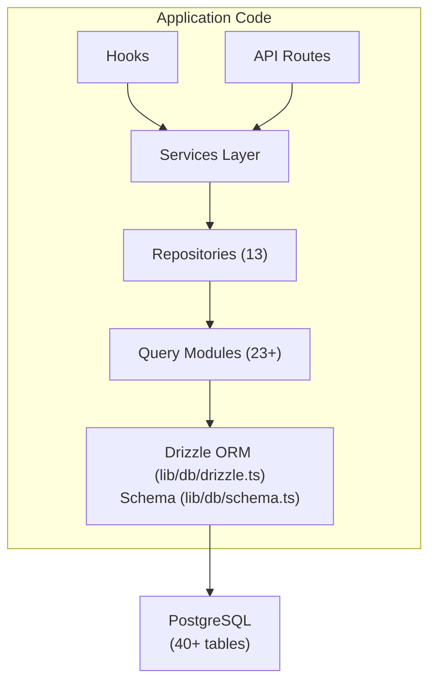

# 数据库概述

Ever Works 模板使用 **Drizzle ORM** 和 **PostgreSQL** 作为其数据库层。数据库是可选的——应用程序可以在没有数据库的情况下运行，以进行仅内容部署——但它为所有用户、订阅、参与和管理功能提供支持。

## 技术栈

|组件|技术|目的|
|-----------|-----------|---------|
|ORM|毛毛雨 ORM|类型安全的查询生成器和架构管理|
|数据库|PostgreSQL|主关系数据库|
|司机|`postgres` (postgres.js)|Node.js 的 PostgreSQL 客户端|
|迁移|毛毛雨套件|架构迁移生成和执行|
|播种|`drizzle-seed` + 自定义脚本|使用默认数据初始化数据库|

## 数据库架构



## 配置

### 细雨配置 (`drizzle.config.ts`)

```typescript
export default {
  schema: "./lib/db/schema.ts",
  out: "./lib/db/migrations",
  dialect: "postgresql",
  dbCredentials: {
    url: process.env.DATABASE_URL,
  },
} satisfies Config;
```

配置指向：
- **架构文件**：`lib/db/schema.ts`——所有表定义的单一事实来源
- **迁移输出**：`lib/db/migrations/` -- 存储生成的 SQL 迁移文件的位置
- **方言**：PostgreSQL
- **连接**：通过`DATABASE_URL`环境变量

### 连接管理 (`lib/db/drizzle.ts`)

数据库连接在首次使用时延迟初始化，并通过全局单例模式在开发过程中的热重载中重用连接。

主要特点：
- **延迟初始化**：在执行第一个查询之前不会创建数据库连接
- **基于代理的访问**：导出的 `db` 对象使用 JavaScript `Proxy` 透明地初始化连接
- **连接池**：可通过 `DB_POOL_SIZE` 环境变量配置池大小（默认值：生产中 20 个，开发中 10 个，限制为 1-50）
- **空闲超时**：20 秒不活动后连接被释放
- **连接超时**：建立新连接的超时时间为 30 秒
- **单例模式**：使用 `globalThis` 在 Next.js 热重载中保持连接

```typescript
// Usage - just import and use
import { db } from '@/lib/db/drizzle';

const users = await db.select().from(schema.users);
```

### 环境变量

|变量|必填|默认|描述|
|----------|----------|---------|-------------|
|`DATABASE_URL`|否| - |PostgreSQL 连接字符串|
|`DB_POOL_SIZE`|否| 10/20 |连接池大小（开发/产品）|

当`DATABASE_URL` 未设置时，数据库功能将被静默禁用，从而允许应用程序在仅内容模式下运行。

## 架构概述

数据库模式在单个文件 (`lib/db/schema.ts`) 中定义，其中包含按域组织的 40 多个表：

|域名|表格|描述|
|--------|--------|-------------|
|用户和授权| 8 |用户、帐户、会话、令牌、验证器|
|角色和权限| 3 |具有角色、权限和角色-权限映射的 RBAC|
|客户资料| 1 |客户帐户的扩展用户配置文件|
|内容参与度| 4 |评论、投票、收藏、项目浏览|
|订阅| 4 |计划、订阅历史记录、支付提供商、支付账户|
|通知| 1 |应用内通知系统|
|管理与审核| 4 |报告、审核历史记录、项目审核日志、活动日志|
|集成| 2 |CRM 配置、集成映射|
|公司| 2 |公司和项目公司协会|
|赞助商广告| 1 |赞助品广告|
|调查| 2 |调查和调查回复|
|时事通讯| 1 |时事通讯订阅|
|系统| 1 |种子状态跟踪|

## 数据库初始化

应用程序启动时（通过 `instrumentation.ts`），模板会自动：

1. **运行迁移**：Drizzle 的 `migrate()` 函数应用任何待处理的迁移（幂等 - 已应用的迁移将被跳过）
2. **种子数据**：如果数据库尚未播种，则种子脚本会在运行时提供咨询锁保护，以防止多进程部署中出现竞争条件

这是由`lib/db/initialize.ts` 处理的。有关详细信息，请参阅[迁移指南](./migrations-guide) 和[数据库播种](./seeding)。

## 按键命令

```bash
# Generate a migration from schema changes
pnpm db:generate

# Run pending migrations
pnpm db:migrate

# Seed the database
pnpm db:seed

# Open Drizzle Studio (database GUI)
pnpm db:studio
```
