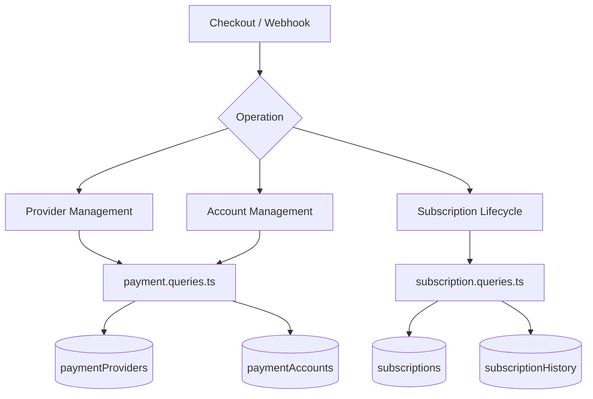
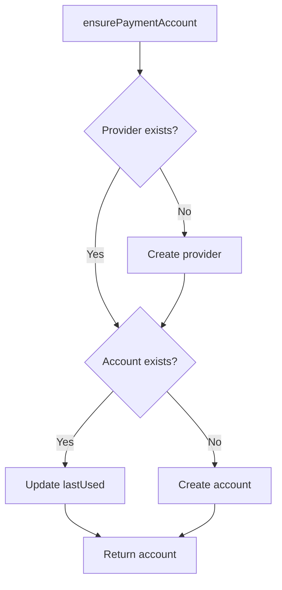
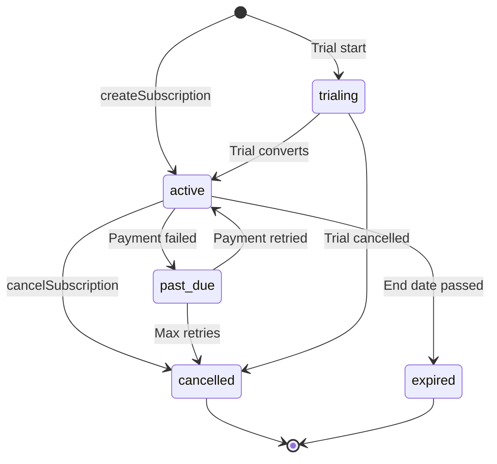

# 付款和订阅查询

付款查询管理提供商注册表、用户付款帐户和完整的订阅生命周期。相关模块是`payment.queries.ts` 和`subscription.queries.ts`。

## 支付系统架构



## 支付提供商查询 (`payment.queries.ts`)

### 提供者增删改查

|功能|描述|
|----------|-------------|
|`getPaymentProvider(id)`|通过ID获取提供商|
|`getPaymentProviderByName(name)`|按名称获取提供商（例如`'stripe'`）|
|`getActivePaymentProviders()`|列出所有活跃的提供商，按名称排序|
|`createPaymentProvider(data)`|创建新的提供者记录|
|`updatePaymentProvider(id, data)`|提供商字段的部分更新|
|`deactivatePaymentProvider(id)`|设置`isActive = false`|

支持的提供商名称：`stripe`、`lemonsqueezy`、`polar`、`solidgate`。

### 支付账户查询

付款帐户将用户链接到特定于提供商的客户 ID：

|功能|描述|
|----------|-------------|
|`getPaymentAccountByUserId(userId, providerId)`|通过有效的提供商检查获取帐户|
|`getPaymentAccountByCustomerId(customerId, providerId)`|按客户ID反向查找|
|`createPaymentAccount(data)`|使用 `lastUsed` 时间戳创建帐户|
|`updatePaymentAccountLastUsed(accountId)`|触摸`lastUsed`时间戳|
|`getUserPaymentAccountByProvider(userId, providerName)`|按提供商名称查找（首先解析提供商）|

### 主动提供商验证

`getPaymentAccountByUserId` 执行三重内部连接以确保提供者和用户都有效：

```typescript
export async function getPaymentAccountByUserId(
  userId: string,
  providerId: string
): Promise<PaymentAccount | null> {
  const result = await db
    .select({ /* payment account fields */ })
    .from(paymentAccounts)
    .innerJoin(paymentProviders, eq(paymentAccounts.providerId, paymentProviders.id))
    .innerJoin(users, eq(paymentAccounts.userId, users.id))
    .where(and(
      eq(paymentAccounts.userId, userId),
      eq(paymentAccounts.providerId, providerId),
      eq(paymentProviders.isActive, true)
    ))
    .limit(1);
  return result[0] || null;
}
```

### 确保付款账户

`ensurePaymentAccount` 为支付账户实现幂等更新插入模式：



```typescript
export async function ensurePaymentAccount(
  providerName: string,
  userId: string,
  customerId: string,
  accountId?: string
): Promise<PaymentAccount>
```

### 设置用户支付账户

`setupUserPaymentAccount` 通过客户 ID 更改检测扩展了确保模式：

```typescript
if (existingAccount.customerId !== customerId) {
  await db
    .update(paymentAccounts)
    .set({
      customerId,
      accountId: accountId || existingAccount.accountId,
      lastUsed: new Date(),
      updatedAt: new Date()
    })
    .where(eq(paymentAccounts.id, existingAccount.id));
}
```

### 方便的别名

- `getOrCreatePaymentAccount` -- `ensurePaymentAccount` 的别名
- `createOrGetPaymentAccount` -- `setupUserPaymentAccount` 的别名

## 订阅查询 (`subscription.queries.ts`)

### 订阅查询

|功能|参数|退货|
|----------|-----------|---------|
|`getUserActiveSubscription(userId)`|用户ID|有效订阅或为空|
|`getUserSubscriptions(userId)`|用户ID|所有订阅（按日期排序）|
|`getSubscriptionByProviderSubscriptionId(provider, subId)`|提供者 + 子 ID|订阅或为空|
|`getSubscriptionByUserIdAndSubscriptionId(userId, subId)`|用户+子ID|订阅或为空|
|`getSubscriptionWithUser(subId)`|订阅ID|用户加入订阅|
|`hasActiveSubscription(userId)`|用户ID|布尔值|

### 订阅生命周期

#### 创建

```typescript
export async function createSubscription(data: NewSubscription): Promise<Subscription> {
  const result = await db
    .insert(subscriptions)
    .values({ ...data, createdAt: new Date(), updatedAt: new Date() })
    .returning();
  return result[0];
}
```

#### 更新状态

当转换到 `CANCELLED` 时，状态更改会自动设置 `cancelledAt` 和 `cancelReason`：

```typescript
export async function updateSubscriptionStatus(
  subscriptionId: string,
  status: string,
  reason?: string
): Promise<Subscription | null>
```

#### 取消

支持立即取消和期末取消：

```typescript
export async function cancelSubscription(
  subscriptionId: string,
  reason?: string,
  cancelAtPeriodEnd: boolean = false
): Promise<Subscription | null>
```

当`cancelAtPeriodEnd = true`时，状态保持为`ACTIVE`，但`cancelledAt`和`cancelAtPeriodEnd`被设置。

### 订阅状态流程



### 计划决议

`getUserPlan` 检查订阅到期情况并退回到免费计划：

```typescript
export async function getUserPlan(userId: string): Promise<string> {
  const subscription = await getUserActiveSubscription(userId);
  if (!subscription) return PaymentPlan.FREE;
  return getEffectivePlan(subscription.planId, subscription.endDate, subscription.status);
}
```

`getUserPlanWithExpiration` 返回完整的到期详细信息：

```typescript
{
  planId: string;         // Stored plan
  effectivePlan: string;  // Actual plan after expiration check
  isExpired: boolean;
  expiresAt: Date | null;
  status: string | null;
  subscriptionId: string | null;
}
```

### 到期和续订

|功能|描述|
|----------|-------------|
|`getSubscriptionsExpiringSoon(days)`|有效订阅将在 N 天内到期|
|`getExpiredSubscriptions()`|订阅已超过结束日期|
|`getSubscriptionsForRenewalReminder(days)`|需要续订通知的订阅|

### 订阅历史

更改记录到 `subscriptionHistory` 表中：

```typescript
export async function logSubscriptionHistory(data: NewSubscriptionHistory)
export async function getSubscriptionHistory(subscriptionId: string)
```

### 订阅统计

`getSubscriptionStats` 返回聚合计数：

```typescript
{
  total: number;
  active: number;
  cancelled: number;
  expired: number;
  pastDue: number;
  trialing: number;
}
```

## 模式常量

```typescript
// lib/db/schema.ts
export const SubscriptionStatus = {
  ACTIVE: 'active',
  CANCELLED: 'cancelled',
  EXPIRED: 'expired',
  PAST_DUE: 'past_due',
  TRIALING: 'trialing',
} as const;

// lib/constants/payment.ts
export const PaymentPlan = {
  FREE: 'free',
  STANDARD: 'standard',
  PREMIUM: 'premium',
} as const;

export const PaymentProvider = {
  STRIPE: 'stripe',
  LEMONSQUEEZY: 'lemonsqueezy',
  POLAR: 'polar',
  SOLIDGATE: 'solidgate',
} as const;
```
