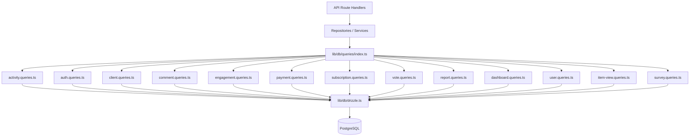

# 查询模式系统

该模板将所有数据库查询组织到 `lib/db/queries/` 下的特定于域的模块中。每个模块都遵循单一职责原则 (SRP)，将相关操作分组在一起。 `index.ts` 中的桶导出为所有查询函数提供了单个入口点。

## 架构概述



## 查询模块

|模块|文件|目的|
|--------|------|---------|
|活动|`activity.queries.ts`|活动记录和审计跟踪|
|授权|`auth.queries.ts`|密码重置令牌、验证令牌|
|客户|`client.queries.ts`|客户资料 CRUD、搜索、统计|
|评论|`comment.queries.ts`|注释 CRUD 与用户连接|
|公司简介|`company.queries.ts`|公司管理和项目-公司链接|
|仪表板|`dashboard.queries.ts`|仪表板统计数据和参与度图表|
|参与度|`engagement.queries.ts`|聚合参与度指标（观点、投票、收藏、评论）|
|整合映射|`integration-mapping.queries.ts`|CRM 集成映射|
|项目|`item.queries.ts`|项目段标准化和验证|
|项目审核|`item-audit.queries.ts`|项目变更历史|
|项目视图|`item-view.queries.ts`|通过重复数据删除查看跟踪|
|位置索引|`location-index.queries.ts`|地理空间项目索引|
|适度|`moderation.queries.ts`|内容审核操作|
|时事通讯|`newsletter.queries.ts`|时事通讯订阅者管理|
|付款方式|`payment.queries.ts`|支付提供商和账户管理|
|报告|`report.queries.ts`|带过滤功能的内容报告|
|订阅|`subscription.queries.ts`|订阅生命周期管理|
|调查|`survey.queries.ts`|调查回复和分析|
|用户|`user.queries.ts`|核心用户 CRUD 和管理员检查|
|投票|`vote.queries.ts`|投票CRUD和净分计算|

## 常见模式

### 1. 分页模式

所有列表查询都遵循使用 `limit` 和 `offset` 的一致分页模式：

```typescript
export async function getClientProfiles(params: {
  page?: number;
  limit?: number;
  search?: string;
  status?: string;
}): Promise<{
  profiles: ClientProfileWithAuth[];
  total: number;
  page: number;
  totalPages: number;
  limit: number;
}> {
  const { page = 1, limit = 10, search, status } = params;
  const offset = (page - 1) * limit;

  // 1. Build WHERE conditions dynamically
  const whereConditions: SQL[] = [];
  if (search) { /* add ILIKE condition */ }
  if (status) { whereConditions.push(eq(clientProfiles.status, status)); }
  const whereClause = whereConditions.length > 0
    ? and(...whereConditions)
    : undefined;

  // 2. Count query for total
  const countResult = await db
    .select({ count: sql<number>`count(distinct ${clientProfiles.id})` })
    .from(clientProfiles)
    .where(whereClause);
  const total = Number(countResult[0]?.count || 0);

  // 3. Data query with limit/offset
  const profiles = await db
    .select({ /* fields */ })
    .from(clientProfiles)
    .where(whereClause)
    .orderBy(desc(clientProfiles.createdAt))
    .limit(limit)
    .offset(offset);

  return {
    profiles,
    total,
    page,
    totalPages: Math.ceil(total / limit),
    limit,
  };
}
```

### 2. 动态过滤模式

过滤器作为 SQL 条件数组累积并由 `and()` 组成：

```typescript
const whereConditions: SQL[] = [];

if (search) {
  const escapedSearch = search
    .replace(/\\/g, '\\\\')
    .replace(/[%_]/g, '\\$&');
  whereConditions.push(
    sql`(${clientProfiles.name} ILIKE ${`%${escapedSearch}%`} OR
         ${clientProfiles.email} ILIKE ${`%${escapedSearch}%`})`
  );
}

if (status) {
  whereConditions.push(eq(clientProfiles.status, status));
}

if (provider) {
  whereConditions.push(
    sql`exists (
      select 1 from ${accounts}
      where ${accounts.userId} = ${clientProfiles.userId}
        and ${accounts.provider} = ${provider}
    )`
  );
}

const whereClause = whereConditions.length > 0
  ? and(...whereConditions)
  : undefined;
```

### 3. 连接模式

代码库使用显式`innerJoin`/`leftJoin`和子查询来处理相关数据：

**所需关系的内部联接：**

```typescript
const result = await db
  .select({
    id: comments.id,
    content: comments.content,
    user: {
      id: clientProfiles.id,
      name: clientProfiles.name,
      email: clientProfiles.email,
      image: clientProfiles.avatar,
    },
  })
  .from(comments)
  .innerJoin(clientProfiles, eq(comments.userId, clientProfiles.id))
  .where(and(eq(comments.itemId, itemId), isNull(comments.deletedAt)))
  .orderBy(desc(comments.createdAt));
```

**子查询以避免多个连接中的重复行：**

```typescript
const profiles = await db
  .select({
    id: clientProfiles.id,
    // ... other fields
    accountProvider: sql<string>`coalesce(
      (SELECT provider FROM ${accounts}
       WHERE ${accounts.userId} = ${clientProfiles.userId}
       LIMIT 1),
      'unknown'
    )`,
  })
  .from(clientProfiles);
```

### 4.聚合模式

`count`、`SUM` 和 `AVG` 等聚合函数与 `groupBy` 一起使用：

```typescript
// Net vote score using conditional SUM
const voteCounts = await db
  .select({
    itemId: votes.itemId,
    netScore: sql<number>`
      SUM(CASE
        WHEN vote_type = 'upvote' THEN 1
        WHEN vote_type = 'downvote' THEN -1
        ELSE 0
      END)
    `.as('netScore'),
  })
  .from(votes)
  .where(inArray(votes.itemId, itemSlugs))
  .groupBy(votes.itemId);
```

### 5. 并行查询模式

当需要多个独立聚合时，查询与 `Promise.all` 并行运行：

```typescript
const [viewsData, votesData, favoritesData, commentsData] =
  await Promise.all([
    db.select({ itemId: itemViews.itemId, count: count() })
      .from(itemViews)
      .where(inArray(itemViews.itemId, itemSlugs))
      .groupBy(itemViews.itemId),

    db.select({ itemId: votes.itemId, netScore: sql`...` })
      .from(votes)
      .where(inArray(votes.itemId, itemSlugs))
      .groupBy(votes.itemId),

    db.select({ itemSlug: favorites.itemSlug, count: count() })
      .from(favorites)
      .where(inArray(favorites.itemSlug, itemSlugs))
      .groupBy(favorites.itemSlug),

    db.select({ itemId: comments.itemId, count: count(), avgRating: sql`...` })
      .from(comments)
      .where(and(inArray(comments.itemId, itemSlugs), isNull(comments.deletedAt)))
      .groupBy(comments.itemId),
  ]);
```

### 6.更新插入/冲突解决模式

用于重复数据删除，特别是在视图跟踪中：

```typescript
export async function recordItemView(
  view: Pick<NewItemView, 'itemId' | 'viewerId' | 'viewedDateUtc'>
): Promise<boolean> {
  const result = await db
    .insert(itemViews)
    .values(view)
    .onConflictDoNothing()
    .returning({ id: itemViews.id });

  return result.length > 0;
}
```

### 7. 软删除模式

记录被标记为已删除而不是被物理删除：

```typescript
export async function deleteComment(id: string) {
  const [comment] = await db
    .update(comments)
    .set({ deletedAt: new Date() })
    .where(eq(comments.id, id))
    .returning();
  return comment;
}

// Querying always filters out soft-deleted records
.where(and(eq(comments.itemId, itemId), isNull(comments.deletedAt)))
```

### 8. 结果标准化模式

查询结果通常通过查找 `Map` 对象进行映射，以实现高效的 O(1) 访问：

```typescript
const viewsMap = new Map<string, number>(
  viewsData.map(v => [v.itemId, Number(v.count)])
);
const votesMap = new Map<string, number>(
  votesData.map(v => [v.itemId, Number(v.netScore ?? 0)])
);

// Combine into final metrics
for (const slug of itemSlugs) {
  metricsMap.set(slug, {
    views: viewsMap.get(slug) ?? 0,
    votes: votesMap.get(slug) ?? 0,
  });
}
```

## 共享实用程序

### `lib/db/queries/utils.ts`

提供跨查询模块共享的辅助函数：

- **`extractUsernameFromEmail(email)`** -- 从电子邮件地址中提取并清理用户名
- **`ensureUniqueUsername(baseUsername)`** -- 如果需要，通过附加数字后缀生成唯一的用户名

### `lib/db/queries/types.ts`

定义跨查询模块使用的共享类型：

- **`ClientProfileWithAuth`** -- 客户端配置文件与身份验证提供商数据相结合
- **`ClientStatus`** / **`ClientPlan`** / **`ClientAccountType`** -- 用于过滤的枚举类型
- **`CommentWithUser`** -- 添加了用户信息的评论数据

## 进口公约

所有查询均通过桶导出导入：

```typescript
import {
  getClientProfiles,
  createVote,
  getEngagementMetricsPerItem,
  getUserActiveSubscription,
} from '@/lib/db/queries';
```
