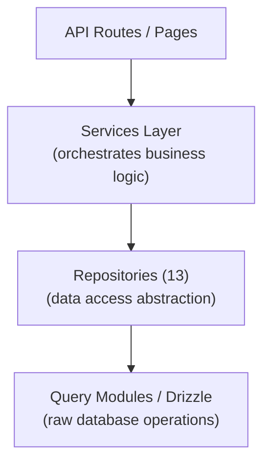

# 存储库模式

Ever Works 模板通过 `lib/repositories/` 中的 13 个专用存储库类实现存储库模式。存储库提供了对原始数据库查询的更高级别的抽象，封装了复杂的查询逻辑、业务规则和数据转换。

## 建筑



## 存储库列表

|存储库|文件|域名|
|------------|------|--------|
|管理分析（优化）|`admin-analytics-optimized.repository.ts`|具有性能优化的管理分析|
|管理统计|`admin-stats.repository.ts`|管理仪表板统计|
|类别|`category.repository.ts`|品类管理|
|客户仪表板|`client-dashboard.repository.ts`|客户端仪表板操作|
|客户项目|`client-item.repository.ts`|客户项目提交|
|收藏|`collection.repository.ts`|馆藏管理|
|整合映射|`integration-mapping.repository.ts`|CRM 集成映射|
|项目|`item.repository.ts`|物品操作|
|角色|`role.repository.ts`|角色管理|
|赞助商广告|`sponsor-ad.repository.ts`|赞助广告管理|
|标签|`tag.repository.ts`|标签管理|
|20 CRM 配置|`twenty-crm-config.repository.ts`|客户关系管理配置|
|用户|`user.repository.ts`|用户管理|

## 基于 Git 的内容存储库 (`lib/repository.ts`)

除了数据库存储库之外，该模板还包括一个基于 Git 的内容存储库，位于 `lib/repository.ts`。这处理 Git CMS 操作：

- 从 `DATA_REPOSITORY` URL 克隆内容存储库
- 与上游同步内容（带冲突检测的拉/推）
- 跟踪本地更改并提交它们
- Git操作超时保护（120秒超时）

这与数据库存储库不同，它管理内容层使用的 `.content/` 目录。

## 存储库详细信息

### 管理分析优化.repository.ts

用于管理仪表板的性能优化的分析存储库。使用批量查询和缓存策略来最大限度地减少生成分析视图时的数据库负载。

关键能力：
- 聚合视图统计数据
- 用户增长趋势
- 内容参与摘要
- 收入分析

### 管理统计.repository.ts

提供管理面板的仪表板统计信息。

关键能力：
- 用户总数
- 活跃订阅数
- 内容统计（项目、评论、报告）
- 近期活动总结

### 类别.repository.ts

通过 CRUD 操作和关系处理来管理类别数据。

关键能力：
- 包含项目数量的类别列表
- 类别树遍历（父/子）
- 类别搜索和过滤
- 类别排序

### 客户端仪表板.repository.ts

最大的存储库 (28KB)，处理所有客户端仪表板数据。

关键能力：
- 客户提交管理
- 提交分析（每个项目的视图、投票、评论）
- 客户活动历史记录
- 仪表板汇总统计
- 带过滤器的分页项目列表

### 客户端项目.repository.ts

从客户（提交者）的角度管理项目。

关键能力：
- 项目提交创建和更新
- 物品状态追踪
- 提交历史
- 客户特定的项目过滤

### 集合.repository.ts

精选项目组的集合管理。

关键能力：
- 集合CRUD操作
- 物品收藏协会
- 集合排序和状态
- 分页集合列表

### 集成映射.repository.ts

CRM 集成映射持久性。

关键能力：
- 创建和更新内部 ID 和 CRM ID 之间的映射
- 批量更新插入操作
- 通过内部 ID 或 CRM ID 查找
- 同步时间戳跟踪
- 用于变更检测的版本哈希管理

### 项目.repository.ts

核心项目数据操作（针对数据库存储的元数据，而不是 Git 内容）。

关键能力：
- 项目元数据管理
- 使用多个过滤器进行项目搜索
- 项目参与度数据聚合
- 特色项目管理

### 角色.repository.ts

RBAC 系统的角色管理。

关键能力：
- 角色CRUD操作
- 角色-权限关联
- 用户角色分配
- 角色验证

### 赞助商广告.repository.ts

赞助广告生命周期管理。

关键能力：
- 赞助商广告制作和管理
- 状态转换（待处理、活动、已过期）
- 按状态、用户或项目过滤广告
- 支付整合数据
- 过期处理

### 标签.repository.ts

具有项目关联的标签管理。

关键能力：
- 标签增删改查操作
- 标签搜索和自动完成
- 标签使用统计
- 物品-标签关联

### 二十-crm-config.repository.ts

二十个CRM单例配置管理。

关键能力：
- 获取/更新 CRM 配置
- 启用/禁用 CRM 集成
- 同步模式管理
- API密钥管理

### 用户存储库.ts

用户帐户管理。

关键能力：
- 用户资料操作
- 用户搜索和过滤
- 账户状态管理
- 用户删除（软删除）

## 使用模式

存储库在 API 路由、服务和服务器组件中直接导入和使用：

```typescript
import { clientDashboardRepository } from '@/lib/repositories/client-dashboard.repository';

// In an API route
export async function GET(request: NextRequest) {
  const session = await auth();
  const dashboard = await clientDashboardRepository.getDashboardStats(session.user.id);
  return NextResponse.json({ success: true, data: dashboard });
}
```

```typescript
import { itemRepository } from '@/lib/repositories/item.repository';

// In a server component
export default async function ItemPage({ params }) {
  const item = await itemRepository.findBySlug(params.slug);
  return <ItemDetail item={item} />;
}
```

## 存储库与查询模块

|方面|查询模块 (`lib/db/queries/`)|存储库 (`lib/repositories/`)|
|--------|-----------------------------------|-------------------------------------|
|复杂性|简单、集中的查询|复杂的多表操作|
|业务逻辑|无（纯数据访问）|包括验证和业务规则|
|数据转换|原始数据库结果|转换/丰富的数据|
|使用案例|直接数据库操作|功能级数据访问|
|典型消费者|其他查询模块，简单路线|服务、API 路由、服务器组件|

两个层都使用 Drizzle ORM 并从 `lib/db/drizzle.ts` 导入数据库连接。它们之间的选择取决于操作的复杂性：简单的读取直接使用查询模块，而复杂的功能则通过存储库。
