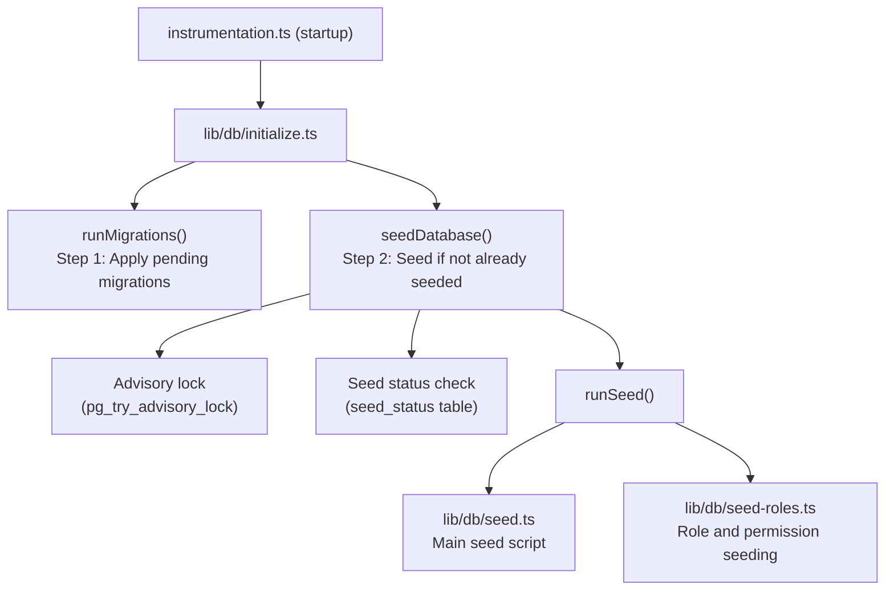

# 数据库播种

Ever Works 模板包括一个全面的数据库播种系统，用于初始化基本数据（角色、权限、支付提供商），并可选择生成用于开发和测试的演示数据。

## 种子架构



## 种子脚本

### 主种子脚本 (`lib/db/seed.ts`)

主种子脚本处理所有数据库初始化。它以两种模式运行：

**生产模式**：仅播种应用程序运行所需的基本数据：
- 管理员和客户角色
- 系统权限
- 默认支付提供商
- 所需的系统记录

**演示模式**：另外为开发提供全面的测试数据：
- 具有不同角色的示例用户
- 客户资料样本
- 订阅示例
- 演示评论、投票和收藏夹
- 测试通知
- 活动日志条目

设置`DEMO_MODE` 环境变量后，演示模式将被激活。

主要特点：
- **每表幂等性**：每个表在播种前都会被检查；仅填充空表
- **表存在检查**：在尝试插入之前验证表是否存在
- **使用 `drizzle-seed`**：利用官方 Drizzle 播种库进行结构化数据生成
- **重新运行安全**：可以多次调用而不会重复数据

```typescript
// Simplified seed flow
export async function runSeed(): Promise<void> {
  await ensureDb();
  const isDemo = isDemoMode();

  if (isDemo) {
    // Seed comprehensive test data
  } else {
    // Seed minimal essential data only
  }

  // Seed roles (always)
  if (await isTableEmpty('roles', roles)) {
    await seedRoles();
  }

  // Seed permissions (always)
  if (await isTableEmpty('permissions', permissions)) {
    await seedPermissions();
  }

  // Seed payment providers (always)
  if (await isTableEmpty('paymentProviders', paymentProviders)) {
    await seedPaymentProviders();
  }

  // Demo-only: seed users, profiles, subscriptions, etc.
  if (isDemo) {
    await seedDemoData();
  }
}
```

### 角色播种 (`lib/db/seed-roles.ts`)

用于播种 RBAC 系统的专用脚本，也可以独立运行。

**`seedPermissions()`** 创建初始权限集：

|权限键|描述|
|---------------|-------------|
|`read:own`|可以读取自己的数据|
|`write:own`|可以写入自己的数据|
|`admin:all`|完整的管理访问权限|
|`client:manage`|可以管理客户特定的操作|
|`user:read`|可以读取用户数据|
|`user:write`|可以写入用户数据|

使用 `onConflictDoUpdate` 安全地更新现有权限，而不会在重新运行时失败。

**`linkRolesToPermissions()`** 创建角色权限关联：

- **管理员角色**：获取所有权限
- **客户端角色**：获取 `read:own`、`write:own` 和 `client:manage`

该函数在创建关联之前验证所需的角色（管理员、客户端）是否存在且处于活动状态。

**`seedRolesAndPermissions()`** 在数据库事务中协调这两个操作：

```typescript
export async function seedRolesAndPermissions() {
  await db.transaction(async () => {
    await seedPermissions();
    await linkRolesToPermissions();
  });
}
```

可以独立运行：
```bash
# Run directly (if configured as a script)
npx tsx lib/db/seed-roles.ts
```

## 初始化系统（`lib/db/initialize.ts`）

初始化系统通过并发保护来管理完整的启动序列。

### 种子状态跟踪

`seed_status` 表跟踪播种状态：

|状态|含义|
|--------|---------|
|`seeding`|种子操作正在进行中|
|`completed`|种子成功完成|
|`failed`|种子失败（已存储错误）|

### 并发保护

在多进程部署中（例如，同时启动多个 Vercel 无服务器功能），系统使用以下方式防止重复播种：

1. **PostgreSQL 建议锁**：`pg_try_advisory_lock(12345)` 提供非阻塞锁。只有一个进程可以获取它。
2. **种子状态表**：其他进程检查`seed_status`表并等待完成。
3. **过时检测**：如果 `seeding` 状态超过 5 分钟，则会被视为过时并被清理。
4. **等待超时**：等待另一个实例完成的进程将在 60 秒后超时。

### 初始化流程

```
initializeDatabase()
│
├── DATABASE_URL not set? → Silent skip (DB is optional)
│
├── Step 1: Run migrations (always, idempotent)
│   └── Failure? → Error in production, warning in dev/preview
│
├── Step 2: Check if already seeded
│   └── seed_status = 'completed'? → Done
│
├── Step 3: Handle edge cases
│   ├── Previous seed failed? → Delete failed status, retry
│   ├── Stale seeding (>5min)? → Clean up, retry
│   └── Another instance seeding? → Wait for completion
│
├── Step 4: Acquire advisory lock
│   └── Lock not available? → Wait for other instance
│
├── Step 5: Double-check (another instance may have finished)
│
├── Step 6: Run seed
│   ├── Create seed_status record ('seeding')
│   ├── Execute runSeed()
│   └── Update seed_status ('completed' or 'failed')
│
└── Step 7: Release advisory lock (always, in finally block)
```

## 手动运行种子

### 标准种子

```bash
pnpm db:seed
```

### 单独的种子脚本

```bash
# Seed roles and permissions only
npx tsx lib/db/seed-roles.ts
```

### 演示模式

要使用演示数据作为种子，请设置 `DEMO_MODE` 环境变量：

```bash
DEMO_MODE=true pnpm db:seed
```

## 环境变量

|变量|默认|描述|
|----------|---------|-------------|
|`DATABASE_URL`| - |PostgreSQL 连接字符串（播种所需）|
|`DEMO_MODE`|`false`|启用演示数据播种|

## 种子数据摘要

### 始终播种（生产模式）

|表|数据|
|-------|------|
|`roles`|管理员和客户角色|
|`permissions`|系统权限定义|
|`rolePermissions`|角色-权限关联|
|`paymentProviders`|Stripe、LemonSqueezy、Polar、Solidgate|

### 仅演示模式

|表|数据|
|-------|------|
|`users`|管理员和客户端用户示例|
|`accounts`|示例用户的身份验证帐户|
|`clientProfiles`|具有不同状态的客户资料|
|`subscriptions`|跨计划订阅示例|
|`comments`|示例项目评论|
|`votes`|投票样本|
|`favorites`|样品最爱|
|`notifications`|管理员通知示例|
|`activityLogs`|活动历史示例|

## 最佳实践

1. **切勿在生产中使用 DEMO_MODE 运行种子**：演示数据只能用于开发和登台
2. **手动重新设定种子之前检查种子状态**：查询 `seed_status` 表以了解当前状态
3. **使用事务**：角色播种使用事务来确保一致性
4. **幂等设计**：插入前始终检查数据是否存在，以支持安全重新运行
5. **咨询锁**：咨询锁系统可防止多个实例可能同时启动的无服务器环境中出现问题
