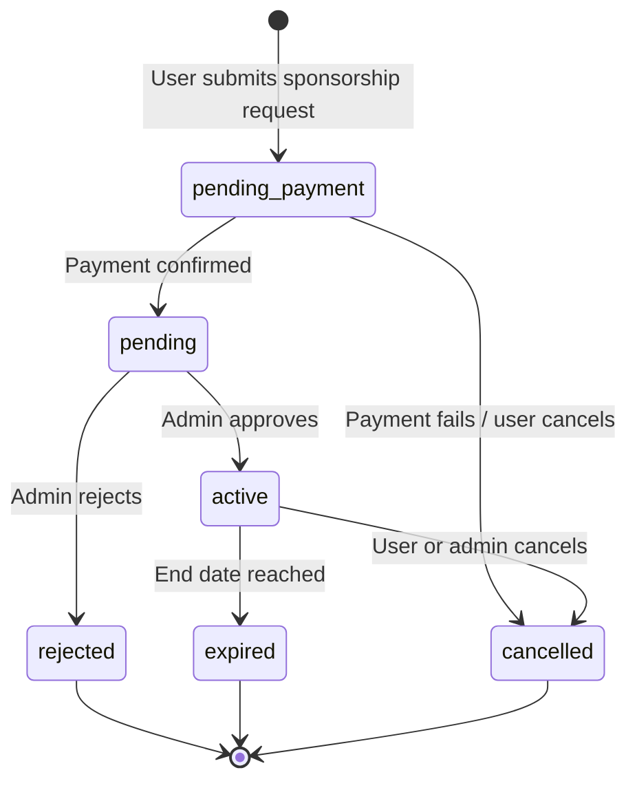
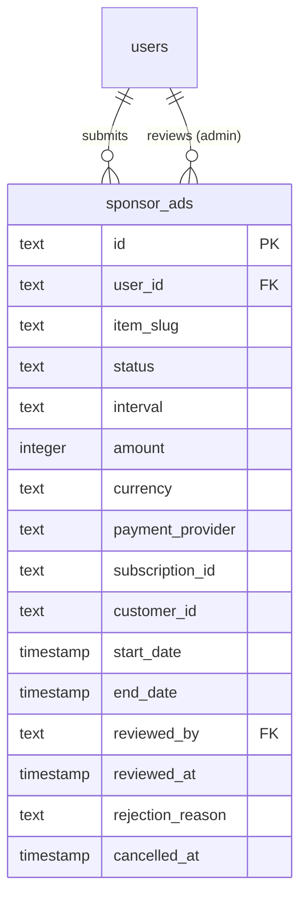

# 赞助商广告架构深入探讨

## 概述

赞助商广告模块使用户能够为网站上的项目促销放置付费。它实现了完整的生命周期：提交、支付、管理员审核、主动展示、过期/取消。该系统与支付提供商基础设施集成，并支持每周和每月的赞助间隔。

**源文件：** `template/lib/db/schema.ts`

---

## Table: `sponsor_ads`

### Columns

| Column | DB Name | Type | Nullable | Default | Constraints |
|---|---|---|---|---|---|
| `id` | `id` | `text` | No | `crypto.randomUUID()` | Primary Key |
| **User/Submitter** | | | | | |
| `userId` | `user_id` | `text` | No | - | FK -> `users.id` (CASCADE) |
| **Item** | | | | | |
| `itemSlug` | `item_slug` | `text` | No | - | Item being sponsored |
| **Sponsorship Details** | | | | | |
| `status` | `status` | `text (enum)` | No | `'pending_payment'` | See status enum |
| `interval` | `interval` | `text (enum)` | No | - | `weekly`, `monthly` |
| **Pricing** | | | | | |
| `amount` | `amount` | `integer` | No | - | In dollars |
| `currency` | `currency` | `text` | No | `'usd'` | ISO currency code |
| **Payment** | | | | | |
| `paymentProvider` | `payment_provider` | `text` | No | - | Provider name |
| `subscriptionId` | `subscription_id` | `text` | Yes | - | External subscription ID |
| `customerId` | `customer_id` | `text` | Yes | - | External customer ID |
| **Subscription Period** | | | | | |
| `startDate` | `start_date` | `timestamp` | Yes | - | - |
| `endDate` | `end_date` | `timestamp` | Yes | - | - |
| **Admin Review** | | | | | |
| `reviewedBy` | `reviewed_by` | `text` | Yes | - | FK -> `users.id` (SET NULL) |
| `reviewedAt` | `reviewed_at` | `timestamp` | Yes | - | - |
| `rejectionReason` | `rejection_reason` | `text` | Yes | - | - |
| **Cancellation** | | | | | |
| `cancelledAt` | `cancelled_at` | `timestamp` | Yes | - | - |
| `cancelReason` | `cancel_reason` | `text` | Yes | - | - |
| **Timestamps** | | | | | |
| `createdAt` | `created_at` | `timestamp` | No | `now()` | - |
| `updatedAt` | `updated_at` | `timestamp` | No | `now()` | - |

### Foreign Keys

| Column | References | On Delete |
|---|---|---|
| `user_id` | `users.id` | CASCADE |
| `reviewed_by` | `users.id` | SET NULL |

### Indexes

| Name | Columns | Type |
|---|---|---|
| `sponsor_ads_user_id_idx` | `userId` | B-tree |
| `sponsor_ads_item_slug_idx` | `itemSlug` | B-tree |
| `sponsor_ads_status_idx` | `status` | B-tree |
| `sponsor_ads_interval_idx` | `interval` | B-tree |
| `sponsor_ads_provider_subscription_idx` | `(paymentProvider, subscriptionId)` | Unique |
| `sponsor_ads_start_date_idx` | `startDate` | B-tree |
| `sponsor_ads_end_date_idx` | `endDate` | B-tree |
| `sponsor_ads_created_at_idx` | `createdAt` | B-tree |

---

## 状态枚举

```typescript
export const SponsorAdStatus = {
    PENDING_PAYMENT: 'pending_payment', // User submitted, waiting for payment
    PENDING: 'pending',                 // User paid, waiting for admin review
    REJECTED: 'rejected',               // Admin rejected
    ACTIVE: 'active',                   // Admin approved, displaying on site
    EXPIRED: 'expired',                 // Subscription period ended
    CANCELLED: 'cancelled'              // Cancelled by user or admin
} as const;

export type SponsorAdStatusValues =
    (typeof SponsorAdStatus)[keyof typeof SponsorAdStatus];
```

## 区间枚举

```typescript
export const SponsorAdInterval = {
    WEEKLY: 'weekly',
    MONTHLY: 'monthly'
} as const;

export type SponsorAdIntervalValues =
    (typeof SponsorAdInterval)[keyof typeof SponsorAdInterval];
```

---

## TypeScript Types

```typescript
export type SponsorAd = typeof sponsorAds.$inferSelect;
export type NewSponsorAd = typeof sponsorAds.$inferInsert;
```

---

## 状态工作流程



---

## Relations Diagram



---

## 关键设计决策

### `users` 的两个外键

该表有两个对 `users` 表的引用：
1. **`userId` (CASCADE):** 提交并支付赞助费用的用户。删除用户会删除其所有赞助商广告。
2. **`reviewedBy` (SET NULL):** 批准/拒绝的管理员。如果管理员被删除，审阅记录将保留为空审阅者。

### 外部支付整合

`paymentProvider` + `subscriptionId` 组合具有唯一索引，镜像`subscriptions` 表中的模式。这允许在 Webhook 处理期间通过外部订阅引用查找赞助商广告。

### 金额（美元）

与 `subscriptions` 表以美分存储金额不同，`sponsor_ads.amount` 列以整数美元存储值。与支付提供商集成时请注意这一差异。

---

## Query Examples

### Create a sponsor ad request

```typescript
import { db } from '@/lib/db/drizzle';
import { sponsorAds, SponsorAdStatus } from '@/lib/db/schema';

await db.insert(sponsorAds).values({
    userId,
    itemSlug: 'my-tool-slug',
    status: SponsorAdStatus.PENDING_PAYMENT,
    interval: 'monthly',
    amount: 49,
    currency: 'usd',
    paymentProvider: 'stripe',
});
```

### Confirm payment (update status)

```typescript
await db
    .update(sponsorAds)
    .set({
        status: SponsorAdStatus.PENDING,
        subscriptionId: stripeSubscription.id,
        customerId: stripeCustomer.id,
        updatedAt: new Date(),
    })
    .where(eq(sponsorAds.id, sponsorAdId));
```

### Admin approves a sponsor ad

```typescript
await db
    .update(sponsorAds)
    .set({
        status: SponsorAdStatus.ACTIVE,
        reviewedBy: adminUserId,
        reviewedAt: new Date(),
        startDate: new Date(),
        endDate: new Date(Date.now() + 30 * 24 * 60 * 60 * 1000), // 30 days
        updatedAt: new Date(),
    })
    .where(eq(sponsorAds.id, sponsorAdId));
```

### Admin rejects a sponsor ad

```typescript
await db
    .update(sponsorAds)
    .set({
        status: SponsorAdStatus.REJECTED,
        reviewedBy: adminUserId,
        reviewedAt: new Date(),
        rejectionReason: 'Content does not meet advertising guidelines.',
        updatedAt: new Date(),
    })
    .where(eq(sponsorAds.id, sponsorAdId));
```

### Get active sponsor ads for display

```typescript
import { and, eq, lte, gte } from 'drizzle-orm';

const now = new Date();
const activeAds = await db
    .select()
    .from(sponsorAds)
    .where(
        and(
            eq(sponsorAds.status, SponsorAdStatus.ACTIVE),
            lte(sponsorAds.startDate, now),
            gte(sponsorAds.endDate, now)
        )
    );
```

### Find sponsor ad by Stripe subscription ID

```typescript
const ad = await db
    .select()
    .from(sponsorAds)
    .where(
        and(
            eq(sponsorAds.paymentProvider, 'stripe'),
            eq(sponsorAds.subscriptionId, stripeSubscriptionId)
        )
    )
    .limit(1);
```

### Get pending reviews for admin dashboard

```typescript
const pendingReviews = await db
    .select()
    .from(sponsorAds)
    .where(eq(sponsorAds.status, SponsorAdStatus.PENDING))
    .orderBy(asc(sponsorAds.createdAt));
```

### Expire sponsor ads past their end date

```typescript
await db
    .update(sponsorAds)
    .set({
        status: SponsorAdStatus.EXPIRED,
        updatedAt: new Date(),
    })
    .where(
        and(
            eq(sponsorAds.status, SponsorAdStatus.ACTIVE),
            lte(sponsorAds.endDate, new Date())
        )
    );
```

---

## 设计笔记

- **通过 slug 进行项目标识。** 与所有项目引用表一样，`itemSlug` 存储项目的内容 slug，而不是数据库外键。
- **独特的提供商+订阅索引。**确保没有重复的订阅记录并实现快速的Webhook查找。
- **软状态转换。** 状态更改通过状态列本身进行跟踪。要获得完整的审计跟踪，请考虑与 `activityLogs` 表配对。
- **手动过期。** 数据库级别没有自动过期机制。 cron 作业或 webhook 处理程序应定期检查过期的赞助商广告并使其过期。
