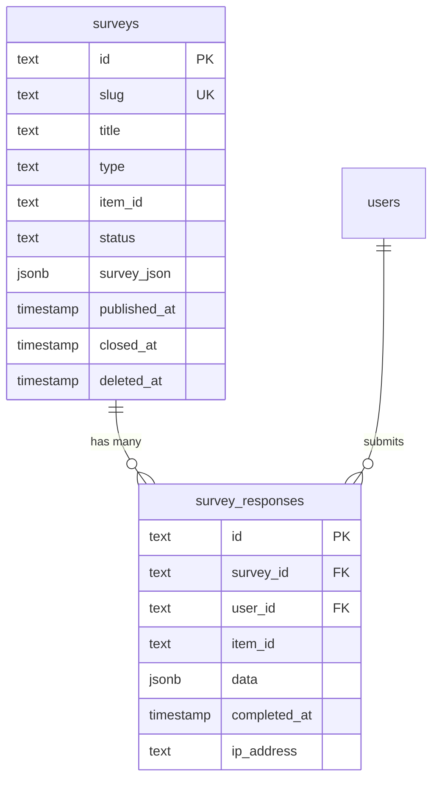
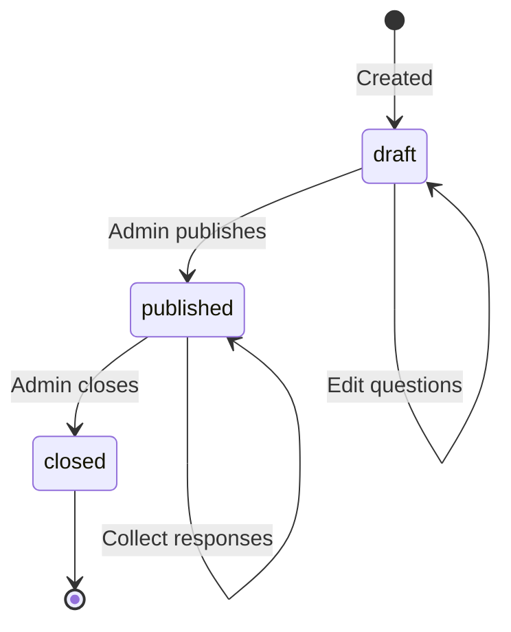

# 调查模式深入探讨

## 概述

调查模块提供了一个灵活的调查系统，具有两种表格类型：`surveys` 用于调查定义，`survey_responses` 用于收集的答案。调查可以是全球性的（站点范围内的），也可以是针对特定项目的。调查结构使用 JSONB 列类型存储为 JSON blob (`surveyJson`)，允许动态问题模式，而无需严格的数据库建模。

**源文件：** `template/lib/db/schema.ts`

---

## Table: `surveys`

Stores survey definitions with their question structure in a JSON column.

### Columns

| Column | DB Name | Type | Nullable | Default | Constraints |
|---|---|---|---|---|---|
| `id` | `id` | `text` | No | `crypto.randomUUID()` | Primary Key |
| `slug` | `slug` | `text` | No | - | Unique |
| `title` | `title` | `text` | No | - | - |
| `description` | `description` | `text` | Yes | - | - |
| `type` | `type` | `text (enum)` | No | - | `global`, `item` |
| `itemId` | `item_id` | `text` | Yes | - | Item slug (for item surveys) |
| `status` | `status` | `text (enum)` | No | `'draft'` | `draft`, `published`, `closed` |
| `surveyJson` | `survey_json` | `jsonb` | No | - | Full survey structure |
| `createdAt` | `created_at` | `timestamp (tz)` | No | `now()` | - |
| `updatedAt` | `updated_at` | `timestamp (tz)` | No | `now()` | - |
| `publishedAt` | `published_at` | `timestamp (tz)` | Yes | - | - |
| `closedAt` | `closed_at` | `timestamp (tz)` | Yes | - | - |
| `deletedAt` | `deleted_at` | `timestamp (tz)` | Yes | - | Soft delete |

### Indexes

| Name | Columns | Type |
|---|---|---|
| `surveys_slug_idx` | `slug` | B-tree |
| `surveys_type_idx` | `type` | B-tree |
| `surveys_item_id_idx` | `itemId` | B-tree |
| `surveys_status_idx` | `status` | B-tree |
| `surveys_created_at_idx` | `createdAt` | B-tree |

### Survey Type Enum

| Value | Description |
|---|---|
| `global` | Site-wide survey visible to all users |
| `item` | Survey attached to a specific item (referenced by `itemId`) |

### Survey Status Enum

| Value | Description |
|---|---|
| `draft` | Not yet published, only visible to admins |
| `published` | Live and accepting responses |
| `closed` | No longer accepting responses |

---

## 表：`survey_responses`

存储个人用户对调查的响应。响应数据存储为 JSONB blob。

### 专栏

|专栏|数据库名称|类型|可空|默认|约束条件|
|---|---|---|---|---|---|
|`id`|`id`|`text`|否|`crypto.randomUUID()`|主键|
|`surveyId`|`survey_id`|`text`|否| - |FK -> `surveys.id`（限制）|
|`userId`|`user_id`|`text`|是的| - |FK -> `users.id`（设置为空）|
|`itemId`|`item_id`|`text`|是的| - |项目上下文 slug|
|`data`|`data`|`jsonb`|否| - |回应答案|
|`completedAt`|`completed_at`|`timestamp (tz)`|否| - |当用户完成时|
|`ipAddress`|`ip_address`|`text`|是的| - |提交者IP|
|`userAgent`|`user_agent`|`text`|是的| - |浏览器用户代理|
|`createdAt`|`created_at`|`timestamp (tz)`|否|`now()`| - |
|`updatedAt`|`updated_at`|`timestamp (tz)`|否|`now()`| - |

### 外键

|专栏|参考文献|删除时|
|---|---|---|
|`surveyId`|`surveys.id`|限制|
|`userId`|`users.id`|设置为空|

:::info 删除行为
`surveyId` 外键使用`RESTRICT`（不是`CASCADE`），这意味着调查在有回复时无法删除。这可以保护响应数据免遭意外丢失。请对调查使用软删除 (`deletedAt`)。

`userId` 外键使用`SET NULL`，即使用户帐户被删除，也会保留匿名响应数据。
:::

### 索引

|名称|专栏|类型|
|---|---|---|
|`survey_responses_survey_id_idx`|`surveyId`|B树|
|`survey_responses_user_id_idx`|`userId`|B树|
|`survey_responses_item_id_idx`|`itemId`|B树|
|`survey_responses_completed_at_idx`|`completedAt`|B树|

---

## TypeScript Types

```typescript
export type Survey = typeof surveys.$inferSelect;

export type SurveyItem = Survey & {
    responseCount?: number;
    isCompletedByUser?: boolean;
};

export type NewSurvey = typeof surveys.$inferInsert;
export type SurveyResponse = typeof surveyResponses.$inferSelect;
export type NewSurveyResponse = typeof surveyResponses.$inferInsert;
```

---

## 关系图



---

## Survey Lifecycle



---

## `surveyJson`专栏

`surveyJson` JSONB 列存储完整的调查定义。这是一个灵活的模式，可以表示各种问题类型：

```typescript
// Example surveyJson structure
{
  "pages": [
    {
      "name": "page1",
      "elements": [
        {
          "type": "rating",
          "name": "satisfaction",
          "title": "How satisfied are you?",
          "rateMin": 1,
          "rateMax": 5
        },
        {
          "type": "text",
          "name": "feedback",
          "title": "Any additional feedback?"
        },
        {
          "type": "radiogroup",
          "name": "recommend",
          "title": "Would you recommend this?",
          "choices": ["Yes", "No", "Maybe"]
        }
      ]
    }
  ]
}
```

---

## Query Examples

### Create a survey

```typescript
import { db } from '@/lib/db/drizzle';
import { surveys } from '@/lib/db/schema';

await db.insert(surveys).values({
    slug: 'user-satisfaction-2025',
    title: “2025 年用户满意度调查”，
    description: 'Help us improve our platform',
    type: 'global',
    status: 'draft',
    surveyJson: {
        pages: [{
            name: 'page1',
            elements: [
                { type: 'rating', name: 'overall', title: 'Overall satisfaction' }
            ]
        }]
    },
});
```

### Publish a survey

```typescript
await db
    .update(surveys)
    .set({
        status: 'published',
        publishedAt: new Date(),
        updatedAt: new Date(),
    })
    .where(eq(surveys.id, surveyId));
```

### Submit a response

```typescript
import { surveyResponses } from '@/lib/db/schema';

await db.insert(surveyResponses).values({
    surveyId,
    userId,
    itemId: 'specific-item-slug', // Optional, for item-type surveys
    data: {
        overall: 4,
        feedback: 'Great platform, minor UI issues',
        recommend: 'Yes',
    },
    completedAt: new Date(),
    ipAddress: request.headers.get('x-forwarded-for'),
    userAgent: request.headers.get('user-agent'),
});
```

### Get surveys with response counts

```typescript
import { sql } from 'drizzle-orm';

const surveysWithCounts = await db
    .select({
        id: surveys.id,
        title: 调查.标题,
        status: surveys.status,
        responseCount: sql<number>`(
            SELECT count(*) FROM survey_responses
            WHERE survey_responses.survey_id = surveys.id
        )`,
    })
    .from(surveys)
    .where(isNull(surveys.deletedAt))
    .orderBy(desc(surveys.createdAt));
```

### Check if user completed a survey

```typescript
const completed = await db
    .select({ id: surveyResponses.id })
    .from(surveyResponses)
    .where(
        and(
            eq(surveyResponses.surveyId, surveyId),
            eq(surveyResponses.userId, userId)
        )
    )
    .limit(1);

const hasCompleted = completed.length > 0;
```

### Get published surveys for an item

```typescript
const itemSurveys = await db
    .select()
    .from(surveys)
    .where(
        and(
            eq(surveys.type, 'item'),
            eq(surveys.itemId, 'my-item-slug'),
            eq(surveys.status, 'published'),
            isNull(surveys.deletedAt)
        )
    );
```

---

## 设计笔记

- **JSONB 实现灵活性。** 使用 `surveyJson` 和 `data` 作为 JSONB 列允许调查系统支持任何问题类型，而无需架构迁移。代价是数据库级别的类型安全性不太严格。
- **限制删除。** 无法硬删除包含回复的调查。请改用 `deletedAt` 软删除列。
- **支持匿名回复。** `survey_responses` 上的 `userId` 可为空，并在删除时使用 `SET NULL`，允许经过身份验证和匿名调查提交。
- **项目上下文。** 两个表上的 `itemId` 字段可启用特定于项目的调查（例如，“评价此工具”），同时保持模式对于全球调查而言足够通用。
